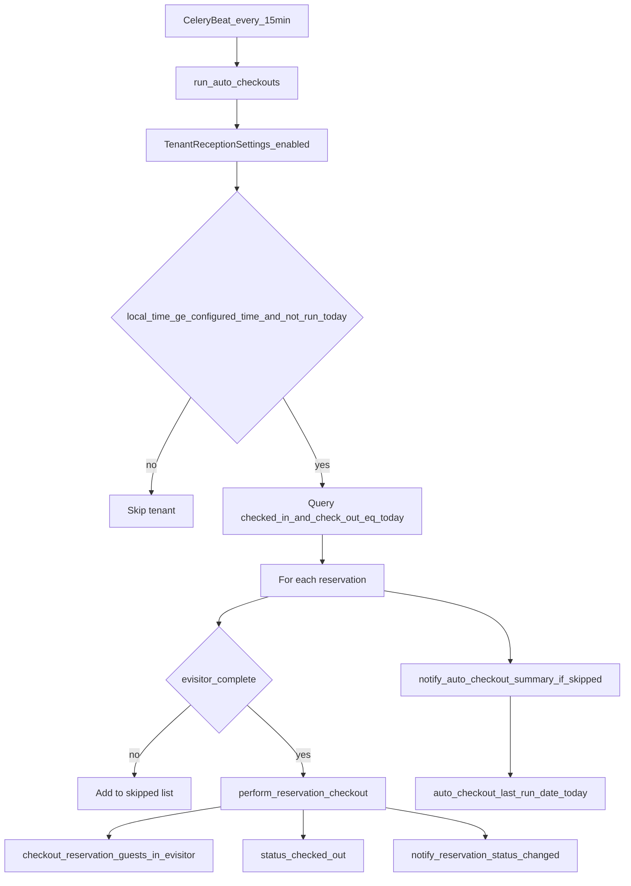

# Auto checkout — tenant model + scheduled job

## Kontekst

Ručna odjava već postoji u [`stay.hr/backend/apps/api/reception_serializers.py`](c:\Users\avrca\Documents\Projects\Uzorita_all\stay.hr\backend\apps\api\reception_serializers.py):

- Dozvoljen prijelaz: `checked_in` → `checked_out`
- Blokada ako `evisitor_summary != "complete"`
- Pri uspjehu: `checkout_reservation_guests_in_evisitor()` + push `reservation.status_changed`

Auto checkout mora koristiti **ista poslovna pravila**, bez dupliciranja logike.

## Odluke (potvrđeno)

| Tema | Odluka |
|------|--------|
| Scope rezervacija | Samo `check_out == danas` (u tenant timezone) |
| eVisitor uvjet | Obavezno `evisitor_summary == "complete"` |
| Preskočene rezervacije | Push recepciji sa sažetkom |
| Konfiguracija | Tenant razina (ne property) |
| Flutter | Nema UI promjena u ovoj fazi — admin + backend |

## Arhitektura



## 1. Model — `TenantReceptionSettings`

**Datoteka:** nova u [`stay.hr/backend/apps/tenants/models.py`](c:\Users\avrca\Documents\Projects\Uzorita_all\stay.hr\backend\apps\tenants\models.py)

```python
class TenantReceptionSettings(models.Model):
    tenant = models.OneToOneField(Tenant, related_name="reception_settings", ...)
    auto_checkout_enabled = models.BooleanField(default=False)
    auto_checkout_time = models.TimeField(default=time(10, 0))  # lokalno u tenant.timezone
    auto_checkout_last_run_date = models.DateField(null=True, blank=True)
    updated_at = models.DateTimeField(auto_now=True)
```

- Migracija: `0005_tenantreceptionsettings.py`
- `auto_checkout_last_run_date` osigurava idempotenciju (Beat svakih 15 min ne ponavlja isti dan)
- Za Uzoritu postaviti `Tenant.timezone = "Europe/Zagreb"` u adminu (polje već postoji na [`Tenant`](c:\Users\avrca\Documents\Projects\Uzorita_all\stay.hr\backend\apps\tenants\models.py))

**Admin:** inline u [`stay.hr/backend/apps/tenants/admin.py`](c:\Users\avrca\Documents\Projects\Uzorita_all\stay.hr\backend\apps\tenants\admin.py) — polja `auto_checkout_enabled`, `auto_checkout_time`, read-only `auto_checkout_last_run_date`.

## 2. Servis — zajednička logika checkouta

**Nova datoteka:** [`stay.hr/backend/apps/reservations/checkout.py`](c:\Users\avrca\Documents\Projects\Uzorita_all\stay.hr\backend\apps\reservations\checkout.py)

```python
class CheckoutBlockedError(Exception):
    code: str  # npr. "evisitor_incomplete", "invalid_status"

def perform_reservation_checkout(reservation, *, source: str = "manual") -> None:
    # 1. status == checked_in
    # 2. evisitor_summary == "complete"
    # 3. checkout_reservation_guests_in_evisitor(reservation)
    # 4. reservation.status = checked_out; save
```

**Refactor:** [`ReservationUpdateSerializer`](c:\Users\avrca\Documents\Projects\Uzorita_all\stay.hr\backend\apps\api\reception_serializers.py) delegira na `perform_reservation_checkout()` — mapiranje iznimaka (`EvisitorValidationError`, `EvisitorApiError`) ostaje u serializeru kao danas.

**Napomena:** `evisitor_summary == "none"` (nema gostiju) tretira se kao blokada — nije zadovoljen eVisitor uvjet.

## 3. Celery task — auto checkout runner

**Nova datoteka:** [`stay.hr/backend/apps/reservations/tasks.py`](c:\Users\avrca\Documents\Projects\Uzorita_all\stay.hr\backend\apps\reservations\tasks.py)

```python
@shared_task
def run_auto_checkouts() -> dict:
    ...
```

Logika po tenantu:

1. Učitaj `TenantReceptionSettings` gdje `auto_checkout_enabled=True`
2. Izračunaj `now_local` preko `ZoneInfo(tenant.timezone or "Europe/Zagreb")`
3. Preskoči ako `auto_checkout_last_run_date == today_local`
4. Preskoči ako `now_local.time() < auto_checkout_time`
5. Query kandidata:
   ```python
   Reservation.objects.filter(
       tenant=tenant,
       status=Reservation.Status.CHECKED_IN,
       check_out=today_local,
   ).prefetch_related("guests")
   ```
6. Za svaku rezervaciju:
   - `complete` → `perform_reservation_checkout(..., source="auto")` + `notify_reservation_status_changed.delay(...)` (origin prazan — nije s tableta)
   - inače → dodaj u `skipped` listu s razlogom (`evisitor_incomplete`, `evisitor_none`, `evisitor_api_error`, ...)
7. Ako `skipped` nije prazan → `notify_auto_checkout_summary.delay(tenant_id, skipped_payload)`
8. Postavi `auto_checkout_last_run_date = today_local` **čak i ako su sve preskočene** (tenant je „obradio“ dan)

**Beat schedule:** u [`stay.hr/backend/config/settings/base.py`](c:\Users\avrca\Documents\Projects\Uzorita_all\stay.hr\backend\config\settings\base.py):

```python
"auto-checkout": {
    "task": "apps.reservations.tasks.run_auto_checkouts",
    "schedule": 900.0,  # 15 min
},
```

## 4. Push — sažetak preskočenih

**Nova task funkcija** u [`stay.hr/backend/apps/core/tasks.py`](c:\Users\avrca\Documents\Projects\Uzorita_all\stay.hr\backend\apps\core\tasks.py):

```python
@shared_task
def notify_auto_checkout_summary(tenant_id: int, skipped: list[dict]) -> dict:
    # title: "Auto odjava — preskočeno"
    # body: "3 rezervacije nisu odjavljene (eVisitor)"
    # data: reception_push_data(event_type="auto_checkout.skipped", ...)
```

Koristi postojeći [`send_tenant_reception_push`](c:\Users\avrca\Documents\Projects\Uzorita_all\stay.hr\backend\apps\core\notifications.py). Payload uključuje broj preskočenih + opcionalno booking_code liste (max ~5 u body, ostatak u data JSON).

**Flutter:** nije obavezna promjena — postojeći foreground listener već invalidira sync na push; novi `event_type` ne mora imati posebnu navigaciju u prvoj fazi (timeline se osvježi).

## 5. Testovi

**Nova datoteka:** [`stay.hr/backend/apps/reservations/tests/test_auto_checkout.py`](c:\Users\avrca\Documents\Projects\Uzorita_all\stay.hr\backend\apps\reservations\tests\test_auto_checkout.py)

| Test | Očekivanje |
|------|------------|
| Disabled tenant | Nema promjena |
| Prije `auto_checkout_time` | Preskočeno |
| `check_out == today`, svi gosti `sent` | `checked_out` + eVisitor checkout mock |
| eVisitor incomplete | Preskočeno, ostaje `checked_in` |
| Nema gostiju | Preskočeno |
| `check_out == yesterday` | **Ne ulazi** (samo danas) |
| Drugi run isti dan | Idempotentno — ništa |
| Skipped list | `notify_auto_checkout_summary.delay` pozvan |

**Refactor test:** dodati test u [`stay.hr/backend/apps/api/tests/test_reception_api.py`](c:\Users\avrca\Documents\Projects\Uzorita_all\stay.hr\backend\apps\api\tests\test_reception_api.py) da PATCH checkout i dalje radi nakon refactora (mock eVisitor).

Koristiti `CELERY_TASK_ALWAYS_EAGER` iz test settings ([`config/settings/test.py`](c:\Users\avrca\Documents\Projects\Uzorita_all\stay.hr\backend\config\settings\test.py)).

## 6. Operativno — uključivanje za Uzoritu

1. Deploy migracije
2. Django admin → Tenant `uzorita`:
   - `timezone = Europe/Zagreb`
   - `auto_checkout_enabled = True`
   - `auto_checkout_time = 10:00` (ili po dogovoru)
3. Provjera na stagingu: ručno pokrenuti `run_auto_checkouts` management command (opcionalno dodati `python manage.py run_auto_checkouts --tenant=uzorita --force` za debug)

## Datoteke koje se mijenjaju

| Datoteka | Promjena |
|----------|----------|
| `apps/tenants/models.py` | + `TenantReceptionSettings` |
| `apps/tenants/admin.py` | inline admin |
| `apps/tenants/migrations/0005_...` | migracija |
| `apps/reservations/checkout.py` | **novi** servis |
| `apps/reservations/tasks.py` | **novi** Celery task |
| `apps/api/reception_serializers.py` | refactor na servis |
| `apps/core/tasks.py` | + summary push task |
| `config/settings/base.py` | Beat schedule |
| `apps/reservations/tests/test_auto_checkout.py` | **novi** testovi |

## Izvan scopea (kasnije)

- Flutter UI za prikaz auto checkout postavki
- Per-property vrijeme odjave
- Audit tablica (`AutoCheckoutRun`) — trenutno dovoljan log + push
- Legacy `uzorita-rooms-code` — ne dirati; produkcija je `stay.hr`
