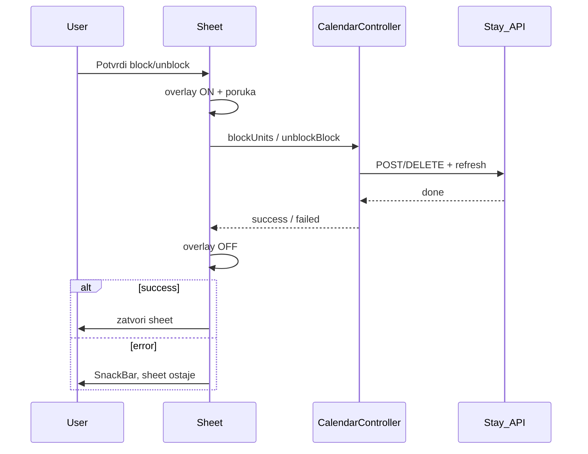

# Loading UX za block/unblock u kalendaru

## Odluka

| Pristup | Verdikt |
|---------|---------|
| Zatvori sheet odmah, API u pozadini | **Ne** — korisnik ne vidi uspjeh/grešku, rizik ponovnog klika |
| Puni blocking overlay cijelog ekrana | **Ne** — preteško za recepciju |
| **Sheet ostaje otvoren + overlay loader** | **Da** — jasno “u tijeku”, sprječava dvostruki submit |

Trenutno stanje u [`booking_day_bookings_sheet.dart`](c:\Users\avrca\Documents\Projects\Uzorita_all\uzorita_flutter\lib\features\reception\presentation\widgets\booking_day_bookings_sheet.dart): `_busy` gasi chipove/gumbove, ali loader je samo **mali spinner u FilledButtonu** (22px) — lako promašen dok čeka Smoobu + puni `refresh()` iz [`booking_calendar_controller.dart`](c:\Users\avrca\Documents\Projects\Uzorita_all\uzorita_flutter\lib\features\reception\presentation\booking_calendar_controller.dart).



---

## 1. Overlay komponenta u sheetu

**Datoteka:** [`booking_day_bookings_sheet.dart`](c:\Users\avrca\Documents\Projects\Uzorita_all\uzorita_flutter\lib\features\reception\presentation\widgets\booking_day_bookings_sheet.dart)

Proširiti state:

```dart
bool _busy = false;
String? _busyMessage; // npr. "Blokiram R6…" / "Odblokiram R6…"
```

U `build()`, omotati sadržaj sheet-a u `Stack`:

- Donji sloj: postojeći `Column` + `ListView` (ne mijenjati layout)
- Kad `_busy`: `Positioned.fill` + `ModalBarrier` (ili `ColoredBox` s `surface` ~70% opacity) + centrirani `Column`:
  - `CircularProgressIndicator`
  - `SizedBox(height: 12)`
  - `Text(_busyMessage!, style: titleSmall)`

**Ponašanje:**
- `IgnorePointer(ignoring: _busy)` oko cijelog stacka — blokira tap na rezervacije/chipove dok traje operacija
- Ukloniti spinner **iz** `FilledButton` childa kad je `_busy` (overlay je dovoljan); gumb ostaje `onPressed: null`

Postaviti poruku u `_confirmUnblock` / `_submitBlock` prije `setState(() => _busy = true)`:
- Unblock: `calendarUnblocking(unitCode)` 
- Block 1 soba: `calendarBlocking(unitCode)`
- Block N soba: `calendarBlockingMultiple(count)` ili progress `calendarBlockingProgress(current, total)` (opcionalno u fazi 2)

---

## 2. Controller — opcionalni progress callback (multi-block)

**Datoteka:** [`booking_calendar_controller.dart`](c:\Users\avrca\Documents\Projects\Uzorita_all\uzorita_flutter\lib\features\reception\presentation\booking_calendar_controller.dart)

U `blockUnits`, dodati opcionalni callback:

```dart
void Function(int completed, int total, String unitLabel)? onProgress,
```

Nakon svakog uspješnog/neuspješnog `api.blockUnit`, pozvati `onProgress(i + 1, unitIds.length, label)` — sheet ažurira `_busyMessage` preko `setState` (npr. „Blokiram 2/3 (R2)…”).

`unblockBlock` ostaje jedan korak — samo statična poruka.

**Napomena:** `refresh()` i dalje ide **jednom** na kraju (ispravno za konzistentnost kalendara).

---

## 3. Lokalizacija

U [`tool/l10n/strings.json`](c:\Users\avrca\Documents\Projects\Uzorita_all\uzorita_flutter\tool\l10n\strings.json) (hr + en ručno):

| Ključ | hr primjer |
|-------|------------|
| `calendarBlocking` | `Blokiram {unitCode}…` |
| `calendarBlockingMultiple` | `Blokiram {count} smještaja…` |
| `calendarBlockingProgress` | `Blokiram {current}/{total} ({unitCode})…` |
| `calendarUnblocking` | `Odblokiram {unitCode}…` |
| `calendarBlockSuccess` | `Blokada spremljena.` (opcionalno, kratki SnackBar) |
| `calendarUnblockSuccess` | `Blokada uklonjena.` (opcionalno) |

`python tool/gen_arb.py` + `flutter gen-l10n`.

---

## 4. Ishodi operacija (bez promjene logike)

Zadržati postojeće pravilo:
- **Uspjeh** → `Navigator.pop(sheet)`
- **Greška** → SnackBar + sheet ostaje, overlay off
- **Djelomičan block** → `calendarBlockPartialFailed`, sheet ostaje

Opcionalno: nakon uspjeha kratki SnackBar prije `pop` — nije obavezno ako overlay već jasno signalizira završetak.

---

## 5. Test / ručna provjera

| # | Scenarij |
|---|----------|
| 1 | Odblokiraj R6 → overlay + poruka, sheet se ne može scrollati/tapati, zatim zatvara |
| 2 | Blokiraj 3 sobe → overlay, opcionalno 1/3, 2/3, 3/3 u poruci |
| 3 | API greška → overlay nestane, SnackBar, sheet otvoren |
| 4 | Tap rezervacije tijekom `_busy` → ništa (IgnorePointer) |

Widget test nije obavezan; dovoljna je logika `_busy` + postojeći block testovi.

---

## Izvan scopea (kasnije)

- Zatvaranje sheeta odmah nakon Smoobu POST-a, `refresh()` u pozadini — brže percipirano, ali kalendar kratko pokazuje staro stanje
- Optimistički update `blocksByDate` bez punog refetcha

---

## Datoteke

- [`booking_day_bookings_sheet.dart`](c:\Users\avrca\Documents\Projects\Uzorita_all\uzorita_flutter\lib\features\reception\presentation\widgets\booking_day_bookings_sheet.dart) — overlay, `_busyMessage`, IgnorePointer
- [`booking_calendar_controller.dart`](c:\Users\avrca\Documents\Projects\Uzorita_all\uzorita_flutter\lib\features\reception\presentation\booking_calendar_controller.dart) — `onProgress` u `blockUnits` (opcionalno ali preporučeno)
- [`tool/l10n/strings.json`](c:\Users\avrca\Documents\Projects\Uzorita_all\uzorita_flutter\tool\l10n\strings.json) — nove poruke
