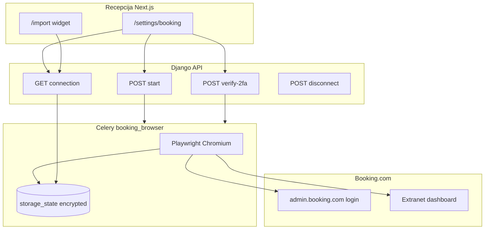

# Booking.com extranet — login i session (Faza A)

## Odluke

| Odluka | Vrijednost |
|--------|------------|
| Cilj Faze A | **Samo** održavanje valjane sesije; puni podaci i dalje **XLS** + **email stub** |
| Frontend | Next.js recepcija (`rooms/code/frontend`), auth kao na `/import` (`IsAuthenticated` + CSRF) |
| Backend | Django app `reception`, API pod `/api/reception/booking-extranet/` |
| Browser | **Playwright** (Chromium), persistent profil + `storage_state` JSON |
| Credentials | `BOOKING_EXTRANET_USERNAME` / `PASSWORD` u **`.env` na serveru** — **ne** šalju se s frontenda |
| 2FA | Frontend šalje samo **SMS kod** (`POST verify-2fa`) |
| Sesija na disku | Enkriptirani blob ili datoteka pod `BOOKING_EXTRANET_STORAGE_DIR` (Docker volume) |
| Izvršavanje browsera | Zasebni Celery queue `booking_browser`, **concurrency 1** |
| Scraping | **Faza B** — izvan ovog plana |

## Trenutno stanje

- Rezervacije: IMAP email ([`docs/operations/booking-ingest.md`](../docs/operations/booking-ingest.md)), XLS import ([`booking_xls_views.py`](../backend/app/reception/booking_xls_views.py)), iCal blokade
- Stub rezervacije: `Reservation.details_pending` + email parser
- Nema Playwrighta u [`requirements.txt`](../backend/app/requirements.txt)
- Nema modela za Booking extranet sesiju
- Frontend: [`/import`](../frontend/app/import/page.tsx) za XLS — prirodno mjesto za “Booking veza” widget



---

## 1. Model podataka

Novi model u [`reception/models.py`](../backend/app/reception/models.py):

### `BookingExtranetConnection` (singleton po deploymentu)

| Polje | Tip | Napomena |
|-------|-----|----------|
| `id` | PK | Jedan red — `get_solo()` helper |
| `status` | CharField choices | `disconnected`, `connecting`, `needs_2fa`, `connected`, `expired`, `error` |
| `hotel_id` | CharField, blank | npr. `4181954` iz mailova / extraneta |
| `storage_version` | PositiveIntegerField | Inkrement pri svakom uspješnom save |
| `storage_path` | CharField | Relativna putanja unutar `BOOKING_EXTRANET_STORAGE_DIR` |
| `last_ok_at` | DateTimeField, null | Zadnji uspješan health check |
| `last_connect_at` | DateTimeField, null | Zadnja uspješna prijava |
| `last_error` | TextField, blank | Kratka poruka za UI (bez stack tracea) |
| `connected_by` | FK User, null | Tko je pokrenuo connect |
| `updated_at` | auto | |

**Ne spremati** plain-text lozinku u bazu.

### `BookingExtranetConnectAttempt` (opcionalno, za audit)

| Polje | Tip |
|-------|-----|
| `connection` | FK |
| `started_at`, `finished_at` | DateTime |
| `initiated_by` | FK User |
| `outcome` | `success`, `needs_2fa`, `failed`, `cancelled` |
| `error_message` | Text, blank |

---

## 2. Spremanje sesije (cookies)

### Format

Playwright [`browser_context.storage_state()`](https://playwright.dev/python/docs/auth#reuse-authentication-state) — JSON s:

- `cookies[]` (domain, name, value, expires, httpOnly, secure, sameSite)
- `origins[]` (localStorage po originu)

To je **jedini** izvor istine za “session”. Ne parsirati ručno pojedinačne cookie headere u Django session tablici.

### Putanja i enkripcija

```
BOOKING_EXTRANET_STORAGE_DIR=/data/booking_browser   # Docker volume
  state.enc          # Fernet(AES) enkriptirani storage_state JSON
  profile/           # opcionalno: user_data_dir za persistent context
```

- Ključ: `BOOKING_EXTRANET_FERNET_KEY` (32-byte base64) — generirati jednom, držati u `.env`
- Modul: `reception/booking_extranet/session_store.py`
  - `save_storage_state(state: dict) -> None`
  - `load_storage_state() -> dict | None`
  - `clear_storage_state() -> None`

### Učitavanje u Playwright

```python
context = browser.new_context(storage_state=load_storage_state())
page = context.new_page()
page.goto("https://admin.booking.com/...")
# ako redirect na login → status expired
```

---

## 3. Connect flow (Playwright)

Modul: `reception/booking_extranet/connect.py`

### 3.1 `start_connect(user_id)`

1. Postavi `status=connecting`
2. Pokreni Chromium (`headless=True` na serveru)
3. `page.goto` Booking extranet login URL (konfigurabilno `BOOKING_EXTRANET_LOGIN_URL`)
4. Popuni username/password iz env (ne iz requesta)
5. Klik “Sign in” / ekvivalent
6. **Detekcija stanja** (robusno, više selektora + URL):
   - Ako vidljiv 2FA input / tekst “verification code” → `status=needs_2fa`, vrati `{ "step": "needs_2fa" }`
   - Ako dashboard / reservations lista → `save_storage_state()`, `status=connected`
   - Inače → `status=error`, `last_error=...`

**Važno:** Selektori su krhki — držati ih u jednom `selectors.py` i imati fallback na URL pattern (`/hotel/`, `/extranet/`).

### 3.2 `submit_2fa(code: str)`

1. Samo ako `status=needs_2fa`
2. Playwright: upiši kod, potvrdi
3. Uspjeh → save state, `connected`
4. Neuspjeh → `error` ili ostani `needs_2fa` s porukom

### 3.3 `disconnect()`

- Obriši `state.enc` + profile dir
- `status=disconnected`

### 3.4 Timeout i lock

- Connect task max **120s** (Celery soft time limit)
- Redis lock `booking_extranet:connect` — samo jedan connect istovremeno
- Ako worker padne u `connecting` → beat task resetira na `error` nakon N minuta

---

## 4. Django REST API

Prefix: `/api/reception/booking-extranet/` (dodati u [`api_urls.py`](../backend/app/reception/api_urls.py))

Svi endpointi: `permission_classes = [IsAuthenticated]`

| Metoda | Path | Body | Odgovor |
|--------|------|------|---------|
| GET | `connection/` | — | `{ status, hotel_id, last_ok_at, last_connect_at, last_error, storage_version }` |
| POST | `connection/start/` | — | `{ task_id, status: "connecting" }` — async Celery |
| GET | `connection/start/<task_id>/` | — | `{ state, status, last_error? }` — poll dok nije `needs_2fa` ili terminal |
| POST | `connection/verify-2fa/` | `{ "code": "123456" }` | `{ task_id }` ili sync ako brzo |
| POST | `connection/disconnect/` | — | `{ status: "disconnected" }` |
| POST | `connection/check/` | — | ručni health check (admin) |

**Serializer:** nikad ne vraćati cookie vrijednosti u API-ju.

### Polling vs WebSocket

MVP: frontend **poll** `GET .../start/<task_id>/` svake 2s dok `needs_2fa` ili `connected`/`error`. WebSocket nije potreban u Fazi A.

---

## 5. Celery

### Novi worker (preporuka)

U [`docker-compose.yml`](../backend/docker-compose.yml):

```yaml
celery-booking-browser:
  command: celery -A config worker -Q booking_browser -c 1 -l info
  volumes:
    - booking_browser_data:/data/booking_browser
```

Taskovi u `reception/tasks.py` ili `reception/booking_extranet/tasks.py`:

- `booking_extranet_start_connect_task`
- `booking_extranet_verify_2fa_task`
- `check_booking_extranet_session_task` (beat)

### Health check (`check_booking_extranet_session_task`)

Schedule: **svakih 6 sati** (i nakon svakog failed connecta):

1. Ako nema storage → `disconnected`, exit
2. Učitaj state, otvori extranet home / reservations
3. Ako URL sadrži `login` ili login forma vidljiva → `expired`, `last_error="Sesija istekla — ponovno spojite Booking"`
4. Inače → `connected`, `last_ok_at=now()`

**Faza B hook:** kad `expired`, označiti rezervacije s `details_pending=True` u adminu — ne auto-scrape još.

---

## 6. Frontend (Next.js)

### Stranica `/settings/booking`

- Isti auth pattern kao [`import/page.tsx`](../frontend/app/import/page.tsx): `GET /api/auth/me/`, CSRF cookie
- **Status kartica:**
  - Zeleno: Spojeno (`connected`) + `last_ok_at`
  - Žuto: Potreban SMS (`needs_2fa`) + input + gumb Potvrdi
  - Crveno: Sesija istekla (`expired`) / Greška (`error`)
  - Sivo: Nije spojeno (`disconnected`)
- Gumb **Poveži Booking** → `POST start` → polling
- Gumb **Odspoji** → `POST disconnect`
- Napomena: “XLS import i email i dalje rade bez ove veze.”

### Widget na `/import`

Kompaktan banner: status + link “Upravljaj Booking vezom”.

### Navigacija

Link u headeru recepcije (pored Import) — samo za prijavljene korisnike.

---

## 7. Konfiguracija (.env)

```bash
BOOKING_EXTRANET_ENABLED=true
BOOKING_EXTRANET_USERNAME=...
BOOKING_EXTRANET_PASSWORD=...
BOOKING_EXTRANET_HOTEL_ID=4181954
BOOKING_EXTRANET_LOGIN_URL=https://account.booking.com/sign-in?op_token=...
BOOKING_EXTRANET_STORAGE_DIR=/data/booking_browser
BOOKING_EXTRANET_FERNET_KEY=...   # python -c "from cryptography.fernet import Fernet; print(Fernet.generate_key().decode())"
```

Dodati u `.env.example` (bez stvarnih vrijednosti).

Settings u [`base.py`](../backend/app/config/settings/base.py): čitanje env varijabli + validacija ako `ENABLED` a nema username.

---

## 8. Docker / Playwright

### Ovisnosti

U `requirements.txt`:

```
playwright>=1.49,<2
cryptography>=42,<45
```

Post-install u Dockerfile ili startup skripti:

```bash
playwright install chromium
playwright install-deps chromium   # na Debian slim imageu
```

### Volume

```yaml
volumes:
  booking_browser_data:
```

Mount na `celery-booking-browser` i opcionalno `django` (samo za management command test).

### Alternativa za prvi deploy (fallback)

Management command `upload_booking_storage_state` — ručni upload `state.json` nakon prijave s laptopa (Playwright lokalno). Korisno dok se Docker image ne stabilizira.

---

## 9. Sigurnost

| Rizik | Mitigacija |
|-------|------------|
| Ukradena sesija = pristup svim rezervacijama | Fernet enkripcija; volume samo na workeru; API samo `IsAuthenticated` |
| Lozinka u requestu | Zabranjeno — samo env |
| Logovi | Nikad ne logirati cookie values ni 2FA kod |
| ToS Booking | Dokumentirati rizik; Faza A ne skida podatke automatski |
| CSRF | POST endpointi s CSRF kao ostali reception API |

Rotacija: `disconnect` + novi connect; inkrement `storage_version` u audit logu.

---

## 10. Testiranje

| Test | Pristup |
|------|---------|
| Unit | `session_store` encrypt/decrypt roundtrip |
| Unit | API serializers / permissions bez Playwrighta |
| Integration | Mock `connect.start_connect` → `needs_2fa` → `connected` |
| E2E (ručno) | Staging: jedan connect + health check + disconnect |

Fixture: minimalan `storage_state.json` s lažnim cookiejem za health check mock.

---

## 11. Operativni runbook (sažetak)

1. Postavi env varijable na serveru
2. `docker compose up -d celery-booking-browser`
3. U recepciji: **Postavke → Booking** → Poveži
4. Unesi SMS kod kad zatraži
5. Ako banner “Sesija istekla” — ponovi connect (Booking ponekad traži 2FA s fiksnog IP-a)

Detalji: [`docs/integrations/booking-extranet-session.md`](../docs/integrations/booking-extranet-session.md)

---

## 12. Faza B (izvan scopea, referenca)

Kad Faza A radi stabilno 2+ tjedna:

- Model `BookingExtranetJob` (reservation FK, `res_id` URL, status, retries)
- Email pipeline: novi mail s `res_id` → enqueue job
- Worker otvara stranicu rezervacije s `storage_state`, parsira HTML (ili export gumb)
- Popuni `details_pending=False`

**Ne počinjati Fazu B** dok health check i 2FA refresh nisu pouzdani.

---

## Redoslijed implementacije

1. `a1-model` + `a2-settings`
2. `a3-playwright-core` + ručni `upload_booking_storage_state` (brzi win)
3. `a4-connect-api` + `a5-connect-worker`
4. `a6-health-beat`
5. `a7-frontend`
6. `a8-docker` (produkcijski hardening)
7. `a9-tests-docs`

---

## Povezani dokumenti

- [booking-ingest.md](../docs/operations/booking-ingest.md) — email pipeline
- [booking-ical.md](../docs/integrations/booking-ical.md) — iCal (samo blokade)
- [booking-sync.md](../docs/integrations/booking-sync.md) — službeni API (on hold)
