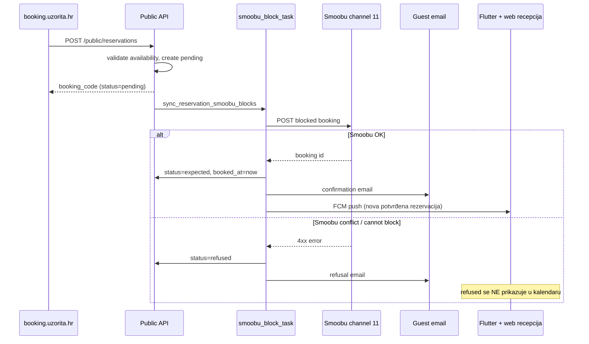

# Booking lifecycle (Smoobu) + web kalendar blokiranje

## Kontekst — što danas ne radi

| Problem | Trenutno stanje |
|---------|-----------------|
| Web kalendar | Samo read-only prikaz blokada ([`RoomCalendarDayDetail.tsx`](c:\Users\avrca\Documents\Projects\Uzorita_all\stay.hr\web\reception\app\_components\RoomCalendarDayDetail.tsx)) |
| Booking create | `POST /api/v1/public/reservations` → `status=pending`, ostaje pending zauvijek ([`serializers.py`](c:\Users\avrca\Documents\Projects\Uzorita_all\stay.hr\backend\apps\api\serializers.py)) |
| Smoobu sync | [`sync_reservation_smoobu_blocks_task`](c:\Users\avrca\Documents\Projects\Uzorita_all\stay.hr\backend\apps\integrations\smoobu\tasks.py) kreira `UnitAvailabilityBlock`, ali **ne mijenja status** |
| Email gostu | Ne postoji — nema `EMAIL_*` u settings, nema send taska |
| `refused` status | Ne postoji u [`Reservation.Status`](c:\Users\avrca\Documents\Projects\Uzorita_all\stay.hr\backend\apps\reservations\models.py) |
| Kalendar recepcije | Prikazuje `pending` rezervacije ([`UnitCalendarView`](c:\Users\avrca\Documents\Projects\Uzorita_all\stay.hr\backend\apps\api\rooms_views.py) isključuje samo `canceled`) |
| Push recepciji | [`notify_new_reservation`](c:\Users\avrca\Documents\Projects\Uzorita_all\stay.hr\backend\apps\reservations\signals.py) odmah na create (dok je još pending) |

---

## Case 2 — novi booking lifecycle (Smoobu-driven)

### Ciljani flow



### Backend — model i statusi

**Nova migracija** u [`models.py`](c:\Users\avrca\Documents\Projects\Uzorita_all\stay.hr\backend\apps\reservations\models.py):

```python
REFUSED = "refused", "Refused"
```

Pravila prikaza / blokiranja:

| Status | Public availability API | Reception kalendar | Timeline |
|--------|------------------------|-------------------|----------|
| `pending` | **ne blokira** (kratko trajanje) | **ne prikazuje** | opcionalno (filter) |
| `expected` | blokira | prikazuje | prikazuje |
| `refused` | ne blokira | **ne prikazuje** | ne prikazuje (ili samo admin) |
| `canceled` | ne blokira | ne prikazuje | filter |

Promjena u [`views.py`](c:\Users\avrca\Documents\Projects\Uzorita_all\stay.hr\backend\apps\api\views.py):

```python
BLOCKING_RESERVATION_STATUSES = {EXPECTED, CHECKED_IN}  # ukloniti PENDING
```

Isto u [`UnitCalendarView`](c:\Users\avrca\Documents\Projects\Uzorita_all\stay.hr\backend\apps\api\rooms_views.py): isključiti `pending` i `refused` iz queryseta.

### Backend — Smoobu task kao state machine

Proširiti [`sync_reservation_smoobu_blocks_task`](c:\Users\avrca\Documents\Projects\Uzorita_all\stay.hr\backend\apps\integrations\smoobu\tasks.py) i [`reservation_blocking_service.py`](c:\Users\avrca\Documents\Projects\Uzorita_all\stay.hr\backend\apps\integrations\smoobu\reservation_blocking_service.py):

1. **Samo za `source=api` + prazan `import_source` + status=pending** pokrenuti confirm/refuse logiku (channel importi ostaju nepromijenjeni).

2. **Prije Smoobu poziva** — server-side availability check na create ([`PublicReservationCreateSerializer`](c:\Users\avrca\Documents\Projects\Uzorita_all\stay.hr\backend\apps\api\serializers.py)): isti kriterij kao public availability (expected/checked_in + manual blocks + Smoobu external blocks).

3. **Na uspjeh** (svi uniti blokirani):
   - `reservation.status = expected`
   - `booked_at = now()`
   - enqueue `send_guest_booking_confirmed_email`
   - enqueue `notify_new_reservation` (premješteno s create signala)

4. **Na definitivni fail** (Smoobu 4xx / `SmoobuRatesError` s overlap porukom):
   - rollback djelomično kreiranih `UnitAvailabilityBlock` redova (`remove_reservation_smoobu_blocks`)
   - `reservation.status = refused`
   - enqueue `send_guest_booking_refused_email`
   - **bez** reception pusha

5. **Na transient fail** (5xx, mreža, 429 nakon retrya):
   - Celery retry (postojeće ponašanje)
   - nakon max retries: ostaje `pending` + log/alert (ne automatski refused — to nije Smoobu conflict)

6. **Nova iznimka** `SmoobuBlockConflictError(SmoobuRatesError)` — klasificirati Smoobu 409/422/overlap poruke da se ne retrya nego ide u refused.

7. **Signal promjena** ([`signals.py`](c:\Users\avrca\Documents\Projects\Uzorita_all\stay.hr\backend\apps\reservations\signals.py)):
   - `notify_new_reservation` **ne** na create pending web bookinga
   - `sync_reservation_smoobu_blocks_task` ostaje na create

### Backend — email infrastruktura (greenfield)

Referenca: [`uzorita-rooms-code/backend/app/communications/`](c:\Users\avrca\Documents\Projects\Uzorita_all\uzorita-rooms-code\backend\app\communications\)

1. **Django email settings** u [`config/settings/base.py`](c:\Users\avrca\Documents\Projects\Uzorita_all\stay.hr\backend\config\settings\base.py) + env u [`.env.example`](c:\Users\avrca\Documents\Projects\Uzorita_all\stay.hr\.env.example):
   - `EMAIL_HOST`, `EMAIL_PORT`, `EMAIL_HOST_USER`, `EMAIL_HOST_PASSWORD`, `EMAIL_USE_TLS/SSL`, `DEFAULT_FROM_EMAIL`

2. **Tenant from-adresa** — novo polje na [`TenantReceptionSettings`](c:\Users\avrca\Documents\Projects\Uzorita_all\stay.hr\backend\apps\tenants\models.py):
   - `guest_contact_email` (CharField, From/Reply-To za goste)
   - `guest_contact_name` (opcionalno, npr. "Uzorita Rooms")
   - Admin inline već postoji u [`tenants/admin.py`](c:\Users\avrca\Documents\Projects\Uzorita_all\stay.hr\backend\apps\tenants\admin.py)

3. **Novi app `apps/communications/`** (minimalno):
   - `send_guest_email_task` (Celery)
   - HTML + text templatei: `booking_confirmed`, `booking_refused` (HR + EN prema `tenant.default_language`)
   - Sadržaj: booking_code, datumi, soba, property name, kontakt

4. **Triggeri** iz Smoobu task completion hooka (ne iz raw `post_save`).

### Backend — public status lookup (booking web)

Novi endpoint (auth: `public:read`):

```
GET /api/v1/public/reservations/{booking_code}
→ { status, check_in, check_out, property_slug, unit_code, booker_name }
```

Bez osjetljivih podataka (email/telefon). Omogućuje confirmation stranici polling.

### Booking web — confirmation stranica

[`web/booking/app/confirmation/[code]/page.tsx`](c:\Users\avrca\Documents\Projects\Uzorita_all\stay.hr\web\booking\app\confirmation\[code]\page.tsx):

- Client komponenta s pollingom (npr. svakih 3 s, max 60 s)
- `pending` → "Obrađujemo rezervaciju…"
- `expected` → "Rezervacija potvrđena" (+ mail poslan)
- `refused` → "Nažalost, termin nije dostupan" (+ mail poslan)
- i18n stringovi u [`messages/*.json`](c:\Users\avrca\Documents\Projects\Uzorita_all\stay.hr\web\booking\messages\)

Checkout create stranica: tekst da je rezervacija **zaprimljena** (ne "potvrđena") dok Smoobu ne završi.

### Flutter + web recepcija (prikaz potvrđenih web bookinga)

- **Kalendar** ([`RoomCalendarGrid`](c:\Users\avrca\Documents\Projects\Uzorita_all\stay.hr\web\reception\app\_components\RoomCalendarGrid.tsx), Flutter booking calendar): prikazuje samo `expected`+ (backend filter)
- **Timeline**: `expected` web bookingi vidljivi; otkazivanje `expected → canceled` već postoji u Flutteru ([`reservation_status.dart`](c:\Users\avrca\Documents\Projects\Uzorita_all\uzorita_flutter\lib\features\reception\presentation\reservation_status.dart))
- **Web recepcija detalj**: dodati PATCH cancel za `expected` (minimalni scope — samo cancel, ne cijeli tablet feature set)
- **`refused` / `pending` badge**: dodati u i18n/UI mape ako treba u adminu

---

## Case 1 — blokiranje datuma na web kalendaru

Backend API **već postoji** — samo frontend:

| Akcija | API |
|--------|-----|
| Lista blokada | `GET /api/v1/reception/calendar/blocks/?from=&to=` |
| Blokiraj | `POST /api/v1/reception/units/{unit_id}/block/` `{check_in, check_out}` |
| Odblokiraj | `DELETE /api/v1/reception/blocks/{block_id}/` (samo `can_unblock=true`) |

BFF proxy već podržava POST/DELETE ([`app/api/stay/[...path]/route.ts`](c:\Users\avrca\Documents\Projects\Uzorita_all\stay.hr\web\reception\app\api\stay\[...path]\route.ts)).

### Implementacija (mirror Flutter)

Referenca: [`booking_day_bookings_sheet.dart`](c:\Users\avrca\Documents\Projects\Uzorita_all\uzorita_flutter\lib\features\reception\presentation\widgets\booking_day_bookings_sheet.dart)

1. **Nova lib** [`web/reception/lib/calendarAvailability.ts`](c:\Users\avrca\Documents\Projects\Uzorita_all\stay.hr\web\reception\lib\calendarAvailability.ts) — port `freeUnitsForNight` / `isUnitFreeForRange` logike iz [`booking_calendar_models.dart`](c:\Users\avrca\Documents\Projects\Uzorita_all\uzorita_flutter\lib\features\reception\domain\booking_calendar_models.dart)

2. **Proširiti** [`RoomCalendarDayDetail.tsx`](c:\Users\avrca\Documents\Projects\Uzorita_all\stay.hr\web\reception\app\_components\RoomCalendarDayDetail.tsx):
   - Unblock gumb na Hospira blokovima (`can_unblock && id`)
   - Sekcija "Blokiraj sobu": multi-select slobodnih unita, date pickeri check-in/check-out, confirm dialog
   - Sekvencijalni POST po unitu + loading overlay
   - `onChanged` callback → reload u [`page.tsx`](c:\Users\avrca\Documents\Projects\Uzorita_all\stay.hr\web\reception\app\calendar\rooms\page.tsx)

3. **Ograničenja** (kao Flutter):
   - Samo budući datumi (≥ today Europe/Zagreb)
   - Samo Hospira blokovi se mogu otkloniti
   - Backend `validate_block_request` kao fallback za greške

4. **i18n** — stringovi u [`web/reception/messages/*.json`](c:\Users\avrca\Documents\Projects\Uzorita_all\stay.hr\web\reception\messages\)

---

## Test plan

### Backend
- `pending` + Smoobu mock success → `expected`, email queued, block created, push sent
- `pending` + Smoobu mock 409/overlap → `refused`, partial blocks cleaned, refusal email, no calendar row
- `pending` ne blokira public availability; `expected` blokira
- Public create s overlap → 400 prije nego stvori pending
- `GET /public/reservations/{code}` vraća ispravan status

### Web reception
- Block/unblock na `/calendar/rooms` — ručno na dev okruženju
- `expected` web booking vidljiv nakon Smoobu synca

### Booking web
- Checkout → confirmation polling: pending → expected ili refused

### Flutter (regresija)
- Postojeći block flow nepromijenjen
- Timeline/kalendar ne prikazuje refused

---

## Redoslijed implementacije

1. **Backend lifecycle** (refused status, Smoobu state machine, availability rules) — temelj za case 2
2. **Email infra + tenant guest_contact_email** — potvrda/odbijanje mailovi
3. **Public status endpoint + booking web polling** — gost vidi ishod
4. **Web kalendar block/unblock UI** — case 1, neovisno od case 2 ali isti deploy
5. **Web recepcija cancel + UI badge polish** — manji scope

## Deploy napomene

- Postaviti SMTP env varijable na produkciji prije uključivanja booking emaila
- U Django adminu za tenant `uzorita`: popuniti `guest_contact_email` (npr. recepcijski mail objekta)
- Celery worker mora biti aktivan (Smoobu task + email task)
