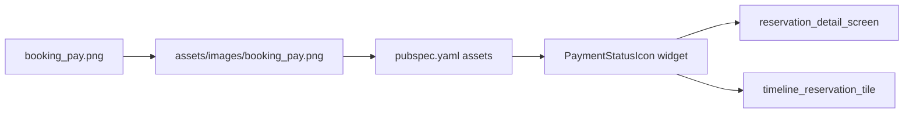

# Booking.com ikona za status plaćanja

## Kontekst

- Status **„Naplata putem Booking.com-a”** mapira se na `paymentStatusKey == 'booking'` ([`reservation.dart`](c:\Users\avrca\Documents\Projects\Uzorita_all\uzorita_flutter\lib\features\reception\domain\reservation.dart) — `contains('booking')` ili API `payment_status_key`).
- Ikona se bira u [`reservation_status.dart`](c:\Users\avrca\Documents\Projects\Uzorita_all\uzorita_flutter\lib\features\reception\presentation\reservation_status.dart) — trenutno `Icons.storefront_outlined` za `'booking'`.
- Prikaz na **dva mjesta** (ista logika, različita veličina):

| Mjesto | Datoteka | Veličina |
|--------|----------|----------|
| Detalj rezervacije — red „Status plaćanja” | [`reservation_detail_screen.dart`](c:\Users\avrca\Documents\Projects\Uzorita_all\uzorita_flutter\lib\features\reception\presentation\reservation_detail_screen.dart) ~L188 | **20** logical px |
| Timeline chipovi (pored kreveta/osoba/djece) | [`timeline_reservation_tile.dart`](c:\Users\avrca\Documents\Projects\Uzorita_all\uzorita_flutter\lib\features\reception\presentation\timeline_reservation_tile.dart) `_PaymentIcon` ~L208 | **18** logical px |

Susjedne Material ikone su outline, 18–20 px, s `color` iz `paymentStatusColor` (za `booking`: `colorScheme.tertiary` na detalju, isto na timelineu).

Izvorni [`booking_pay.png`](c:\Users\avrca\Documents\Projects\Uzorita_all\uzorita_flutter\booking_pay.png) je punokoloran Booking „B.” + ruka na **crnoj** pozadini — za krem pozadinu UI-a treba **transparentan** PNG (inače crni pravokutnik).

## Pristup



**Bez novih dependencija** (`flutter_svg` nije u projektu) — ostaje **PNG** s resolution-aware varijantama (standardni Flutter pattern, kao kod drugih slika u `assets/images/`).

### 1. Priprema asset-a

- Premjestiti iz roota u [`assets/images/booking_pay.png`](c:\Users\avrca\Documents\Projects\Uzorita_all\uzorita_flutter\assets\images\booking_pay.png) (uz postojeći `hospira_button.png`).
- Urediti sliku:
  - **Transparentna pozadina** (ukloniti crno).
  - **Kvadratni crop** oko logotipa + ruke (visina ≈ širina), da `BoxFit.contain` u 18×18 / 20×20 ne ostavi prazan prostor.
- Generirati DPR varijante (isti naziv datoteke u podmapama):

| Putanja | Fizička veličina (px) | Za logical |
|---------|----------------------|------------|
| `assets/images/booking_pay.png` | 24×24 | 24 @1x (ili 20×20 ako želimo točno max visinu) |
| `assets/images/2.0x/booking_pay.png` | 40×40 | 20 @2x |
| `assets/images/3.0x/booking_pay.png` | 54×54 | 18 @3x |
| `assets/images/3.0x/booking_pay.png` | 60×60 | 20 @3x |

Praktično: jedan set **24 / 48 / 72** px visine pokriva oba prikaza (Flutter skalira prema `width`/`height` u widgetu). Alat: ImageMagick, GIMP, ili online — nije potrebno u repou.

- Obrisati ili ostaviti root `booking_pay.png` (preporuka: samo `assets/images/`).

### 2. Registracija u pubspec

U [`pubspec.yaml`](c:\Users\avrca\Documents\Projects\Uzorita_all\uzorita_flutter\pubspec.yaml) dodati pod `flutter.assets`:

```yaml
- assets/images/booking_pay.png
```

(Flutter automatski učitava `2.0x/` i `3.0x/` varijante ako postoje.)

### 3. Zajednički widget

U [`reservation_status.dart`](c:\Users\avrca\Documents\Projects\Uzorita_all\uzorita_flutter\lib\features\reception\presentation\reservation_status.dart) dodati npr. `PaymentStatusIcon`:

- Ako `statusKey == 'booking'` → `Image.asset('assets/images/booking_pay.png', width: size, height: size, fit: BoxFit.contain)` — **bez** `ColorFiltered` (brand plava + tamna ruka).
- Inače → postojeći `Icon(paymentStatusIcon(...), size: size, color: paymentStatusColor(...))`.

`paymentStatusIcon()` ostaje za ostale ključeve (`paid`, `unpaid`, …).

### 4. Zamjena na oba ekrana

- **Detalj:** zamijeniti `Icon(paymentStatusIcon(...), size: 20, ...)` s `PaymentStatusIcon(statusKey: d.paymentStatusKey, size: 20)`.
- **Timeline:** u `_PaymentIcon` zamijeniti `Icon(...)` s `PaymentStatusIcon(statusKey: statusKey, size: 18)`.

Tooltip / tekst ostaju nepromijenjeni.

### 5. Provjera

- Hot restart nakon `flutter pub get`.
- Rezervacija s `payment_status` koji sadrži „booking” — timeline chip i detalj prikazuju novu ikonu, poravnata s `Icons.bed` / `Icons.people` (18 px) odnosno tekstom (20 px).
- Ostali statusi plaćanja i dalje koriste Material ikone.

## Napomene

- Ako Play/marketing zahtijeva strogo monochrome ikone, kasnije se može dodati `ColorFiltered` s `paymentStatusColor` — za sada korisnik dostavlja punokoloran logo.
- Nema promjena backenda ni `paymentStatusKey` logike.
