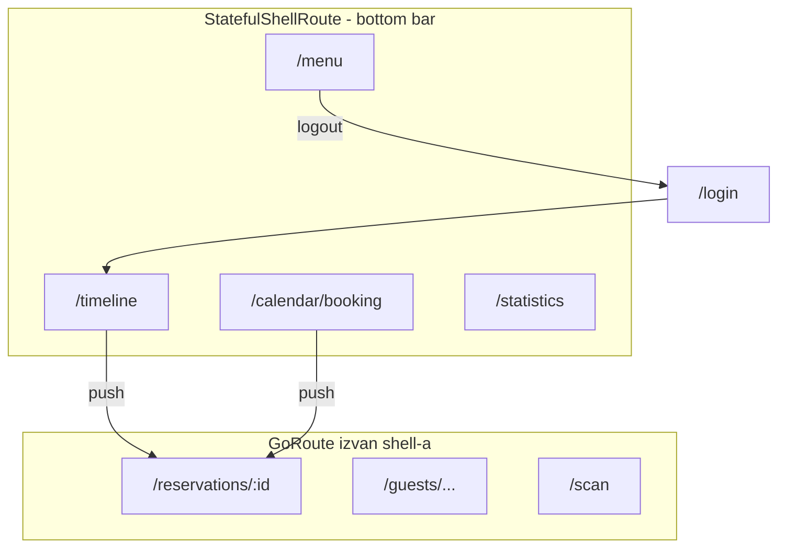

# Bottom navigacija — fazni plan

## Trenutno stanje

- Router u [`uzorita_flutter/lib/app/app.dart`](c:\Users\avrca\Documents\Projects\Uzorita_all\uzorita_flutter\lib\app\app.dart): ravne rute `/timeline` i `/calendar/booking`; auth redirect na `/timeline`.
- [`timeline_screen.dart`](c:\Users\avrca\Documents\Projects\Uzorita_all\uzorita_flutter\lib\features\reception\presentation\timeline_screen.dart): `AppBar` s naslovom, gumbom kalendara (`context.push`) i avatarom/odjavom.
- [`booking_calendar_screen.dart`](c:\Users\avrca\Documents\Projects\Uzorita_all\uzorita_flutter\lib\features\reception\presentation\booking_calendar_screen.dart): `AppBar` s `BackButton` jer je ekran push-an s timelinea.
- Detalji (`/reservations/:id`, gosti, scan) već koriste vlastiti `AppBar` — ostaju full-screen izvan tabova.
- Ekran statistika **ne postoji** — u ovom planu ide placeholder.

---

## Faza 1 — Shell infrastruktura (router + scaffold)

**Cilj:** Jedan zajednički bottom bar za sve glavne tabove; rute i redirecti i dalje rade.

**Datoteke:**
- Novi: [`lib/app/reception_shell_scaffold.dart`](c:\Users\avrca\Documents\Projects\Uzorita_all\uzorita_flutter\lib\app\reception_shell_scaffold.dart)
- Izmjena: [`lib/app/app.dart`](c:\Users\avrca\Documents\Projects\Uzorita_all\uzorita_flutter\lib\app\app.dart)

**Radnje:**
1. Dodati `ReceptionShellScaffold` koji prima `StatefulNavigationShell` i renderira:
   - `body: navigationShell`
   - `bottomNavigationBar: NavigationBar` (Material 3, usklađeno s postojećim `ThemeData` u `HospiraApp`)
2. Zamijeniti ravne `GoRoute` za timeline/kalendar s `StatefulShellRoute.indexedStack` i **4 brancha**:

| Index | Path | Widget |
|-------|------|--------|
| 0 | `/timeline` | `TimelineScreen` |
| 1 | `/calendar/booking` | `BookingCalendarScreen` (path zadržati radi kompatibilnosti) |
| 2 | `/statistics` | `StatisticsScreen` (Faza 4) |
| 3 | `/menu` | `MenuScreen` (Faza 3) |

3. Rute `/reservations/:id`, gosti i scan ostaviti **izvan** shell-a (sibling na root razini) — bottom bar nestaje na detaljima.
4. Zadržati `initialLocation: '/timeline'` i auth redirect (`login` → `/timeline`).
5. `navigationShell.goBranch(index, initialLocation: index == currentIndex)` za ponovni tap na isti tab (scroll-to-top kasnije opcionalno).

**Kriterij prihvaćanja:** Nakon logina vidljiv bottom bar; tapovi mijenjaju tab; `flutter analyze` čist.

---

## Faza 2 — Timeline: ukloniti gornji meni

**Cilj:** Više prostora za filtere/listu; nema naslova „Timeline rezervacija“, kalendara ni odjave u headeru.

**Datoteka:** [`timeline_screen.dart`](c:\Users\avrca\Documents\Projects\Uzorita_all\uzorita_flutter\lib\features\reception\presentation\timeline_screen.dart)

**Radnje:**
1. Ukloniti cijeli `appBar` (ili `Scaffold` bez `appBar` — `body` ostaje nepromijenjen).
2. Maknuti `IconButton` za kalendar i `PopupMenuButton` / `_userInitials` (premještaju se u Fazu 3).
3. Opcionalno: mali `SafeArea` / gornji padding na filter sekciji ako sadržaj ide ispod status bara (test na uređaju s `flutter run --release`).

**Kriterij:** Timeline izgleda kao na referentnoj slici — filteri odmah ispod status bara, bez velikog zaglavlja.

---

## Faza 3 — Kalendar: tab umjesto push ekrana

**Cilj:** Kalendar je drugi tab; nema Back gumba prema timelineu.

**Datoteka:** [`booking_calendar_screen.dart`](c:\Users\avrca\Documents\Projects\Uzorita_all\uzorita_flutter\lib\features\reception\presentation\booking_calendar_screen.dart)

**Radnje:**
1. Ukloniti `leading: BackButton` i `context.go('/timeline')` fallback.
2. Pojednostaviti `AppBar`:
   - **Opcija A (preporučeno):** bez naslova — samo `actions` s filter ikonom (`Icons.filter_list`), kao funkcionalni toolbar.
   - **Opcija B:** zadržati kratki naslov „Kalendar“ ako tim želi kontekst.
3. `body` i `BookingCalendarFilterSheet` — bez promjena logike.

**Kriterij:** Prebacivanje Timeline ↔ Kalendar ide bottom barom; filter i refresh rade kao prije.

---

## Faza 4 — Menu tab (odjava + stub postavki)

**Cilj:** Logout i buduće postavke na jednom mjestu.

**Novi file:** [`lib/features/reception/presentation/menu_screen.dart`](c:\Users\avrca\Documents\Projects\Uzorita_all\uzorita_flutter\lib\features\reception\presentation\menu_screen.dart)

**Radnje:**
1. `MenuScreen` (ConsumerWidget):
   - Prikaz korisnika iz `authControllerProvider` (username; inicijali — premjestiti `_userInitials` iz timelinea u npr. `lib/core/utils/user_initials.dart` ili ostaviti privatno u menu fileu).
   - `ListTile` **Odjava** → `ref.read(authControllerProvider.notifier).logout()` (ista logika kao danas u timeline popupu).
   - Placeholder sekcija „Postavke“ (npr. disabled `ListTile` ili kratka napomena „Uskoro“) za buduće nadogradnje.
2. `Scaffold` bez `AppBar` ili s minimalnim naslovom „Više“ — dosljedno s timelineom.

**Kriterij:** Odjava iz Menija vraća na `/login`; sesija se ponaša kao dosad.

---

## Faza 5 — Statistike (placeholder)

**Cilj:** Četvrti tab postoji u navigaciji; kasnije se zamijeni pravim grafikonima/API-jem.

**Novi file:** [`lib/features/reception/presentation/statistics_screen.dart`](c:\Users\avrca\Documents\Projects\Uzorita_all\uzorita_flutter\lib\features\reception\presentation\statistics_screen.dart)

**Radnje:**
1. Jednostavan placeholder: ikona `Icons.bar_chart`, tekst „Statistike — uskoro“.
2. Opcionalno: napomena u stilu referentne web aplikacije (prihod od dodatnih usluga) kao `bodySmall` — bez API poziva.

**Kriterij:** Tab se otvara bez greške; nema mrežnih poziva.

---

## Faza 6 — Čišćenje referenci i ručno testiranje

**Cilj:** Nema mrtvih linkova na stari push kalendara; povratak s detalja radi.

**Datoteke za provjeru (grep već pokazuje ove točke):**
- [`login_screen.dart`](c:\Users\avrca\Documents\Projects\Uzorita_all\uzorita_flutter\lib\features\auth\presentation\login_screen.dart) — `context.go('/timeline')` OK
- [`reservation_detail_screen.dart`](c:\Users\avrca\Documents\Projects\Uzorita_all\uzorita_flutter\lib\features\reception\presentation\reservation_detail_screen.dart) — `context.go('/timeline')` OK
- [`booking_day_bookings_sheet.dart`](c:\Users\avrca\Documents\Projects\Uzorita_all\uzorita_flutter\lib\features\reception\presentation\widgets\booking_day_bookings_sheet.dart) — `context.push('/reservations/...')` OK (ostaje izvan shell-a)

**Checklist testiranja (fizički uređaj / release build):**
1. Login → Timeline tab, bottom bar vidljiv.
2. Tab Kalendar → filter → dan s rezervacijama → detalj rezervacije → back → još uvijek na kalendar tabu (ili očekivani stack).
3. Tab Statistike → placeholder.
4. Tab Menu → odjava.
5. Timeline → tap rezervacija → detalj → back / `go('/timeline')` akcije.
6. Rotacija / ponovni tap na isti tab (shell state).

**Napomena:** Nema postojećih router testova u `test/` — Faza 6 je ručna; opcionalno kasnije `go_router` widget test za shell.

---

## Ikone i labeli (finalno)

| Tab | Ikona | Label |
|-----|--------|--------|
| Timeline | `Icons.schedule` | Timeline |
| Kalendar | `Icons.calendar_month` | Kalendar |
| Statistike | `Icons.bar_chart` | Statistike |
| Menu | `Icons.more_horiz` | Više |

---

## Izvan opsega (kasnije)

- Pravi ekran statistika + backend API.
- Postavke u Menu tabu (API URL, tema, itd.).
- Peti tab s referentne web aplikacije (clipboard/speedometer) — nije tražen.
- Automatski widget testovi za `StatefulShellRoute`.

## Procjena

| Faza | Opseg |
|------|--------|
| 1 | ~1 novi file + router refactor |
| 2–3 | Uklanjanje AppBar logike na 2 ekrana |
| 4–5 | 2 mala nova ekrana |
| 6 | Ručno testiranje |

Ukupno: jedan koherentan PR u `uzorita_flutter`, bez promjena u `uzorita-rooms-code` backendu.
