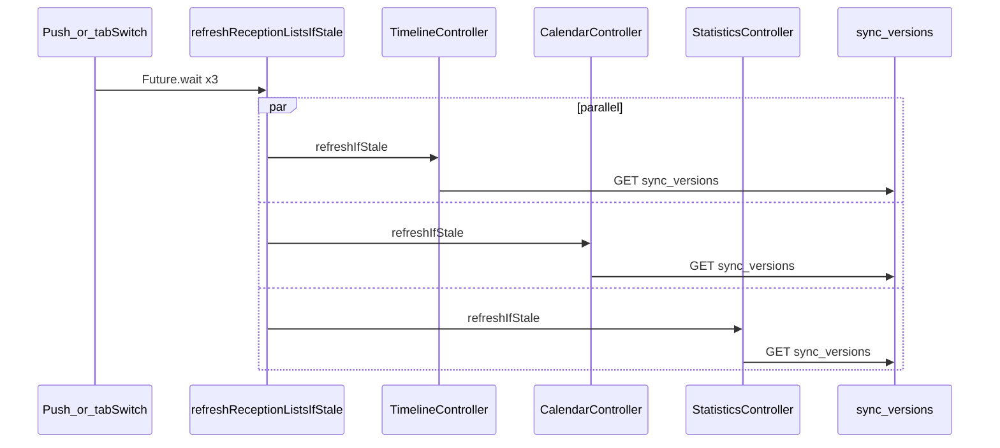
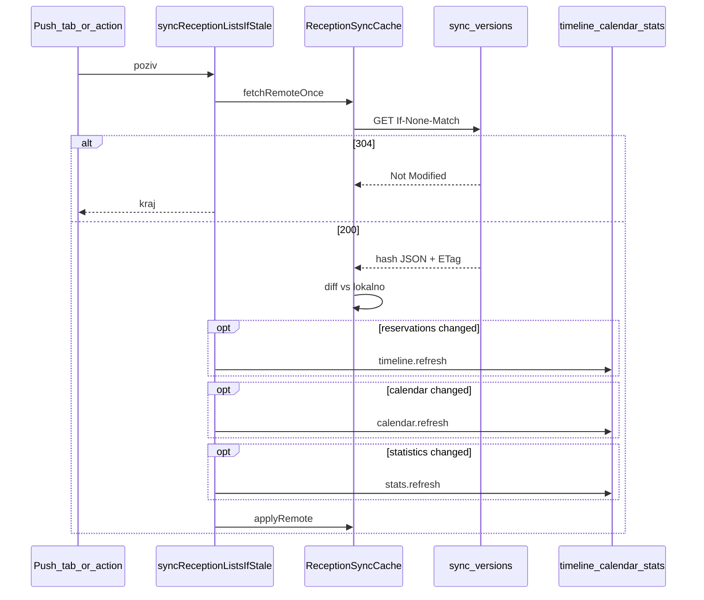

# Centralni sync orchestrator + ETag

## Problem

Hash sync je već implementiran, ali orchestracija nije centralizirana:

| Dio | Stanje |
|-----|--------|
| Centralni hash JSON | [`GET /api/v1/reception/sync-versions/`](stay.hr/backend/apps/api/reception_urls.py) — [`sync_versions.py`](stay.hr/backend/apps/reservations/sync_versions.py) |
| Lokalni cache | [`reception_sync_cache.dart`](uzorita_flutter/lib/features/reception/data/reception_sync_cache.dart) |
| Per-controller `refreshIfStale()` | timeline, kalendar, statistika |
| Push refresh | [`push_invalidation.dart`](uzorita_flutter/lib/core/notifications/push_invalidation.dart) |
| **Jedan sync-versions poziv** | Nedostaje — push/tab switch radi **3 paralelna** poziva |
| **ETag / 304** | Nedostaje u reception API-ju |



**Cilj:** jedan poziv → usporedba → selektivni puni fetch.

---

## Faza A — Backend (stay.hr): ETag na sync-versions

### A.1 ETag helper

Nova funkcija u [`sync_versions.py`](stay.hr/backend/apps/reservations/sync_versions.py) (ili `apps/api/etag.py`):

- Stabilan canonical JSON (`sort_keys=True`, bez whitespace)
- SHA256 → weak ETag: `W/"<hex32>"`

### A.2 View promjena

U [`ReceptionSyncVersionsView`](stay.hr/backend/apps/api/reception_views.py) (`~` linija 133):

1. `payload = build_sync_versions_payload(request.tenant, year)`
2. `etag = sync_versions_etag(payload)`
3. Ako `If-None-Match == etag` → **304 Not Modified** (prazan body)
4. Inače → **200** + `ETag` header + JSON body

`year` query utječe na `statistics[year]` — ETag mora pokrivati cijeli payload za taj year.

### A.3 Testovi

Proširiti [`test_reception_api.py`](stay.hr/backend/apps/api/tests/test_reception_api.py) (`test_sync_versions`):

- 200 + `ETag` header postoji
- GET s `HTTP_IF_NONE_MATCH` → 304
- Nakon promjene rezervacije → novi ETag, stari `If-None-Match` → 200

---

## Faza B — Flutter: centralni orchestrator

### B.1 Proširiti ReceptionSyncCache

Datoteka: [`reception_sync_cache.dart`](uzorita_flutter/lib/features/reception/data/reception_sync_cache.dart)

Novi tip i metode:

```dart
class ReceptionSyncDiff {
  final bool reservations;
  final bool calendar;   // reservations OR rooms
  final bool statistics;
}
```

| Metoda | Ponašanje |
|--------|-----------|
| `fetchRemoteOnce(api, {year})` | Jedan HTTP poziv; cacheira remote; `null` ako P1 nedostaje |
| `compareAll(api, {year})` | `fetchRemoteOnce` + diff vs lokalno → `ReceptionSyncDiff` |
| `applyRemote(remote, year)` | Ažuriraj lokalne hashove bez novog HTTP poziva |

ETag u cacheu (`_syncVersionsEtag`):

- [`reception_api.dart`](uzorita_flutter/lib/features/reception/data/reception_api.dart) `syncVersions()` šalje `If-None-Match` ako postoji
- 304 → nema promjene (diff sve `false`)
- 200 → spremi `ETag` iz response headera

Refaktor: postojeće `reservationsChanged` / `calendarDataChanged` / `statisticsChanged` ne smiju više zasebno zvati `_fetchVersions` — delegiraju na `compareAll` ili se uklone iz trigger puta.

### B.2 Nova datoteka: reception_sync_orchestrator.dart

```dart
Future<void> syncReceptionListsIfStale(Ref ref) async {
  final api = ref.read(receptionApiProvider);
  final cache = ref.read(receptionSyncCacheProvider);
  final year = DateUtilsIso.propertyNow().year;
  final statsYear =
      ref.read(statisticsControllerProvider).asData?.value.year ?? year;

  final result = await cache.fetchRemoteOnce(api, year: statsYear);
  if (result == null) return; // P1 missing — fallback ostaje u controller build()

  final diff = cache.diffFromRemote(result, year: statsYear);
  if (!diff.reservations && !diff.calendar && !diff.statistics) return;

  await Future.wait([
    if (diff.reservations)
      ref.read(timelineControllerProvider.notifier).refresh(),
    if (diff.calendar)
      ref.read(bookingCalendarControllerProvider.notifier).refresh(),
    if (diff.statistics)
      ref.read(statisticsControllerProvider.notifier).refresh(),
  ]);

  cache.applyRemote(result.remote, year: statsYear);
}
```

Orchestrator zove **`refresh()`**, ne `refreshIfStale()` — hash provjera je već odrađena.

Ukloniti dupli `markFresh()` HTTP poziv iz controller `build()` nakon orchestrator refresha — `applyRemote` zamjenjuje taj korak u orchestrator putu; u direktnom `refresh()` (korisnička akcija) `markFresh` može ostati.

### B.3 Zamjena triggera

| Datoteka | Prije | Poslije |
|----------|-------|---------|
| [`push_invalidation.dart`](uzorita_flutter/lib/core/notifications/push_invalidation.dart) | `refreshReceptionListsIfStale` → 3× `refreshIfStale` | → `syncReceptionListsIfStale` |
| [`reception_shell_scaffold.dart`](uzorita_flutter/lib/app/reception_shell_scaffold.dart) | tab switch → 3× `refreshIfStale` | → `syncReceptionListsIfStale` |

Per-controller `refreshIfStale()` zadržati za single-tab slučajeve (npr. dugi pritisak na kalendar) — implementacija preko `compareAll` + refresh samo tog resursa.

Detalji ostaju po ID-u: `invalidate(reservationDetail)` / `invalidate(guestDetail)` iz push payloada — centralni hash ne pokriva pojedinačne entitete.

---

## Faza C — Ciljani tok



| Trigger | Lista sync | Detalj |
|---------|------------|--------|
| FCM `reservation.*` | orchestrator | `invalidate(reservationDetail)` |
| FCM `guest.*` / `document.scanned` | orchestrator | + `guestDetail` |
| Tab switch | orchestrator | — |
| Lokalni PATCH (isti tablet) | direktan UI update iz response | push s istog uređaja → orchestrator |

---

## Faza D — Testovi

### stay.hr
- ETag 200 / 304 / bump nakon promjene rezervacije

### uzorita_flutter
Nova datoteka `test/features/reception/reception_sync_cache_test.dart`:

- isti remote → diff sve `false`
- promjena samo `reservations` → samo `reservations: true`
- promjena `rooms` → `calendar: true`
- simulacija 304 → diff prazan

Mock `ReceptionApi` — bez mreže.

---

## Faza E — Opcionalno (odgoditi)

ETag na punim list endpointima (`reservations/`, `rooms/`, `statistics/monthly/`). **Ne uključiti u prvu iteraciju** — filtrirani timeline query parametri ne mapiraju se na agregatni hash bez dodatnog dizajna.

---

## Deploy redoslijed

1. **stay.hr** — ETag na sync-versions (backward compatible)
2. **uzorita_flutter** — orchestrator + ETag u cacheu
3. Ručni test (2 tableta):

| Scenarij | Očekivano |
|----------|-----------|
| B promijeni status → A push | 1× sync-versions; timeline refresh samo ako hash ≠ |
| Tab switch bez promjene | 1× sync-versions → 304 ili prazan diff → 0 punih GET |
| Promjena samo statistike | samo stats refresh |
| P1 404 / endpoint missing | fallback na puni fetch (postojeći `isP1EndpointMissing`) |

---

## Ograničenja

- Agregatni hash (`count:max_updated_at`) je namjerno lagan — dovoljan za recepciju
- Detalji rezervacije/gosta ne ulaze u centralni hash
- `sync-versions` mora biti deployan na produkciji da orchestrator ima smisla
