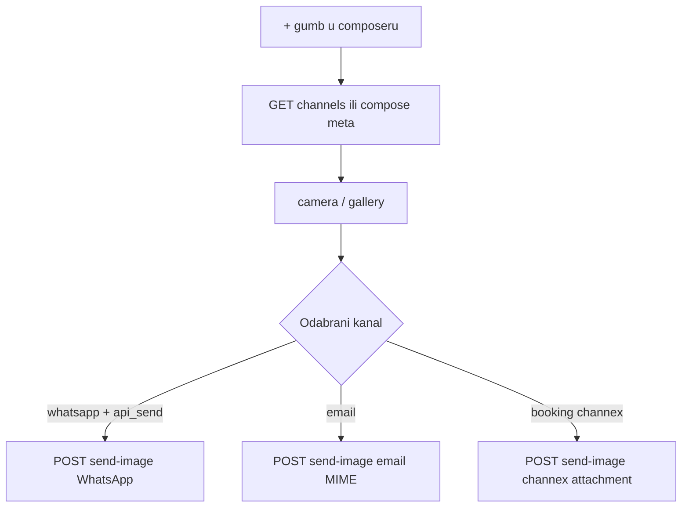

# Plan: slike u chatu (prikaz + slanje)

## Zašto vidiš „Images can only be sent via WhatsApp API”

Poruka **nije** nužno znak da 360dialog ne radi. U trenutnoj implementaciji postoje **dva** uzroka:

### 1. Bug u Flutteru (najvjerojatniji na tvom screenshotu)

U [`message_composer_bar.dart`](c:/Users/avrca/Documents/Projects/Uzorita_all/uzorita_flutter/lib/features/messages/presentation/widgets/message_composer_bar.dart) gumb `+` provjerava `channels.whatsappApiSend` **prije** otvaranja pickera.

Problem: `whatsappApiSend` dolazi iz API odgovora `channels.whatsapp.api_send`, ali taj objekt se u stateu postavlja **tek nakon AI compose** (`composeMessage`). Ako otvoriš thread i odmah pritisneš `+` bez compose-a, Flutter koristi lokalni fallback iz [`guest_message_channels.dart`](c:/Users/avrca/Documents/Projects/Uzorita_all/uzorita_flutter/lib/features/reception/domain/guest_message_channels.dart) gdje je **`whatsappApiSend: false` hardcodiran**.

```dart
// guestMessageChannelsFromReservation — uvijek false
whatsappApiSend: false,
```

Rezultat: SnackBar čak i kad je na serveru WhatsApp API spreman.

### 2. Stvarno nema WhatsApp API slanja (backend)

Server postavlja `api_send: true` samo kad postoji aktivna 360dialog integracija **i** `access_token` / `D360_API_KEY` ([`send_credentials_ok`](c:/Users/avrca/Documents/Projects/Uzorita_all/stay.hr/backend/apps/integrations/whatsapp/runtime_config.py)). Inače tekstualne poruke idu preko **handoff** (`wa.me`), a slike **ne mogu** — nema API endpointa za media u handoff modu.

---

## Email — zašto sada ne šaljemo slike?

Trenutno email kanal šalje **samo plain text** ([`EmailMultiAlternatives`](c:/Users/avrca/Documents/Projects/Uzorita_all/stay.hr/backend/apps/communications/guest_message_send.py) bez `attach()`). Nema `send-image` grane za email.

**Moguće i razumno dodati:** Django `message.attach(filename, bytes, mime_type)` na postojeći SMTP flow — gost dobije attachment u inboxu. Nema vanjskog API ograničenja osim veličine (npr. 8 MB kao ostale fotke).

---

## Channex / Booking.com — podržava li slike?

**Da, Channex API podržava attachmente**, ali naš kod **još ne**:

| Sloj | Stanje |
|------|--------|
| Channex docs | `POST /api/v1/attachments` (base64 file) → `attachment_id` → `POST /bookings/:id/messages` s `attachment_id` |
| OTA podrška | Channex navodi attachment messaging za **Booking.com, Expedia, Airbnb** (ne svi kanali) |
| Naš kod | [`send_booking_message`](c:/Users/avrca/Documents/Projects/Uzorita_all/stay.hr/backend/apps/integrations/channex/client.py) šalje samo `{"message": {"message": text}}` |
| Inbound | [`have_attachment`](c:/Users/avrca/Documents/Projects/Uzorita_all/stay.hr/backend/apps/integrations/models.py) se sprema na `ChannexMessage`, ali se ne servira u timeline UI |

Inbound attachment s Booking.coma **može** stići — mi to zapisujemo u `have_attachment`, ali ne prikazujemo sliku u Hospiri.

---

## Faza 3 — sljedeći koraci (odabrano: bugfix + email + Channex)



### 3.1 Bugfix — učitavanje kanala (Flutter + opcionalno backend)

**Minimalno (Flutter):** pri otvaranju [`MessageThreadScreen`](c:/Users/avrca/Documents/Projects/Uzorita_all/uzorita_flutter/lib/features/messages/presentation/message_thread_screen.dart) pozvati lagani endpoint ili `composeMessageFromText` s placeholderom da se `channels` spreme u state **prije** `+`.

**Bolje (backend):** novi `GET /api/v1/reception/reservations/{id}/messages/channels/` koji vraća isti JSON kao `build_message_channels()` — bez LLM drafta.

**UX:** zamijeniti generički SnackBar s jasnijom porukom:
- „Prvo generiraj poruku (AI)” — samo ako je to stvarno potrebno (nakon bugfixa ne bi trebalo)
- „WhatsApp API nije konfiguriran — slike nisu dostupne” — kad je `api_send: false` na serveru

### 3.2 Email attachment

**Backend:** proširiti `POST .../messages/send-image/` (ili novi unified endpoint) s parametrom `channel=email`:
- `EmailMultiAlternatives` + `message.attach(...)`
- audit u `GuestOutboundMessage` (novo polje `has_attachment` ili `message_type=image` u timeline serializaciji)

**Flutter:** nakon pickera, koristiti **trenutno odabrani kanal** (`_selectedChannel`) umjesto hardcoded WhatsApp-only; ako je email — multipart s `channel=email`.

### 3.3 Channex attachment (Booking.com)

**Backend:**
- [`ChannexClient`](c:/Users/avrca/Documents/Projects/Uzorita_all/stay.hr/backend/apps/integrations/channex/client.py): `upload_attachment(base64, filename, mime)` + `send_booking_message_with_attachment(booking_id, attachment_id, caption?)`
- `send_guest_booking_image(...)` u [`guest_message_send.py`](c:/Users/avrca/Documents/Projects/Uzorita_all/stay.hr/backend/apps/communications/guest_message_send.py)
- Timeline: outbound Channex s attachmentom (proširiti `serialize_channex` ili koristiti postojeći WhatsApp-style media URL pattern)

**Ograničenje:** samo rezervacije s `import_source=channex` i aktivnom integracijom; Booking.com limit ~1 MB po slici (Channex/Booking docs).

**Inbound (bonus):** download attachment URL iz Channex payloada i prikaz u bubbleu (slično WhatsApp document intake).

### 3.4 Flutter composer — multi-channel attachment

- Ukloniti `if (!channels.whatsappApiSend) return` kao jedini gate
- Nakon pickera: `switch (_selectedChannel)` → whatsapp / email / booking API poziv
- Ako kanal nije podržan za slike → SnackBar specifičan po kanalu

---

## Status Faza 1–2 (gotovo)

| Commit | Repo |
|--------|------|
| `4299d21` | stay.hr — media GET, send-image WhatsApp, migracija |
| `54f9192` | uzorita_flutter — thumbnail, modal, picker (WhatsApp-only gate) |

Deploy produkcija: OK (`deploy.sh`, django + celery).

---

## Ručni test (nakon Faze 3)

1. Otvori thread → odmah `+` (bez compose) → ne smije blokirati ako je `api_send=true`
2. WhatsApp: slika stigne gostu
3. Email: attachment u inboxu gosta
4. Booking.com rezervacija: slika u Booking extranet porukama
5. Inbound thumbnail i dalje radi (WhatsApp)

---

## Rizici

- **Channex attachment** nije dostupan na svim OTA kanalima — UI mora gracefully fallback na tekst
- **Email attachment** velike slike — koristiti isti `_max_photo_bytes` limit
- **WhatsApp handoff** — slike nikad neće raditi bez 360dialog API (by design)
