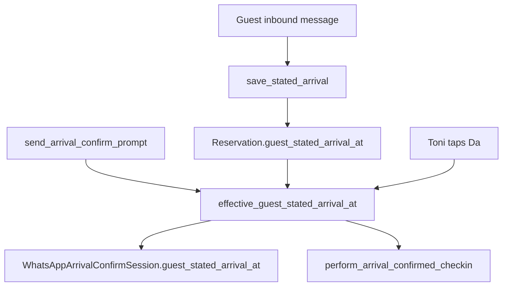

# Default za Guest stated arrival at = property check-in

## Problem

Polje `guest_stated_arrival_at` (Django label: **Guest stated arrival at**) ostaje `null` kad gost ne pošalje parsabilno vrijeme. To utječe na:

1. **[`WhatsAppArrivalConfirmSession`](stay.hr/backend/apps/reservations/models.py)** — pri kreiranju sesije u [`send_arrival_confirm_prompt`](stay.hr/backend/apps/integrations/whatsapp/operator_arrival_confirm.py) se kopira `reservation.guest_stated_arrival_at` (često `null`).
2. **Toni potvrda „Da”** — [`_default_confirmed_arrival_at`](stay.hr/backend/apps/integrations/whatsapp/operator_arrival_confirm.py) fallback je `property_local_now()`, ne check-in vrijeme objekta.
3. **WhatsApp prompt / push** — [`format_guest_stated_arrival_for_operator`](stay.hr/backend/apps/integrations/whatsapp/arrival_time_parse.py) vraća `""` kad je `null`, pa Toni ne vidi plan dolaska.

Postojeći uzor za kombiniranje datuma + `check_in_time` već postoji u [`autocheckin_docs_deadline.py`](stay.hr/backend/apps/integrations/whatsapp/autocheckin_docs_deadline.py):

```python
checkin_dt = datetime.combine(reservation.check_in, prop.check_in_time, tzinfo=tz)
```

## Rješenje

Uvesti jednu zajedničku helper funkciju i koristiti je na svim „effective“ mjestima — **bez** automatskog upisivanja na `Reservation` kad gost nije naveo vrijeme (rezervacija ostaje izvor istine za ono što gost stvarno rekao).

### 1. Helper funkcije

Dodati u [`apps/core/timezone.py`](stay.hr/backend/apps/core/timezone.py) (ili [`guest_arrival_policy.py`](stay.hr/backend/apps/communications/guest_arrival_policy.py) ako preferiramo blizu arrival logike):

- `reservation_check_in_datetime(reservation)` → `datetime` na `check_in` + `property.check_in_time` u property TZ (`effective_timezone`)
- `effective_guest_stated_arrival_at(reservation)` → `reservation.guest_stated_arrival_at` ako postoji, inače `reservation_check_in_datetime(reservation)`

### 2. Toni / arrival-confirm flow

U [`operator_arrival_confirm.py`](stay.hr/backend/apps/integrations/whatsapp/operator_arrival_confirm.py):

| Mjesto | Promjena |
|--------|----------|
| `send_arrival_confirm_prompt` (create + update session) | `guest_stated_arrival_at = effective_guest_stated_arrival_at(reservation)` |
| `_default_confirmed_arrival_at` | zamijeniti `property_local_now` s `effective_guest_stated_arrival_at` |
| `_notify_arrival_confirm_push` / `_build_arrival_confirm_prompt_body` | već koriste `format_guest_stated_arrival_for_operator` — popraviti tamo |

U [`arrival_time_parse.py`](stay.hr/backend/apps/integrations/whatsapp/arrival_time_parse.py):

- `format_guest_stated_arrival_for_operator`: ako postoji `guest_stated_arrival_text`, i dalje prikaži tekst gosta; ako nema teksta, formatiraj **effective** vrijeme kao `HH:MM` (npr. `15:00`).

### 3. Što namjerno NE mijenjamo

- [`save_stated_arrival`](stay.hr/backend/apps/communications/guest_arrival_inbound.py) — i dalje sprema `parsed` (može biti `null` za `late_inquiry` bez vremena).
- `Reservation.guest_stated_arrival_at` u bazi — ostaje `null` dok gost ne navede vrijeme; default je samo za **prikaz / Toni sesiju / check-in potvrdu**.
- [`schedule_arrival_confirm_prompt`](stay.hr/backend/apps/communications/guest_arrival_inbound.py) — i dalje samo kad je `parsed is not None` (gost je naveo vrijeme).



## Testovi

Ažurirati / dodati u [`test_operator_arrival_confirm.py`](stay.hr/backend/apps/integrations/tests/test_operator_arrival_confirm.py):

- Rezervacija **bez** `guest_stated_arrival_at` → nakon `send_arrival_confirm_prompt`, `session.guest_stated_arrival_at` = check-in datetime (npr. `2026-06-07 15:00 Europe/Zagreb` ako je default property `check_in_time`).
- Toni „Da” bez stated vremena → `_finish_arrival_checkin` / `confirmed_at` = check-in datetime, ne mock `now`.

Opcionalno u [`test_arrival_time_parse.py`](stay.hr/backend/apps/integrations/tests/test_arrival_time_parse.py):

- `format_guest_stated_arrival_for_operator` s praznim poljima → `"15:00"` (ili property-specific vrijeme).

## Deploy

- Samo Python logika, **bez migracije**.
- `git commit` + `./scripts/deploy.sh` na produkciji (isti workflow kao parking deploy).
