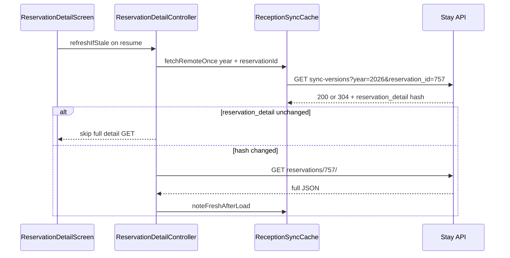

# Sync-versions na ReservationDetailScreen

## Cilj

Detail ekran danas uvijek radi puni `GET /reservations/{id}/`. Želimo isti obrazac kao timeline:



Pull-to-refresh ostaje **uvijek puni fetch** (postojeće ponašanje).

---

## 1. Backend (stay.hr) — per-rezervacija hash

### Nova funkcija u [`backend/apps/reservations/sync_versions.py`](c:\Users\avrca\Documents\Projects\Uzorita_all\stay.hr\backend\apps\reservations\sync_versions.py)

Dodati `reservation_detail_version(tenant, reservation_id) -> str | None`:

- U fingerprint uključiti promjene koje detail ekran prikazuje:
  - `Reservation.updated_at` za tu rezervaciju
  - agregat gostiju: `Count` + `Max(updated_at)` na `Guest` za `reservation_id`
  - agregat jedinica: `Count` + `Max(updated_at)` na `ReservationUnit` za `reservation_id`
- Ako rezervacija ne postoji za tenant → `None` (view vraća 404)

Proširiti `build_sync_versions_payload(tenant, year, reservation_id=None)`:

```python
payload = {
    "reservations": ...,
    "rooms": ...,
    "statistics": {...},
}
if reservation_id is not None:
    detail = reservation_detail_version(tenant, reservation_id)
    if detail is None:
        raise ReservationNotFound  # handled in view
    payload["reservation_detail"] = detail
```

ETag (`sync_versions_etag`) ostaje iz cijelog payloada — automatski uključuje `reservation_detail` kad je param prisutan.

### View u [`backend/apps/api/reception_views.py`](c:\Users\avrca\Documents\Projects\Uzorita_all\stay.hr\backend\apps\api\reception_views.py)

U `ReceptionSyncVersionsView.get`:

- Opcionalni query param `reservation_id` (int, validacija)
- Ako je zadan → u payload dodati `reservation_detail`
- Ako rezervacija ne postoji → `404`

Postojeći pozivi bez `reservation_id` ostaju **backward compatible** (nema novog polja).

### Testovi

- [`backend/apps/reservations/tests/test_sync_versions.py`](c:\Users\avrca\Documents\Projects\Uzorita_all\stay.hr\backend\apps\reservations\tests\test_sync_versions.py): promjena statusa rezervacije #757 mijenja `reservation_detail`; promjena druge rezervacije **ne** mijenja hash za #757; promjena gosta na #757 mijenja hash.
- [`backend/apps/api/tests/test_reception_api.py`](c:\Users\avrca\Documents\Projects\Uzorita_all\stay.hr\backend\apps\api\tests\test_reception_api.py): `GET sync-versions?year=2026&reservation_id=<id>` vraća polje; nepostojeći id → 404; ETag/304 i dalje rade.

**Deploy redoslijed:** backend prvo (additive API), zatim Flutter.

---

## 2. Flutter API + cache

### [`lib/features/reception/data/reception_api.dart`](c:\Users\avrca\Documents\Projects\Uzorita_all\uzorita_flutter\lib\features\reception\data\reception_api.dart)

Proširiti `syncVersions()` s opcionalnim `reservationId` query parametrom.

### [`lib/features/reception/data/reception_sync_cache.dart`](c:\Users\avrca\Documents\Projects\Uzorita_all\uzorita_flutter\lib\features\reception\data\reception_sync_cache.dart)

**Važno:** ETag cache ne smije biti jedan globalni — detail poziv (`reservation_id=757`) i timeline poziv (bez parama) imaju različite ETag-ove.

- Uvesti cache ključ npr. `'$year'` vs `'$year:r$reservationId'`
- Mapa `_syncVersionsEtagByKey` + `_reservationDetailHashById`
- Proširiti `fetchRemoteOnce`, `noteFreshAfterLoad`, `markFresh`, `applyRemote` s opcionalnim `reservationId`
- Nove metode:
  - `reservationDetailChanged(result, reservationId)` — usporedi `remote['reservation_detail']` s lokalnim; ako polje nedostaje (stari backend) → tretirati kao stale (`true`)
  - `_applyRemote` sprema hash u `_reservationDetailHashById[reservationId]`

### Testovi

Proširiti [`test/features/reception/reception_sync_cache_test.dart`](c:\Users\avrca\Documents\Projects\Uzorita_all\uzorita_flutter\test\features\reception\reception_sync_cache_test.dart):

- odvojeni ETag po ključu s/bez `reservationId`
- `reservationDetailChanged` detektira promjenu samo `reservation_detail` polja

---

## 3. ReservationDetailController

Datoteka: [`lib/features/reception/presentation/reservation_detail_controller.dart`](c:\Users\avrca\Documents\Projects\Uzorita_all\uzorita_flutter\lib\features\reception\presentation\reservation_detail_controller.dart)

Po uzoru na [`timeline_controller.dart`](c:\Users\avrca\Documents\Projects\Uzorita_all\uzorita_flutter\lib\features\reception\presentation\timeline_controller.dart) `refreshIfStale()` (linije 77–88):

```dart
Future<void> refreshIfStale() async {
  final api = ref.read(receptionApiProvider);
  final year = DateUtilsIso.propertyNow().year;
  final cache = ref.read(receptionSyncCacheProvider);
  final result = await cache.fetchRemoteOnce(
    api,
    year: year,
    reservationId: reservationId,
  );
  if (result == null || !cache.reservationDetailChanged(result, reservationId: reservationId)) {
    return;
  }
  await refresh();
}
```

U `build()` nakon uspješnog loada:

```dart
await ref.read(receptionSyncCacheProvider).noteFreshAfterLoad(
  api,
  year: year,
  reservationId: reservationId,
);
```

`updateStatus()` nakon PATCH-a: osvježiti lokalni detail hash (kroz `noteFreshAfterLoad` ili direktno iz odgovora — PATCH već vraća pun JSON, hash će se uskladiti pri sljedećem sync-versions pozivu).

---

## 4. ReservationDetailScreen — lifecycle trigger

Datoteka: [`lib/features/reception/presentation/reservation_detail_screen.dart`](c:\Users\avrca\Documents\Projects\Uzorita_all\uzorita_flutter\lib\features\reception\presentation\reservation_detail_screen.dart)

- `_ReservationDetailScreenState` implementira `WidgetsBindingObserver`
- Na `AppLifecycleState.resumed` → `refreshIfStale()` (bez loading spinnera ako nema promjene)
- `initState` / `dispose`: add/remove observer

**Ne mijenjati:**

- Pull-to-refresh → i dalje `refresh()` + messages refresh
- Push `invalidate` u [`push_invalidation.dart`](c:\Users\avrca\Documents\Projects\Uzorita_all\uzorita_flutter\lib\core\notifications\push_invalidation.dart) — push zna da je došlo do promjene
- Ručni `invalidate` nakon guest akcija — lokalna promjena, puni refetch je OK

---

## 5. Ručno testiranje

| Scenarij | Očekivano |
|----------|-----------|
| Otvori #757, drugi tablet promijeni #100 | Resume na #757 → sync-versions 200, `reservation_detail` isti → **nema** punog detail GET |
| Drugi tablet promijeni status #757 | Resume → hash drugačiji → puni detail GET |
| Pull-to-refresh | uvijek puni GET |
| Push za #757 | i dalje instant invalidate + refetch |
| Backend bez deploya (nema `reservation_detail`) | `reservationDetailChanged` → stale → puni GET (safe fallback) |

---

## Datoteke koje se mijenjaju

| Repo | Datoteke |
|------|----------|
| stay.hr | `sync_versions.py`, `reception_views.py`, testovi |
| uzorita_flutter | `reception_api.dart`, `reception_sync_cache.dart`, `reservation_detail_controller.dart`, `reservation_detail_screen.dart`, `reception_sync_cache_test.dart` |
