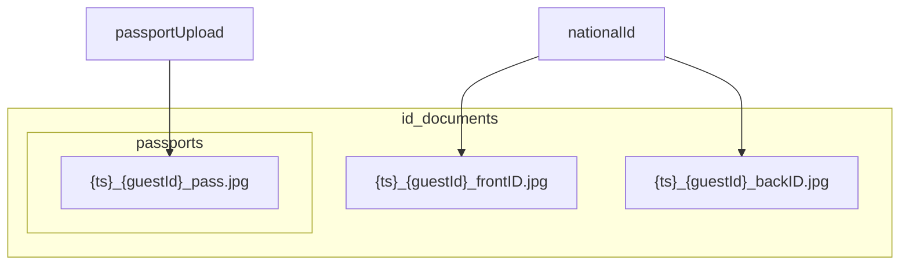

# Plan: putanje i imena datoteka za document-photos

## Trenutno stanje

- Model [`IDDocument`](c:\Users\avrca\Documents\Projects\Uzorita_all\uzorita-rooms-code\backend\app\reception\models.py): `front_photo` → `id_documents/front/`, `back_photo` → `id_documents/back/`
- View [`DocumentPhotosUploadView`](c:\Users\avrca\Documents\Projects\Uzorita_all\uzorita-rooms-code\backend\app\reception\document_photo_views.py) koristi originalno ime uploada (`front.name`)
- Testovi u [`DocumentPhotosUploadViewTests`](c:\Users\avrca\Documents\Projects\Uzorita_all\uzorita-rooms-code\backend\app\reception\tests.py) provjeravaju samo postojanje polja, ne put/ime

## Ciljna struktura na disku



- **Osobna** (`national_id`): prednja i stražnja u **root** `id_documents/` (bez `front/` / `back/`)
- **Putovnica** (`passport`): samo prednja u `id_documents/passports/`
- `faces/` i `signatures/` — **ne dirati** (NFC/MRZ)

## Konvencija imena

Timestamp: `timezone.localtime().strftime("%d%m%y%H%M")` (npr. `1705261942` = 17.05.26 19:42).

| Tip | Polje | Ime datoteke | Puna putanja (relativno na MEDIA) |
|-----|-------|--------------|-----------------------------------|
| `national_id` | `front_photo` | `{ts}_{guest_id}_frontID.jpg` | `id_documents/{ime}` |
| `national_id` | `back_photo` | `{ts}_{guest_id}_backID.jpg` | `id_documents/{ime}` |
| `passport` | `front_photo` | `{ts}_{guest_id}_pass.jpg` | `id_documents/passports/{ime}` |

Sufiksi `frontID` / `backID` / `pass` su **doslovni** (ne PK `id_document`).

## Implementacija

### 1. Novi modul [`document_photo_storage.py`](c:\Users\avrca\Documents\Projects\Uzorita_all\uzorita-rooms-code\backend\app\reception\document_photo_storage.py)

- `document_photo_filename(*, guest_id, document_type, side)` → generira ime prema tablici gore (`side`: `front` | `back`; za passport samo `front` → `_pass.jpg`)
- `id_document_front_upload_to(instance, filename)`:
  - ako `getattr(instance, "_passport_photo", False)` → `id_documents/passports/{filename}`
  - inače → `id_documents/{filename}`
- `id_document_back_upload_to(instance, filename)` → uvijek `id_documents/{filename}` (stražnja samo za osobnu)

### 2. Model [`models.py`](c:\Users\avrca\Documents\Projects\Uzorita_all\uzorita-rooms-code\backend\app\reception\models.py)

```python
front_photo = models.ImageField(upload_to=id_document_front_upload_to, ...)
back_photo = models.ImageField(upload_to=id_document_back_upload_to, ...)
```

### 3. Migracija `0022_alter_iddocument_photo_upload_to.py`

- `AlterField` za `front_photo` i `back_photo` s novim callable/string `upload_to`
- **Napomena:** postojeće datoteke u `id_documents/front/` i `.../back/` ostaju na starim putanjama u bazi dok se ne ponovo uploadaju; nema data migration (nema produkcijskih uploada u fazi 1)

### 4. View [`document_photo_views.py`](c:\Users\avrca\Documents\Projects\Uzorita_all\uzorita-rooms-code\backend\app\reception\document_photo_views.py)

Prije `save`:

```python
doc_type = data["document_type"]
id_document._passport_photo = doc_type == DOCUMENT_TYPE_PASSPORT

front_name = document_photo_filename(guest_id=guest.id, document_type=doc_type, side="front")
id_document.front_photo.save(front_name, front, save=False)
```

Za `back` (samo osobna):

```python
back_name = document_photo_filename(guest_id=guest.id, document_type=doc_type, side="back")
id_document.back_photo.save(back_name, back, save=False)
```

Ostala logika (validacija, `Guest.document_type`, JSON odgovor) — bez promjena.

### 5. Testovi [`tests.py`](c:\Users\avrca\Documents\Projects\Uzorita_all\uzorita-rooms-code\backend\app\reception\tests.py)

Proširiti `DocumentPhotosUploadViewTests`:

- **Passport:** `doc.front_photo.name` sadrži `id_documents/passports/`, završava s `_{guest_id}_pass.jpg`, nema `/front/` ni `/back/`
- **Osobna:** oba imena u `id_documents/`, završavaju s `_frontID.jpg` / `_backID.jpg`, nisu u `passports/`
- Regex na početak imena datoteke: `^\d{10}_\d+_(frontID|backID|pass)\.jpg$` (10 znamenki = ddmmyyhhmm)

Opcionalno: `@override_settings(USE_TZ=True)` + fiksni `freeze_time` nije potreban ako se provjerava samo sufiks i folder.

### 6. Van opsega

- Migracija starih fileova s diska
- Flutter promjene (API kontrakt isti)
- Sekunde u timestampu (dodati `%S` samo ako zatreba nakon prvog testa u produkciji)

## Provjera

```powershell
cd backend\app
python manage.py migrate reception
python manage.py test reception.tests.DocumentPhotosUploadViewTests
```

Ručno: upload osobne → dva fajla u `media/id_documents/`; upload putovnice → jedan u `media/id_documents/passports/`.
