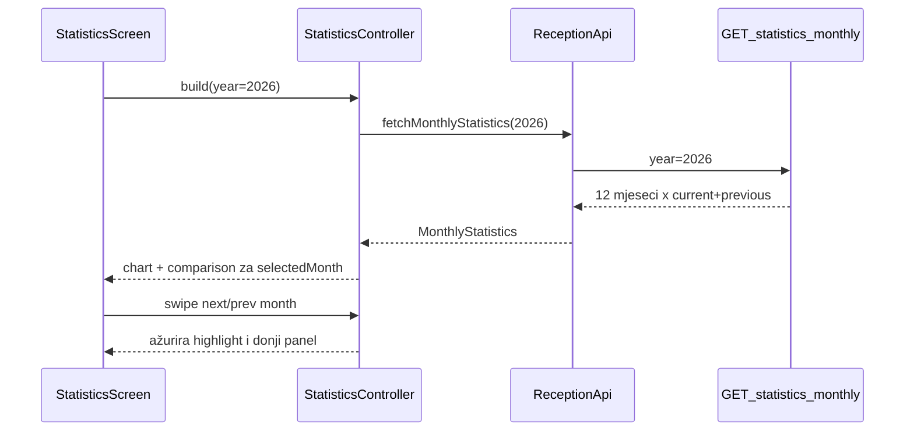

# Ekran statistika — YoY graf i stacked provizija

## Kontekst

- Tab **Statistike** već postoji na [`/statistics`](c:\Users\avrca\Documents\Projects\Uzorita_all\uzorita_flutter\lib\app\app.dart) (branch index 2), ali je placeholder u [`statistics_screen.dart`](c:\Users\avrca\Documents\Projects\Uzorita_all\uzorita_flutter\lib\features\reception\presentation\statistics_screen.dart).
- Financijski podaci postoje na [`Reservation`](c:\Users\avrca\Documents\Projects\Uzorita_all\uzorita-rooms-code\backend\app\reception\models.py): `total_amount`, `commission_amount`, `nights_count`, `check_in_date`, `status`.
- **Nema** postojećeg statistics API-ja.

**Potvrđena pravila:**
- Mjesec = **`check_in_date`**
- **YoY**: tekuća godina vs prošla godina za isti mjesec
- Default: **tekući mjesec** (`DateUtilsIso.propertyNow()`)
- Swipe lijevo/desno mijenja odabrani mjesec
- **U statistiku ulaze samo rezervacije sa statusom `checked_in` ili `checked_out`** — ne `expected`, ne `canceled`



---

## 1. Backend — `GET /api/reception/statistics/monthly/`

**Datoteke (novo/izmijena):**
- [`backend/app/reception/statistics.py`](c:\Users\avrca\Documents\Projects\Uzorita_all\uzorita-rooms-code\backend\app\reception\statistics.py) — agregacija
- [`backend/app/reception/statistics_views.py`](c:\Users\avrca\Documents\Projects\Uzorita_all\uzorita-rooms-code\backend\app\reception\statistics_views.py) — DRF view
- [`backend/app/reception/api_urls.py`](c:\Users\avrca\Documents\Projects\Uzorita_all\uzorita-rooms-code\backend\app\reception\api_urls.py) — ruta
- [`backend/app/reception/tests.py`](c:\Users\avrca\Documents\Projects\Uzorita_all\uzorita-rooms-code\backend\app\reception\tests.py) — unit testovi

**Query:** `?year=2026` (default: kalendarska tekuća godina u `Europe/Zagreb`)

**Filter queryseta:**
```python
status__in=[ReservationStatus.CHECKED_IN, ReservationStatus.CHECKED_OUT]
```
- **Uključeno:** `checked_in` (Prijavljen), `checked_out` (Odjavljen)
- **Isključeno:** `expected` (Očekuje dolazak), `canceled` (Otkazan)
- `check_in_date` u rasponu `[Y-1-01-01, Y-12-31]` (pokriva i comparison godinu)

**Agregacija po `(godina, mjesec)` iz `check_in_date`:**

| Polje | Izračun |
|-------|---------|
| `revenue_total` | `Sum(total_amount)` (null → 0) |
| `commission_total` | `Sum(commission_amount)` (null → 0) |
| `nights_total` | `Sum(nights_count)`; fallback `(check_out_date - check_in_date).days` ako je `nights_count` null |

**Response (primjer):**
```json
{
  "property_label": "Uzorita Luxury Rooms",
  "year": 2026,
  "comparison_year": 2025,
  "currency": "EUR",
  "months": [
    {
      "month": 3,
      "current": { "revenue": "1075.00", "commission": "120.00", "nights": 14 },
      "previous": { "revenue": "245.35", "commission": "30.00", "nights": 3 }
    }
  ]
}
```

Uvijek vraća **12 mjeseci** (1–12); prazni mjeseci = nule.

**Testovi:** eksplicitno provjeriti da `expected` i `canceled` rezervacije **ne ulaze** u sume, a `checked_in` i `checked_out` **ulaze**.

---

## 2. Flutter — podaci i state

**Ovisnost:** `fl_chart` u [`pubspec.yaml`](c:\Users\avrca\Documents\Projects\Uzorita_all\uzorita_flutter\pubspec.yaml).

**Novi/izmijenjeni fileovi:**
- `lib/features/reception/domain/monthly_statistics.dart`
- `lib/features/reception/data/reception_api.dart` — `fetchMonthlyStatistics(int year)`
- `lib/features/reception/presentation/statistics_controller.dart`
- `statistics_screen.dart` — zamjena placeholdera

**Controller:** `year` + `selectedMonth` (default tekući), swipe mijenja mjesec; refetch ako swipe prelazi u drugu godinu.

---

## 3. Flutter UI

1. Header: `property_label` (iz API-ja)
2. Filter: **Prihod** / **Noći** + legenda godina
3. Graf (~5 mjeseci oko odabranog):
   - **Prihod:** stacked stupac (visina = total, segment = provizija Booking.com)
   - **Noći:** grouped YoY stupci bez provizije
   - Linije trenda + highlight odabranog mjeseca
4. Donji panel: YoY usporedba s %
5. Footer: napomena o prihodu od smještaja (bez dodatnih usluga)

Swipe na grafu/panelu mijenja `selectedMonth`.

---

## Izvan opsega (MVP)

- Multi-property, dodatne metrike, export

## Procjena

Backend + Flutter UI u oba repozitorija (`uzorita-rooms-code`, `uzorita_flutter`).
