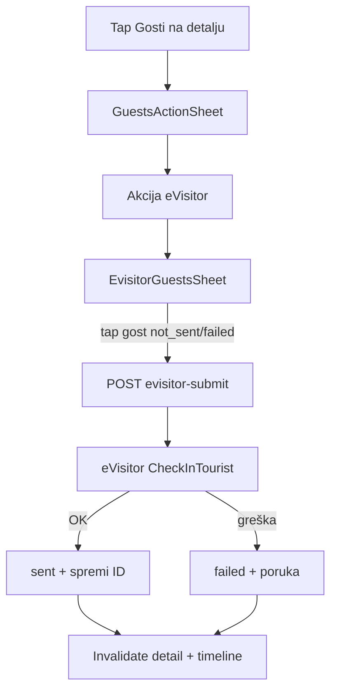

# eVisitor — eksplicitni API (test → produkcija)

## Produktni cilj (ova faza)

- Recepcija **ručno** šalje prijavu u eVisitor **po gostu** (bez automatikе na `checked_in`).
- U modalu **Gosti** nova akcija **eVisitor** → lista gostiju s oznakom je li prijava već odrađena → tap → slanje.
- Vizualno:
  - **Kartica sekcije „Gosti”** na detalju rezervacije: **svijetlo crvena** pozadina ako eVisitor **nije dovršen** za rezervaciju.
  - **Timeline**: dodatna ikona — **crvena** ako nedovršeno, **zelena** ako dovršeno.

Automatsko slanje nakon check-ina ostaje **izvan scope-a** (kasnije, kad ručni flow prođe test).

### Dodatna pravila (ova iteracija)

1. **Odjava zabranjena bez eVisitora:** prijelaz `checked_in` → `checked_out` **nije dopušten** dok `evisitor_summary != complete` (svi gosti moraju biti `sent`).
2. **Timeline — prijavljeni uvijek vidljivi:** sve rezervacije u statusu **`checked_in`** prikazuju se na timelineu **bez obzira na odabrani datumski raspon** (Danas / tjedan / mjesec); ostale rezervacije i dalje po periodu.

---

## Agregatni status (za UI)

Po gostu (`evisitor_status`):

| Vrijednost | Značenje |
|------------|----------|
| `not_sent` | Još nije pokušano / nema uspješne prijave |
| `pending` | Zahtjev u tijeku (kratko, sync poziv) |
| `sent` | Uspješno primljeno od eVisitora |
| `failed` | Zadnji pokušaj neuspješan (poruka u logu) |

Po rezervaciji (`evisitor_summary` — izračun na backendu):

| Vrijednost | Kartica Gosti | Timeline ikona |
|------------|---------------|----------------|
| `complete` | normalna (bez crvene) | zelena |
| `incomplete` | svijetlo crvena | crvena |
| `none` | normalna (nema gostiju) | skrivena ili siva |

**Pravilo `incomplete`:** postoji barem jedan gost i **nije** svi u statusu `sent` (uključuje `not_sent` i `failed`).



---

## Faza 0 — Preduvjeti (test okolina)

Prije koda (operativno, vidi [docs/evisitor/Testna okolina - pristupni podaci.docx](docs/evisitor/Testna%20okolina%20-%20pristupni%20podaci.docx)):

1. Obveznik/TZ otvara **test** podkorisnika (API) + GUI korisnika za provjeru u `https://www.evisitor.hr/test`.
2. Zabilježiti: `username`, `password`, **`apikey`** (obavezno na testu), **`Facility` šifru** objekta (npr. preko `FacilityBrowse` filter `Code`).
3. U backend `.env` (ne commitati):

```env
EVISITOR_ENABLED=true
EVISITOR_ENV=test
EVISITOR_BASE_URL=https://www.evisitor.hr/testApi
EVISITOR_USERNAME=...
EVISITOR_PASSWORD=...
EVISITOR_API_KEY=...
EVISITOR_FACILITY_CODE=...
EVISITOR_DEFAULT_ARRIVAL_ORGANISATION=O
EVISITOR_DEFAULT_OFFERED_SERVICE_TYPE=noćenje
EVISITOR_DEFAULT_PAYMENT_CATEGORY=11
```

4. **Gate na produkciju:** dok je `EVISITOR_ENV=test`, client **odbija** pozive ako je `EVISITOR_BASE_URL` produkcijski (zaštita od slučajnog slanja).

**Probe naredba** (Django management command): login → `GET Rest/Htz/Country/?psize=1` → ispis cookie/HTTP statusa. Koristi se prije Flutter integracije.

---

## Faza 1 — Backend

### 1.1 Modeli i migracije

U [backend/app/reception/models.py](backend/app/reception/models.py):

- `EvisitorSubmission` (1:N s `Guest`, zadnji pokušaj = aktualno):
  - `guest` FK, `registration_id` UUID (naš `ID` u `CheckInTourist`)
  - `status`: pending / sent / failed
  - `submitted_at`, `submitted_by` (User, nullable)
  - `error_user_message`, `error_system_message`
  - `request_payload` / `response_payload` JSON (maskirano: bez cijelog MRZ/slika)

- Na `Guest` (opcionalno denormalizirano): `evisitor_status`, `evisitor_registration_id` — ažurira se iz zadnjeg submissiona radi brzog lista.

Na [rooms/models.py](backend/app/rooms/models.py) `PropertyInfo`:

- `evisitor_facility_code` CharField (admin) — ako prazno, fallback na `EVISITOR_FACILITY_CODE` env.

### 1.2 eVisitor client (novi paket)

`backend/app/reception/evisitor/`:

| Modul | Odgovornost |
|-------|-------------|
| `client.py` | Login/Logout (`requests.Session`), cookie spajanje s `;`, POST `Rest/Htz/{action}/` |
| `mapper.py` | `Guest` + `Reservation` → `CheckInTourist` JSON (`YYYYMMDD`, `HH:mm`, ISO3 države) |
| `lookups.py` | Cache šifrarnika `Country` (ISO2→ISO3), `DocumentType` mapa |
| `service.py` | `submit_guest_checkin(guest, user)` — validacija, idempotencija, poziv API-ja |
| `exceptions.py` | `EvisitorConfigError`, `EvisitorValidationError`, `EvisitorApiError` |

**API akcija:** `CheckInTourist` (JSON), ne `ImportTourists` XML ([docs/integrations/evisitor.md](docs/integrations/evisitor.md)).

**Idempotencija:** ako gost već ima `sent` s istim `registration_id`, POST vraća **409** ili **200** s postojećim statusom (bez duplog poziva). Retry na `failed` generira **novi** `registration_id` samo ako korisnik eksplicitno retry-a.

**Validacija prije slanja** (400 s listom polja): ime, prezime, spol, datum rođenja, državljanstvo, tip/broj dokumenta, datumi boravka s rezervacije, facility code.

**Mapiranja (MVP):**

- `nationality` ISO2 → ISO3 preko cache `Country.CodeTwoLetters`
- `document_type` / `document_code` → eVisitor `DocumentType` CODE (mala statička mapa + kasnije lookup)
- `Gender`: `M`/`F` ili HR `muški`/`ženski` iz `Guest.sex`
- `StayFrom` / `ForeseenStayUntil`: iz `reservation.check_in_date` / `check_out_date` + default vrijeme (npr. 14:00 / 10:00) dok nemamo točne sate na rezervaciji
- `CountryOfResidence`: fallback na državljanstvo ili `document_country_iso3` ako nema dedicated polja (Faza 1); dedicated polja kasnije

### 1.3 REST API

U [backend/app/reception/api_urls.py](backend/app/reception/api_urls.py):

```
POST /api/reception/reservations/<reservation_id>/guests/<guest_id>/evisitor-submit/
```

- Auth: kao ostali reception endpointi
- Body: prazan ili `{ "force_retry": true }` za failed
- Odgovor 200: `{ "status": "sent", "registration_id": "...", "submitted_at": "..." }`
- Odgovor 400: validation errors
- Odgovor 502: eVisitor API greška (`user_message`, `system_message`)

Proširiti [GuestLiteSerializer](backend/app/reception/serializers.py):

```python
evisitor_status  # not_sent | pending | sent | failed
evisitor_error   # zadnja poruka (samo ako failed)
```

Proširiti `ReservationTimelineSerializer` i detail serializer:

```python
evisitor_summary  # complete | incomplete | none
```

Implementacija `get_evisitor_summary(reservation)`: prefetch guest statuses.

Helper `evisitor_summary_for_reservation(reservation) -> str` — dijeljen između serializera i validacije statusa.

### 1.3b Blokada odjave bez eVisitora

U [ReservationUpdateSerializer.validate_status](backend/app/reception/serializers.py), nakon provjere `_ALLOWED_STATUS_TRANSITIONS`:

```python
if (
    instance.status == ReservationStatus.CHECKED_IN
    and value == ReservationStatus.CHECKED_OUT
    and evisitor_summary_for_reservation(instance) != "complete"
):
    raise ValidationError(
        "Odjava nije moguća dok svi gosti nisu prijavljeni u eVisitor."
    )
```

**Pravilo `complete`:** barem jedan gost i svi gosti imaju `evisitor_status == sent`. Ako nema gostiju → `none` → odjava **zabranjena** (nema smisla odjaviti praznu rezervaciju bez eVisitor koraka; recepcija prvo doda goste).

Test: `test_patch_rejects_checked_out_when_evisitor_incomplete`.

### 1.3c Timeline — svi `checked_in` izvan raspona

U [ReservationTimelineListView.get_queryset](backend/app/reception/views.py), kad su `period_from` i `period_to` postavljeni:

```python
queryset = queryset.filter(
    Q(status=ReservationStatus.CHECKED_IN)
    | Q(check_in_date__gte=period_from, check_in_date__lte=period_to)
    | Q(check_out_date__gte=period_from, check_out_date__lte=period_to)
)
```

Kad je `OverviewMode.all` (bez period parametara) — ponašanje ostaje kao danas.

Test: rezervacija `checked_in` s `check_in_date` izvan perioda i dalje se vraća u listi.

### 1.4 Postavke

U [backend/app/config/settings/base.py](backend/app/config/settings/base.py): `EVISITOR_*` varijable (optional default — `EVISITOR_ENABLED=false` dok nema creds).

### 1.5 Testovi

- Unit: mapper (datumi, ISO3, gender)
- Unit: cookie header format (`;` separator)
- API test: submit mockiran `requests` → status `sent` / `failed`
- API test: 400 kad nedostaju polja

---

## Faza 2 — Flutter UI

### 2.1 Model i API

[lib/features/reception/domain/reservation_detail.dart](uzorita_flutter/lib/features/reception/domain/reservation_detail.dart) — `GuestLite`:

- `evisitorStatus`, `evisitorError`

`ReservationDetail`:

- `evisitorSummary`

[lib/features/reception/domain/reservation.dart](uzorita_flutter/lib/features/reception/domain/reservation.dart):

- `evisitorSummary` za timeline

[lib/features/reception/data/reception_api.dart](uzorita_flutter/lib/features/reception/data/reception_api.dart):

```dart
Future<Map<String, dynamic>> submitEvisitor(int reservationId, int guestId, {bool forceRetry = false});
```

### 2.2 Modal eVisitor u Gosti flowu

[lib/features/reception/presentation/widgets/guests_action_sheet.dart](uzorita_flutter/lib/features/reception/presentation/widgets/guests_action_sheet.dart):

- Novi enum value: `GuestsAction.evisitor`
- ListTile: **„eVisitor”** s ikonom (npr. `Icons.how_to_reg_outlined`)

Novi widget `evisitor_guests_sheet.dart`:

- Lista gostiju: ime, glavni gost, badge (**Poslano** zeleno / **Nije poslano** / **Greška** crveno)
- Gost `sent` → onemogućen tap ili samo info
- Gost `not_sent` / `failed` → tap → confirm dialog → `submitEvisitor` → loading → snackbar s porukom eVisitora
- Nakon uspjeha: `ref.invalidate(reservationDetailControllerProvider)` + timeline provider

Wire u [reservation_detail_screen.dart](uzorita_flutter/lib/features/reception/presentation/reservation_detail_screen.dart) `_openGuestsActions` → case `evisitor`.

### 2.3 Kartica „Gosti” — svijetlo crvena

U `_DetailSection` za naslov **Gosti** (samo ta sekcija):

- Ako `d.evisitorSummary == 'incomplete'`: `Card.color = Color.alphaBlend(scheme.error.withOpacity(0.08), scheme.surface)` (ili `surfaceContainerHighest` s error tintom)
- Inače postojeći stil

Po želji i pojedinačni `_GuestCard` s tankim lijevim borderom (crveno/zeleno) — sekundarno; primarni signal je cijela kartica sekcije.

### 2.4 Timeline ikona

[lib/features/reception/presentation/timeline_reservation_tile.dart](uzorita_flutter/lib/features/reception/presentation/timeline_reservation_tile.dart):

- Pored postojeće ikone statusa rezervacije: `Icons.verified_user` ili `Icons.badge_outlined`
- `evisitor_summary == complete` → `Colors.green` (ili `scheme.primary` za success)
- `incomplete` → `scheme.error`
- `none` → ne prikazuj

Tooltip: „eVisitor: poslano” / „eVisitor: nije dovršeno”.

### 2.5 Blokada odjave u Flutteru

[reservation_status.dart](uzorita_flutter/lib/features/reception/presentation/reservation_status.dart):

```dart
List<String> allowedNextReservationStatuses(
  String currentStatus, {
  String? evisitorSummary,
}) {
  ...
  case 'checked_in':
    if (evisitorSummary == 'complete') return const ['checked_out'];
    return const []; // ili disabled checked_out u pickeru
}
```

[ReservationStatusPickerSheet](uzorita_flutter/lib/features/reception/presentation/widgets/reservation_status_picker_sheet.dart):

- Proširiti `show(..., evisitorSummary: ...)`.
- Ako `checked_in` i `evisitorSummary != complete`: prikazati ListTile **Odjavljen** kao `enabled: false` + podnaslov *„Prvo pošaljite sve goste u eVisitor (Gosti → eVisitor).”*
- [reservation_detail_screen.dart](uzorita_flutter/lib/features/reception/presentation/reservation_detail_screen.dart): proslijediti `d.evisitorSummary` u picker.

Ako API ipak vrati 400, prikazati snackbar s `ValidationError` porukom.

### 2.6 Timeline — prijavljeni bez obzira na period

**Lokalni filter** u [timeline_period_filter.dart](uzorita_flutter/lib/features/reception/presentation/timeline_period_filter.dart):

```dart
bool reservationVisibleOnTimeline(Reservation r, PeriodInfo period, OverviewMode mode) {
  if (r.status == 'checked_in') return true;
  return reservationInTimelinePeriod(r, period, mode);
}
```

Zamijeniti poziv u [timeline_controller.dart](uzorita_flutter/lib/features/reception/presentation/timeline_controller.dart) `_applyPeriodFilter`.

**Grupiranje:** u `groupedByTimelineDay`:

- Rezervacije `checked_in` koje **ne** ulaze u period po datumu → posebna grupa na **vrhu** liste s fiksnim ključem (npr. `_in_house`) i headerom u [timeline_screen.dart](uzorita_flutter/lib/features/reception/presentation/timeline_screen.dart): **„Prijavljeni u objektu”**.
- Ostale rezervacije — postojeća logika po danu dolaska/odlaska.

**Summary brojač** (`checkedInCount`): broji sve `checked_in` u vidljivoj listi (usklađeno s novim pravilom).

Backend i Flutter moraju biti usklađeni (backend šalje sve `checked_in`; Flutter ih ne filtrira ponovno van perioda).

---

## Faza 3 — Test u test okolini → produkcija

| Korak | Akcija |
|-------|--------|
| 1 | `evisitor_probe` s test creds |
| 2 | Jedan testni gost s punim podacima → submit iz appa → provjera u eVisitor test GUI |
| 3 | Namjerno nepotpun gost → očekivani 400 + poruka u appu |
| 4 | Failed → retry iz modala |
| 5 | Excel usporedba prema [PDF uputama](docs/evisitor/Upute%20za%20provjeru%20API%20integracije%20sa%20sustavom%20eVisitor.pdf) (opcionalno, ručno) |
| 6 | Produkcija: promjena env na prod URL **bez** apikey, novi credentials, `EVISITOR_ENV=production`, ponoviti korake 1–2 na jednom pravom gostu |

**Ne uključivati u prvi deploy:** `CheckOutTourist`, automatski trigger, admin pregled (M7).

---

## Datoteke (pregled)

| Sloj | Novo / izmjena |
|------|----------------|
| Backend | `reception/evisitor/*`, `EvisitorSubmission`, migracija, `PropertyInfo.evisitor_facility_code`, settings, `api_urls`, `views`, `serializers`, `tests`, management `evisitor_probe` |
| Flutter | `evisitor_guests_sheet.dart`, `guests_action_sheet.dart`, `reservation_detail_screen.dart`, `timeline_reservation_tile.dart`, `timeline_period_filter.dart`, `timeline_controller.dart`, `timeline_screen.dart`, `reservation_status.dart`, `reservation_status_picker_sheet.dart`, domain + `reception_api.dart` |
| Docs | Ažurirati checklist u [docs/integrations/evisitor.md](docs/integrations/evisitor.md) (eksplicitni flow, ne wizard) |

---

## Rizici i mitigacije

| Rizik | Mitigacija |
|-------|------------|
| Nedostaju polja (grad rođenja, ISO3) | Jasna validacija 400; postepeno proširiti Guest polja |
| Pogrešan cookie format | Kopirati PHP primjer (`;`); unit test |
| Slučajno prod slanje | `EVISITOR_ENV` guard + `EVISITOR_ENABLED` |
| Više gostiju — djelomično poslano | `evisitor_summary=incomplete` + crvena kartica dok svi nisu `sent` |
| Odjava bez eVisitora | Backend 400 + disabled opcija u pickeru |
| Duga boravak — checked_in van „Danas” | Union na API-ju + sekcija „Prijavljeni u objektu” na timelineu |

---

## Kasnije (izvan ovog plana)

- Automatsko slanje na `checked_in`
- `CheckOutTourist` na `checked_out`
- Dedicated polja: `country_of_birth`, `city_of_birth`, `phone`
- Admin ops pregled submission logova
