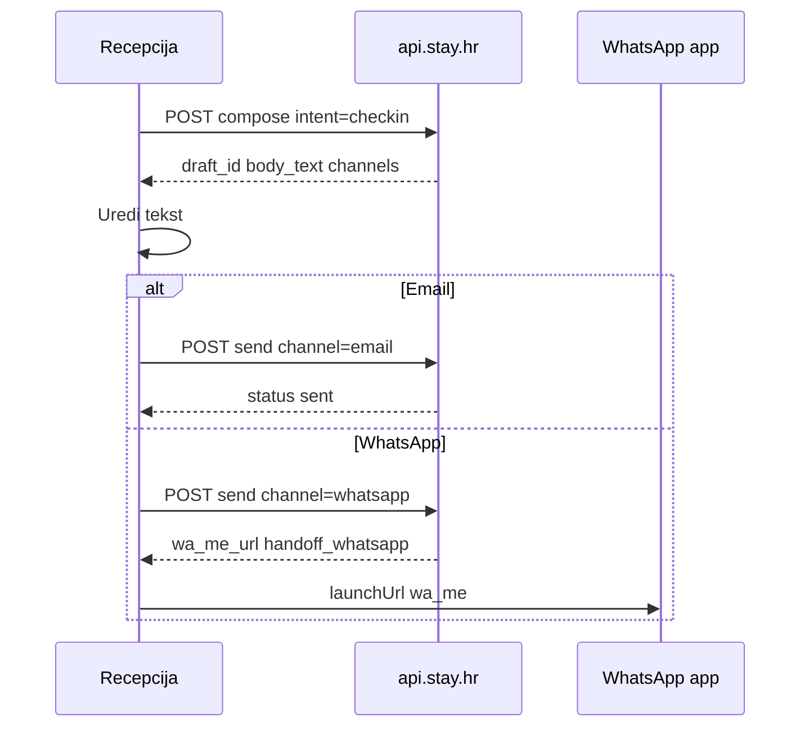
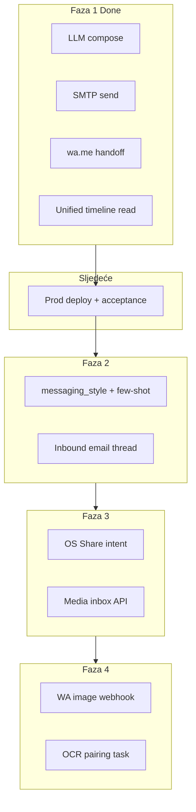

# Guest messaging hub — restrukturirani plan

## Status pregled

| Faza | Opis | Kod | Produkcija / test |
|------|------|-----|-------------------|
| **1** | LLM compose + Email + WhatsApp | **Gotovo** | **Compose OK; WhatsApp send → 500 (hotfix)** |
| **1b** | Hotfix WhatsApp 500 | **Pending** | Duga poruka → preduga `wa_me_url` |
| **2** | Učenje + puni thread | Nije započeto | — |
| **3** | Share slika iz WhatsAppa | Nije započeto | — |
| **4** | Webhook mediji + OCR | Nije započeto | — |

---

## HOTFIX — WhatsApp 500 (rezervacija #833)

**Simptom:** Generiraj radi; klik **WhatsApp** → SnackBar s HTML `Server Error (500)`.

**Vjerojatni uzrok (kod):** [`GuestOutboundMessage.wa_me_url`](c:/Users/avrca/Documents/Projects/Uzorita_all/stay.hr/backend/apps/communications/models.py) ima `max_length=512`. Check-in poruka + URL encoding (`%20`, `%0A`, hrvatski znakovi) lako prelazi 512 znakova → `DataError` pri `objects.create()` → Django 500 (HTML jer `DEBUG=False`).

**Provjera na serveru:**
```bash
docker compose logs django --tail=100 | grep -i "wa_me\|DataError\|guest_outbound"
```

**Fix (stay.hr):**

1. Migracija: `wa_me_url` → `TextField` ili `URLField(max_length=2048)` (dovoljno za encoded URL).
2. [`build_wa_me_url()`](c:/Users/avrca/Documents/Projects/Uzorita_all/stay.hr/backend/apps/communications/guest_message_send.py): opcionalno skratiti `body_text` prije `quote()` na ~1500 znakova (WhatsApp praktični limit za prefilled text); ostatak gost vidi nakon otvaranja chata.
3. Test: [`test_send_whatsapp_handoff`](c:/Users/avrca/Documents/Projects/Uzorita_all/stay.hr/backend/apps/api/tests/test_reception_guest_messages.py) proširiti s **dugim** `body_text` (800+ znakova).

**Fix (Flutter, sekundarno):** u [`evisitor_error_message.dart`](c:/Users/avrca/Documents/Projects/Uzorita_all/uzorita_flutter/lib/features/reception/evisitor_error_message.dart) — ako `response.data` počinje s `<!doctype` / `<html`, prikazati `l10n.serverErrorGeneric` umjesto cijelog HTML-a.

**Workaround dok nije deployano:** skratite poruku ručno prije WhatsApp gumba, ili otvorite WhatsApp ručno s brojem gosta.

**Poruka „malo doraditi”:** nakon hotfixa — Faza 2 (`messaging_style`, few-shot) ili fino podešavanje system prompta u `guest_compose.py` (check-in sat iz `property.check_in_time`, kraći dokument-block).

---

## Faza 1 — IMPLEMENTIRANO

### Backend (stay.hr)

| Komponenta | Datoteka | Napomena |
|------------|----------|----------|
| Modeli | [`backend/apps/communications/models.py`](c:/Users/avrca/Documents/Projects/Uzorita_all/stay.hr/backend/apps/communications/models.py) | `GuestMessageDraft`, `GuestOutboundMessage` |
| Migracija | `0001_guest_message_models` | Pokrenuti na produkciji ako još nije |
| Admin audit | [`backend/apps/communications/admin.py`](c:/Users/avrca/Documents/Projects/Uzorita_all/stay.hr/backend/apps/communications/admin.py) | Read-only |
| OpenAI provider | [`backend/apps/ai/provider.py`](c:/Users/avrca/Documents/Projects/Uzorita_all/stay.hr/backend/apps/ai/provider.py) | `GUEST_COMPOSE_LLM_*` |
| Compose + fallback | [`backend/apps/communications/guest_compose.py`](c:/Users/avrca/Documents/Projects/Uzorita_all/stay.hr/backend/apps/communications/guest_compose.py) | LLM + template; `smoke_test_llm()` |
| Send | [`backend/apps/communications/guest_message_send.py`](c:/Users/avrca/Documents/Projects/Uzorita_all/stay.hr/backend/apps/communications/guest_message_send.py) | SMTP email + `wa.me` handoff |
| API | [`backend/apps/api/reception_guest_messages_views.py`](c:/Users/avrca/Documents/Projects/Uzorita_all/stay.hr/backend/apps/api/reception_guest_messages_views.py) | compose / send / timeline |
| URLs | [`backend/apps/api/reception_urls.py`](c:/Users/avrca/Documents/Projects/Uzorita_all/stay.hr/backend/apps/api/reception_urls.py) | `messages/`, `compose/`, `send/` |
| Testovi | [`backend/apps/api/tests/test_reception_guest_messages.py`](c:/Users/avrca/Documents/Projects/Uzorita_all/stay.hr/backend/apps/api/tests/test_reception_guest_messages.py) | fallback, LLM mock, email, WA |
| Env docs | [`.env.example`](c:/Users/avrca/Documents/Projects/Uzorita_all/stay.hr/.env.example) | `GUEST_COMPOSE_*` blok |
| Produkcijski `.env` | Server | Vi ste postavili OpenAI ključ |

**API kontrakt:**

```
GET  /api/v1/reception/reservations/{id}/messages/
POST /api/v1/reception/reservations/{id}/messages/compose/   { intent, hint?, language? }
POST /api/v1/reception/reservations/{id}/messages/send/      { draft_id, channel, body_text, subject? }
```

Timeline agregira: `GuestOutboundMessage` + `WhatsAppMessage` + `ChannexMessage`.

### Flutter (uzorita_flutter)

| Komponenta | Datoteka |
|------------|----------|
| API | [`lib/features/reception/data/reception_api.dart`](c:/Users/avrca/Documents/Projects/Uzorita_all/uzorita_flutter/lib/features/reception/data/reception_api.dart) |
| Controller | [`lib/features/reception/presentation/guest_messages_controller.dart`](c:/Users/avrca/Documents/Projects/Uzorita_all/uzorita_flutter/lib/features/reception/presentation/guest_messages_controller.dart) |
| UI | [`lib/features/reception/presentation/widgets/reservation_messages_section.dart`](c:/Users/avrca/Documents/Projects/Uzorita_all/uzorita_flutter/lib/features/reception/presentation/widgets/reservation_messages_section.dart) |
| Kanali model | [`lib/features/reception/domain/guest_message_channels.dart`](c:/Users/avrca/Documents/Projects/Uzorita_all/uzorita_flutter/lib/features/reception/domain/guest_message_channels.dart) |
| Detail screen | [`reservation_detail_screen.dart`](c:/Users/avrca/Documents/Projects/Uzorita_all/uzorita_flutter/lib/features/reception/presentation/reservation_detail_screen.dart) — prosljeđuje `bookerEmail` / `bookerPhone` |
| url_launcher | `pubspec.yaml` |
| iOS WhatsApp | [`ios/Runner/Info.plist`](c:/Users/avrca/Documents/Projects/Uzorita_all/uzorita_flutter/ios/Runner/Info.plist) — `LSApplicationQueriesSchemes` |
| L10n | `actionGenerate`, `actionEmail`, `actionWhatsApp`, intenti, `messageStatusHandoffWhatsapp` |

**UX flow (implementiran):**



**Ograničenje:** `send` zahtijeva prethodni `compose` (mora postojati `draft_id` u controlleru).

---

## Faza 1 — PREOSTALO (operativa, ne novi feature kod)

### 1. Deploy na produkciju

```bash
cd /opt/stacks/stay.hr   # ili vaš stack path
git pull
docker compose exec django python manage.py migrate communications
./scripts/deploy.sh      # ili docker compose restart django
```

### 2. Smoke test LLM-a (u Django kontejneru)

```bash
docker compose exec django python manage.py shell -c "
from apps.communications.guest_compose import smoke_test_llm
print(smoke_test_llm())
"
```

Očekivano: `{'ok': True, 'sample': 'OK'}` (ili slično). Ako `not_configured` — provjeriti da kontejner vidi `GUEST_COMPOSE_LLM_API_KEY`.

### 3. Acceptance na fizičkom uređaju

| # | Test | PASS |
|---|------|------|
| 1 | Detalj rezervacije → sekcija Poruke učitava timeline (ne „uskoro”) | |
| 2 | Generiraj (check-in) → tekst na jeziku gosta | |
| 3 | Email → status `sent` (tenant SMTP u adminu) | |
| 4 | WhatsApp → otvara chat s brojem i tekstom | |
| 5 | Uredi tekst prije send → Django admin draft `edited=true` | |
| 6 | Rezervacija bez telefona → WhatsApp gumb disabled | |

Flutter: `flutter run --dart-define=STAY_API_BASE_URL=https://api.stay.hr`

---

## Faza 1 — opcionalni polish (niski prioritet)

- **Channel badge** u `_MessageBubble`: prikazati `email` / `whatsapp` / `booking` umjesto generičke mail ikone za sve inbound
- **Send bez compose**: backend auto-kreira draft ako korisnik ručno upiše tekst i pritisne Email/WhatsApp (manje trenja u UI)
- **`manage.py smoke_guest_compose`** — management command umjesto shell one-linera

---

## Faza 2 — Učenje i puni thread

**Cilj:** LLM postaje bolji s vremenom; jedan timeline uključuje i inbound email.

| Task | Opis |
|------|------|
| `TenantReceptionSettings.messaging_style` | TextField — tenant upute za ton (admin) |
| Few-shot u promptu | Zadnjih 3 `GuestMessageDraft` gdje `edited=true`, isti `intent` |
| Export / admin filter | Draftovi za ručni pregled kvalitete |
| `GuestConversation` + inbound email | Port iz [`uzorita-rooms-code/.../guest_messaging.py`](c:/Users/avrca/Documents/Projects/Uzorita_all/uzorita-rooms-code/backend/app/communications/guest_messaging.py) — IMAP link, `@guest.booking.com` reply |
| Timeline | Inbound email poruke u `GET messages/` |
| `purge_old_message_drafts` | Retencija 90 dana |

**Flutter:** badge kanala u bubbleu; `reply` intent automatski uključuje zadnju inbound poruku u hint.

---

## Faza 3 — Share slika iz WhatsAppa u Hospiru

**Cilj:** Recepcija dijeli fotke dokumenata iz WA chata → upload na backend.

| Task | Repo | Opis |
|------|------|------|
| `receive_sharing_intent` | uzorita_flutter | Android `ACTION_SEND` / `SEND_MULTIPLE` u [`AndroidManifest.xml`](c:/Users/avrca/Documents/Projects/Uzorita_all/uzorita_flutter/android/app/src/main/AndroidManifest.xml) |
| Import ekran | uzorita_flutter | Ruta `/import/whatsapp-media` — pregled slika, odabir rezervacije/gosta |
| `media-inbox` API | stay.hr | `POST .../guests/{gid}/media-inbox/` — batch upload prije uparivanja front/back |
| OCR uparivanje | stay.hr | Celery task (MRZ logika iz [`ai-runbook-ocr-checkin-evisitor-2026-06.md`](c:/Users/avrca/Documents/Projects/Uzorita_all/stay.hr/docs/operations/ai-runbook-ocr-checkin-evisitor-2026-06.md)) — recepcija potvrđuje |

Postojeći [`document-photos/`](c:/Users/avrca/Documents/Projects/Uzorita_all/stay.hr/backend/apps/api/reception_views.py) ostaje za par front/back nakon uparivanja.

---

## Faza 4 — WhatsApp Cloud webhook mediji

**Cilj:** Gost šalje sliku na poslovni WhatsApp broj → server automatski preuzme.

| Task | Datoteka | Opis |
|------|----------|------|
| Image inbound | [`webhook_service.py`](c:/Users/avrca/Documents/Projects/Uzorita_all/stay.hr/backend/apps/integrations/whatsapp/webhook_service.py) | `message_type == "image"` → Graph API media download |
| Link rezervaciji | `reservation_lookup.py` | `wa_id` ↔ `booker_phone` |
| Inbox + push | stay.hr | Spremi u media inbox; FCM recepciji |
| Flutter deep link | uzorita_flutter | Otvori rezervaciju / import ekran |

Paralelno s Fazom 3 — Share ostaje za ad-hoc slučajeve.

---

## Arhitektura (cjelina)



---

## Repozitoriji

| Repo | Uloga |
|------|--------|
| [`stay.hr`](c:/Users/avrca/Documents/Projects/Uzorita_all/stay.hr) | Backend API, LLM, SMTP, webhook, OCR |
| [`uzorita_flutter`](c:/Users/avrca/Documents/Projects/Uzorita_all/uzorita_flutter) | Hospira UI, Share intent, url_launcher |
| [`uzorita-rooms-code`](c:/Users/avrca/Documents/Projects/Uzorita_all/uzorita-rooms-code) | Referenca za inbound email (legacy) |

---

## Preporučeni sljedeći korak

1. **Deploy + smoke_test_llm** na produkciji (blokira stvarno korištenje LLM-a).
2. **Acceptance checklist** na tabletu s pravom rezervacijom.
3. Tek nakon PASS-a — krenuti **Fazu 2** (messaging_style + few-shot) ili **Fazu 3** (Share import) ovisno o prioritetu: bolje poruke vs. brži check-in s WhatsApp fotkama.
