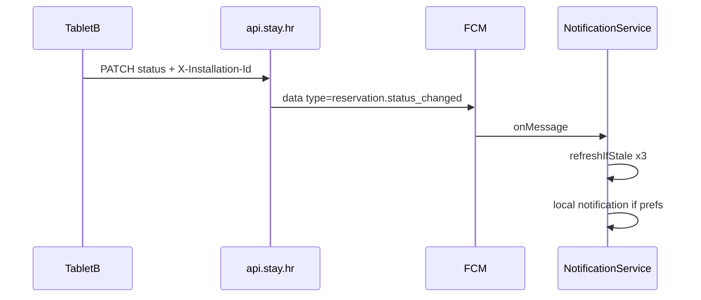

# FCM refresh s hash provjerom + foreground notifikacije

## Problem (trenutno stanje)

| Dio | Stanje |
|-----|--------|
| Tab refresh + hash | Implementirano ([`reception_sync_cache.dart`](uzorita_flutter/lib/features/reception/data/reception_sync_cache.dart), `refreshIfStale` na controllerima) |
| Push → osvježavanje | [`push_invalidation.dart`](uzorita_flutter/lib/core/notifications/push_invalidation.dart) i dalje radi `clear()` + `invalidate()` — **zaobilazi hash**, uvijek puni reload |
| Push payload | Backend šalje `event: reservation_created` ([`tasks.py`](stay.hr/backend/apps/core/tasks.py)); Flutter čita samo `type` ([`push_payload.dart`](uzorita_flutter/lib/core/notifications/push_payload.dart)) → **prazan `type`** → `handlePushEvent` i foreground notifikacija se **ne izvrše** |
| Status promjena | Samo `notify_new_reservation` na `post_save(created=True)` ([`signals.py`](stay.hr/backend/apps/reservations/signals.py)); **nema** pusha na `PATCH` statusa |
| `origin_installation_id` | Flutter šalje `X-Installation-Id` ([`dio_providers.dart`](uzorita_flutter/lib/core/network/dio_providers.dart)); backend **ne čita** header — ne može isključiti push na uređaju koji je napravio promjenu |
| Foreground UI | [`notification_service.dart`](uzorita_flutter/lib/core/notifications/notification_service.dart) već ima `onMessage` + `_showLocalNotification` + iOS `setForegroundNotificationPresentationOptions` — radi kad `type` nije prazan |



---

## 1. Backend (stay.hr) — push kontrakt

### 1.1 Zajednički helper za FCM `data`

Nova datoteka npr. [`stay.hr/backend/apps/core/push_payload.py`](stay.hr/backend/apps/core/push_payload.py):

- `reception_push_data(*, event_type: str, reservation_id: int, origin_installation_id: str = "", summary: str = "", **extra) -> dict[str, str]`
- Kanonski ključevi (sve stringovi za FCM):
  - `type` — npr. `reservation.created`, `reservation.status_changed`
  - `reservation_id`, `summary`
  - `origin_installation_id` (prazan ako nepoznat)

### 1.2 Čitanje `X-Installation-Id`

- Helper npr. `installation_id_from_request(request)` u [`stay.hr/backend/apps/api/reception_views.py`](stay.hr/backend/apps/api/reception_views.py) ili `apps/api/request_context.py`
- U `ReservationDetailView.update()` nakon uspješnog spremanja: ako se promijenio `status`, pozvati novi Celery task s `origin_installation_id` iz headera

### 1.3 Novi task: promjena statusa

U [`stay.hr/backend/apps/core/tasks.py`](stay.hr/backend/apps/core/tasks.py):

- `notify_reservation_status_changed(reservation_id, old_status, new_status, origin_installation_id="")`
- Title/body npr. „Promjena statusa”, summary `expected → checked_in`
- `send_tenant_reception_push` s `type: reservation.status_changed`

**Ne** slati push ako je `origin_installation_id` jednak tokenu primatelja — filtrirati u `send_tenant_reception_push` ili u tasku (treba mapirati FCM token → installation nije u bazi; jednostavnije: **samo u Flutteru** preskočiti prikaz/refresh za isti origin — refresh i dalje može jer drugi tabovi trebaju sync; push notifikaciju ne prikazati).

Napomena: refresh na istom uređaju i dalje ima smisla ako je korisnik na drugom ekranu; `handlePushEvent` već preskače cijeli event kad `origin == myInstallationId` — **to treba promijeniti**: preskočiti samo **notifikaciju**, ali **ipak** pozvati `refreshIfStale` (split u `notification_service` vs `push_invalidation`).

### 1.4 Ispraviti `notify_new_reservation`

- Zamijeniti `event: reservation_created` s `type: reservation.created` (+ `summary` s booker/check-in)

### 1.5 Testovi

- [`stay.hr/backend/apps/core/tests/test_notifications.py`](stay.hr/backend/apps/core/tests/test_notifications.py): assert `type` u data
- Novi test: PATCH rezervacije pokreće `notify_reservation_status_changed` (mock delay)
- Test header `X-Installation-Id` prolazi u task

---

## 2. Flutter — payload i push refresh

### 2.1 Normalizacija `PushPayload`

U [`push_payload.dart`](uzorita_flutter/lib/core/notifications/push_payload.dart):

- `type` iz `data['type']` ili mapiranje `data['event']`:
  - `reservation_created` → `reservation.created`
  - `reservation_status_changed` → `reservation.status_changed`
- Test u [`test/core/notifications/push_payload_test.dart`](uzorita_flutter/test/core/notifications/push_payload_test.dart) za legacy `event` ključ

### 2.2 Push → `refreshIfStale` (ne `invalidate`)

U [`push_invalidation.dart`](uzorita_flutter/lib/core/notifications/push_invalidation.dart):

- Ukloniti `_invalidateReceptionLists` (ili ostaviti samo za `sync.failed` ako treba)
- Dodati `_refreshReceptionIfStale(Ref ref)`:
  ```dart
  Future.wait([
    ref.read(timelineControllerProvider.notifier).refreshIfStale(),
    ref.read(bookingCalendarControllerProvider.notifier).refreshIfStale(),
    ref.read(statisticsControllerProvider.notifier).refreshIfStale(),
  ]);
  ```
- Za `reservation.*` / `guest.*` evente: pozvati `_refreshReceptionIfStale`, zatim `invalidate` samo **detalj** / **gost** / **poruke** po ID-u (kao sada)
- **Ne** zvati `receptionSyncCacheProvider.clear()` prije refreshIfStale — hash usporedba na serveru je dovoljna

### 2.3 Isti uređaj: refresh da, banner ne

U [`notification_service.dart`](uzorita_flutter/lib/core/notifications/notification_service.dart) `_onForegroundMessage`:

- Uvijek pozvati novu funkciju npr. `handlePushDataRefresh(ref, payload, installationId)` (bez early return na origin)
- Za `_shouldShowNotification` zadržati preskok kad `origin == installationId`
- U `handlePushEvent`: **ukloniti** early return na origin (ili ga premjestiti samo u notification path) — inače isti tablet ne osvježi timeline kad promijeni status s detalja

### 2.4 Foreground notifikacija (sitne dorade)

- Nakon fixa `type`, postojeći `_showLocalNotification` bi trebao raditi
- Opcionalno uskladiti Android FCM kanal u [`firebase.py`](stay.hr/backend/apps/core/firebase.py) `channel_id` s `hospira_reception` iz Fluttera (samo za system notification u backgroundu)
- Provjera: Postavke → obavijesti uključene za „Promjena statusa” / „Nova rezervacija”

---

## 3. Deploy i ručni test

1. Deploy **stay.hr** (`sync-versions` ako još nije + push task + payload)
2. Firebase service account na produkciji + APNs (iOS)
3. Dva fizička uređaja:
   - B promijeni status → A vidi **banner** + timeline se osvježi
   - A ponovno otvori tab Timeline bez promjene na serveru → samo `sync-versions`, bez punog GET
   - B promijeni status na **istom** A → **nema** bannera, ali timeline se osvježi (refreshIfStale)

---

## Ovisnosti

- [`GET /api/v1/reception/sync-versions/`](stay.hr/backend/apps/api/reception_urls.py) mora biti deployan da `refreshIfStale` ima smisla (inače fallback na puni fetch — već implementirano).
