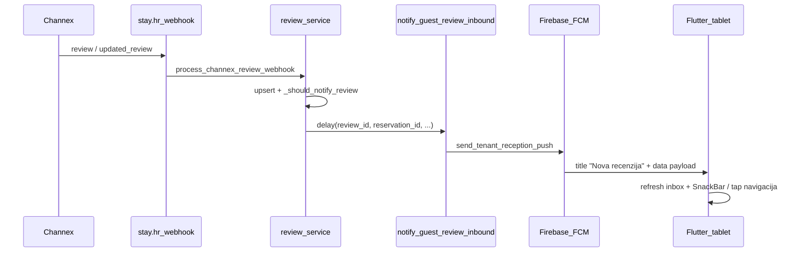

# FCM notifikacije za recenzije — trenutno stanje

**Kratak odgovor: Da, imamo.** Event tip je `guest.review.received`. Dokumentirano u [`stay.hr/docs/operations/guest-reviews-channex.md`](c:\Users\avrca\Documents\Projects\Uzorita_all\stay.hr\docs\operations\guest-reviews-channex.md).

---

## Tok od Channexa do tableta

---

## Backend (stay.hr)

### Okidač
Push se šalje **samo iz Channex webhooka**, ne iz ručnog/API synca:

- [`webhook_service.py`](c:\Users\avrca\Documents\Projects\Uzorita_all\stay.hr\backend\apps\integrations\channex\webhook_service.py) — eventi `review` i `updated_review`
- [`review_service.py`](c:\Users\avrca\Documents\Projects\Uzorita_all\stay.hr\backend\apps\integrations\channex\review_service.py) — `_should_notify_review()` + `notify_guest_review_inbound.delay(...)`

### Uvjeti za slanje pusha (`_should_notify_review`)
Push **ne ide** ako:
- recenzija **nije povezana** s rezervacijom (`reservation_id` je null)
- recenzija je **već odgovorena** (`is_replied`)

Push **ide** ako:
- novi webhook `review` (created) **i** gore navedeno vrijedi, **ili**
- webhook `updated_review` kad tekst recenzije **tek stigne** (`content_just_arrived`)

`sync_channex_reviews` / `sync_reviews_from_channex` **ne šalju** push — samo upsert u bazu.

### Celery task i payload
[`tasks.py`](c:\Users\avrca\Documents\Projects\Uzorita_all\stay.hr\backend\apps\core\tasks.py) — `notify_guest_review_inbound`:
- **Title:** `Nova recenzija`
- **Body:** npr. `Joan March · BookingCom · 8.5/10: odličan boravak…`
- **FCM data:**
  - `type`: `guest.review.received`
  - `reservation_id`
  - `review_id`
  - `summary`, `booking_code`, `tenant_id`, `channel`

Slanje: [`notifications.py`](c:\Users\avrca\Documents\Projects\Uzorita_all\stay.hr\backend\apps\core\notifications.py) → svi aktivni `ApiApplication.fcm_token` za tenant (nema server-side filtriranja po postavkama uređaja).

---

## Flutter (Hospira tablet)

### Prijem i osvježavanje
- [`push_payload.dart`](c:\Users\avrca\Documents\Projects\Uzorita_all\uzorita_flutter\lib\core\notifications\push_payload.dart) — parsira `guest.review.received` i `review_id`
- [`push_invalidation.dart`](c:\Users\avrca\Documents\Projects\Uzorita_all\uzorita_flutter\lib\core\notifications\push_invalidation.dart) — invalidira inbox recenzija + recenzije na detalju rezervacije

### Foreground
- SnackBar s naslovom/tijelom ([`foreground_push_alert.dart`](c:\Users\avrca\Documents\Projects\Uzorita_all\uzorita_flutter\lib\core\notifications\foreground_push_alert.dart))
- Gumb **Otvori** vodi na `/reviews` (inbox), ne direktno na review detail

### Tap (background / terminated)
[`notification_service.dart`](c:\Users\avrca\Documents\Projects\Uzorita_all\uzorita_flutter\lib\core\notifications\notification_service.dart):
- ako ima `reservation_id` + `review_id` → `/reservations/{id}/reviews/{reviewId}` (ekran za odgovor)
- inače fallback → `/reviews`

### Postavke
[`notification_settings_section.dart`](c:\Users\avrca\Documents\Projects\Uzorita_all\uzorita_flutter\lib\features\auth\presentation\widgets\notification_settings_section.dart) — toggle **Recenzija gosta** (`guest_review`, default **uključeno**).

Napomena: toggle filtrira **foreground SnackBar** na uređaju; sistemska push obavijest u pozadini i dalje stiže (backend ne gleda per-device preference).

---

## Operativni preduvjeti (inače nema pusha)

| Preduvjet | Provjera |
|-----------|----------|
| Channex webhook eventi `review` + `updated_review` s `send_data=true` | Channex webhook config |
| Messaging & Reviews app na propertyju | Channex Apps |
| Firebase service account na API-ju | backend env |
| Tablet registriran: `PUT /api/v1/app/fcm-token` | Stay admin / push log |
| Recenzija povezana s rezervacijom u bazi | admin `ChannexReview.reservation` |
| Backend deployan s review webhook + push kodom | produkcija |

Checklist stavka 1 u [`guest-reviews-channex.md`](c:\Users\avrca\Documents\Projects\Uzorita_all\stay.hr\docs\operations\guest-reviews-channex.md): *Webhook `review` → row in admin + push on tablet*.

---

## Poznata ograničenja

1. **Bez webhooka nema pusha** — recenzija otkrivena samo sync-om ne okida FCM.
2. **Nepovezana recenzija** — ostaje u inboxu, push se ne šalje dok nema `reservation_id`.
3. **Nema unit testa** za `notify_guest_review_inbound` (za razliku od guest message push testova).
4. **Foreground „Otvori”** ide na inbox (`/reviews`), ne na detail s gumbom za odgovor — tap iz system tray-a ide na detail ako payload ima oba ID-a.

---

## Brzi test na uređaju

1. U Channexu pošalji test `review` webhook (ili čekaj stvarnu recenziju s povezanom rezervacijom).
2. Na tabletu: Postavke → **Recenzija gosta** = ON.
3. Očekivano: push „Nova recenzija”; tap → detail recenzije; foreground → SnackBar + osvježen inbox.

Za debug: `flutter run` s `--dart-define=PUSH_DEBUG_LOG=true`, filtriraj `[Hospira Push]`.
