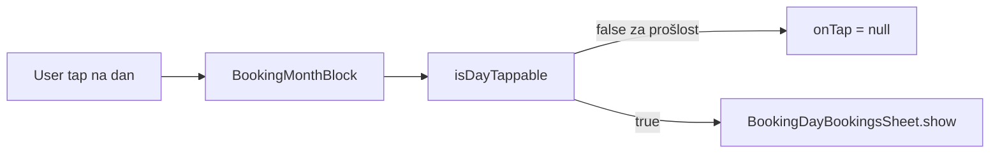

# Fix: tap na datum u povijesti kalendara

## Dijagnoza

Kada je uključen **Show history**, kalendar ispravno učitava i boji prošle datume (npr. ožujak–travanj 2026 na tvom screenshotu), ali tap na te dane ne radi.

Tok interakcije:



**Uzrok** je u [`lib/features/reception/domain/booking_calendar_models.dart`](c:/Users/avrca/Documents/Projects/Uzorita_all/uzorita_flutter/lib/features/reception/domain/booking_calendar_models.dart):

```405:409:c:/Users/avrca/Documents/Projects/Uzorita_all/uzorita_flutter/lib/features/reception/domain/booking_calendar_models.dart
  bool isDayTappable(DateTime date) {
    if (!isInEffectiveRange(date)) return false;
    final day = DateTime(date.year, date.month, date.day);
    return !day.isBefore(_todayDate());
  }
```

Metoda **ne gleda** `showHistory`. Usporedno, `decorationFor` već razlikuje način rada:

```452:458:c:/Users/avrca/Documents/Projects/Uzorita_all/uzorita_flutter/lib/features/reception/domain/booking_calendar_models.dart
    if (!showHistory && day.isBefore(today)) {
      return DayDecoration(
        isHoliday: isHoliday,
        occupancy: DayOccupancy.unknown,
        isAllRoomsView: allRooms,
      );
    }
```

Zato vidiš zauzetost (crveni segmenti), ali [`BookingMonthBlock`](c:/Users/avrca/Documents/Projects/Uzorita_all/uzorita_flutter/lib/features/reception/presentation/widgets/booking_month_block.dart) ne postavlja `InkWell.onTap` jer `isDayTappable` vraća `false`:

```58:61:c:/Users/avrca/Documents/Projects/Uzorita_all/uzorita_flutter/lib/features/reception/presentation/widgets/booking_month_block.dart
                        onTap: onDayTap != null &&
                                cell.isInMonth &&
                                (isDayTappable?.call(cell) ?? false)
                            ? () => onDayTap!(cell)
```

`_onDayTap` i `BookingDayBookingsSheet.show` su ispravni — sheet se jednostavno nikad ne pozove.

## Rješenje (minimalni diff)

U [`booking_calendar_models.dart`](c:/Users/avrca/Documents/Projects/Uzorita_all/uzorita_flutter/lib/features/reception/domain/booking_calendar_models.dart), uskladiti `isDayTappable` s `decorationFor`:

```dart
bool isDayTappable(DateTime date) {
  if (!isInEffectiveRange(date)) return false;
  if (showHistory) return true;
  final day = DateTime(date.year, date.month, date.day);
  return !day.isBefore(_todayDate());
}
```

Logika:
- **Bez povijesti** (default): samo danas i budućnost unutar raspona — kao dosad.
- **S povijesti**: svi datumi unutar filter raspona (`rangeStart`–`rangeEnd`) su tapabilni — samo pregled rezervacija/blokada.

Nema potrebe mijenjati screen, controller ni sheet.

## Test

Dodati test u [`test/features/reception/booking_calendar_blocks_test.dart`](c:/Users/avrca/Documents/Projects/Uzorita_all/uzorita_flutter/test/features/reception/booking_calendar_blocks_test.dart):

- `showHistory: true`, raspon npr. 2026-03-01 – 2026-06-06
- `isDayTappable(DateTime(2026, 3, 15))` → `true`
- `showHistory: false`, isti datum → `false` (ako je prije „danas” u testu — mockati `DateUtilsIso` nije potreban ako koristimo datum sigurno u prošlosti relativno na `propertyNow()`; alternativno testirati samo `showHistory: true` granu s fiksnim datumom u prošlosti unutar rangea)

Pokrenuti: `flutter test test/features/reception/booking_calendar_blocks_test.dart`

## Ručna provjera

1. Filter → uključi **Show history**, raspon npr. 1. ožu 2026 – 6. lip 2026 → Apply
2. Tap na dan u ožujku/travnju s crvenim segmentom → otvara se bottom sheet s rezervacijama
3. Isključi **Show history** → prošli datumi više nisu tapabilni (sivo/bez interakcije)

## Napomena (izvan scopea)

Sheet i dalje nudi **block unit** UI i na prošlim datumima ako postoje slobodne sobe. To nije uzrok buga; ako želiš read-only pregled u povijesti, to bi bio zaseban zadatak (sakriti block sekciju kad je `showHistory`).
