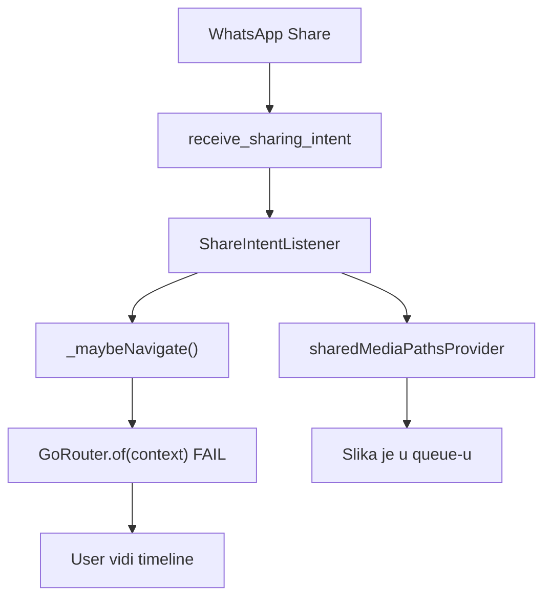

# Fix: Share → Import ekran se ne otvara

## Dijagnoza

Log jasno pokazuje:

```
I/FileDirectory: File name: IMG-20260605-WA0000.jpg   ← share intent OK
No GoRouter found in context
  at _ShareIntentListenerState._maybeNavigate (share_intent_listener.dart:64)
```

**Ekran postoji** — [`SharedMediaImportScreen`](c:/Users/avrca/Documents/Projects/Uzorita_all/uzorita_flutter/lib/features/import/presentation/shared_media_import_screen.dart) je registriran na `/import/shared-media` u [`app.dart`](c:/Users/avrca/Documents/Projects/Uzorita_all/uzorita_flutter/lib/app/app.dart).

**Problem nije “nema screena”**, nego **navigacija nikad ne uspije**:



Uzrok: [`ShareIntentListener`](c:/Users/avrca/Documents/Projects/Uzorita_all/uzorita_flutter/lib/core/share/share_intent_listener.dart) je **parent** od `MaterialApp.router`:

```151:166:c:/Users/avrca/Documents/Projects/Uzorita_all/uzorita_flutter/lib/app/app.dart
return ShareIntentListener(
  child: MaterialApp.router(
    routerConfig: router,
    ...
  ),
);
```

`GoRouter.of(context)` u listeneru traži router u **parent** kontekstu — a router živi **unutar** child-a. Zato push nikad ne dođe do ekrana.

Push notifikacije već rješavaju isto ispravno:

```438:438:c:/Users/avrca/Documents/Projects/Uzorita_all/uzorita_flutter/lib/core/notifications/notification_service.dart
_ref.read(goRouterProvider).push(path);
```

---

## Fix 1 — Navigacija preko `goRouterProvider` (obavezno)

U [`share_intent_listener.dart`](c:/Users/avrca/Documents/Projects/Uzorita_all/uzorita_flutter/lib/core/share/share_intent_listener.dart):

- Import `goRouterProvider` iz `app.dart`
- Zamijeni `GoRouter.of(context)` s `ref.read(goRouterProvider)`
- **Ne briši** `pendingShareImportProvider` prije uspješnog `push` (trenutno se briše na liniji 61 pa se flag gubi ako navigacija padne)

Predložena logika:

```dart
void _maybeNavigate() {
  if (ref.read(authControllerProvider).asData?.value == null) return;
  if (!ref.read(pendingShareImportProvider)) return;

  WidgetsBinding.instance.addPostFrameCallback((_) {
    if (!mounted) return;
    final router = ref.read(goRouterProvider);
    if (router.state.matchedLocation == '/import/shared-media') {
      ref.read(pendingShareImportProvider.notifier).state = false;
      return;
    }
    router.push('/import/shared-media');
    ref.read(pendingShareImportProvider.notifier).state = false;
  });
}
```

---

## Fix 2 — (opcionalno) Premjestiti listener ispod routera

Alternativa: umjesto parent wrappera, staviti `ShareIntentListener` u `MaterialApp.router` `builder` — tada bi `GoRouter.of(context)` radio. **Nije potrebno** ako koristimo Fix 1 (manji diff, usklađeno s push kodom).

---

## Fix 3 — Debug log (kratko)

Dodati 1–2 `debugPrint` u share listener (npr. `[Hospira Share] paths=N → push /import/shared-media`) radi lakšeg QA na Pixelu — po uzoru na `[Hospira Push]`.

---

## Test plan

| # | Korak | Očekivano |
|---|--------|-----------|
| 1 | Hot restart / pun `flutter run` | Build OK |
| 2 | WhatsApp → Share → Hospira (app već ulogiran) | Otvara **Import fotografija** s thumbnailom |
| 3 | Cold start share (app ugašen) | Prijava/token → automatski import ekran |
| 4 | Više → Import fotografija | Ručni ulaz i dalje radi |
| 5 | Logcat | Nema `No GoRouter found`; eventualno `[Hospira Share] push OK` |

**Napomena:** OCR gumb radi tek kad je backend deployan s `document-intake/*` API + `DOCUMENT_OCR_LLM_*`. Bez toga ekran ipak mora biti vidljiv s fotkama u queue-u.

---

## Datoteke

| Datoteka | Promjena |
|----------|----------|
| [`lib/core/share/share_intent_listener.dart`](c:/Users/avrca/Documents/Projects/Uzorita_all/uzorita_flutter/lib/core/share/share_intent_listener.dart) | `goRouterProvider`, fix pending flag |
| (opcionalno) [`lib/app/app.dart`](c:/Users/avrca/Documents/Projects/Uzorita_all/uzorita_flutter/lib/app/app.dart) | Samo ako biramo builder pristup — **ne treba** s Fix 1 |
