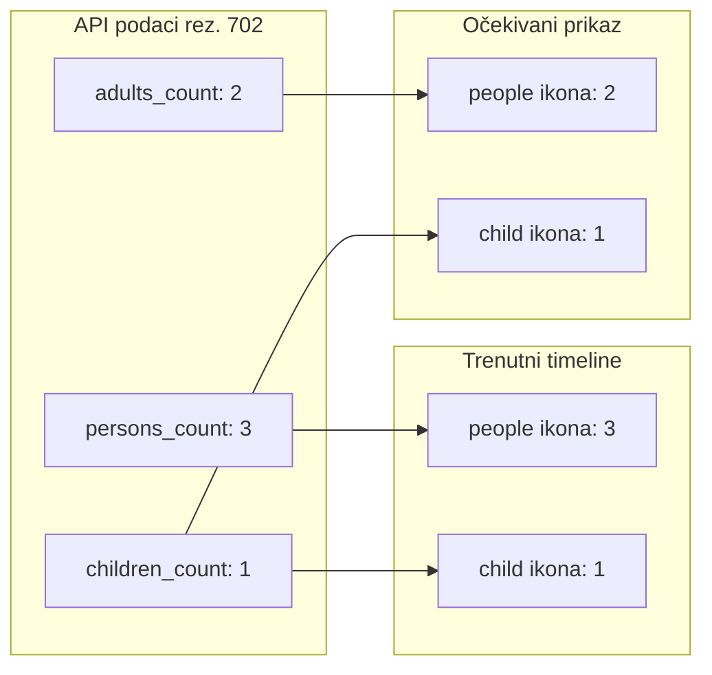

# Ispravak broja gostiju na timelineu

## Dijagnoza

Rezervacija **#702** (Smoobu/Booking) ima ispravne podatke u API-ju i na ekranu detalja:
- `persons_count`: **3** (ukupno)
- `adults_count`: **2**
- `children_count`: **1**

Detalj to ispravno prikazuje u sekciji **Putnici** ([`reservation_detail_screen.dart`](c:\Users\avrca\Documents\Projects\Uzorita_all\uzorita_flutter\lib\features\reception\presentation\reservation_detail_screen.dart)).

Timeline kartica koristi drugačiju logiku u [`timeline_reservation_tile.dart`](c:\Users\avrca\Documents\Projects\Uzorita_all\uzorita_flutter\lib\features\reception\presentation\timeline_reservation_tile.dart):

```224:244:c:\Users\avrca\Documents\Projects\Uzorita_all\uzorita_flutter\lib\features\reception\presentation\timeline_reservation_tile.dart
    final persons = reservation.effectivePersonsCount;
    if (persons > 0) {
      chips.add(
        _CountIcon(
          icon: Icons.people_outline,
          count: persons,
          ...
        ),
      );
    }
    if (reservation.childrenCount > 0) {
      chips.add(
        _CountIcon(
          icon: Icons.child_care_outlined,
          count: reservation.childrenCount,
          ...
        ),
      );
    }
```

`effectivePersonsCount` ([`travelers_count.dart`](c:\Users\avrca\Documents\Projects\Uzorita_all\uzorita_flutter\lib\features\reception\domain\travelers_count.dart)) vraća **`persons_count` kad je > 0**, dakle **3**. Zatim se **zasebno** prikaže ikona djece s **1**. Vizualno to izgleda kao **3 odraslih + 1 dijete** (4 gosta), iako je ukupno troje.



**Backend nije problem** — [`ReservationTimelineSerializer`](c:\Users\avrca\Documents\Projects\Uzorita_all\stay.hr\backend\apps\api\reception_serializers.py) šalje sva tri polja; Smoobu ingest postavlja `persons_count = adults + children`.

## Rješenje (Flutter, minimalni diff)

### 1. Nova helper funkcija za meta prikaz odraslih

U [`travelers_count.dart`](c:\Users\avrca\Documents\Projects\Uzorita_all\uzorita_flutter\lib\features\reception\domain\travelers_count.dart) dodati npr. `computeMetaAdultsCount`:

- Ako **`childrenCount == 0`**: vrati postojeći `computeEffectivePersonsCount(...)` (nema promjene ponašanja za rezervacije bez djece).
- Ako **`childrenCount > 0`** (djeca se prikazuju zasebnom ikonom):
  - preferiraj `adultsCount` ako je > 0
  - inače fallback `personsCount - childrenCount` (kad XLS/import nema `adults_count`)
  - inače 0

Primjer za #702: `adultsCount=2` → people ikona **2**, child ikona **1**.

### 2. Primjena u timeline tileu

U [`timeline_reservation_tile.dart`](c:\Users\avrca\Documents\Projects\Uzorita_all\uzorita_flutter\lib\features\reception\presentation\timeline_reservation_tile.dart) zamijeniti `reservation.effectivePersonsCount` s novom funkcijom **samo za people ikonu** u `_MetaIconRow`. Ikona djece ostaje na `childrenCount`.

Opcionalno (nije blocker): kad se prikazuje split adults/children, tooltip people ikone može koristiti novi l10n ključ `tooltipAdults` umjesto `tooltipPersons`. Za minimalni fix dovoljno je promijeniti broj; tooltip „2 osoba" je prihvatljiv.

### 3. Testovi

Proširiti [`travelers_count_test.dart`](c:\Users\avrca\Documents\Projects\Uzorita_all\uzorita_flutter\test\features\reception\travelers_count_test.dart):

| persons | adults | children | people ikona | child ikona |
|---------|--------|----------|--------------|-------------|
| 3 | 2 | 1 | 2 | 1 |
| 2 | 2 | 0 | 2 | skriveno |
| 0 | 3 | 0 | 3 | skriveno |
| 0 | 2 | 1 | 2 | 1 |
| 4 | 0 | 1 | 3 | 1 (fallback bez adults) |

Postojeći testovi za `computeEffectivePersonsCount` ostaju nepromijenjeni (Plaćanje sekcija i kalendar i dalje koriste ukupan broj).

## Što se ne mijenja

- **Backend / API** — podaci su ispravni.
- **`computeEffectivePersonsCount`** — i dalje služi za ukupan broj (detalj → Plaćanje, kalendar).
- **Kalendar** — prikazuje samo ukupan broj bez zasebne child ikone; nema isti bug.

## Verifikacija

1. `flutter test test/features/reception/travelers_count_test.dart`
2. Na uređaju/emulatoru: timeline za rez. #702 → **2** (people) + **1** (child)
3. Regresija: rezervacija bez djece (npr. prva na screenshotu) → i dalje samo people ikona s ukupnim brojem
