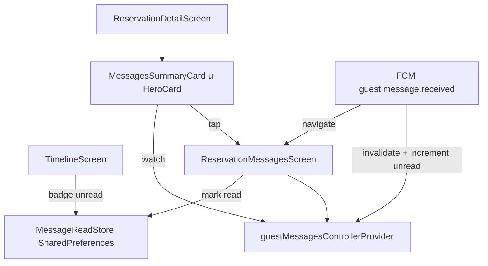

# Flutter: poruke gostu — puni chat + summary kartica

## Cilj

Recepcija vidi **summary karticu poruka** odmah ispod imena i operational statusa na detail ekranu; tap otvara **zaseban chat ekran** s tri kanala. Unread stanje je **po uređaju** (lokalno), s badgeom na timelineu i push navigacijom direktno u thread.

Referenca: [`GuestMessagesPanel.tsx`](C:/Users/avrca/Documents/Projects/Uzorita_all/stay.hr/web/reception/app/_components/GuestMessagesPanel.tsx), [`guest-messages-flutter.md`](C:/Users/avrca/Documents/Projects/Uzorita_all/stay.hr/docs/development/guest-messages-flutter.md).



---

## Faza A — Model, controller, l10n (postojeći plan)

### A1. Treći kanal u modelu

[`guest_message_channels.dart`](C:/Users/avrca/Documents/Projects/Uzorita_all/uzorita_flutter/lib/features/reception/domain/guest_message_channels.dart):

- `bookingAvailable` iz `channels.booking.available`
- Helperi `channelOrder`, `availableChannels()`, `defaultChannel()` — prioritet **booking → email → whatsapp**

### A2. Controller send flow

[`guest_messages_controller.dart`](C:/Users/avrca/Documents/Projects/Uzorita_all/uzorita_flutter/lib/features/reception/presentation/guest_messages_controller.dart):

- Nakon `sendMessage` → `refresh()` (GET timeline), ne lokalni append
- `clearDraft: true` nakon senda
- WhatsApp `waMeUrl` ostaje u UI sloju

### A3. Lokalizacija

[`tool/l10n/strings.json`](C:/Users/avrca/Documents/Projects/Uzorita_all/uzorita_flutter/tool/l10n/strings.json) — kanali, hintovi, send/compose stringovi + **novi za summary/timeline**:

| Ključ | HR primjer |
|-------|------------|
| `messagesSummaryTitle` | Poruke |
| `messagesSummaryEmpty` | Nema poruka — dodirni za slanje |
| `messagesSummaryPreview` | {count} poruka |
| `messagesUnreadBadge` | {count} nepročitano |
| `messagesChannexActive` | Channex thread aktivan |
| `messagesScreenTitle` | Poruke gostu |
| `channelBooking` / `channelEmail` / `channelWhatsapp` | Channex / Mail / WhatsApp |
| (+ postojeći iz prethodnog plana) | composeReady, actionSend, hintovi… |

`python tool/gen_arb.py` → `flutter gen-l10n`.

### A4. Check-in ready hint (OCR)

- `checkin_ready_hint_provider.dart` — `StateProvider.family<bool, int>`
- [`scan_screen.dart`](C:/Users/avrca/Documents/Projects/Uzorita_all/uzorita_flutter/lib/features/scan/presentation/scan_screen.dart): nakon uspješnog `documentScan` → flag = true
- Compose: ako `intent == 'reply'` && flag → `hint: 'checkin ready'`; reset nakon compose/send

---

## Faza B — Read/unread store (lokalno, bez backend-a)

Backend nema `unread` API. Novi modul:

**[`message_read_store.dart`](C:/Users/avrca/Documents/Projects/Uzorita_all/uzorita_flutter/lib/features/reception/data/message_read_store.dart)** (SharedPreferences, uzorak kao [`push_navigation_store.dart`](C:/Users/avrca/Documents/Projects/Uzorita_all/uzorita_flutter/lib/core/notifications/push_navigation_store.dart)):

```dart
// Ključevi po reservationId:
// message_last_read_at_{id}  → ISO8601 DateTime
// message_unread_delta_{id}  → int (push increment kad thread nije učitan)

Future<void> markRead(int reservationId);
Future<DateTime?> lastReadAt(int reservationId);
Future<void> incrementUnread(int reservationId); // na push
Future<void> reconcileUnread(int reservationId, List<GuestMessage> messages);
```

**Logika unread:**

```dart
unread = messages.where((m) =>
  m.isInbound && DateTime.parse(m.createdAt).isAfter(lastReadAt ?? epoch)
).length + unreadDelta;
```

- **markRead** kad se otvori `ReservationMessagesScreen` (postavi `lastReadAt = now`, reset delta)
- **reconcileUnread** kad `guestMessagesController` učita timeline — točan broj iz poruka
- **incrementUnread** u [`push_invalidation.dart`](C:/Users/avrca/Documents/Projects/Uzorita_all/uzorita_flutter/lib/core/notifications/push_invalidation.dart) na `guest.message.received` (fallback dok se thread ne učita)

**Provider:** `messageUnreadCountProvider = Provider.family<int, int>` — kombinira store + cached messages iz controllera.

---

## Faza C — Summary kartica u hero bloku

**Nova datoteka:** [`reservation_messages_summary_card.dart`](C:/Users/avrca/Documents/Projects/Uzorita_all/uzorita_flutter/lib/features/reception/presentation/widgets/reservation_messages_summary_card.dart)

**Pozicija:** unutar [`_HeroCard`](C:/Users/avrca/Documents/Projects/Uzorita_all/uzorita_flutter/lib/features/reception/presentation/reservation_detail_screen.dart) — nakon operational status gumba, `Divider`, zatim `InkWell` summary kartica.

**Props:** `reservationId`, `importSource`, `bookerEmail`, `bookerPhone`, `guests`

**Sadržaj (lijevo → desno):**

| Element | Izvor |
|---------|-------|
| Ikona + „Poruke” | l10n |
| Ukupan broj | `messages.length` |
| Unread badge (plavi krug s brojem) | `messageUnreadCountProvider` |
| Preview zadnje poruke (1 linija) | `messages.lastOrNull?.bodyText` |
| Vrijeme zadnje poruke | `messages.last.createdAt` |
| Channel badge zadnje poruke | `messages.last.channel` |
| **Dostupni kanali** — 3 mini ikone (Channex/Mail/WA) | compose `channels` ili heuristika: `booking` ako `importSource==channex`, email ako `bookerEmail`/guest email, WA ako telefon |
| **Channex hint** | ako `importSource==channex` → `messagesChannexActive` pod previewom |
| Chevron desno | navigacija |

**Stanja:** loading spinner, `messagesUnavailable` (siva), prazno, unread bold preview.

**Tap:** `context.push('/reservations/$id/messages')`

**Ukloniti** donji `_DetailSection(sectionMessages)` s detail ekrana — chat više nije u scroll listi.

Detail pull-to-refresh i dalje invalidira `guestMessagesControllerProvider` (summary se osvježava automatski).

---

## Faza D — Zaseban chat ekran

**Nova datoteka:** [`reservation_messages_screen.dart`](C:/Users/avrca/Documents/Projects/Uzorita_all/uzorita_flutter/lib/features/reception/presentation/reservation_messages_screen.dart)

**Ruta u [`app.dart`](C:/Users/avrca/Documents/Projects/Uzorita_all/uzorita_flutter/lib/app/app.dart):**

```dart
GoRoute(
  path: '/reservations/:id/messages',
  builder: (context, state) => ReservationMessagesScreen(
    reservationId: int.parse(state.pathParameters['id']!),
  ),
),
```

**Layout (chat app stil):**

```
Scaffold
├── AppBar: messagesScreenTitle + Refresh
├── Expanded: ListView (bubbles) + RefreshIndicator
└── Bottom panel (fiksno): intent → hint → Generiraj → body → radio kanala → Pošalji
```

**Refaktor:** [`reservation_messages_section.dart`](C:/Users/avrca/Documents/Projects/Uzorita_all/uzorita_flutter/lib/features/reception/presentation/widgets/reservation_messages_section.dart) → koristi se **samo** u chat ekranu (preimenovati u `GuestMessagesPanel` ili zadržati ime).

**Tri kanala (web parity):**

- Radio: booking / email / whatsapp (samo `available`)
- Default nakon compose: `defaultChannel(channels)`
- Jedan **Pošalji** gumb
- Channel badge na svakom bubbleu; inbound ikona po kanalu

**Auto-scroll na dno:**

- `ScrollController` na timeline `ListView`
- `initState` / nakon load / nakon send / nakon refresh → `WidgetsBinding.addPostFrameCallback` → `jumpTo(maxScrollExtent)`
- Opcionalno `reverse: false` s eksplicitnim scroll na kraj (jednostavnije za compose panel ispod)

**initState:** `markRead(reservationId)` + `reconcileUnread`

Proslijedi `importSource`, `bookerEmail`, `bookerPhone`, `guests` — iz `reservationDetailControllerProvider` (watch na ekranu).

---

## Faza E — Push navigacija na poruke (ideja A)

[`notification_service.dart`](C:/Users/avrca/Documents/Projects/Uzorita_all/uzorita_flutter/lib/core/notifications/notification_service.dart):

- Za `guest.message.received` → navigiraj na `/reservations/{id}/messages` umjesto `/reservations/{id}`
- Proširiti [`PushNavigationStore`](C:/Users/avrca/Documents/Projects/Uzorita_all/uzorita_flutter/lib/core/notifications/push_navigation_store.dart): spremi puni path ili flag `openMessages: true`

Isto u [`foreground_push_listener.dart`](C:/Users/avrca/Documents/Projects/Uzorita_all/uzorita_flutter/lib/core/notifications/foreground_push_listener.dart) — SnackBar **Open** akcija za message push → messages route.

---

## Faza F — Timeline unread badge (ideja B)

[`timeline_reservation_tile.dart`](C:/Users/avrca/Documents/Projects/Uzorita_all/uzorita_flutter/lib/features/reception/presentation/timeline_reservation_tile.dart):

- `ConsumerWidget` (ili wrap u parent) — `ref.watch(messageUnreadCountProvider(r.id))`
- Ako `count > 0`: mali badge (broj ili dot) desno od imena gosta
- **Ne** fetchati messages za svaku rezervaciju na timeline load — badge se puni iz:
  1. push `incrementUnread`
  2. reconcile kad je korisnik otvorio detail/chat za tu rezervaciju (cache u store)

Opcionalno: lazy prefetch samo za vidljive tileove s push unread delta (bez full N+1 na cijelom timelineu).

---

## Faza G — Testovi

[`guest_message_test.dart`](C:/Users/avrca/Documents/Projects/Uzorita_all/uzorita_flutter/test/features/reception/guest_message_test.dart):

- `GuestMessageChannels` s booking
- `availableChannels` / `defaultChannel`
- `MessageReadStore` unit test (mock SharedPreferences ili test binding)

---

## Što namjerno NE radimo

- Backend read receipts / sync unread između uređaja
- Email subject polje
- Email inbound ingest
- Attachment download
- Uklanjanje `messagesUnavailable` fallbacka

---

## Test plan

| # | Scenarij | Očekivano |
|---|----------|-----------|
| 1 | Detail Channex rez. | Summary kartica ispod statusa; Channex hint; 3 channel ikone |
| 2 | Tap summary | Otvara `/messages` puni chat |
| 3 | Inbound poruka (push) | Unread badge na summary + timeline tile |
| 4 | Otvori chat | Badge nestaje (mark read) |
| 5 | Push tap | Direktno na messages ekran |
| 6 | Send booking | Channex outbound u threadu |
| 7 | Vlastita platforma | Samo Mail + WA u pickeru; default Mail |
| 8 | WhatsApp send | wa.me handoff |
| 9 | Novi inbound dok si u chatu | Auto-scroll na dno |
| 10 | OCR → Reply → Generiraj | `hint: checkin ready` |

---

## Datoteke (pregled)

| Datoteka | Promjena |
|----------|----------|
| `domain/guest_message_channels.dart` | booking + helperi |
| `presentation/guest_messages_controller.dart` | refresh + clear draft |
| `data/message_read_store.dart` | **novo** — read/unread |
| `presentation/message_unread_provider.dart` | **novo** — unread count |
| `widgets/reservation_messages_summary_card.dart` | **novo** — hero kartica |
| `presentation/reservation_messages_screen.dart` | **novo** — puni chat |
| `widgets/reservation_messages_section.dart` | refaktor → chat panel |
| `presentation/reservation_detail_screen.dart` | summary u hero, ukloni donju sekciju |
| `presentation/timeline_reservation_tile.dart` | unread badge |
| `app/app.dart` | ruta `/messages` |
| `core/notifications/notification_service.dart` | push → messages |
| `core/notifications/foreground_push_listener.dart` | SnackBar Open → messages |
| `core/notifications/push_invalidation.dart` | incrementUnread |
| `core/notifications/push_navigation_store.dart` | pending messages path |
| `scan/presentation/scan_screen.dart` | checkin ready flag |
| `presentation/checkin_ready_hint_provider.dart` | **novo** |
| `tool/l10n/strings.json` | svi stringovi |
| `test/.../guest_message_test.dart` | parse + store testovi |

Procijenjeni scope: **~600–900 linija** diff, bez novih dependencija (`shared_preferences` već u projektu).
