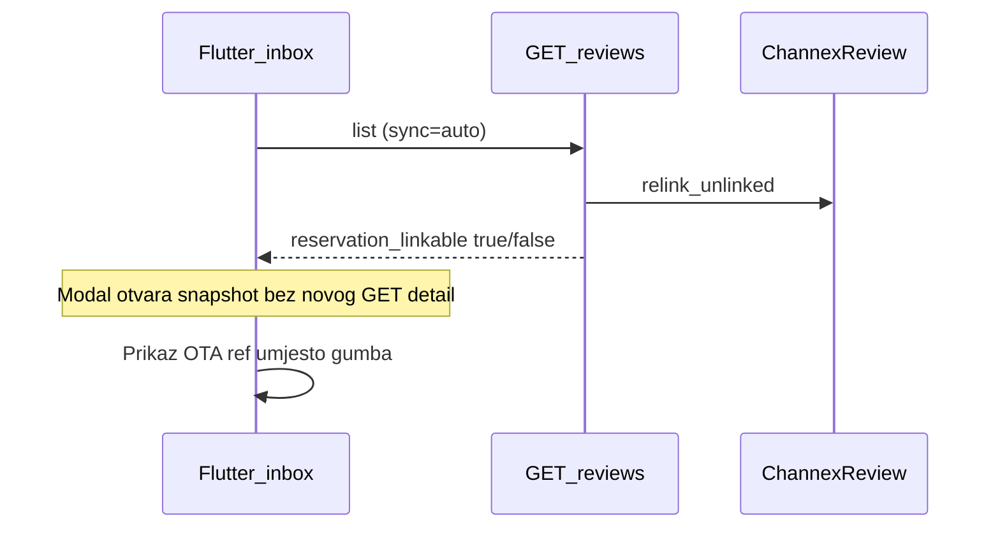

# Flutter: usklađivanje s backend relink commitom

## Što backend sada radi (commit `2228756`)

| Mjesto | Promjena |
|--------|----------|
| [`list_reviews_for_property`](c:\Users\avrca\Documents\Projects\Uzorita_all\stay.hr\backend\apps\integrations\channex\review_service.py) | `relink_unlinked_channex_reviews(tenant)` **prije** queryja — svaki inbox GET pokuša povezati recenzije po `channex_booking_id` / `ota_reservation_id` → `booking_code` |
| [`get_review_for_tenant`](c:\Users\avrca\Documents\Projects\Uzorita_all\stay.hr\backend\apps\integrations\channex\review_service.py) | isti relink pri GET `/reviews/{id}/` |
| [`booking_service.py`](c:\Users\avrca\Documents\Projects\Uzorita_all\stay.hr\backend\apps\integrations\channex\booking_service.py) | nakon Channex booking ingest-a → `relink_unlinked_channex_reviews` na commit |
| Test | `test_list_reviews_relinks_unlinked_review` — recenzija s `ota_reservation_id=5307026805` postane linkana na GET |

API odgovor (već podržan u Flutteru):

- `reservation_id`, `reservation_ref`, `reservation_linkable`, `booking_code`

## Zašto screenshot i dalje pokazuje „OTA ref: 6541736653”

Modal koristi **snapshot s inbox liste** ([`ReviewDetailSheet`](c:\Users\avrca\Documents\Projects\Uzorita_all\uzorita_flutter\lib\features\reception\presentation\widgets\review_detail_sheet.dart)) — `getReview` se zove **samo** pri promjeni jezika, ne pri otvaranju.

Ako je inbox učitan prije deploya, ili relink uspije tek na detail GET-u, modal ostaje na starom `reservation_linkable: false`.

Alternativa: u Stay bazi **nema** rezervacije s `booking_code = 6541736653` — tada relink ne može uspjeti (provjera u Django adminu).



---

## Flutter izmjene (mali diff)

### 1. Modal — fetch pri otvaranju

Datoteka: [`review_detail_sheet.dart`](c:\Users\avrca\Documents\Projects\Uzorita_all\uzorita_flutter\lib\features\reception\presentation\widgets\review_detail_sheet.dart)

U `initState`:

```dart
WidgetsBinding.instance.addPostFrameCallback((_) => _reloadReview());
```

Efekt: prvi `GET /reviews/{id}/?lang=hr&translate=1` pokreće backend relink + vraća ažurirani `reservation_linkable` → gumb **„Otvori rezervaciju {code}”** umjesto statičnog OTA ref bloka.

Dok traje fetch: spinner u headeru (već postoji `_loading`).

### 2. Inbox — refresh nakon povratka (opcionalno, preporučeno)

Datoteka: [`reviews_screen.dart`](c:\Users\avrca\Documents\Projects\Uzorita_all\uzorita_flutter\lib\features\reception\presentation\reviews_screen.dart)

Nakon zatvaranja modala (`ReviewDetailSheet.show` → `await` → `controller.refresh()`) osvježiti inbox da kartice pokažu **„Rezervacija {code}”** u primarnoj boji.

### 3. Bez promjena

- [`channex_review.dart`](c:\Users\avrca\Documents\Projects\Uzorita_all\uzorita_flutter\lib\features\reception\domain\channex_review.dart) — polja već mapirana
- [`review_inbox_card.dart`](c:\Users\avrca\Documents\Projects\Uzorita_all\uzorita_flutter\lib\features\reception\presentation\widgets\review_inbox_card.dart) — logika već ispravna (`reservationLinkable` → linked label)

---

## Ručna provjera

1. **Deploy** backend s commitom `2228756` na `api.stay.hr`
2. U adminu provjeri postoji li rezervacija s `booking_code = 6541736653` (ili odgovarajući OTA kod)
3. U appu: tab Recenzije → **refresh** (ikona) → kartica bi trebala pokazati „Rezervacija 6541736653” (plavo) ako je link uspio
4. Tap kartice → modal → nakon kratkog loada gumb **„Otvori rezervaciju …”**
5. Tap gumba → detalj rezervacije

Ako nakon refresha i dalje samo OTA ref: rezervacija s tim kodom nije u Stay bazi — to nije Flutter bug.
