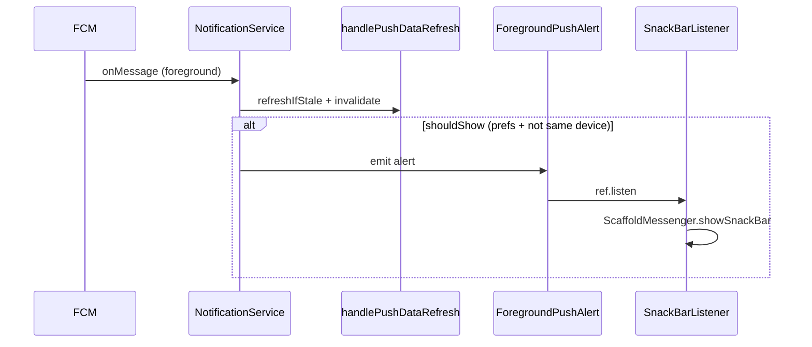

# Foreground push: in-app SnackBar (iOS + Android)

## Problem

Na iPhoneu u foregroundu korisnik često ne vidi obavijest iako [`notification_service.dart`](c:\Users\avrca\Documents\Projects\Uzorita_all\uzorita_flutter\lib\core\notifications\notification_service.dart) već poziva `_showLocalNotification` i `setForegroundNotificationPresentationOptions`. iOS u aktivnoj app ne prikazuje banner pouzdano kao Android.

Postojeća logika **namjerno** ne prikazuje banner kad je `origin_installation_id` jednak lokalnom uređaju (promjena s istog tableta) — refresh i dalje radi preko `handlePushDataRefresh`.



## Strategija

| Stanje app | Prikaz |
|------------|--------|
| Foreground (`onMessage`) | **SnackBar** (floating), opcija Otvori → detalj rezervacije |
| Background / terminated | Bez promjene — FCM/APNs sustavska notifikacija + `onMessageOpenedApp` |

- **Ne mijenjati** [`stay.hr`](c:\Users\avrca\Documents\Projects\Uzorita_all\stay.hr) backend.
- **Zadržati** pravilo: isti uređaj = refresh, **bez** SnackBar-a.
- **Zadržati** Postavke → Obavijesti (`_shouldShowNotification` / `NotificationPreferences`).
- U foregroundu **ukloniti** poziv `_showLocalNotification` (izbjegava dupli prikaz na Androidu i nepouzdan iOS banner).

## Implementacija (Flutter)

### 1. Globalni `ScaffoldMessenger`

U [`lib/app/app.dart`](c:\Users\avrca\Documents\Projects\Uzorita_all\uzorita_flutter\lib\app\app.dart):

- `final scaffoldMessengerKeyProvider = Provider((_) => GlobalKey<ScaffoldMessengerState>());`
- Na `MaterialApp.router`: `scaffoldMessengerKey: ref.watch(scaffoldMessengerKeyProvider)`

`NotificationService` nema `BuildContext` — SnackBar ide preko ovog ključa.

### 2. Model + Riverpod notifier za alert

Nova datoteka npr. [`lib/core/notifications/foreground_push_alert.dart`](c:\Users\avrca\Documents\Projects\Uzorita_all\uzorita_flutter\lib\core\notifications\foreground_push_alert.dart):

```dart
class ForegroundPushAlert {
  final String title;
  final String body;
  final int? reservationId;
}
```

- `ForegroundPushAlertNotifier` — `show(ForegroundPushAlert)` postavlja state; nakon prikaza `clear()` ili auto-reset u listeneru da se isti event može ponoviti.
- Provider u [`notification_providers.dart`](c:\Users\avrca\Documents\Projects\Uzorita_all\uzorita_flutter\lib\core\notifications\notification_providers.dart).

### 3. Zajednički tekst događaja

Izvući `_titleForEvent` iz `NotificationService` u npr. `push_event_labels.dart` (isti `switch` kao danas: `reservation.created`, `reservation.status_changed`, …) — koriste ga i SnackBar i eventualno lokalne notifikacije u budućnosti.

Body: `summary` iz payloada ako nije prazan, inače `bodyOverride` iz FCM `notification` / `data['body']`.

### 4. Promjena `_onForegroundMessage`

U [`notification_service.dart`](c:\Users\avrca\Documents\Projects\Uzorita_all\uzorita_flutter\lib\core\notifications\notification_service.dart):

```dart
// nakon handlePushDataRefresh + _shouldShowNotification == true:
ref.read(foregroundPushAlertProvider.notifier).show(
  ForegroundPushAlert(
    title: ...,
    body: ...,
    reservationId: payload.reservationId ?? payload.entityId,
  ),
);
// NE pozivati _showLocalNotification u onMessage
```

`_showLocalNotification` ostaje za eventualnu buduću upotrebu ili se označi kao background-only (trenutno se ne koristi iz foreground grane).

### 5. UI listener widget

Nova datoteka npr. [`lib/core/notifications/foreground_push_listener.dart`](c:\Users\avrca\Documents\Projects\Uzorita_all\uzorita_flutter\lib\core\notifications\foreground_push_listener.dart) — `ConsumerStatefulWidget`:

- `ref.listen(foregroundPushAlertProvider, ...)` 
- `scaffoldMessengerKey.currentState?.showSnackBar(...)`
- `SnackBarBehavior.floating`, trajanje ~5 s
- Ako `reservationId != null`: `SnackBarAction` → `ref.read(goRouterProvider).go('/reservations/$id')` (isto kao `_scheduleNavigation`)
- Lokalizirani label akcije

U [`notification_bootstrap.dart`](c:\Users\avrca\Documents\Projects\Uzorita_all\uzorita_flutter\lib\core\notifications\notification_bootstrap.dart):

```dart
return ForegroundPushListener(child: widget.child);
```

(`HospiraApp` ostaje unutar `ProviderScope` — listener ima pristup `ref` i routeru.)

### 6. L10n

U [`tool/l10n/strings.json`](c:\Users\avrca\Documents\Projects\Uzorita_all\uzorita_flutter\tool\l10n\strings.json):

- `pushForegroundOpen` — "Otvori" / "Open" (+ es, it, fr, de)
- (opcionalno) `pushForegroundDismiss` ako treba eksplicitni dismiss label

Zatim: `python tool/gen_arb.py` + `flutter gen-l10n`.

Naslovi događaja za sada mogu ostati hardcoded HR u `push_event_labels` (kao `_titleForEvent` danas) ili se u drugom koraku prebaciti u l10n — minimalni scope: samo gumb **Otvori**.

## Test plan (ručno)

| # | Korak | Očekivano |
|---|--------|-----------|
| 1 | Dva fizička uređaja, app **otvoren** na uređaju A | Promjena statusa s B → SnackBar na A + osvježen timeline |
| 2 | Isti uređaj | Promjena s A → **nema** SnackBar-a, timeline se osvježi |
| 3 | App u pozadini | Sustavska notifikacija (bez regresije) |
| 4 | Tap Otvori na SnackBar-u | Navigacija na `/reservations/:id` |
| 5 | Postavke: isključen tip događaja | Nema SnackBar-a za taj tip |
| 6 | iOS + Android foreground | SnackBar na oba |

## Testovi u kodu

- Unit: `ForegroundPushAlertNotifier` — `show` postavlja state, `clear` briše.
- (Opcionalno) izdvojiti `buildForegroundAlert(PushPayload, {titleOverride, bodyOverride})` u čistu funkciju + 2–3 testa za title/body/reservationId.

Postojeći [`push_payload_test.dart`](c:\Users\avrca\Documents\Projects\Uzorita_all\uzorita_flutter\test\core\notifications\push_payload_test.dart) ostaje nepromijenjen.

## Datoteke (sažetak)

| Akcija | Datoteka |
|--------|----------|
| Novo | `foreground_push_alert.dart`, `foreground_push_listener.dart`, `push_event_labels.dart` |
| Izmjena | `notification_service.dart`, `notification_providers.dart`, `notification_bootstrap.dart`, `app.dart` |
| L10n | `tool/l10n/strings.json` + generirani ARB |
| Test | `test/core/notifications/foreground_push_alert_test.dart` (novo) |

## Izvan scopea

- Promjena backend FCM payloada
- Toast paketi (`fluttertoast`, overlay paketi)
- SnackBar za promjene s **istog** uređaja (osvježavanje ostaje dovoljno)
- iOS APNs / Firebase Console setup (AGENTS.md checklist)
