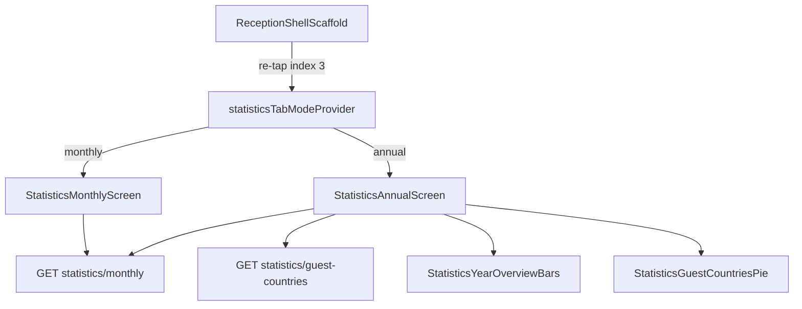

# Godišnji izvještaj statistike — toggle + pie chart

## Cilj

Korisnik na tabu **Statistike** ponovnim tapom na ikonu (dok je tab aktivan) prebacuje:

- **Mjesečni** (default): graf, YoY panel, popunjenost — **bez** horizontalnih godišnjih traka
- **Godišnji**: legenda + horizontalne trake (`StatisticsYearOverviewBars`) + **novi pie chart** s udjelom gostiju po državama i zastavama u segmentima



Uzorak je identičan postojećem:
- [`calendar_tab_mode_provider.dart`](c:\Users\avrca\Documents\Projects\Uzorita_all\uzorita_flutter\lib\features\reception\presentation\calendar_tab_mode_provider.dart) + [`calendar_hub_screen.dart`](c:\Users\avrca\Documents\Projects\Uzorita_all\uzorita_flutter\lib\features\reception\presentation\calendar_hub_screen.dart)
- Re-tap logika u [`reception_shell_scaffold.dart`](c:\Users\avrca\Documents\Projects\Uzorita_all\uzorita_flutter\lib\app\reception_shell_scaffold.dart) (index 3 = Statistike)

---

## 1. Backend (stay.hr)

### Novi endpoint

`GET /api/v1/reception/statistics/guest-countries/?year=2026`

Datoteke:
- [`backend/apps/reservations/statistics.py`](c:\Users\avrca\Documents\Projects\Uzorita_all\stay.hr\backend\apps\reservations\statistics.py) — nova funkcija `aggregate_guest_countries_statistics(tenant, year)`
- [`backend/apps/api/reception_views.py`](c:\Users\avrca\Documents\Projects\Uzorita_all\stay.hr\backend\apps\api\reception_views.py) — `ReceptionGuestCountriesStatisticsView` (isti `year` validator kao `ReceptionMonthlyStatisticsView`)
- [`backend/apps/api/reception_urls.py`](c:\Users\avrca\Documents\Projects\Uzorita_all\stay.hr\backend\apps\api\reception_urls.py) — ruta `statistics/guest-countries/`

### Pravilo agregacije (potvrđeno)

**Svi gosti** na realiziranim boravcima:
- Rezervacije: `status IN (checked_in, checked_out)`, `check_in` u traženoj godini
- Za svakog `Guest` na tim rezervacijama: `guest_nationality_iso2(guest)` iz [`nationality_display.py`](c:\Users\avrca\Documents\Projects\Uzorita_all\stay.hr\backend\apps\reservations\nationality_display.py)
- Prazna/nepoznata nacionalnost → bucket `""` (Flutter prikazuje 🏴‍☠️ preko `GuestCountryFlag`)

### JSON odgovor

```json
{
  "year": 2026,
  "total_guests": 412,
  "countries": [
    { "iso2": "DE", "guest_count": 98, "share": 0.238 },
    { "iso2": "AT", "guest_count": 76, "share": 0.184 }
  ]
}
```

- `share` = `guest_count / total_guests` (za poznate države; nepoznato uključeno u total)
- Sortirano po `guest_count` opadajuće
- Backend vraća **sve** države; Flutter grupira male u „Ostalo” (top 7 + ostatak)

### Testovi

U [`backend/apps/api/tests/test_reception_api.py`](c:\Users\avrca\Documents\Projects\Uzorita_all\stay.hr\backend\apps\api\tests\test_reception_api.py):
- 2 rezervacije, 3 gosta s različitim nacionalnostima → točni count/share
- Nepoznata nacionalnost → uključena u total, `iso2: ""`
- Invalid year → 400

Deploy: `./scripts/deploy.sh` u stay.hr repou nakon pusha.

---

## 2. Flutter — toggle i hub

### Novi provider

Datoteka: `lib/features/reception/presentation/statistics_tab_mode_provider.dart`

```dart
enum StatisticsTabMode { monthly, annual }
// NotifierProvider s toggle() — bez persist (kao middle tab)
```

### Shell

U [`reception_shell_scaffold.dart`](c:\Users\avrca\Documents\Projects\Uzorita_all\uzorita_flutter\lib\app\reception_shell_scaffold.dart):

```dart
const _statisticsTabIndex = 3;

if (index == _statisticsTabIndex &&
    navigationShell.currentIndex == _statisticsTabIndex) {
  ref.read(statisticsTabModeProvider.notifier).toggle();
  return;
}
```

Opcionalno (preporučeno): ikona se mijenja ovisno o modu — `Icons.bar_chart` (mjesečni) / `Icons.pie_chart_outline` (godišnji), kao kalendar mijenja ikonu.

### Hub screen

Nova datoteka `statistics_hub_screen.dart` — zamjena buildera u [`app.dart`](c:\Users\avrca\Documents\Projects\Uzorita_all\uzorita_flutter\lib\app\app.dart) (`/statistics`).

Postojeći [`statistics_screen.dart`](c:\Users\avrca\Documents\Projects\Uzorita_all\uzorita_flutter\lib\features\reception\presentation\statistics_screen.dart) preimenovati/refaktorirati u **`statistics_monthly_screen.dart`** (sadržaj `_StatisticsBody` ostaje, **ukloniti** `StatisticsYearOverviewBars`).

---

## 3. Flutter — godišnji ekran

Nova datoteka: `statistics_annual_screen.dart`

Sadržaj `ListView`:
1. `StatisticsYearLegend` (isti widget)
2. `StatisticsYearOverviewBars(data: state.data)` — **premješteno** s mjesečnog ekrana
3. Naslov sekcije (l10n): „Gosti po državama · {year}”
4. `StatisticsGuestCountriesPie` — novi widget

Podaci:
- Trake: postojeći [`statisticsControllerProvider`](c:\Users\avrca\Documents\Projects\Uzorita_all\uzorita_flutter\lib\features\reception\presentation\statistics_controller.dart) (`MonthlyStatistics`)
- Pie: novi `statisticsGuestCountriesProvider` (AsyncNotifier, `year` iz statistics state)

### API + model

- [`reception_api.dart`](c:\Users\avrca\Documents\Projects\Uzorita_all\uzorita_flutter\lib\features\reception\data\reception_api.dart): `guestCountryStatistics({required int year})`
- Nova datoteka `lib/features/reception/domain/guest_country_statistics.dart`: `GuestCountryStatistics`, `CountryGuestShare`

### Pie chart widget

Nova datoteka: `lib/features/reception/presentation/widgets/statistics_guest_countries_pie.dart`

- `fl_chart` `PieChart` (paket već u [`pubspec.yaml`](c:\Users\avrca\Documents\Projects\Uzorita_all\uzorita_flutter\pubspec.yaml))
- Top **7** država + „Ostalo” (sum manjih)
- `PieChartSectionData.badgeWidget`: [`GuestCountryFlag`](c:\Users\avrca\Documents\Projects\Uzorita_all\uzorita_flutter\lib\features\reception\presentation\widgets\guest_country_flag.dart) (`emojiFromIso2` / pirate)
- `badgePositionPercentageOffset: ~0.55` — zastava u sredini većeg segmenta
- Segmenti < ~6%: bez badgea u krugu, samo u legendi ispod
- Legenda: zastava + ISO2/countryUnknown + `{count}` + `{percent}%`

`RefreshIndicator` na godišnjem ekranu invalidira oba providera.

---

## 4. Lokalizacija

U [`tool/l10n/strings.json`](c:\Users\avrca\Documents\Projects\Uzorita_all\uzorita_flutter\tool\l10n\strings.json) dodati ključeve (hr + en ručno; es/it/fr/de s EN):

| Ključ | Primjer HR |
|-------|------------|
| `statisticsAnnualTitle` | Godišnji izvještaj |
| `statisticsGuestCountriesTitle` | Gosti po državama · {year} |
| `statisticsGuestCountriesOther` | Ostalo |
| `statisticsToggleAnnualHint` | Ponovni tap za mjesečni prikaz |
| `statisticsGuestCountriesEmpty` | Nema podataka o gostima za ovu godinu |

Zatim `python tool/gen_arb.py` + `flutter gen-l10n`.

---

## 5. Test plan

### Automatski
- Backend: `test_guest_countries_statistics` u `test_reception_api.py`
- Flutter: `test/features/reception/guest_country_statistics_test.dart` — parsiranje JSON-a, grupiranje „Ostalo”

### Ručno na uređaju
| # | Korak | Očekivano |
|---|--------|-----------|
| 1 | Tab Statistike (default) | Graf + YoY + popunjenost, **nema** horizontalnih traka |
| 2 | Ponovni tap Statistike | Godišnji ekran: trake + pie |
| 3 | Ponovni tap opet | Povratak na mjesečni |
| 4 | Pie chart | Zastave u većim segmentima, legenda ispod |
| 5 | Pull-to-refresh | Oba prikaza osvježavaju podatke |
| 6 | Država nepoznata | 🏴‍☠️ segment |

---

## Datoteke — sažetak

| Repo | Akcija | Datoteka |
|------|--------|----------|
| stay.hr | Novo/izmijena | `statistics.py`, `reception_views.py`, `reception_urls.py`, `test_reception_api.py` |
| uzorita_flutter | Novo | `statistics_tab_mode_provider.dart`, `statistics_hub_screen.dart`, `statistics_monthly_screen.dart`, `statistics_annual_screen.dart`, `guest_country_statistics.dart`, `statistics_guest_countries_pie.dart`, `statistics_guest_countries_controller.dart` |
| uzorita_flutter | Izmjena | `reception_shell_scaffold.dart`, `app.dart`, `reception_api.dart`, `strings.json` + ARB |
| uzorita_flutter | Ukloniti/refaktor | `statistics_screen.dart` → zamijenjen hubom |

## Izvan scopea

- Mijenjanje mjesečnog grafa ili YoY panela
- Persist toggle moda (nije potreban za MVP)
- Web reception frontend
- Sync-versions ETag za guest-countries (nije blocker; refresh radi direktno)
