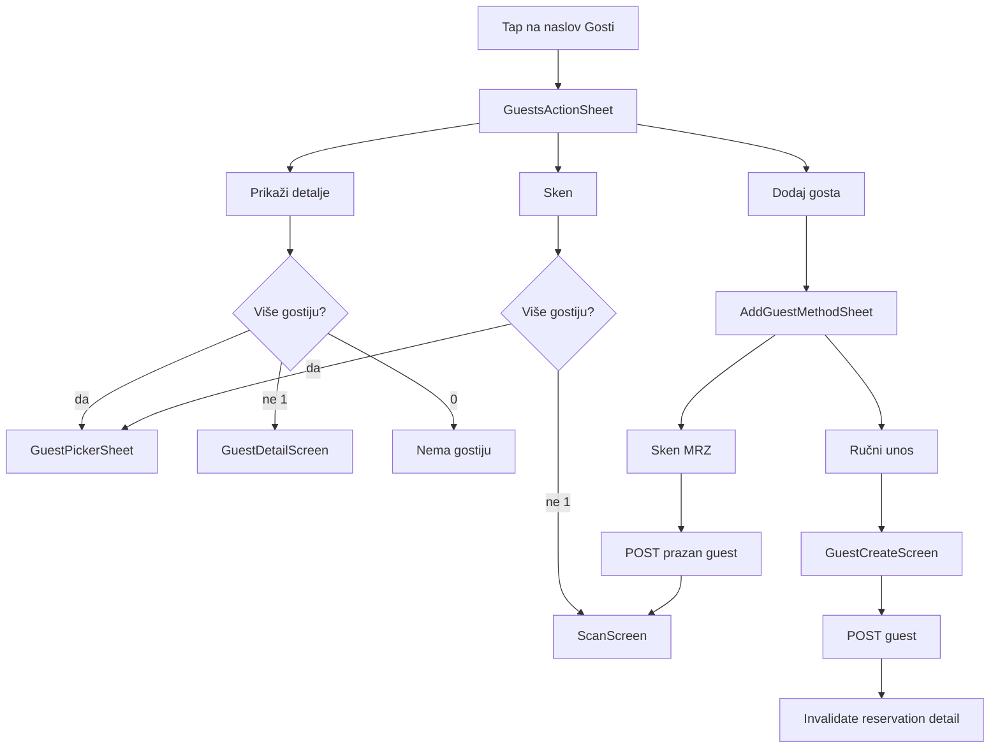

# Preuredba sekcije Gosti

## Trenutno stanje

U [`reservation_detail_screen.dart`](c:\Users\avrca\Documents\Projects\Uzorita_all\uzorita_flutter\lib\features\reception\presentation\reservation_detail_screen.dart) `_GuestCard` (L470–503):

- `onTap` → `context.push('/reservations/.../guests/{id}')`
- `trailing` `IconButton` → scan ruta

Backend ima samo **GET/PATCH** gosta ([`ReservationGuestDetailView`](c:\Users\avrca\Documents\Projects\Uzorita_all\uzorita-rooms-code\backend\app\reception\views.py)); **nema POST** za novog gosta na rezervaciji. Sken ([`DocumentScanIngestView`](c:\Users\avrca\Documents\Projects\Uzorita_all\uzorita-rooms-code\backend\app\reception\views.py)) zahtijeva postojeći `guest_id`.

## Ciljni UX



- **Prikaži detalje / Sken:** ako 0 gostiju → poruka; ako 1 → direktno; ako više → **lista za odabir** (potvrđeno).
- **Dodaj gosta:** pod-sheet „Unesi detalje ručno” | „Sken MRZ”.

## 1. Backend — kreiranje gosta

### Novi endpoint

`POST /api/reception/reservations/<reservation_id>/guests/`

U [`api_urls.py`](c:\Users\avrca\Documents\Projects\Uzorita_all\uzorita-rooms-code\backend\app\reception\api_urls.py):

```python
path("reservations/<int:reservation_id>/guests/", ReservationGuestListCreateView.as_view(), ...)
```

### View + serializer

- [`serializers.py`](c:\Users\avrca\Documents\Projects\Uzorita_all\uzorita-rooms-code\backend\app\reception\serializers.py): `GuestCreateSerializer` — polja kao `GuestDetailSerializer` osim `id`/`reservation` (read-only); `reservation` se postavlja iz URL-a.
- Logika `is_primary`: ako rezervacija nema gostiju, postavi `is_primary=True`, inače `False` (poštuj unique constraint).
- [`views.py`](c:\Users\avrca\Documents\Projects\Uzorita_all\uzorita-rooms-code\backend\app\reception\views.py): `ReservationGuestListCreateView` (`CreateAPIView`), `get_queryset` filtrira po `reservation_id`, `perform_create` veže rezervaciju.
- Test u [`tests.py`](c:\Users\avrca\Documents\Projects\Uzorita_all\uzorita-rooms-code\backend\app\reception\tests.py): POST kreira gosta, drugi gost `is_primary=False`, 404 za nepostojeću rezervaciju.

## 2. Flutter — API i model

[`reception_api.dart`](c:\Users\avrca\Documents\Projects\Uzorita_all\uzorita_flutter\lib\features\reception\data\reception_api.dart):

```dart
Future<Map<String, dynamic>> createGuest(int reservationId, Map<String, dynamic> payload);
// POST /api/reception/reservations/$reservationId/guests/
```

[`guest.dart`](c:\Users\avrca\Documents\Projects\Uzorita_all\uzorita_flutter\lib\features\reception\domain\guest.dart): `toCreatePayload()` — isto kao `toUpdatePayload()` (bez `id`).

## 3. Flutter — UI komponente (novi widgeti)

U `lib/features/reception/presentation/widgets/`:

| Widget | Uloga |
|--------|--------|
| `guests_action_sheet.dart` | 3 opcije: Prikaži detalje, Sken, Dodaj gosta |
| `guest_picker_sheet.dart` | Lista `GuestLite` za odabir (ime, glavni gost, doc) |
| `add_guest_method_sheet.dart` | Ručni unos \| Sken MRZ |

Pattern kao [`reservation_status_picker_sheet.dart`](c:\Users\avrca\Documents\Projects\Uzorita_all\uzorita_flutter\lib\features\reception\presentation\widgets\reservation_status_picker_sheet.dart) (`showModalBottomSheet` + `SafeArea`).

## 4. Flutter — ekran ručnog unosa

**Opcija A (preporučeno):** novi [`guest_create_screen.dart`](c:\Users\avrca\Documents\Projects\Uzorita_all\uzorita_flutter\lib\features\reception\presentation\guest_create_screen.dart)

- Ista polja kao [`guest_detail_screen.dart`](c:\Users\avrca\Documents\Projects\Uzorita_all\uzorita_flutter\lib\features\reception\presentation\guest_detail_screen.dart) (ime, prezime, dokument, …).
- AppBar „Novi gost”, gumb **Spremi** → `createGuest` → `ref.invalidate(reservationDetailControllerProvider)` + `context.pop()`.
- Validacija: ime i prezime obavezni (minimalno).

**Ruta** u [`app.dart`](c:\Users\avrca\Documents\Projects\Uzorita_all\uzorita_flutter\lib\app\app.dart):

```dart
GoRoute(
  path: '/reservations/:id/guests/new',
  builder: ... GuestCreateScreen(reservationId: id),
),
```

## 5. Flutter — izmjena sekcije Gosti

[`reservation_detail_screen.dart`](c:\Users\avrca\Documents\Projects\Uzorita_all\uzorita_flutter\lib\features\reception\presentation\reservation_detail_screen.dart):

1. Proširiti `_DetailSection` opcionalnim `VoidCallback? onTitleTap` i chevron kad je postavljen.
2. Sekcija **Gosti**: `onTitleTap` → `_openGuestsActions(context, guests)`.
3. `_GuestCard`: ukloniti `onTap` i `trailing` kameru; samo prikaz (ListTile bez navigacije, `enabled: false` ili običan `Padding` + tekst).
4. Handler `_openGuestsActions`:
   - **Prikaži detalje** → `_pickGuest` → `context.push('/reservations/$id/guests/$guestId')`
   - **Sken** → `_pickGuest` → `context.push('.../scan')` → po povratku `invalidate` reservation detail
   - **Dodaj gosta** → `AddGuestMethodSheet`:
     - **Ručno** → `push('/reservations/$id/guests/new')`
     - **MRZ** → `createGuest` s praznim imenom/prezimenom → `push scan` → invalidate

[`guest_detail_screen.dart`](c:\Users\avrca\Documents\Projects\Uzorita_all\uzorita_flutter\lib\features\reception\presentation\guest_detail_screen.dart): kamera u AppBar **ostaje** (skener je i dalje dostupan s ekrana detalja gosta).

## 6. Testovi

- Backend: `ReservationGuestCreateApiTests` (create, is_primary, auth).
- Flutter: widget/unit test za `filter` logiku pickera (0/1/N gostiju) ako izdvojimo helper `resolveGuestForAction`.

## Datoteke (sažetak)

| Repo | Datoteke |
|------|----------|
| backend | `api_urls.py`, `views.py`, `serializers.py`, `tests.py` |
| flutter | `reception_api.dart`, `guest.dart`, `guest_create_screen.dart`, 3× sheets, `reservation_detail_screen.dart`, `app.dart` |

## Napomene

- Deploy **backend prije** ili istovremeno s appom (inače „Dodaj gosta” pada na 404).
- MRZ put: prazan gost + postojeći `ScanScreen` + `document-scan/` — bez duplog OCR backenda.
- Nakon uspješnog dodavanja: `ref.invalidate(reservationDetailControllerProvider(reservationId))` da se lista gostiju osvježi.
