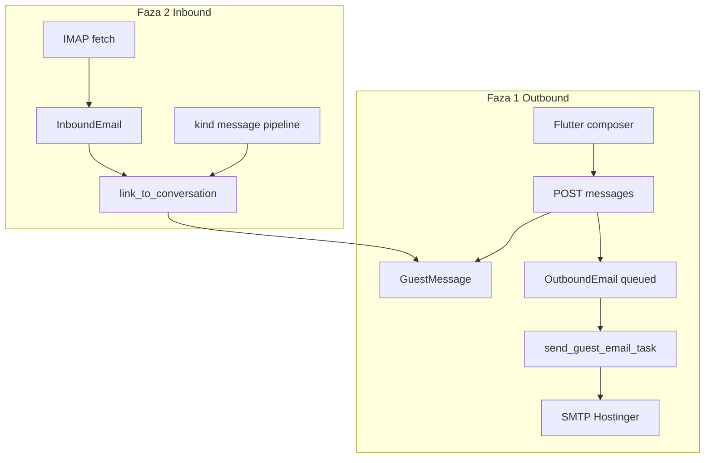

# Guest email messaging (po fazama)

## Odluke (potvrđeno)

| Odluka | Vrijednost |
|--------|------------|
| Thread | Jedan po `Reservation` |
| Primatelj | Uvijek primarni gost (`Guest.is_primary=True`) |
| From | `room_reservations@uzorita.hr` — već [`DEFAULT_FROM_EMAIL = env("MAILBOX_EMAIL")`](backend/app/config/settings/base.py) |
| Adrese | `@guest.booking.com` (Booking relay) + bilo koji validan email na `Guest.email` — **bez** blokade pri slanju (postojeći `_is_blocked_guest_email` ostaje samo za ingest parsiranje) |
| Klijent | Flutter recepcija (`IsAuthenticated`), API pod `/api/reception/` |

## Trenutno stanje

- [`communications`](backend/app/communications/models.py): `InboundEmail`, `OutboundEmail` (bez FK na rezervaciju, **nema** send koda)
- IMAP: [`fetch_booking_emails`](backend/app/communications/management/commands/fetch_booking_emails.py) — samo `UNSEEN`, dedupe po `Message-ID`
- Booking pipeline: `kind == "message"` → parsed, **bez** threada ([`services.py` L72–79](backend/app/communications/services.py))
- SMTP: konfiguriran u settings; nema Celery taska za slanje
- Flutter: [`reception_api.dart`](uzorita_flutter/lib/features/reception/data/reception_api.dart), [`reservation_detail_screen.dart`](uzorita_flutter/lib/features/reception/presentation/reservation_detail_screen.dart) — nema poruka



---

## Faza 1 — Slanje iz appa (MVP)

**Cilj:** Recepcija na detalju rezervacije piše poruku → email gostu (Booking app ili normalan inbox) → poruka vidljiva u threadu.

### 1.1 Django modeli (app `communications`)

Novi modeli u [`backend/app/communications/models.py`](backend/app/communications/models.py):

- **`GuestConversation`**
  - `reservation` — `OneToOneField(Reservation, related_name="guest_conversation")`
  - `created_at`, `updated_at`
  - Meta: jedan thread po rezervaciji

- **`GuestMessage`**
  - `conversation` — FK
  - `direction` — `inbound` | `outbound`
  - `body_text` — TextField
  - `created_at`
  - `inbound_email` — nullable FK `InboundEmail`
  - `outbound_email` — nullable FK `OutboundEmail`
  - `sent_by` — nullable FK `User` (samo outbound)
  - Constraint: točno jedan od inbound/outbound FK po smjeru

Proširenje **`OutboundEmail`**:
- `reservation`, `guest`, `conversation` (nullable dok se ne kreira thread)
- `smtp_message_id` — generirani `Message-ID` header (za threading u fazi 2)
- `in_reply_to` — nullable, za reply lanac
- `sent_by` — FK User

Migracija + registracija u [`admin.py`](backend/app/communications/admin.py); ažurirati [`bootstrap_roles.py`](backend/app/config/management/commands/bootstrap_roles.py) za `guestconversation` / `guestmessage` (view za reception).

### 1.2 Send servis + Celery

Novi modul npr. [`backend/app/communications/guest_messaging.py`](backend/app/communications/guest_messaging.py):

```python
def get_primary_guest(reservation) -> Guest | None:
    return Guest.objects.filter(reservation=reservation, is_primary=True).first()

def send_guest_message(*, reservation_id, body_text, user) -> GuestMessage:
    # 1) primary guest + non-empty email → ValidationError
    # 2) get_or_create GuestConversation
    # 3) OutboundEmail(status=queued) + GuestMessage(outbound)
    # 4) enqueue send_guest_email_task.delay(outbound_id)
```

**`send_guest_email_task`** (Celery, [`communications/tasks.py`](backend/app/communications/tasks.py)):
- `django.core.mail.EmailMessage`
- `from_email=settings.DEFAULT_FROM_EMAIL` (`room_reservations@uzorita.hr`)
- `to=[guest.email]` — **bez** filtriranja `@guest.booking.com`
- **Subject:** `Re: Booking {external_id}` ako `external_id` postoji, inače `Poruka o rezervaciji #{id}`
- Generirati stabilan `Message-ID` (`<uuid@uzorita.hr>`), spremiti u `OutboundEmail.smtp_message_id`
- Na uspjeh: `status=sent`, `sent_at`; na grešku: `status=failed`, `error_message`, retry (postojeći `autoretry` pattern iz booking taska)

**Validacija emaila:** Django `EmailField` + opcionalno `allow_booking_relay=True` (default) — nema posebne logike osim non-empty.

### 1.3 REST API

U [`backend/app/reception/api_urls.py`](backend/app/reception/api_urls.py):

```
GET  /api/reception/reservations/<pk>/messages/
POST /api/reception/reservations/<pk>/messages/
```

Novi view u `reception` ili `communications` (preporuka: **`communications/views.py`** + import u reception URLs radi kohezije domene):

- `permission_classes = [IsAuthenticated]`
- **GET:** lista `GuestMessage` za `conversation` rezervacije, ordering `created_at`; serializer polja: `id`, `direction`, `body_text`, `created_at`, `status` (iz outbound), `sent_by_name`, `from_email` (inbound)
- **POST:** body `{ "body_text": "..." }` — **bez** `guest_id` (uvijek primary); poziva `send_guest_message`
- Greške: `400` nema primarnog / prazan email, `404` rezervacija

Serializeri u `communications/serializers.py`.

### 1.4 Testovi (Django)

- Unit: `send_guest_message` bez emaila → error
- Unit: mock `EmailMessage.send()` → outbound `sent`, `GuestMessage` kreiran
- API: authenticated POST/GET na test rezervaciji s primary guest
- Koristiti `mail.outbox` (Django test backend) u CI

### 1.5 Flutter

| Datoteka | Promjena |
|----------|----------|
| [`reception_api.dart`](uzorita_flutter/lib/features/reception/data/reception_api.dart) | `listMessages(reservationId)`, `sendMessage(reservationId, bodyText)` |
| Novi `guest_messages_controller.dart` | Riverpod `AsyncNotifier`, invalidate nakon send |
| Novi `reservation_messages_section.dart` | Lista bubblea (inbound lijevo / outbound desno), `TextField` + gumb Pošalji |
| [`reservation_detail_screen.dart`](uzorita_flutter/lib/features/reception/presentation/reservation_detail_screen.dart) | Sekcija "Poruke" ispod gostiju; disabled composer + hint ako primary nema email |

**UX MVP:**
- Nakon send: optimistički ili refresh liste
- Prikaz `status: queued/sent/failed` na outbound porukama
- SnackBar na grešku

**Ručno testiranje:** fizički uređaj + staging; Booking test s `@guest.booking.com` (već potvrđeno da radi).

---

## Faza 2 — Dolazni odgovori gosta

**Cilj:** Gost odgovori (Booking app → relay → vaš inbox) → poruka se pojavi u istom threadu.

### 2.1 Linkiranje inbound → conversation

Novi servis `link_inbound_to_conversation(inbound: InboundEmail) -> GuestMessage | None` u `guest_messaging.py`:

Prioritet matcha:
1. **`In-Reply-To` / `References`** sadrži `OutboundEmail.smtp_message_id` → ista rezervacija
2. **Subject** sadrži `Reservation.external_id` (regex Booking broj)
3. **`From`** (parsed email) == `Guest.email` primarnog gosta rezervacije s overlapping stay datumom (oprezno, fallback)

Na match:
- `get_or_create GuestConversation`
- kreirati `GuestMessage(inbound, inbound_email=inbound)`
- postaviti `InboundEmail` FK `reservation` (novo polje, nullable) za audit

### 2.2 Booking `kind == "message"` pipeline

U [`communications/services.py`](backend/app/communications/services.py) nakon uspješnog parsea `kind == "message"`:
- umjesto samo `skipped_upsert`: nađi `Reservation` po `external_id=booking_number`
- pozovi `link_inbound_to_conversation` (inbound već postoji u DB — treba proći `inbound_email_id` nakon fetcha)

**Redoslijed u pipelineu:** fetch kreira `InboundEmail` → `process_booking_emails` za reservation **ili** novi korak `process_guest_messages` za sve inbound bez conversation linka.

Preporuka: **`process_inbound_guest_messages`** management command + poziv na kraju `run_booking_email_pipeline_task` (uz postojeći process).

### 2.3 IMAP prilagodba

[`fetch_booking_emails`](backend/app/communications/management/commands/fetch_booking_emails.py) danas vuče samo `UNSEEN`. Za replyeve koji su već SEEN:
- Faza 2a: zadržati UNSEEN (dovoljno ako Booking šalje nepročitano)
- Faza 2b (ako treba): opcija `--since-hours 48` ili SINCE datum za thread replyeve — **samo ako** u praksi reply ne stigne kao UNSEEN

### 2.4 API proširenje

- GET messages uključuje inbound
- Opcionalno: `unread_inbound_count` na `ReservationDetailSerializer` (badge na timelineu) — ako želite brzu vidljivost

### 2.5 Flutter

- Pull-to-refresh na sekciji poruka (već ima `RefreshIndicator` na detailu)
- Vizualno razlikovati inbound (npr. siva pozadina, "Od: email")

---

## Faza 3 — Polish (opcionalno, nakon faze 2)

- **Predlošci** poruka (hardcoded lista u Flutteru ili `GET /message-templates/`)
- **Reply subject** kopiranje zadnjeg inbound subjecta za bolji Booking threading
- **`Reply-To`** header konzistentan s mailboxom
- **Admin:** nerazriješeni inbound bez rezervacije (lista za ručno linkanje)
- **Push (FCM):** novi inbound — zaseban ticket
- **HTML body** u prikazu (strip tags, `flutter_html` samo ako treba)

---

## Env / ops (bez promjena ako već radi)

Produkcija već koristi ([`docs/operations/booking-ingest.md`](docs/operations/booking-ingest.md)):
- `MAILBOX_EMAIL`, `MAILBOX_PASSWORD`, IMAP/SMTP Hostinger
- `DEFAULT_FROM_EMAIL` = mailbox

Provjera pri deployu faze 1: Celery worker ima SMTP env; test `EmailMessage` s worker containera.

---

## Sigurnost

- Samo `IsAuthenticated` staff (isti kao [`ReservationDetailView`](backend/app/reception/views.py))
- Thread sadrži PII — nema public API
- Audit: `sent_by` na outbound
- Ne logirati `body_text` u production logovima na INFO

---

## Redoslijed isporuke

| Faza | Isporuka | Ovisnosti |
|------|----------|-----------|
| **1** | Modeli + send + API + Flutter composer | — |
| **2** | Inbound link + Booking message pipeline + inbound u UI | Faza 1 |
| **3** | Predlošci, badge, admin queue, FCM | Faza 2 |

Procjena: Faza 1 ~3–5 dana, Faza 2 ~3–4 dana, Faza 3 po prioritetu.
