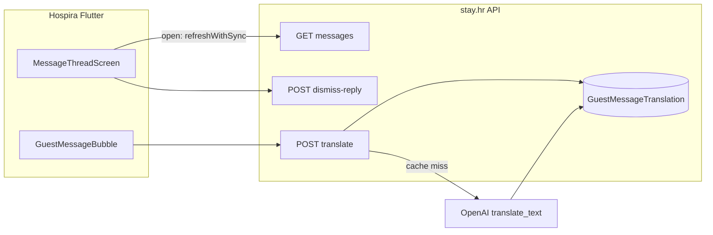

# Guest messages: refresh, dismiss reply, server-cached translate

## Kontekst

| Problem danas | Uzrok |
|---------------|--------|
| Thread ne osvježava pri otvaranju | [`message_thread_screen.dart`](c:\Users\avrca\Documents\Projects\Uzorita_all\uzorita_flutter\lib\features\messages\presentation\message_thread_screen.dart) u `initState` samo `markRead()`, ne `refreshWithSync()` |
| „Needs reply” ne nestaje nakon pregleda | Backend: `needs_reply = last_direction == "inbound"` u [`message_threads_service.py`](c:\Users\avrca\Documents\Projects\Uzorita_all\stay.hr\backend\apps\communications\message_threads_service.py) — nema dismiss stanja |
| Nema prijevoda poruka | Timeline vraća samo `body_text`; prijevod postoji za reviews preko [`translate.py`](c:\Users\avrca\Documents\Projects\Uzorita_all\stay.hr\backend\apps\ai\translate.py) + `content_translations` cache |



---

## 1. Auto-refresh + scroll na dno (Flutter only)

**Datoteka:** [`message_thread_screen.dart`](c:\Users\avrca\Documents\Projects\Uzorita_all\uzorita_flutter\lib\features\messages\presentation\message_thread_screen.dart)

- U `initState` post-frame callback zamijeniti/ proširiti s:
  1. `await refreshWithSync()` na `guestMessagesControllerProvider(reservationId)`
  2. `_scrollToBottom()` helper (extract iz postojećeg `_refresh` + `ref.listen` logike)
  3. Ako `maxScrollExtent == 0`, jedan dodatni `addPostFrameCallback` (layout tek izgrađen)
- `ref.listen` scroll: scrollati samo kad se **promijeni** `messages.length` (izbjeći skokove na svaki rebuild)

---

## 2. „No need reply” (backend + Flutter)

### Backend model

Nova tablica u [`communications/models.py`](c:\Users\avrca\Documents\Projects\Uzorita_all\stay.hr\backend\apps\communications\models.py):

```python
class GuestMessageThreadState(TenantScopedModel):
    reservation = OneToOneField(Reservation, ...)
    reply_dismissed_at = DateTimeField(null=True, blank=True)
```

Migration u `communications/migrations/`.

### Logika needs_reply

U [`message_threads_service.py`](c:\Users\avrca\Documents\Projects\Uzorita_all\stay.hr\backend\apps\communications\message_threads_service.py) `_serialize_thread`:

```python
needs_reply = (
    last.get("direction") == "inbound"
    and (
        dismissed_at is None
        or parse(last["created_at"]) > dismissed_at
    )
)
```

Bulk prefetch `GuestMessageThreadState` za sve reservation_id u inboxu (1 query).

### API

Novi view u [`reception_guest_messages_views.py`](c:\Users\avrca\Documents\Projects\Uzorita_all\stay.hr\backend\apps\api\reception_guest_messages_views.py):

```http
POST /api/v1/reception/reservations/{id}/messages/dismiss-reply/
→ 200 { "reply_dismissed_at": "..." }
```

- `get_or_create` thread state, postavi `reply_dismissed_at = now()`
- Scope: `reception:write`

URL u [`reception_urls.py`](c:\Users\avrca\Documents\Projects\Uzorita_all\stay.hr\backend\apps\api\reception_urls.py).

### Testovi

Proširiti [`test_reception_message_threads.py`](c:\Users\avrca\Documents\Projects\Uzorita_all\stay.hr\backend\apps\api\tests\test_reception_message_threads.py):
- inbound thread → `needs_reply=True`
- nakon dismiss → `needs_reply=False`, `needs_reply_count` smanjen
- nova inbound poruka nakon dismiss → opet `needs_reply=True`

### Flutter

- [`reception_api.dart`](c:\Users\avrca\Documents\Projects\Uzorita_all\uzorita_flutter\lib\features\reception\data\reception_api.dart): `dismissMessageReply(reservationId)`
- [`message_thread_screen.dart`](c:\Users\avrca\Documents\Projects\Uzorita_all\uzorita_flutter\lib\features\messages\presentation\message_thread_screen.dart): AppBar akcija „Ne treba odgovor” (vidljiva kad je zadnja poruka inbound)
- Nakon uspjeha: `guestMessagesInboxControllerProvider.refresh()` + SnackBar
- L10n ključevi u [`tool/l10n/strings.json`](c:\Users\avrca\Documents\Projects\Uzorita_all\uzorita_flutter\tool\l10n\strings.json) → `gen_arb.py`

---

## 3. Prijevod poruka — server cache (backend + Flutter)

### Cache model (centralna tablica)

Nova tablica `GuestMessageTranslation` u [`communications/models.py`](c:\Users\avrca\Documents\Projects\Uzorita_all\stay.hr\backend\apps\communications\models.py):

| Polje | Opis |
|-------|------|
| `tenant` | FK |
| `message_source` | `whatsapp` \| `outbound` \| `booking` (Channex) |
| `source_id` | PK u izvornoj tablici (ne timeline offset) |
| `target_lang` | npr. `hr` |
| `translated_text` | TextField |
| `created_at` | auto |

**Unique:** `(tenant, message_source, source_id, target_lang)`

Zašto centralna tablica: timeline spaja 3 izvora ([`guest_message_timeline.py`](c:\Users\avrca\Documents\Projects\Uzorita_all\stay.hr\backend\apps\communications\guest_message_timeline.py)); jedan cache servis umjesto 3× JSONField migracija.

### Servis

Novi modul [`guest_message_translate.py`](c:\Users\avrca\Documents\Projects\Uzorita_all\stay.hr\backend\apps\communications\guest_message_translate.py):

1. **`resolve_timeline_message(reservation, timeline_id)`** — dekodira ID pomoću postojećih konstanti `WA_ID_OFFSET` / `CHANNEX_ID_OFFSET`; inače `GuestOutboundMessage.pk`
2. **`get_original_body(source, row)`** — `body` / `body_text`
3. **`translate_guest_message(..., target_lang)`**:
   - lookup u `GuestMessageTranslation`
   - **cache hit** → vrati cached, `is_translated`, `from_cache: true`, **bez OpenAI poziva**
   - **cache miss** → `translate_text()` iz [`translate.py`](c:\Users\avrca\Documents\Projects\Uzorita_all\stay.hr\backend\apps\ai\translate.py), spremi red, vrati rezultat

Ciljni jezik: `resolve_request_language(request, tenant=...)` — tenant `default_language`, fallback `hr`.

### API

```http
POST /api/v1/reception/reservations/{id}/messages/translate/
{
  "timeline_id": 2000000015,
  "lang": "hr"   // opcionalno
}
→ {
  "timeline_id": 2000000015,
  "original": "Wir freuen uns",
  "translated": "Radujemo se",
  "target_lang": "hr",
  "is_translated": true,
  "from_cache": false
}
```

- Validacija: poruka mora pripadati rezervaciji
- Ako LLM nije konfiguriran → 503 ili original + `is_translated: false`

### Testovi

Novi [`test_guest_message_translate.py`](c:\Users\avrca\Documents\Projects\Uzorita_all\stay.hr\backend\apps\communications\tests\test_guest_message_translate.py):
- prvi poziv → OpenAI mock, cache zapis
- drugi poziv isti `timeline_id` + lang → **mock se ne zove**, `from_cache: true`
- različit lang → novi cache entry

### Flutter

- [`AppSession`](c:\Users\avrca\Documents\Projects\Uzorita_all\uzorita_flutter\lib\features\auth\domain\app_session.dart): parsirati `tenant.default_language` iz `/api/v1/app/config`
- [`reception_api.dart`](c:\Users\avrca\Documents\Projects\Uzorita_all\uzorita_flutter\lib\features\reception\data\reception_api.dart): `translateMessage(reservationId, timelineId, {lang})`
- [`GuestMessageBubble`](c:\Users\avrca\Documents\Projects\Uzorita_all\uzorita_flutter\lib\features\reception\presentation\widgets\reservation_messages_section.dart):
  - tap na ikonu „Prevedi” ili stavka u long-press meniju (WhatsApp resend ostaje na long-press outbound WhatsApp — koristiti `PopupMenuButton` / sheet da se ne sudaraju)
  - prikaži prevedeni tekst ispod originala + labela `reviewsTranslatedLabel` (reuse postojećeg stringa)
  - lokalni UI state `Map<int, TranslationResult>` u thread screenu (ne treba SharedPreferences — server drži cache)
- Target lang: `session.defaultLanguage` ?? `Localizations.localeOf(context).languageCode`

---

## 4. Deploy redoslijed

1. **stay.hr**: migration + API + testovi → `./scripts/deploy.sh`
2. **uzorita_flutter**: UI + API client → test na uređaju (thread open, dismiss, translate iste poruke 2× — drugi put instant)

---

## Datoteke koje se mijenjaju

**stay.hr**
- [`communications/models.py`](c:\Users\avrca\Documents\Projects\Uzorita_all\stay.hr\backend\apps\communications\models.py) — 2 nova modela
- [`guest_message_translate.py`](c:\Users\avrca\Documents\Projects\Uzorita_all\stay.hr\backend\apps\communications\guest_message_translate.py) — novo
- [`message_threads_service.py`](c:\Users\avrca\Documents\Projects\Uzorita_all\stay.hr\backend\apps\communications\message_threads_service.py)
- [`reception_guest_messages_views.py`](c:\Users\avrca\Documents\Projects\Uzorita_all\stay.hr\backend\apps\api\reception_guest_messages_views.py)
- [`reception_urls.py`](c:\Users\avrca\Documents\Projects\Uzorita_all\stay.hr\backend\apps\api\reception_urls.py)
- testovi

**uzorita_flutter**
- [`message_thread_screen.dart`](c:\Users\avrca\Documents\Projects\Uzorita_all\uzorita_flutter\lib\features\messages\presentation\message_thread_screen.dart)
- [`reservation_messages_section.dart`](c:\Users\avrca\Documents\Projects\Uzorita_all\uzorita_flutter\lib\features\reception\presentation\widgets\reservation_messages_section.dart) — `GuestMessageBubble`
- [`reception_api.dart`](c:\Users\avrca\Documents\Projects\Uzorita_all\uzorita_flutter\lib\features\reception\data\reception_api.dart)
- [`app_session.dart`](c:\Users\avrca\Documents\Projects\Uzorita_all\uzorita_flutter\lib\features\auth\domain\app_session.dart)
- l10n (`messagesDismissReply`, `messagesTranslate`, …)
