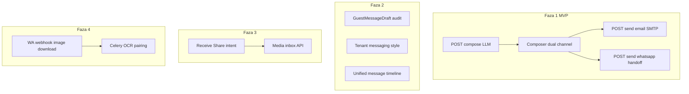

# Guest messaging hub + WhatsApp import (fazni plan)

## Cilj

Recepcija na Hospiri (tablet/mobitel) za rezervaciju:

1. **Generira** poruku gostu (LLM na stay.hr, s fallback predloškom)
2. **Pregleda/uređuje** tekst u Flutteru
3. **Bira kanal**: Email (backend SMTP) ili WhatsApp (OS `wa.me` — ručni Send)
4. **Uči** iz razlike nacrt ↔ poslano
5. **(Kasnije)** dijeli slike iz WhatsApp chata u app → upload na backend za OCR/check-in



---

## Trenutno stanje (referenca)

| Datoteka | Uloga |
|----------|--------|
| [`uzorita_flutter/lib/features/reception/presentation/widgets/reservation_messages_section.dart`](c:/Users/avrca/Documents/Projects/Uzorita_all/uzorita_flutter/lib/features/reception/presentation/widgets/reservation_messages_section.dart) | UI composer — samo email, endpoint često nedostupan |
| [`uzorita_flutter/lib/features/reception/data/reception_api.dart`](c:/Users/avrca/Documents/Projects/Uzorita_all/uzorita_flutter/lib/features/reception/data/reception_api.dart) | `listMessages` / `sendMessage` — treba proširiti |
| [`stay.hr/backend/apps/communications/guest_email.py`](c:/Users/avrca/Documents/Projects/Uzorita_all/stay.hr/backend/apps/communications/guest_email.py) | SMTP, `_email_context()`, `_language_for_reservation()` |
| [`stay.hr/backend/apps/integrations/whatsapp/phone.py`](c:/Users/avrca/Documents/Projects/Uzorita_all/stay.hr/backend/apps/integrations/whatsapp/phone.py) | `normalize_phone()` za `wa.me` |
| [`stay.hr/docs/operations/whatsapp-checkin-template.md`](c:/Users/avrca/Documents/Projects/Uzorita_all/stay.hr/docs/operations/whatsapp-checkin-template.md) | Kanonski ton i placeholderi |
| [`uzorita-rooms-code/backend/app/communications/guest_messaging.py`](c:/Users/avrca/Documents/Projects/Uzorita_all/uzorita-rooms-code/backend/app/communications/guest_messaging.py) | Referenca za email thread (portirati prilagođeno stay.hr authu) |

**Važna razlika:** stay.hr recepcija koristi **device token** (`ApiApplication`), ne Django `User` — polje `sent_by` u modelima treba biti `ForeignKey(ApiApplication)` ili `device_id` string.

---

## Faza 1 — MVP: Compose + LLM + dual channel

### 1.1 Backend modeli (`stay.hr`)

Novi app modul: [`backend/apps/communications/`](c:/Users/avrca/Documents/Projects/Uzorita_all/stay.hr/backend/apps/communications/) (proširiti postojeći, bez punog email ingest u MVP-u):

- **`GuestMessageDraft`** — svaki pokušaj compose/send
  - `reservation`, `intent` (`checkin`, `reply`, `custom`), `hint`
  - `llm_body_text`, `final_body_text`, `language`
  - `channel` (`email` | `whatsapp` | null dok nije poslano)
  - `llm_model`, `prompt_version`
  - `api_application` (tko je poslao), `created_at`, `sent_at`
  - `edited` (computed: llm != final)

- **`GuestOutboundMessage`** (lagani audit log u MVP-u; puni thread u Fazi 2)
  - `reservation`, `channel`, `body_text`, `status` (`handoff_whatsapp` | `queued` | `sent` | `failed`)
  - `to_email` / `to_phone`, `wa_me_url`, `error_message`
  - `draft` FK, `api_application`

Migracija + Django admin (read-only audit).

### 1.2 LLM servis

Novi modul npr. [`backend/apps/communications/guest_compose.py`](c:/Users/avrca/Documents/Projects/Uzorita_all/stay.hr/backend/apps/communications/guest_compose.py) + [`backend/apps/ai/provider.py`](c:/Users/avrca/Documents/Projects/Uzorita_all/stay.hr/backend/apps/ai/provider.py):

**Env varijable** (dodati u [`.env.example`](c:/Users/avrca/Documents/Projects/Uzorita_all/stay.hr/.env.example)):
- `GUEST_COMPOSE_LLM_PROVIDER=openai|gemini`
- `GUEST_COMPOSE_LLM_API_KEY`
- `GUEST_COMPOSE_LLM_MODEL` (npr. `gpt-4o-mini` / `gemini-2.0-flash`)

**Kontekst za prompt** (structured JSON, ne raw DB):
- Rezervacija: ime, booking kod, datumi, soba, odrasli/djeca, `notes`
- Property: adresa, check-in/out vrijeme, maps link (iz property config / fiksno iz predloška)
- Plaćanje: guest-friendly tekst prema [`resolve_payment_method()`](c:/Users/avrca/Documents/Projects/Uzorita_all/stay.hr/backend/apps/billing/services/payment.py) + tablice iz `whatsapp-checkin-template.md` (HR/EN/DE/RO)
- Povijest: zadnjih 10 poruka iz `WhatsAppMessage` + `ChannexMessage` za tu rezervaciju
- Jezik: `_language_for_reservation()` iz `guest_email.py`

**System prompt pravila:**
- Ne izmišljati cijene/datume; koristiti samo dane podatke
- Potpis: property name / „Managed by stay.hr”
- Kratko, recepcijski ton

**Fallback:** ako LLM nije konfiguriran ili API padne → deterministički check-in template (isti placeholderi).

Sync poziv u view-u (< ~15 s); ako traje duže, vratiti `202` + Celery task (opcionalno u MVP-u samo sync s timeoutom).

### 1.3 REST API

Dodati u [`backend/apps/api/reception_urls.py`](c:/Users/avrca/Documents/Projects/Uzorita_all/stay.hr/backend/apps/api/reception_urls.py):

| Metoda | Put | Opis |
|--------|-----|------|
| `POST` | `reservations/<id>/messages/compose/` | Body: `{ intent, hint?, language? }` → draft + `body_text` + `channels` |
| `POST` | `reservations/<id>/messages/send/` | Body: `{ draft_id, channel, body_text, subject? }` |
| `GET` | `reservations/<id>/messages/` | Timeline: `GuestOutboundMessage` + WA/Channex (read-only agregat) |

**`channels` u compose odgovoru:**
```json
{
  "email": { "available": true, "to": "..." },
  "whatsapp": { "available": true, "phone_raw": "+385...", "phone_wa": "385...", "wa_me_url": "https://wa.me/..." }
}
```
- Email: `booker_email` ili primary guest email (kao `_guest_recipient()`)
- WhatsApp: `booker_phone` normaliziran preko `normalize_phone()`

**Send — email:** proširiti [`guest_email.py`](c:/Users/avrca/Documents/Projects/Uzorita_all/stay.hr/backend/apps/communications/guest_email.py) s `send_guest_message_text(reservation, body, subject)` — tenant SMTP, status u `GuestOutboundMessage`.

**Send — whatsapp:** ne šalje server; vraća finalni `wa_me_url`, status `handoff_whatsapp`, sprema `final_body_text` u draft.

Testovi: [`backend/apps/api/tests/`](c:/Users/avrca/Documents/Projects/Uzorita_all/stay.hr/backend/apps/api/tests/) — compose mock LLM, send email mock SMTP, whatsapp URL encoding.

### 1.4 Flutter

**Paketi** u [`pubspec.yaml`](c:/Users/avrca/Documents/Projects/Uzorita_all/uzorita_flutter/pubspec.yaml):
- `url_launcher` — WhatsApp handoff

**API** — proširiti [`reception_api.dart`](c:/Users/avrca/Documents/Projects/Uzorita_all/uzorita_flutter/lib/features/reception/data/reception_api.dart):
- `composeMessage()`, `sendMessage(channel, draftId, bodyText)`

**Controller** — refaktor [`guest_messages_controller.dart`](c:/Users/avrca/Documents/Projects/Uzorita_all/uzorita_flutter/lib/features/reception/presentation/guest_messages_controller.dart):
- `compose(intent, hint)` → popuni composer
- `sendEmail()` / `sendWhatsApp()` — odvojeni flow

**UI** — [`reservation_messages_section.dart`](c:/Users/avrca/Documents/Projects/Uzorita_all/uzorita_flutter/lib/features/reception/presentation/widgets/reservation_messages_section.dart):
- Gumb **Generiraj** (intent: Check-in / Odgovor / Prilagođeno + opcionalni hint)
- Uređivi `TextField`
- Dva gumba: **Email** | **WhatsApp** (disabled s objašnjenjem ako kanal nedostupan)
- WhatsApp: nakon `send` → `launchUrl(waMeUrl, externalApplication)`
- Ukloniti `messagesUnavailable` gate kad API postoji

**iOS** — [`ios/Runner/Info.plist`](c:/Users/avrca/Documents/Projects/Uzorita_all/uzorita_flutter/ios/Runner/Info.plist): `LSApplicationQueriesSchemes` → `whatsapp`

**L10n** — novi stringovi u [`tool/l10n/strings.json`](c:/Users/avrca/Documents/Projects/Uzorita_all/uzorita_flutter/tool/l10n/strings.json) → `gen_arb.py`

**Deploy:** `./scripts/deploy.sh` na stay.hr prije testa na uređaju.

---

## Faza 2 — Učenje i unified timeline

### 2.1 Feedback loop
- Admin export / management command: draftovi gdje `edited=true`
- **`TenantReceptionSettings.messaging_style`** (TextField) — tenant-specifične upute za LLM (npr. „uvijek spomeni parking”)
- Few-shot: zadnjih N odobrenih `final_body_text` po `intent` uključiti u prompt (max 3 para)

### 2.2 Puniji message thread
- Port koncepta iz [`guest_messaging.py`](c:/Users/avrca/Documents/Projects/Uzorita_all/uzorita-rooms-code/backend/app/communications/guest_messaging.py): `GuestConversation` + inbound email link (IMAP pipeline — odvojen task, ne blokira Fazu 1)
- `GET /messages/` vraća jedinstveni timeline s `channel` badgeom: `email` | `whatsapp` | `booking` | `whatsapp_cloud`

### 2.3 Flutter
- Timeline bubble s kanalom i statusom
- Povijest koristi se kao hint pri sljedećem compose (`reply` intent automatski uključuje zadnju inbound poruku)

---

## Faza 3 — Share slika iz WhatsAppa

### 3.1 Flutter receive share
- Paket: **`receive_sharing_intent`** (ili `share_handler`)
- [`AndroidManifest.xml`](c:/Users/avrca/Documents/Projects/Uzorita_all/uzorita_flutter/android/app/src/main/AndroidManifest.xml): `ACTION_SEND` + `SEND_MULTIPLE`, `image/*`
- Inicijalizacija u [`main.dart`](c:/Users/avrca/Documents/Projects/Uzorita_all/uzorita_flutter/lib/main.dart) — slušaj share stream, navigiraj na import ekran
- Nova ruta u [`app.dart`](c:/Users/avrca/Documents/Projects/Uzorita_all/uzorita_flutter/lib/app/app.dart): `/import/whatsapp-media`

**UX ekran:**
1. Pregled primljenih slika (1–N)
2. Odabir rezervacije (pretraga / zadnja otvorena)
3. Odabir gosta
4. Upload

### 3.2 Backend media inbox
Novi endpoint (ne koristiti direktno `document-photos` za batch):

`POST /api/v1/reception/reservations/<id>/guests/<gid>/media-inbox/`

- Multipart: `files[]` (1–10 JPEG/PNG)
- Spremi u `IdDocument` / novi model `GuestMediaInboxItem` s `status=pending`
- Odgovor: `{ inbox_id, file_count }`

**Faza 3b (opcionalno):** Celery task za MRZ/OCR uparivanje strana (logika iz [`ai-runbook-ocr-checkin-evisitor-2026-06.md`](c:/Users/avrca/Documents/Projects/Uzorita_all/stay.hr/docs/operations/ai-runbook-ocr-checkin-evisitor-2026-06.md)) — recepcija potvrđuje prije upisa u `Guest`.

Flutter: nakon uploada, link na postojeći scan/guest detail ekran.

---

## Faza 4 — WhatsApp Cloud webhook mediji (automatizacija)

Proširiti [`webhook_service.py`](c:/Users/avrca/Documents/Projects/Uzorita_all/stay.hr/backend/apps/integrations/whatsapp/webhook_service.py):

- Za `message_type == "image"`: download medija preko Graph API (`media_id` → binary)
- Spremiti u inbox, povezati s rezervacijom preko [`find_reservation_for_wa_id()`](c:/Users/avrca/Documents/Projects/Uzorita_all/stay.hr/backend/apps/integrations/whatsapp/reservation_lookup.py)
- Push notifikacija recepciji (postojeći FCM) — „Nova slika dokumenta od gosta”
- Flutter: deep link na inbox/rezervaciju

Ovo **zamjenjuje ručni Share** kad gost piše na poslovni WhatsApp broj, ali ne isključuje Share za ad-hoc slučajeve.

---

## Sigurnost i operativa

- LLM API key **samo** na serveru; nikad u Flutter build
- PII u prompt logovima: truncate / hash u produkcijskim logovima
- Rate limit compose: npr. 20/h po `ApiApplication`
- GDPR: draft retencija 90 dana (management command `purge_old_message_drafts`)
- Test na **fizičkom Android/iOS** uređaju (Share + WhatsApp + url_launcher)

---

## Redoslijed implementacije (preporuka)

1. **Faza 1 backend** (modeli + compose/send + LLM + testovi) → deploy
2. **Faza 1 Flutter** (composer UI + dual channel) → test s pravom rezervacijom
3. **Faza 2** feedback + timeline
4. **Faza 3** Share import + media inbox
5. **Faza 4** webhook mediji

Faza 1 je **gate** za produkcijsku vrijednost; faze 3–4 paraleliziraju check-in workflow s porukama.

---

## Test plan (Faza 1 acceptance)

| # | Scenarij | Očekivano |
|---|----------|-----------|
| 1 | Compose check-in, HR rezervacija | LLM tekst na hrvatskom, ispunjeni placeholderi |
| 2 | LLM API down | Fallback template, app ne puca |
| 3 | Send Email | SMTP sent / failed status u timeline |
| 4 | Send WhatsApp | WhatsApp se otvara s brojem i tekstom; audit `handoff_whatsapp` |
| 5 | Uređivanje prije send | Draft `edited=true` |
| 6 | Nema telefona | WhatsApp gumb disabled |
| 7 | Nema emaila | Email gumb disabled |
