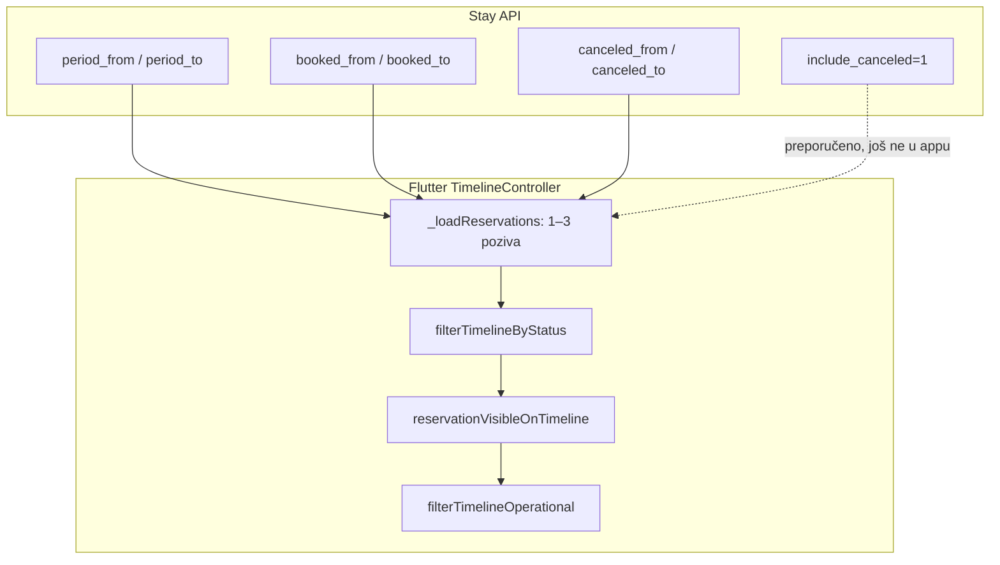

# Uređivanje hospira-timeline-filter.md

## Problem

Datoteka je dodana u commitu `b9f0d7b` („popravak filtera za hospira timeline”) i pokriva **samo** kombinirani dnevni filter `booked_from` + `include_canceled`. U međuvremenu je Timeline u Flutteru znatno širi, a sekcija **„Flutter todo”** (linije 94–101) više nije točna — dio je implementiran, ali **ne** onako kako doc preporučuje.

| U docu | Stvarno stanje |
|--------|----------------|
| Jedan poziv s `include_canceled=1` | Flutter koristi **2–3 paralelna** poziva bez `include_canceled` |
| Primjer s `timezone` paketom | App koristi [`DateUtilsIso`](c:\Users\avrca\Documents\Projects\Uzorita_all\uzorita_flutter\lib\core\utils\date_utils.dart) (`Europe/Zagreb`) |
| Samo „Today booked + canceled” | Glavni mod je **`period_from` / `period_to`** + klijentski operativni filter |
| „Flutter todo” | Dolasci default ON, Status skriven kad je kartica aktivna — **nije dokumentirano** |

Backend referenca u docu treba precizirati: [`ReservationTimelineListView`](c:\Users\avrca\Documents\Projects\Uzorita_all\stay.hr\backend\apps\api\reception_views.py) (testovi u [`test_reception_api.py`](c:\Users\avrca\Documents\Projects\Uzorita_all\stay.hr\backend\apps\api\tests\test_reception_api.py)).

---

## Predložena struktura dokumenta

### 1. Uvod i arhitektura

- Svrha: ugovor između **Stay API** i **Hospira** (`uzorita_flutter`, `hr.finestar.hospira`)
- Endpoint: `GET /api/v1/reception/reservations/`
- Dijagram toka:



### 2. Backend — svi query parametri

Proširiti postojeće tablice; zadržati postojeći sadržaj za `booked_*` / `canceled_*` / `include_canceled` (provjereno u kodu):

| Parametar | Kada | Ponašanje |
|-----------|------|-----------|
| `period_from`, `period_to` | Operativni timeline (Danas/Tjedan/Mjesec) | Dolazak **ili** odlazak u rasponu **ili** `status=checked_in` (uvijek uključen) |
| `booked_from`, `booked_to` | Brojač „Nove danas” / Today fokus | Po `booked_at` u `[00:00, 00:00)` Zagreb; **isključuje** `canceled` |
| `canceled_from`, `canceled_to` | Brojač „Otkazane danas” / Today fokus | Samo `status=canceled`, po `canceled_at` |
| `include_canceled=1` | Optimizacija (1 poziv) | Union booked + canceled istog dana, sort `-activity_at` |
| `status` | Status dropdown | Filtrira prije ostalih grananja |
| `search` | Globalna pretraga | `external_id`, soba, ime gosta |

**Pravilo prioriteta** (iz testa `test_timeline_booked_filter_ignores_period_params`): kad su postavljeni `booked_from`/`booked_to`, **`period_*` se ignorira**.

Zadržati postojeće napomene o timezone ponoći i UI badgeovima za `canceled`.

### 3. Flutter — trenutna implementacija (zamjena „Flutter todo”)

Dokumentirati [`timeline_controller.dart`](c:\Users\avrca\Documents\Projects\Uzorita_all\uzorita_flutter\lib\features\reception\presentation\timeline_controller.dart):

**Operativni mod** (`focusLens == operational`, default):

- 3 paralelna poziva:
  1. `period_from` / `period_to` (+ opcionalni `status`)
  2. `booked_from` / `booked_to` (za stat karticu „Nove danas”)
  3. `canceled_from` / `canceled_to`, `status=canceled` (za „Otkazane danas”)
- Klijentski slojevi: status → period (`reservationVisibleOnTimeline`, checked_in uvijek vidljiv) → operativni filter (`arrivals` / `departures` / `checkedIn`)
- **Default:** `_operationalFilter = arrivals` — lista na startu prikazuje samo dolazak u odabranom periodu
- **Status dropdown** skriven kad `statCardFilterActive` (operativna kartica ≠ `none`, Today fokus, ili global search) — vidi [`timeline_status_filter_field.dart`](c:\Users\avrca\Documents\Projects\Uzorita_all\uzorita_flutter\lib\features\reception\presentation\widgets\timeline_status_filter_field.dart)

**Today fokus** (`focusLens == activityToday`):

- 2 poziva (booked + canceled), lista u sekcijama `__booked_today__` / `__canceled_today__`
- `filterBookedTodayTimeline` dodatno isključuje `canceled` i `no_show` s booked poola

**Datum „danas”:**

```dart
// DateUtilsIso.todayIso() + addDaysIso(today, 1) za booked_to / canceled_to
final todayRange = (from: DateUtilsIso.todayIso(), to: DateUtilsIso.addDaysIso(today, 1));
```

### 4. Kratka sekcija „Buduća optimizacija” (opcionalno, 3–4 rečenice)

- Za Today fokus (i eventualno stat poolove) moguće smanjiti na **1 poziv** s `include_canceled=1` — backend već podržava; [`ReceptionApi.reservations`](c:\Users\avrca\Documents\Projects\Uzorita_all\uzorita_flutter\lib\features\reception\data\reception_api.dart) još nema parametar `includeCanceled` na reservations endpointu (postoji samo na kalendaru soba).
- Nije blocker za release; dokumentirati kao preporuku, ne kao otvoreni todo.

### 5. Reference

- Backend: `backend/apps/api/reception_views.py` → `ReservationTimelineListView`
- Testovi: `backend/apps/api/tests/test_reception_api.py` (klase `test_timeline_*`)
- Flutter: `timeline_controller.dart`, `timeline_period_filter.dart`, `timeline_summary.dart`

---

## Što se ne mijenja

- Sam API endpoint i semantika `include_canceled` (već točno opisana)
- Nema promjena koda u repou — **samo** markdown u `stay.hr`
- Nema novih linkova iz README (doc nije referenciran nigdje)

## Provjera

Nakon uređivanja, doc treba omogućiti developeru da:

1. Razumije zašto Flutter šalje 3 poziva u normalnom modu
2. Zna kad koristiti `period_*` vs `booked_*` vs `include_canceled`
3. Ne traži implementaciju stavki iz uklonjenog „Flutter todo” koje su već u produkcijskom kodu
