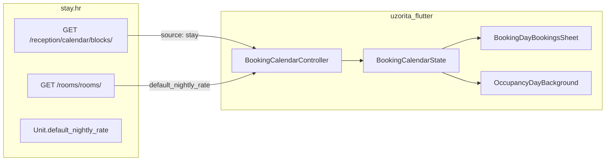

# Kalendar: plava torta za blokadu + cijena slobodne sobe

## Kontekst



**Torta (svi smještaji):** rezervacije = crveno, klijentska blokada = plavo, zelena pozadina = slobodno. Logika već postoji u [`occupancy_day_background.dart`](c:/Users/avrca/Documents/Projects/Uzorita_all/uzorita_flutter/lib/features/reception/presentation/widgets/occupancy_day_background.dart) i [`occupancy_calendar_colors.dart`](c:/Users/avrca/Documents/Projects/Uzorita_all/uzorita_flutter/lib/features/reception/presentation/widgets/occupancy_calendar_colors.dart).

**Bug:** backend šalje `source: "stay"` ([`calendar_blocks_service.py`](c:/Users/avrca/Documents/Projects/Uzorita_all/stay.hr/backend/apps/integrations/calendar_blocks_service.py)), a Flutter prepoznaje samo `"hospira"` ([`booking_calendar_models.dart`](c:/Users/avrca/Documents/Projects/Uzorita_all/uzorita_flutter/lib/features/reception/domain/booking_calendar_models.dart) L146). Ručne blokade zato ulaze u `externalBlockRatio` i crtaju se crveno.

**Cijena:** nema Channex integracije za tenant; korisnik želi **fiksnu noćnu cijenu po sobi** na backendu (ne `channel-ari`).

---

## Faza 1 — Plava torta (samo Flutter)

**Datoteka:** [`booking_calendar_models.dart`](c:/Users/avrca/Documents/Projects/Uzorita_all/uzorita_flutter/lib/features/reception/domain/booking_calendar_models.dart)

- Zamijeniti `isHospira` getter s `isClientBlock`:
  ```dart
  bool get isClientBlock => source == 'hospira' || source == 'stay';
  ```
- U `_hospiraBlockUnitIdsFor` / `_externalBlockUnitIdsFor` koristiti `isClientBlock` (vanjski blok = sve ostalo; trenutno prazno za uzorita).

**Test:** proširiti [`booking_calendar_blocks_test.dart`](c:/Users/avrca/Documents/Projects/Uzorita_all/uzorita_flutter/test/features/reception/booking_calendar_blocks_test.dart) — isti scenarij s `source: 'stay'` umjesto `'hospira'`, očekivati `hospiraBlockRatio > 0`, `externalBlockRatio == 0`.

**Ručno:** blokirati jednu sobu u appu, filter „sve sobe” → plavi segment u torti; rezervacije ostaju crvene.

---

## Faza 2 — Fiksna cijena po sobi (stay.hr backend)

### 2a. Model i migracija

**Datoteka:** [`backend/apps/properties/models.py`](c:/Users/avrca/Documents/Projects/Uzorita_all/stay.hr/backend/apps/properties/models.py)

Dodati na `Unit`:

| Polje | Tip | Napomena |
|-------|-----|----------|
| `default_nightly_rate` | `DecimalField(max_digits=10, decimal_places=2, null=True, blank=True)` | null = cijena nije postavljena |
| `nightly_rate_currency` | `CharField(max_length=3, default="EUR")` | ISO valuta |

Migracija u `backend/apps/properties/migrations/`.

### 2b. API

**Datoteka:** [`backend/apps/api/rooms_views.py`](c:/Users/avrca/Documents/Projects/Uzorita_all/stay.hr/backend/apps/api/rooms_views.py) — `UnitListSerializer`

Dodati u `fields`:
- `default_nightly_rate` (string ili null, npr. `"95.00"`)
- `nightly_rate_currency`

Backward compatible: postojeći klijenti ignoriraju nova polja.

### 2c. Admin

**Datoteka:** [`backend/apps/properties/admin.py`](c:/Users/avrca/Documents/Projects/Uzorita_all/stay.hr/backend/apps/properties/admin.py)

- `list_display`: dodati `default_nightly_rate`
- `fieldsets`: sekcija „Pricing” s oba polja — ručno unošenje cijena za R1–R6

### 2d. Test

**Datoteka:** [`backend/apps/api/tests/test_rooms_api.py`](c:/Users/avrca/Documents/Projects/Uzorita_all/stay.hr/backend/apps/api/tests/test_rooms_api.py)

- Assert nova polja u listi (null/EUR po defaultu)
- Jedan test s postavljenom cijenom na `Unit`

### 2e. Deploy i podaci

1. `./scripts/deploy.sh` (ili restart django) nakon mergea
2. U Django adminu za tenant **uzorita** postaviti `default_nightly_rate` po sobama (R1, R2, R3, R6)

*Nema seed commanda u planu — cijene su poslovni podaci, unose se u adminu.*

---

## Faza 3 — Prikaz cijene u Flutteru

### 3a. Model sobe

**Datoteka:** [`booking_calendar_models.dart`](c:/Users/avrca/Documents/Projects/Uzorita_all/uzorita_flutter/lib/features/reception/domain/booking_calendar_models.dart)

Proširiti `RoomFilterOption`:

```dart
final String? defaultNightlyRate;  // npr. "95.00"
final String nightlyRateCurrency;  // default "EUR"
```

Helper (u istom fileu ili mali util):

```dart
String? formatUnitNightlyLabel(RoomFilterOption unit, Locale locale)
// → "R6 · 95 EUR" ili samo "R6" ako rate null
```

Format broja: `NumberFormat` bez decimala ako su .00 (kao web `formatChannelRateValue`).

### 3b. Učitavanje iz API-ja

**Datoteka:** [`booking_calendar_controller.dart`](c:/Users/avrca/Documents/Projects/Uzorita_all/uzorita_flutter/lib/features/reception/presentation/booking_calendar_controller.dart) — `_loadRoomOptions`

Mapirati `default_nightly_rate` i `nightly_rate_currency` iz `api.rooms()` response.

### 3c. UI

**Datoteka:** [`booking_day_bookings_sheet.dart`](c:/Users/avrca/Documents/Projects/Uzorita_all/uzorita_flutter/lib/features/reception/presentation/widgets/booking_day_bookings_sheet.dart)

U `ChoiceChip` za slobodne jedinice (~L369):

```dart
label: Text(formatUnitChipLabel(unit, locale)),
```

Primjer: **`R6 · 95 EUR`** kad je cijena postavljena; inače samo **`R6`** (bez greške).

**Opseg:** samo chipovi u sheetu „Blokiraj smještaj” — ne mijenjati mrežu mjeseca (manji diff, jasniji UX).

### 3d. Test

Unit test za `formatUnitChipLabel` (s cijenom / bez cijene).

---

## Redoslijed i repozitoriji

| Korak | Repo | Ovisnost |
|-------|------|----------|
| Plava torta | `uzorita_flutter` | nema |
| Unit polja + API | `stay.hr` | nema |
| Deploy backend + admin cijene | ops | prije testa cijena u appu |
| Flutter cijena na chipu | `uzorita_flutter` | backend deployan |

---

## Out of scope

- Cijene u ćelijama mjeseca (grid)
- Channex `channel-ari` / dinamičke cijene po danu
- Web recepcija (chipovi i tamo nemaju cijenu — moguće kasnije)
- Seed/management command za uzorita cijene
