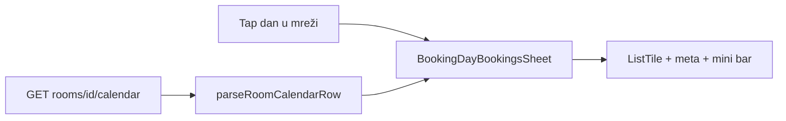

# Kalendar: modal dana — noćenja, gosti, mini timeline

## Cilj

Kad recepcija tapne dan u **Kalendaru** i otvori sheet s rezervacijama, svaki red treba brzo pokazati:

| Info | Primjer |
|------|---------|
| Status + soba | `Očekuje dolazak • R2` (već postoji) |
| **Noćenja** | `3 noćenja` ili `1× 20.05. → 24.05.` |
| **Gosti** | `2 osobe` |
| **Mini timeline** | samo ako `nights > 1` — traka noći s označenim **odabranim danom** |



## Trenutno stanje

| Sloj | Datoteka | Stanje |
|------|----------|--------|
| Otvaranje sheeta | [`booking_calendar_screen.dart`](c:\Users\avrca\Documents\Projects\Uzorita_all\uzorita_flutter\lib\features\reception\presentation\booking_calendar_screen.dart) | `BookingDayBookingsSheet.show(date, bookings)` |
| UI sheeta | [`booking_day_bookings_sheet.dart`](c:\Users\avrca\Documents\Projects\Uzorita_all\uzorita_flutter\lib\features\reception\presentation\widgets\booking_day_bookings_sheet.dart) | `ListTile`: ime, subtitle = status + roomCode |
| Model | [`booking_calendar_models.dart`](c:\Users\avrca\Documents\Projects\Uzorita_all\uzorita_flutter\lib\features\reception\domain\booking_calendar_models.dart) | `CalendarDayBooking`: checkIn/checkOut, **nema** nights/guests |
| Parse | [`booking_occupancy_mapper.dart`](c:\Users\avrca\Documents\Projects\Uzorita_all\uzorita_flutter\lib\features\reception\domain\booking_occupancy_mapper.dart) | `parseRoomCalendarRow` |
| API Stay | [`rooms_views.py`](c:\Users\avrca\Documents\Projects\Uzorita_all\stay.hr\backend\apps\api\rooms_views.py) `UnitCalendarReservationSerializer` | Samo id, datumi, status, ime, soba — **bez** `nights_count` / `persons_count` |

Timeline lista već ima `nights_count` + `effectiveNights` ([`reservation.dart`](c:\Users\avrca\Documents\Projects\Uzorita_all\uzorita_flutter\lib\features\reception\domain\reservation.dart)) — **ponoviti istu logiku** na kalendar modelu.

## Odluke

### Noćenja

- Prvo `nights_count` iz API-ja (ako > 0)
- Fallback: `ReservationDateFormat.nightsBetween(checkIn, checkOut)` (hotel: check-out − check-in u danima)
- Isti helper kao na timelineu — **ne duplicirati** formulu

### Gosti

- Polje **`persons_count`** iz calendar API-ja (usklađeno s timelineom / Booking XLS)
- Prikaz samo ako `> 0`; l10n: postojeći `tooltipPersons(count)`

### Mini timeline

- Prikazati **samo** kad `effectiveNights > 1`
- `anchorDate` = dan modala (`date` iz sheeta)
- `nightIndex` = razlika u danima od check-in do anchor (clamp 0 … nights−1)
- UI: horizontalni niz uskih segmenata (~4–8 px visine, max ~14 segmenata; ako više → cap + tekst `3/21`)
- Boje: status (`expected` / `checked_in`) ili neutralna siva + jači segment za anchor noć
- Ispod/uz traku: kratki monospace raspon datuma (opcionalno, kompaktno)

### Što **ne** raditi u ovom planu

- Promjena mreže mjeseca (zeleni kvadratići) — ostaje
- fl_chart / puni Gantt po sobama — preteško za sheet
- Nova polja u timeline list API-ju — već gotovo

---

## 1. Backend (stay.hr)

**Datoteka:** `backend/apps/api/rooms_views.py` — `UnitCalendarReservationSerializer`

Dodati u `fields`:

- `nights_count`
- `persons_count`

**Test:** proširiti `test_room_calendar` u [`test_rooms_api.py`](c:\Users\avrca\Documents\Projects\Uzorita_all\stay.hr\backend\apps\api\tests\test_rooms_api.py) — fixture s poznatim `nights_count` / `persons_count`.

Deploy: calendar endpoint mora biti na produkciji prije ili uz Flutter release (Flutter fallback za noćenja radi i bez API polja).

---

## 2. Flutter model i mapper

### `CalendarDayBooking`

U [`booking_calendar_models.dart`](c:\Users\avrca\Documents\Projects\Uzorita_all\uzorita_flutter\lib\features\reception\domain\booking_calendar_models.dart):

```dart
final int? nightsCount;
final int personsCount; // default 0

int get effectiveNights { ... } // kao Reservation.effectiveNights
```

### `parseRoomCalendarRow`

U [`booking_occupancy_mapper.dart`](c:\Users\avrca\Documents\Projects\Uzorita_all\uzorita_flutter\lib\features\reception\domain\booking_occupancy_mapper.dart):

```dart
nightsCount: row['nights_count'] as int?,
personsCount: row['persons_count'] as int? ?? 0,
```

---

## 3. Widget: `BookingStayMiniTimeline`

**Nova datoteka:** `lib/features/reception/presentation/widgets/booking_stay_mini_timeline.dart`

Parametri:

- `anchorDate` (dan sheeta)
- `checkIn`, `checkOut`
- `Color accent` (iz statusa)
- `Locale`

Ponašanje:

- `nights <= 1` → `SizedBox.shrink()`
- `nights > 1` → `Row` segmenata + Semantics label (npr. „2. noć od 4, 20.05.–24.05.”)
- Cap: ako `nights > 14`, prikaži 14 segmenata + `Text('$anchorIndex/$nights')`

---

## 4. UI: `BookingDayBookingsSheet`

**Datoteka:** [`booking_day_bookings_sheet.dart`](c:\Users\avrca\Documents\Projects\Uzorita_all\uzorita_flutter\lib\features\reception\presentation\widgets\booking_day_bookings_sheet.dart)

Zamijeniti `subtitle: Text(...)` s `subtitle: Column(...)`:

```
Row: status • roomCode
Row: 3× 20.05. → 24.05.  (ili samo "3 noćenja" ako je usko)
Row: 2 osobe              (ako personsCount > 0)
BookingStayMiniTimeline(anchorDate: date, ...)
```

L10n (ponoviti gdje može):

- `timelineNightsCountOne` / `timelineNightsCount`
- `tooltipPersons`
- Opcionalno novi: `calendarStayNightOf` — „{current} / {total}” za cap

Povećati `maxHeight` sheeta ako treba (npr. 0.45 → 0.55 visine ekrana).

---

## 5. Testovi

| Test | Datoteka |
|------|----------|
| `effectiveNights` na `CalendarDayBooking` | `test/features/reception/booking_occupancy_mapper_test.dart` (novo) |
| `nightIndex` za anchor u sredini boravka | isti ili test uz mini timeline widget |
| Postojeći calendar controller | nije obavezan ako mapper pokriven |

---

## 6. Ručna provjera (tablet)

| # | Scenarij | OK |
|---|----------|-----|
| 1 | Jednonoćna rezervacija — nema mini trake, vidi se broj noći / datumi | |
| 2 | 3+ noći — traka, ispravan segment za odabrani dan | |
| 3 | Check-in prije modala, check-out poslije — anchor u sredini | |
| 4 | `persons_count` s API-ja — „2 osobe” | |
| 5 | Prikaz više soba (R1, R2) — room code + timeline po redu | |
| 6 | HR / EN jezik — l10n meta redova | |

---

## Datoteke (sažetak)

| Repo | Akcija |
|------|--------|
| **stay.hr** | `rooms_views.py`, `test_rooms_api.py` |
| **uzorita_flutter** | `booking_calendar_models.dart`, `booking_occupancy_mapper.dart`, `booking_stay_mini_timeline.dart`, `booking_day_bookings_sheet.dart`, `tool/l10n/strings.json`, test |

## Redoslijed implementacije

1. Stay API + test (ili paralelno s Flutter fallbackom za noćenja)
2. Model + mapper + unit testovi
3. `BookingStayMiniTimeline`
4. Sheet UI + l10n
5. Ručno na uređaju

## Procjena

~ pola dana rada: mali backend PR + Flutter UI/widget + testovi. Bez promjene verzije appa (`pubspec.yaml`) osim ako se ide na Play upload istog build broja.
