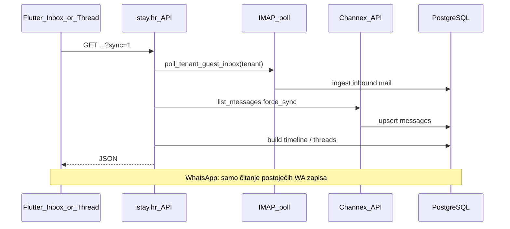

# Guest messages — Refresh sync svih kanala

## Cilj

Kad recepcija na tabletu pritisne **Refresh** ili **povuče listu prema dolje**, aplikacija treba što je moguće više kanala osvježiti odjednom:

| Kanal | Na ručni refresh (`sync=1`) | Napomena |
|-------|----------------------------|----------|
| **Channex** | Da — force pull iz Channex API-ja | Već postoji u backendu |
| **Mail (IMAP)** | Da — `poll_tenant_guest_inbox()` | Novo na API-ju |
| **WhatsApp** | Samo re-read iz baze | Nema pull API-ja; inbound stiže webhookom + FCM |

Prvi load ostaje **`sync=auto`** (brži ulaz). Ručni refresh = **`sync=1`** (kao web [`GuestMessagesPanel.tsx`](c:/Users/avrca/Documents/Projects/Uzorita_all/stay.hr/web/reception/app/_components/GuestMessagesPanel.tsx)).



---

## 1. Backend (stay.hr)

### 1.1 Zajednički sync helper

Nova funkcija npr. u [`message_threads_service.py`](c:/Users/avrca/Documents/Projects/Uzorita_all/stay.hr/backend/apps/communications/message_threads_service.py) ili `guest_message_sync.py`:

```python
def sync_guest_message_sources(tenant, *, sync_param: str, reservations: list[Reservation] | None = None) -> None:
    if sync_param != "1":
        return  # auto/0 — postojeće Channex ponašanje ostaje
    poll_tenant_guest_inbox(tenant)  # no-op ako IMAP disabled
    # Channex: inbox već zove _sync_channex_for_reservations(..., sync_param="1")
```

- Koristi postojeći [`poll_tenant_guest_inbox`](c:/Users/avrca/Documents/Projects/Uzorita_all/stay.hr/backend/apps/communications/guest_email_ingest.py) — isti kod kao Celery/CLI.
- Greške IMAP/Channex **ne ruše** GET (log + nastavi), kao kod Channex synca danas.

### 1.2 Inbox endpoint

U [`reception_message_threads_views.py`](c:/Users/avrca/Documents/Projects/Uzorita_all/stay.hr/backend/apps/api/reception_message_threads_views.py) / [`list_message_threads_for_tenant`](c:/Users/avrca/Documents/Projects/Uzorita_all/stay.hr/backend/apps/communications/message_threads_service.py):

- Kad `sync=1`: **prije** agregacije threadova pozvati `poll_tenant_guest_inbox(request.tenant)`.
- Channex: već radi force sync za sve channex rezervacije u listi kad je `sync_param == "1"` (linija 77–78 u `_sync_channex_for_reservations`).

### 1.3 Thread endpoint

U [`reception_guest_messages_views.py`](c:/Users/avrca/Documents/Projects/Uzorita_all/stay.hr/backend/apps/api/reception_guest_messages_views.py) `ReceptionGuestMessagesView.get`:

- Kad `sync=1`: pozvati `poll_tenant_guest_inbox(request.tenant)` **prije** `_sync_channex_messages_for_timeline`.
- Thread Channex sync već koristi `force_sync` na `sync=1`.

### 1.4 Testovi

U [`test_reception_message_threads.py`](c:/Users/avrca/Documents/Projects/Uzorita_all/stay.hr/backend/apps/api/tests/test_reception_message_threads.py) i/ili [`test_reception_guest_messages.py`](c:/Users/avrca/Documents/Projects/Uzorita_all/stay.hr/backend/apps/api/tests/test_reception_guest_messages.py):

- Mock `poll_tenant_guest_inbox` → provjeri da se zove samo za `?sync=1`, ne za `sync=auto`.
- `sync=auto` i dalje ne smije zvati IMAP (izbjegni sporost na svakom otvaranju).

**Deploy:** `./scripts/deploy.sh` nakon pusha.

---

## 2. Flutter (uzorita_flutter)

### 2.1 Inbox controller

[`guest_messages_inbox_controller.dart`](c:/Users/avrca/Documents/Projects/Uzorita_all/uzorita_flutter/lib/features/messages/presentation/guest_messages_inbox_controller.dart):

- `build()` → `sync: 'auto'` (bez promjene).
- `refresh()` → eksplicitni fetch s `sync: '1'` (ne samo `invalidateSelf` koji ponovno zove `auto`).

Primjer:

```dart
Future<void> refresh({bool? needsReplyOnlyFilter, bool forceSync = true}) async {
  ...
  state = const AsyncLoading();
  state = AsyncData(await api.listMessageThreads(
    needsReplyOnly: needsReplyOnly,
    sync: forceSync ? '1' : 'auto',
  ));
}
```

### 2.2 Inbox UI — pull-to-refresh

[`messages_inbox_screen.dart`](c:/Users/avrca/Documents/Projects/Uzorita_all/uzorita_flutter/lib/features/messages/presentation/messages_inbox_screen.dart):

- Omotati listu u `RefreshIndicator` → `controller.refresh()`.
- Gumb Refresh u app baru ostaje (isti poziv).
- Tijekom synca: `CircularProgressIndicator` / disabled refresh (već djelomično).

### 2.3 Thread

[`guest_messages_controller.dart`](c:/Users/avrca/Documents/Projects/Uzorita_all/uzorita_flutter/lib/features/reception/presentation/guest_messages_controller.dart) — `refreshWithSync()` već šalje `sync: '1'`. Nema promjene osim što backend sada radi i IMAP.

### 2.4 UX (opcionalno, mali scope)

- L10n hint npr. `messagesSyncingChannels` — „Osvježavam poruke (mail, Booking, WhatsApp)…” dok traje refresh >2 s.
- Ne blokirati UI duže od ~15 s; timeout na Dio ako IMAP zaglavi (backend bi trebao biti <10 s u praksi).

---

## 3. Ograničenja (dokumentirati u [`guest-messages-flutter.md`](c:/Users/avrca/Documents/Projects/Uzorita_all/stay.hr/docs/development/guest-messages-flutter.md))

- **WhatsApp:** refresh ne „povlači” nove WA poruke s Meta API-ja — one već ulaze webhookom. Refresh ih prikazuje ako su u bazi.
- **IMAP:** radi samo ako je `guest_imap_enabled` + SMTP lozinka u tenant postavkama.
- **Channex inbox sync=1:** može biti spor na mnogo threadova (N API poziva) — prihvatljivo za ručni refresh, ne za auto.
- **FCM** i dalje služi za real-time; refresh je ručni „sve što backend može povući”.

---

## 4. Test plan (ručno na tabletu)

| Korak | Očekivano |
|-------|-----------|
| Inbox → Refresh | Nove Channex poruke (ako postoje u B.com), nove mail replyeve (ako stignu na IMAP) |
| Inbox → swipe down | Isto kao Refresh |
| Thread → Refresh / swipe | Isto + Channex za tu rezervaciju |
| WhatsApp inbound (webhook) | Vidljiv nakon refresha ili FCM bez ručnog WA synca |
| IMAP disabled u adminu | Refresh ne pada; samo Channex + DB |
| Prvi ulazak u inbox | Brz (`sync=auto`), bez IMAP poll |

---

## Datoteke

| Repo | Izmjene |
|------|---------|
| `stay.hr` | `message_threads_service.py`, `reception_message_threads_views.py`, `reception_guest_messages_views.py`, testovi, doc sync tablica |
| `uzorita_flutter` | `guest_messages_inbox_controller.dart`, `messages_inbox_screen.dart`, opcionalno l10n |
