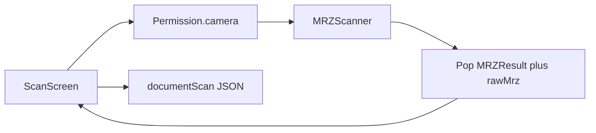

# Migracija na flutter_mrz_scanner (samo MRZ)

## Kontekst u kodu

- Tok skeniranja: [`lib/features/scan/presentation/scan_screen.dart`](c:\Users\avrca\Documents\Projects\Uzorita_all\uzorita_flutter\lib\features\scan\presentation\scan_screen.dart) otvara [`captureDocumentPage()`](c:\Users\avrca\Documents\Projects\Uzorita_all\uzorita_flutter\lib\features\scan\document_snapshot.dart) (cunning / ML Kit dokument skener), zatim šalje sliku na [`ReceptionApi.paddleDocumentScan`](c:\Users\avrca\Documents\Projects\Uzorita_all\uzorita_flutter\lib\features\reception\data\reception_api.dart) (`POST /api/v1/scan/`), parsiranje MRZ-a dolazi iz [`applyPaddleScanResponse`](c:\Users\avrca\Documents\Projects\Uzorita_all\uzorita_flutter\lib\features\scan\paddle_scan_response.dart).
- Slanje gosta: [`buildDocumentScanPayload`](c:\Users\avrca\Documents\Projects\Uzorita_all\uzorita_flutter\lib\features\scan\document_scan_payload.dart) + `documentScan()` ostaju; backend u [`views.py`](c:\Users\avrca\Documents\Projects\Uzorita_all\uzorita-rooms-code\backend\app\reception\views.py) prihvaća `metoda_ocitanja` samo kao **`OCR` ili `NFC`** — lokalni MRZ sken i dalje ide kao **`OCR`** (nije potrebna promjena API-ja).

## Verzija paketa

Na [pub.dev](https://pub.dev/packages/flutter_mrz_scanner) stabilna je linija **2.x** (npr. **2.2.1**). Ograničenje **`^0.2.1`** vjerojatno je tipfel ili zastarjela verzija; s Dart **^3.11** treba koristiti **aktualni `flutter_mrz_scanner` iz 2.x** i provjeriti `flutter pub get` / build.

## Problem: `sirovi_mrz` za backend

Javni [`MRZController`](https://github.com/olexale/flutter_mrz_scanner/blob/master/lib/src/mrz_scanner.dart) u `onParsed` šalje samo **`MRZResult`**; sirovi tekst s nativa (`call.arguments`) se **ne izlaže** u aplikaciju, a [`buildDocumentScanPayload`](c:\Users\avrca\Documents\Projects\Uzorita_all\uzorita_flutter\lib\features\scan\document_scan_payload.dart) treba **`sirovi_mrz`** (pohrana `mrz_raw_text` na backendu).

**Predloženo rješenje (minimalno održivo):** lokalni **path** paket npr. [`packages/flutter_mrz_scanner`](c:\Users\avrca\Documents\Projects\Uzorita_all\uzorita_flutter\packages\flutter_mrz_scanner) — kopija upstreama s malom izmjenom u `onParsed`: uz `MRZResult` proslijediti i **linije** (npr. `List<String> lines` ili `String rawMrz = lines.join('\n')`) istim logikom kao postojeći `_splitRecognized`. U aplikaciji tip callbacka: `(MRZResult, String rawMrz)`.

Alternativa bez forka: prihvatiti slabiji `sirovi_mrz` (npr. serializacija polja) — **ne preporučuje se** jer gubi smisao “sirovi MRZ”.

## Implementacijski koraci

1. **Ovisnosti** — u [`pubspec.yaml`](c:\Users\avrca\Documents\Projects\Uzorita_all\uzorita_flutter\pubspec.yaml): dodati `flutter_mrz_scanner` (path na fork iznad ili direktno `^2.2.1` ako forkate kroz `dependency_overrides`), dodati **`permission_handler: ^11.3.1`**; ukloniti **`cunning_document_scanner`** i **`image`** ako više nitko ne koristi (trenutno su vezani samo uz [`document_snapshot.dart`](c:\Users\avrca\Documents\Projects\Uzorita_all\uzorita_flutter\lib\features\scan\document_snapshot.dart) / [`scan_image_postprocess.dart`](c:\Users\avrca\Documents\Projects\Uzorita_all\uzorita_flutter\lib\features\scan\scan_image_postprocess.dart)).

2. **Nova zaslon / ruta za kameru** — npr. `lib/features/scan/presentation/mrz_camera_screen.dart`:
   - prije `MRZScanner`: `Permission.camera.request()` (i obrada `denied` / `permanentlyDenied`);
   - `MRZScanner(withOverlay: true, onControllerCreated: (c) { c.onParsed = ...; c.onError = ...; c.startPreview(); })`;
   - na uspjeh: `Navigator.pop(context, (mrz, rawMrz))`; AppBar „Gotovo / Odustani” koji poziva `stopPreview()`;
   - opcionalno: gumb za `flashlightOn` / `flashlightOff`.

3. **Refaktor [`scan_screen.dart`](c:\Users\avrca\Documents\Projects\Uzorita_all\uzorita_flutter\lib\features\scan\presentation\scan_screen.dart)**:
   - ukloniti `_runPaddleScan`, `_serverOcrInProgress`, `_ServerOcrProgress`, import `paddle_scan_response`, pozive `receptionApiProvider().paddleDocumentScan`;
   - zamijeniti `_captureAndProcess` **pushom** na `MrzCameraScreen` i postavljanjem `_mrz`, `_rawMrz`, `_hint`;
   - **putovnica**: jedan MRZ sken (bez uploada slike);
   - **HR osobna**: pošto je cilj „samo MRZ”, ukloniti dvokorak prednja/stražnja + `_frontVizHints`; jedan gumb za MRZ; **ukloniti uvjet `_backPreviewBytes`** u [`_canSubmit`](c:\Users\avrca\Documents\Projects\Uzorita_all\uzorita_flutter\lib\features\scan\presentation\scan_screen.dart) (ili ga zamijeniti samo s „ima MRZ”); minijature `_IdCardThumbnails` ukloniti ili pojednostaviti;
   - polje adrese: ostaviti ručni unos; labelu **„Prebivalište (OCR)”** preimenovati u nešto neutralno (npr. „Prebivalište”) jer OCR s poslužitelja više ne dolazi;
   - pregled slike: ili ukloniti ako nema snimke, ili povezati s `MRZController.takePhoto()` samo za thumbnail (opcionalno, kasnije).

4. **API čišćenje** — u [`reception_api.dart`](c:\Users\avrca\Documents\Projects\Uzorita_all\uzorita_flutter\lib\features\reception\data\reception_api.dart) ukloniti `paddleDocumentScan` ako ga nitko drugi ne zove; obrisati [`paddle_scan_response.dart`](c:\Users\avrca\Documents\Projects\Uzorita_all\uzorita_flutter\lib\features\scan\paddle_scan_response.dart) ako postane mrtav kod.

5. **Dozvole (većinom gotovo)**  
   - Android: [`android/app/src/main/AndroidManifest.xml`](c:\Users\avrca\Documents\Projects\Uzorita_all\uzorita_flutter\android\app\src\main\AndroidManifest.xml) već ima `CAMERA`; uz `permission_handler` nema dodatnog manifesta osim eventualnog `tools:replace` ako se pojavi sukob s drugim pluginom.  
   - iOS: [`ios/Runner/Info.plist`](c:\Users\avrca\Documents\Projects\Uzorita_all\uzorita_flutter\ios\Runner\Info.plist) već ima `NSCameraUsageDescription`; po želji ažurirati string na MRZ (nije blokirajuće).  
   - [`ios/Podfile`](c:\Users\avrca\Documents\Projects\Uzorita_all\uzorita_flutter\ios\Podfile): `platform :ios, '13.0'` zadovoljava zahtjev plugina (min 12).

6. **Dokumentacija u repou** — u korijenskom [`AGENTS.md`](c:\Users\avrca\Documents\Projects\Uzorita_all\AGENTS.md) (ili gdje je pravilo za sken) zamijeniti formulaciju „Google ML Kit + mrz_parser” opisom da je **MRZ lokalno `flutter_mrz_scanner`**, bez Paddle uploada, da agenti ne vrate staru arhitekturu.

## Test plan (ručno)

- Android fizički uređaj: dozvola kamere, sken TD3 (putovnica) i TD1 (osobna), NFC nakon MRZ-a, **Pošalji** na staging/backend.
- iOS: isto + provjera `Pod install`.
- Regresija: gost bez MRZ-a ne može poslati; s MRZ-om može i bez NFC-a.

