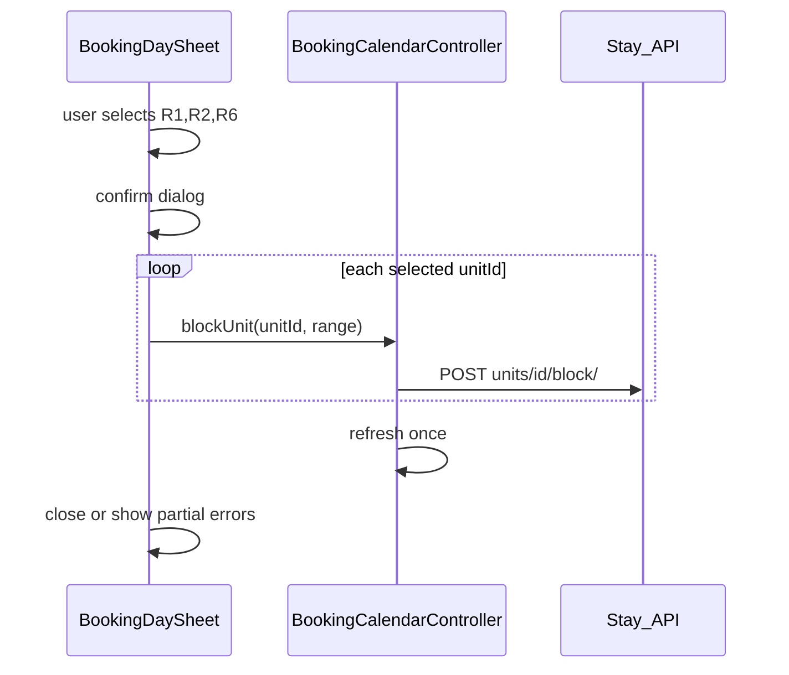

# Multi-select blokada soba u kalendaru

## Kontekst

Trenutno [`booking_day_bookings_sheet.dart`](c:\Users\avrca\Documents\Projects\Uzorita_all\uzorita_flutter\lib\features\reception\presentation\widgets\booking_day_bookings_sheet.dart) drži `int? _selectedUnitId` i `ChoiceChip` s `selected: _selectedUnitId == unit.roomId` — samo **jedna** soba (npr. R1 **ili** R2).

Backend [`POST /api/v1/reception/units/{unit_id}/block/`](c:\Users\avrca\Documents\Projects\Uzorita_all\stay.hr\backend\apps\api\reception_calendar_block_views.py) je po dizajnu **per unit** — nema potrebe za novim bulk endpointom; dovoljno je N poziva iz Fluttera.



---

## 1. Flutter — state i chips (multi-select)

**Datoteka:** [`booking_day_bookings_sheet.dart`](c:\Users\avrca\Documents\Projects\Uzorita_all\uzorita_flutter\lib\features\reception\presentation\widgets\booking_day_bookings_sheet.dart)

| Promjena | Detalj |
|----------|--------|
| State | `int? _selectedUnitId` → `Set<int> _selectedUnitIds = {}` |
| ChoiceChip `onSelected` | Ako `selected`: dodaj `unit.roomId` u set; inače ukloni |
| Prikaz raspona | Uvjet `if (_selectedUnitIds.isNotEmpty)` umjesto `!= null` |
| Lista slobodno/zauzeto | Prikazati **samo odabrane** sobe (jasnije uz multi-select), ili sve sobe s naglaskom na odabrane — preporuka: **samo odabrane** ispod chipova |
| Gumb Blokiraj | Disabled kad `_busy` ili nijedna odabrana soba nije slobodna za raspon (`isUnitFreeForRange` za svaku) |
| Label gumba | Npr. `Blokiraj (3)` kad su 3 odabrane — novi l10n ključ `calendarBlockUnitCount` |

---

## 2. Flutter — submit i controller

**Controller** [`booking_calendar_controller.dart`](c:\Users\avrca\Documents\Projects\Uzorita_all\uzorita_flutter\lib\features\reception\presentation\booking_calendar_controller.dart):

Dodati metodu:

```dart
Future<List<String>> blockUnits({
  required List<int> unitIds,
  required DateTime checkIn,
  required DateTime checkOut,
}) async
```

- Za svaki `unitId`: poziv `api.blockUnit(...)` u try/catch
- Pri grešci: zabilježi label sobe (R1, R2…) u listu `failed`
- **Jedan** `refresh()` na kraju (ne nakon svakog unita — danas `blockUnit` radi refresh svaki put, to usporava multi-block)
- Refaktor: postojeći `blockUnit` neka delegira na `blockUnits` s jednim ID-om, ili `blockUnits` interno koristi API bez refresha, pa jedan refresh vani

**Sheet `_submitBlock`:**

- Ako `_selectedUnitIds.isEmpty` → return
- Confirm dialog s **listom kodova** (npr. "R1, R2, R6") — novi string `calendarBlockConfirmMultiple`
- Poziv `blockUnits(...)`
- Ako `failed.isEmpty` → zatvori sheet
- Ako djelomičan uspjeh/neuspjeh → SnackBar: koje sobe nisu prošle; sheet ostaje otvoren da korisnik može ispraviti odabir

---

## 3. Lokalizacija

U [`tool/l10n/strings.json`](c:\Users\avrca\Documents\Projects\Uzorita_all\uzorita_flutter\tool\l10n\strings.json) (hr + en ručno):

| Ključ | Primjer (hr) |
|-------|----------------|
| `calendarBlockConfirmMultiple` | `Blokirati {unitCodes} od {checkIn} do {checkOut}?` |
| `calendarBlockUnitCount` | `Blokiraj ({count})` |
| `calendarBlockPartialFailed` | `Blokada nije uspjela za: {units}` |

Zatim: `python tool/gen_arb.py` + `flutter gen-l10n`.

---

## 4. Test

Proširiti [`booking_calendar_blocks_test.dart`](c:\Users\avrca\Documents\Projects\Uzorita_all\uzorita_flutter\test\features\reception\booking_calendar_blocks_test.dart) ili dodati widget/logic test: validacija da su sve odabrane sobe free prije submita (postojeća `isUnitFreeForRange`).

---

## Scope (izvan ovog zadatka)

- **Backend bulk POST** — nije potreban
- **Unblock multi** — ostaje po jednoj blokadi (kartica + Odblokiraj)

## Ručni test

1. Tap budući slobodan dan → odaberi R1 + R2 + R6 (više chipova istovremeno aktivno)
2. Blokiraj (3) → sve tri blokade u Smoobu, kalendar osvježen
3. Jedna soba zauzeta u rasponu → chip se može odabrati, gumb disabled ili greška samo za tu sobu pri partial fail
