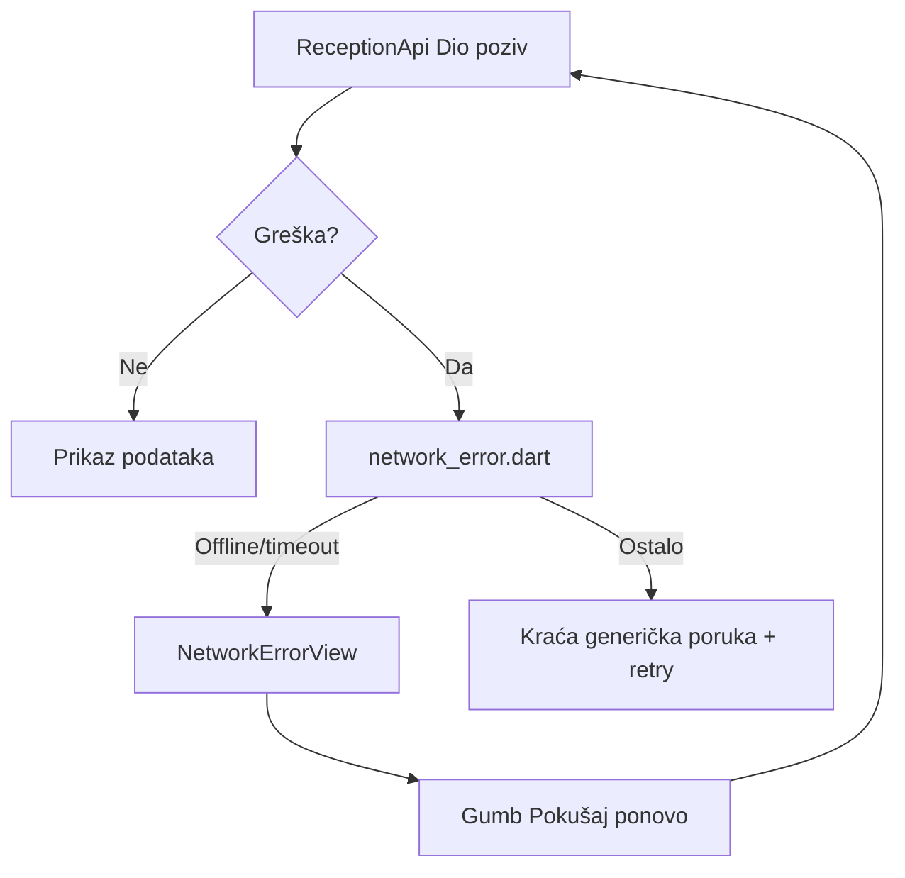

# Lijepi offline ekran za Hospira

## Problem

Na Timeline tabu (i ostalim ekranima) mrežna greška se prikazuje kao sirovi tekst:

```25:25:c:\Users\avrca\Documents\Projects\Uzorita_all\uzorita_flutter\lib\features\reception\presentation\timeline_screen.dart
error: (err, _) => Center(child: Text(context.l10n.errorGeneric(err.toString()))),
```

`errorGeneric` samo prefiksira `"Greška: "` ispred cijelog `DioException` / `SocketException` stringa — vidljivo na screenshotu.

## Pristup

**Bez novog paketa** (`connectivity_plus` nije potreban). Detekcija offline stanja ide kroz postojeće `DioException` tipove i `SocketException` u `error`/`cause` — to je upravo ono što se događa kad nema interneta (`connectionError`, `Failed host lookup`).



Fokus: **jasna poruka da aplikacija ne radi bez interneta**, ne offline cache niti stale podaci.

## 1. Helper za klasifikaciju grešaka

Nova datoteka: [`lib/core/network/network_error.dart`](c:\Users\avrca\Documents\Projects\Uzorita_all\uzorita_flutter\lib\core\network\network_error.dart)

- `bool isNetworkConnectivityError(Object err)` — `true` za:
  - `DioException` s tipom `connectionError`, `connectionTimeout`, `sendTimeout`, `receiveTimeout`, `unknown` (kad je uzrok `SocketException`)
  - direktni `SocketException`
  - poruke koje sadrže `Failed host lookup`, `Network is unreachable`
- `String userFacingNetworkMessage(AppLocalizations l10n, Object err)` — vraća lokalizirani string; za ostale greške kraći fallback (npr. `err is DioException ? err.message : null`) bez cijelog stack tracea

## 2. Zajednički UI widget

Nova datoteka: [`lib/core/widgets/network_error_view.dart`](c:\Users\avrca\Documents\Projects\Uzorita_all\uzorita_flutter\lib\core\widgets\network_error_view.dart)

Vizualno usklađen s postojećim `_P1Placeholder` u [`statistics_screen.dart`](c:\Users\avrca\Documents\Projects\Uzorita_all\uzorita_flutter\lib\features\reception\presentation\statistics_screen.dart):

- centriran layout, padding 32
- ikona `Icons.wifi_off_outlined` (56px, `colorScheme.outline`)
- **naslov** (`titleMedium`) — npr. „Nema internetske veze”
- **opis** (`bodyMedium`, `onSurfaceVariant`) — npr. „Aplikacija zahtijeva internetsku vezu. Provjerite Wi‑Fi ili mobilne podatke.”
- `FilledButton` s postojećim `l10n.actionRetry` ako je proslijeđen `onRetry`

API widgeta:

```dart
NetworkErrorView({
  required Object error,
  VoidCallback? onRetry,
})
```

Unutra: ako `isNetworkConnectivityError(error)` → offline copy; inače generička mrežna poruka (bez `err.toString()` dumpa).

## 3. Lokalizacija

U [`tool/l10n/strings.json`](c:\Users\avrca\Documents\Projects\Uzorita_all\uzorita_flutter\tool\l10n\strings.json) dodati ključeve (hr + en ručno; es/it/fr/de prevesti s EN):

| Ključ | HR primjer |
|-------|------------|
| `networkOfflineTitle` | Nema internetske veze |
| `networkOfflineMessage` | Aplikacija zahtijeva internetsku vezu za rad. Provjerite Wi‑Fi ili mobilne podatke i pokušajte ponovo. |
| `networkErrorGeneric` | Došlo je do greške pri povezivanju. Pokušajte ponovo. |

Zatim: `python tool/gen_arb.py` → `flutter gen-l10n`.

## 4. Zamjena error grana na ekranima

Zamijeniti `Center(child: Text(l10n.errorGeneric(err.toString())))` s `NetworkErrorView` + retry:

| Ekran | Datoteka | Retry akcija |
|-------|----------|--------------|
| Timeline | [`timeline_screen.dart`](c:\Users\avrca\Documents\Projects\Uzorita_all\uzorita_flutter\lib\features\reception\presentation\timeline_screen.dart) | `timelineControllerProvider.notifier.refresh()` |
| Kalendar | [`booking_calendar_screen.dart`](c:\Users\avrca\Documents\Projects\Uzorita_all\uzorita_flutter\lib\features\reception\presentation\booking_calendar_screen.dart) | `bookingCalendarControllerProvider.notifier.refresh()` |
| Statistika | [`statistics_screen.dart`](c:\Users\avrca\Documents\Projects\Uzorita_all\uzorita_flutter\lib\features\reception\presentation\statistics_screen.dart) | postojeći `invalidate` — samo zamijeniti Text s widgetom |
| Detalj rezervacije | [`reservation_detail_screen.dart`](c:\Users\avrca\Documents\Projects\Uzorita_all\uzorita_flutter\lib\features\reception\presentation\reservation_detail_screen.dart) | `reservationDetailControllerProvider(...).notifier.refresh()` |
| Detalj gosta | [`guest_detail_screen.dart`](c:\Users\avrca\Documents\Projects\Uzorita_all\uzorita_flutter\lib\features\reception\presentation\guest_detail_screen.dart) | odgovarajući invalidate/refresh |

`P1UnavailableException` grane na Statistici/Kalendaru ostaju nepromijenjene.

## 5. Login / Postavke (manji dodatak)

Proširiti [`auth_controller.dart`](c:\Users\avrca\Documents\Projects\Uzorita_all\uzorita_flutter\lib\features\auth\presentation\auth_controller.dart) `errorMessage()` da za `isNetworkConnectivityError` vrati `networkOfflineMessage` umjesto sirovog `err.message`. Login već koristi `errorMessage()` — korisnik neće vidjeti Dio dump ni pri prvom spajanju.

## 6. Test

Nova datoteka: `test/core/network/network_error_test.dart` — par unit testova za `isNetworkConnectivityError` (connectionError Dio, SocketException, obični Exception → false).

## Što namjerno ne radimo (manji scope)

- **Bez `connectivity_plus`** — ne dodajemo dependency; Dio greške su dovoljne za prikaz iz screenshot-a.
- **Bez offline cache-a** — korisnik traži jasnu poruku da app ne radi bez interneta, ne stale timeline.
- **Bez globalnog bannera** u shellu — dovoljno je full-screen error na svakom tabu s retry gumbom.

## Test plan (ručno)

1. Uključiti airplane mode na fizičkom uređaju / emulatoru.
2. Otvoriti Timeline → očekivano: ikona wifi_off, HR poruka, gumb „Pokušaj ponovo” (ne DioException tekst).
3. Ponoviti na Kalendar i Statistika tabovima.
4. Uključiti internet → „Pokušaj ponovo” → podaci se učitavaju.
5. Promijeniti jezik uređaja (EN) → isti ekran na engleskom.
