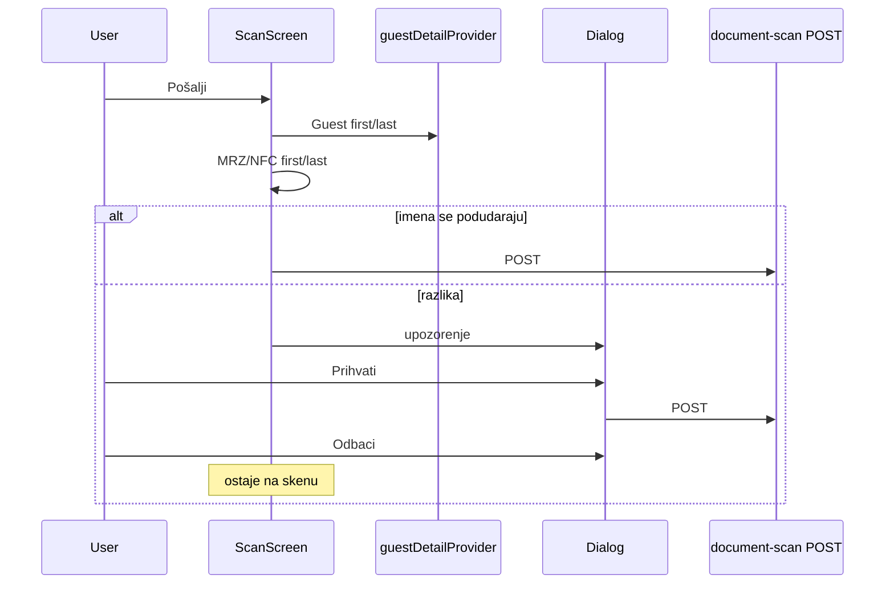

# Provjera imena pri Pošalji (skener)

## Kontekst

- [`scan_screen.dart`](c:\Users\avrca\Documents\Projects\Uzorita_all\uzorita_flutter\lib\features\scan\presentation\scan_screen.dart) — `_submit()` (L380) odmah šalje `documentScan()` bez provjere imena.
- Ime sa skena već se izvodi u [`buildDocumentScanPayload`](c:\Users\avrca\Documents\Projects\Uzorita_all\uzorita_flutter\lib\features\scan\document_scan_payload.dart): `first = nfc?.firstName ?? mrz.givenNames`, `last = nfc?.lastName ?? mrz.surnames`.
- Referentno ime za usporedbu: gost na ruti skena — [`Guest`](c:\Users\avrca\Documents\Projects\Uzorita_all\uzorita_flutter\lib\features\reception\domain\guest.dart) `firstName` / `lastName` preko postojećeg [`guestDetailProvider`](c:\Users\avrca\Documents\Projects\Uzorita_all\uzorita_flutter\lib\features\reception\presentation\guest_detail_controller.dart) (već se sluša u `build` za tip dokumenta).

---

## 1. Zajednička logika imena

**Nova datoteka:** `lib/features/scan/guest_name_match.dart` (ili `lib/core/utils/person_name_match.dart`)

- `({String first, String last}) scanNamesFromMrz({required MRZResult mrz, NFCResponse? nfc})` — ista pravila kao u payloadu.
- `bool guestNamesMatchReservation({required String guestFirst, required String guestLast, required String scanFirst, required String scanLast})`:
  - normalizacija: trim, višestruki razmaci, `toUpperCase()`, uklanjanje dijakritika (npr. `VREČAN` vs `VRECAN` preko postojećeg pristupa ili jednostavno `package:intl` / ručna mapa za hr znakove).
  - usporedba punog imena: `"$first $last"` normalizirano.
  - **Ako na gostu nema imena i prezimena** (oba prazna nakon trim) → preskoči provjeru (`true`, šalji bez dijaloga).
  - **Ako na skenu nema imena** → također preskoči (edge case).

Opcionalno: usporedba kao skup riječi (isti tokeni bez obzira na redoslijed) — korisno ako MRZ ponekad invertira redoslijed; može ostati u v1 kao točan match normaliziranog stringa.

---

## 2. Refaktor `_submit` u scan_screen

**Datoteka:** [`scan_screen.dart`](c:\Users\avrca\Documents\Projects\Uzorita_all\uzorita_flutter\lib\features\scan\presentation\scan_screen.dart)

1. Izdvojiti postojeći API poziv u `Future<void> _sendDocumentScan(...)` (payload build + POST + navigacija + SnackBar).
2. U `_submit()`:
   - nakon `_canSubmit` provjere, dohvatiti gosta: `ref.read(guestDetailProvider(args).future)` (ili `value` ako je već u cacheu).
   - izračunati scan first/last iz `_mrz` / `_nfc`.
   - ako `!guestNamesMatchReservation(...)` → `final accepted = await _confirmNameMismatch(context, guest: ..., scanFirst: ..., scanLast: ...)`;
     - `false` (Odbaci) → `return`;
     - `true` (Prihvati) → nastavi.
   - pozovi `_sendDocumentScan()`.

3. **`_confirmNameMismatch`** — `showDialog<bool>`:
   - **Naslov:** „Ime se ne podudara”
   - **Sadržaj:** kratko objašnjenje + dvije linije npr.  
     „Na rezervaciji: {guestFirst} {guestLast}”  
     „Na dokumentu: {scanFirst} {scanLast}”
   - **Akcije:** `TextButton` „Odbaci” → `pop(false)`, `FilledButton` „Prihvati” → `pop(true)`.

Nema backend promjena — document-scan i dalje upisuje ime s dokumenta; upozorenje je samo UX za recepciju.

---

## 3. Testovi (opcionalno, preporučeno)

**Datoteka:** `test/features/scan/guest_name_match_test.dart`

- `ANTE` + `VREAN` vs `Ante` + `Vrean` → match.
- `ANTE` + `VREAN` vs `MARIO` + `VREAN` → no match.
- prazan gost → match (preskočeno).

---

## Test plan (ručno)

1. Gost **ANTE VREAN** na kartici, sken s istim imenom → Pošalji ide odmah, bez dijaloga.
2. Gost **Vincent Bourgois**, sken **ANTE VREAN** → dijalog; **Odbaci** → ostaje na skenu, nema POST-a.
3. Isti kao 2, **Prihvati** → POST uspije, povratak na gost.
4. NFC uspješan (ime s čipa) — usporedba koristi NFC ime, ne samo MRZ.
