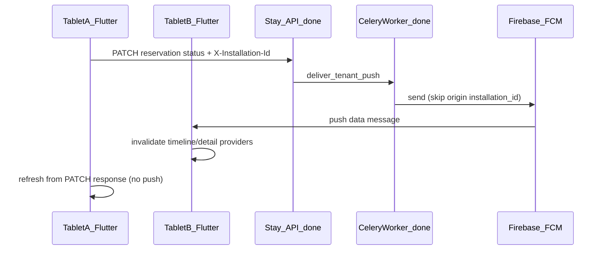

# Push notifikacije i live sync — implementacijski plan

## Status

| Sloj | Status |
|------|--------|
| **Stay.hr backend** | **Gotovo** — `DeviceRegistration`, register/PATCH API, `X-Installation-Id`, `emit_tenant_event`, Celery FCM |
| **Firebase projekt** | **Gotovo** — projekt `hospira-fc0dc`, Android + iOS app registrirani |
| **Flutter client** | **Preostaje** — svi koraci u ovom planu |

## Kontekst

- Flutter danas: **pull-to-refresh** + ručni `refresh()` u Riverpod kontrolerima; auth preko **Stay device tokena** ([`device_token_store.dart`](c:\Users\avrca\Documents\Projects\Uzorita_all\uzorita_flutter\lib\core\auth\device_token_store.dart)).
- Više tableta dijeli **isti Bearer token** (`ApiApplication`) — backend koristi odvojeni **`installation_id`** po fizičkom uređaju (`X-Installation-Id` header).
- Backend API (već deployan):
  - `POST /api/v1/reception/devices/register/`
  - `PATCH /api/v1/reception/devices/me/`



---

## Firebase config datoteke (postoje)

Korisnik je dodao config u root `uzorita_flutter/` (još **nisu** na standardnim Gradle/Xcode lokacijama):

| Platforma | Izvorna datoteka | Cilj pri implementaciji |
|-----------|------------------|-------------------------|
| Android | [`google-services (hospira).json`](c:\Users\avrca\Documents\Projects\Uzorita_all\uzorita_flutter\google-services%20(hospira).json) | [`android/app/google-services.json`](c:\Users\avrca\Documents\Projects\Uzorita_all\uzorita_flutter\android\app\google-services.json) |
| iOS | [`GoogleService-Info (hospira).plist`](c:\Users\avrca\Documents\Projects\Uzorita_all\uzorita_flutter\GoogleService-Info%20(hospira).plist) | [`ios/Runner/GoogleService-Info.plist`](c:\Users\avrca\Documents\Projects\Uzorita_all\uzorita_flutter\ios\Runner\GoogleService-Info.plist) |

**Firebase projekt:** `hospira-fc0dc` (project number `36948128139`)  
**Package / bundle:** `hr.finestar.hospira`

**Implementacijski korak:** kopirati/preimenovati datoteke na standardne putanje (FlutterFire očekuje točno ta imena). Izvorne datoteke s `(hospira)` u imenu mogu ostati u rootu kao backup ili se uklone nakon kopiranja.

**Backend FCM credentials** (service account JSON na serveru) — korisnik potvrđuje da je riješeno; Flutter ne treba service account.

---

## Backend referenca (gotovo — za Flutter integraciju)

### Register API

**POST** `/api/v1/reception/devices/register/` (`reception:write`)

```json
{
  "installation_id": "uuid-v4",
  "fcm_token": "...",
  "platform": "android",
  "app_version": "1.0.6",
  "preferences": { ... }
}
```

Header: `X-Installation-Id` mora odgovarati `installation_id` u body-ju.

**PATCH** `/api/v1/reception/devices/me/` — ažuriranje `preferences` i/ili `fcm_token`.

### Push payload (FCM data message)

Backend šalje **data message** (ne notification payload):

```json
{
  "type": "reservation.status_changed",
  "tenant_slug": "uzorita",
  "reservation_id": "12345",
  "guest_id": "",
  "entity_id": "12345",
  "origin_installation_id": "abc-uuid",
  "summary": "Rezervacija #5307026805 → checked_in"
}
```

Event tipovi: `reservation.status_changed`, `reservation.created`, `guest.added`, `evisitor.submitted`, `document.scanned`.

### Default preferences (Flutter default mora odgovarati backendu)

| Ključ | Default |
|-------|---------|
| `reservation_created` | ON |
| `reservation_status` | ON |
| `guest_added` | ON |
| `document_scanned` | OFF |
| `evisitor_success` | ON |
| `evisitor_failed` | ON |
| `guest_message` | ON |
| `sync_errors` | OFF |

---

## Korak 1 — `installation_id` u Flutteru

**Cilj:** stabilni UUID po instalaciji, header na svim HTTP pozivima (backend već očekuje `X-Installation-Id`).

| Datoteka | Promjena |
|----------|----------|
| Novi [`lib/core/auth/installation_id_store.dart`](c:\Users\avrca\Documents\Projects\Uzorita_all\uzorita_flutter\lib\core\auth\installation_id_store.dart) | `flutter_secure_storage`, ključ `hospira_installation_id`; `getOrCreate()` generira UUID v4 |
| [`lib/core/network/dio_providers.dart`](c:\Users\avrca\Documents\Projects\Uzorita_all\uzorita_flutter\lib\core\network\dio_providers.dart) | U interceptoru dodaj `X-Installation-Id: <uuid>` na svaki request |
| [`lib/features/scan/presentation/scan_screen.dart`](c:\Users\avrca\Documents\Projects\Uzorita_all\uzorita_flutter\lib\features\scan\presentation\scan_screen.dart) | Zamijeni `_deviceLabel` s `installation_id` u `document_scan_payload` (`uredaj_id`) |
| Test | Unit test: prvi poziv kreira UUID, drugi vraća isti |

**Napomena:** `installation_id` ≠ Stay Bearer token; ne briše se pri logout.

---

## Korak 2 — `firebase_messaging` + FCM registracija (Flutter)

### Dependencies ([`pubspec.yaml`](c:\Users\avrca\Documents\Projects\Uzorita_all\uzorita_flutter\pubspec.yaml))

- `firebase_core`
- `firebase_messaging`
- `flutter_local_notifications` (foreground + tap handling)

### Android

1. Kopirati `google-services (hospira).json` → `android/app/google-services.json`
2. [`android/settings.gradle.kts`](c:\Users\avrca\Documents\Projects\Uzorita_all\uzorita_flutter\android\settings.gradle.kts) + [`android/app/build.gradle.kts`](c:\Users\avrca\Documents\Projects\Uzorita_all\uzorita_flutter\android\app\build.gradle.kts): Google Services plugin
3. [`AndroidManifest.xml`](c:\Users\avrca\Documents\Projects\Uzorita_all\uzorita_flutter\android\app\src\main\AndroidManifest.xml): `POST_NOTIFICATIONS` (API 33+)

### iOS

1. Kopirati `GoogleService-Info (hospira).plist` → `ios/Runner/GoogleService-Info.plist`
2. [`AppDelegate.swift`](c:\Users\avrca\Documents\Projects\Uzorita_all\uzorita_flutter\ios\Runner\AppDelegate.swift): Firebase init + notification delegate
3. Xcode: Push Notifications capability, background mode `remote-notification`

### Flutter servis

Novi modul `lib/core/notifications/`:

| Datoteka | Uloga |
|----------|-------|
| `notification_service.dart` | init Firebase, request permission, `onTokenRefresh` → register API |
| `push_payload.dart` | parse backend data message polja |
| `reception_devices_api.dart` | `registerDevice()`, `updatePreferences()` |

**Registracija FCM tokena** (poziv na backend register API):
- Nakon uspješnog `authController.login()` / app start s validnim Stay tokenom
- Na `onTokenRefresh`
- Nakon promjene preferenci

[`main.dart`](c:\Users\avrca\Documents\Projects\Uzorita_all\uzorita_flutter\lib\main.dart): `Firebase.initializeApp()` + background handler (`@pragma('vm:entry-point')`).

---

## Korak 3 — Notification handler → invalidate providere

Novi [`lib/core/notifications/push_invalidation.dart`](c:\Users\avrca\Documents\Projects\Uzorita_all\uzorita_flutter\lib\core\notifications\push_invalidation.dart):

```dart
void handlePushEvent(WidgetRef ref, PushPayload event) {
  if (event.originInstallationId == myInstallationId) return;
  switch (event.type) {
    case 'reservation.status_changed':
    case 'reservation.created':
      ref.invalidate(timelineControllerProvider);
      if (event.reservationId != null) {
        ref.invalidate(reservationDetailControllerProvider(event.reservationId!));
      }
    case 'guest.added':
    case 'evisitor.submitted':
    case 'document.scanned':
      // reservationDetail + guestDetail family
    ...
  }
}
```

**Provideri za invalidaciju:**

- [`timelineControllerProvider`](c:\Users\avrca\Documents\Projects\Uzorita_all\uzorita_flutter\lib\features\reception\presentation\timeline_controller.dart)
- [`reservationDetailControllerProvider`](c:\Users\avrca\Documents\Projects\Uzorita_all\uzorita_flutter\lib\features\reception\presentation\reservation_detail_controller.dart) (family)
- `guestDetailProvider`, `guestMessagesControllerProvider`, `bookingCalendarControllerProvider`, `invalidateGuestFacePhoto`

**Foreground vs background:**
- **Foreground:** data message → `handlePushEvent` + lokalna notifikacija ako preference ON
- **Background:** top-level handler; pri resume invalidira
- **Tap:** deep link `context.go('/reservations/$id')` ([`app.dart`](c:\Users\avrca\Documents\Projects\Uzorita_all\uzorita_flutter\lib\app\app.dart))

**Riverpod iz background handlera:** `ProviderContainer` ref u [`main.dart`](c:\Users\avrca\Documents\Projects\Uzorita_all\uzorita_flutter\lib\main.dart) (`globalContainer` pattern).

---

## Korak 4 — Postavke preferenci (lokalno + sync)

Proširiti [`settings_screen.dart`](c:\Users\avrca\Documents\Projects\Uzorita_all\uzorita_flutter\lib\features\auth\presentation\settings_screen.dart) sekcijom **Obavijesti**:

| Grupa | Toggle | Default |
|-------|--------|---------|
| Rezervacije | Nove / Promjena statusa | ON / ON |
| Gosti | Novi gost / Sken dokumenta | ON / OFF |
| eVisitor | Uspjeh / Greška | ON / ON |
| Poruke | Nova poruka gosta | ON (disabled „uskoro” dok nije na Stay API) |
| Sustav | Sync greške | OFF |

**Spremanje:**
- Lokalno: `SharedPreferences` JSON (`notification_preferences`)
- Sync: `PATCH /api/v1/reception/devices/me/`
- Pri loginu: merge server → lokalno (server wins za nepoznate ključeve)

---

## Test plan (Flutter fokus)

**Unit / widget:**
- `installation_id` persistencija
- Push payload parsing + invalidation mapping
- Settings toggles → PATCH sync (mock dio)

**Manual (2 tableta, isti Bearer token):**
1. Tablet A: promjena statusa → Tablet B: timeline se osvježi + notifikacija
2. Tablet A: ne dobiva push za vlastitu akciju
3. Postavke: isključi „Promjena statusa” → nema push na B
4. Logout/login: FCM re-register na backend

---

## Redoslijed PR-ova (samo Flutter)

1. **PR1:** `installation_id` + Dio header + scan payload
2. **PR2:** Firebase wiring (kopija config datoteka + Gradle/Xcode) + `NotificationService` + devices API client
3. **PR3:** push handler + invalidation + deep links
4. **PR4:** settings UI preferenci + sync

PR2 ovisi o PR1 (register API treba `installation_id`).

---

## Svjesno izvan scope-a (kasnije)

- WebSocket foreground sync (backend Redis pub/sub već pripremljen)
- iOS TestFlight push cert provjera u produkciji
- Guest messages push (kad Stay API bude live)
