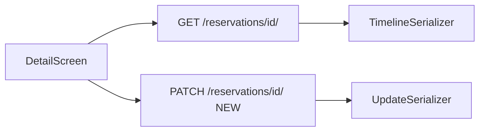

# Radni ekran detalja rezervacije

## Stanje danas

[`ReservationDetailScreen`](c:\Users\avrca\Documents\Projects\Uzorita_all\uzorita_flutter\lib\features\reception\presentation\reservation_detail_screen.dart) prikazuje samo:
- `externalId • roomName`
- ISO datume + sirovi `status` (npr. `expected`)
- listu gostiju kao jednostavne `Card` + `ListTile`

[`ReservationDetail`](c:\Users\avrca\Documents\Projects\Uzorita_all\uzorita_flutter\lib\features\reception\domain\reservation_detail.dart) parsira ~10 polja, iako **GET** [`/api/reception/reservations/<id>/`](c:\Users\avrca\Documents\Projects\Uzorita_all\uzorita-rooms-code\backend\app\reception\api_urls.py) već koristi [`ReservationTimelineSerializer`](c:\Users\avrca\Documents\Projects\Uzorita_all\uzorita-rooms-code\backend\app\reception\serializers.py) s `units[]`, `persons_count`, `payment_status`, `booker_*`, `notes`, itd.

**Nema PATCH-a za rezervaciju** — [`ReservationDetailView`](c:\Users\avrca\Documents\Projects\Uzorita_all\uzorita-rooms-code\backend\app\reception\views.py) je samo `RetrieveAPIView`; status se ne može mijenjati iz aplikacije.



---

## 1. Backend — PATCH statusa

U [`views.py`](c:\Users\avrca\Documents\Projects\Uzorita_all\uzorita-rooms-code\backend\app\reception\views.py):

- Zamijeniti `ReservationDetailView` s **`RetrieveUpdateAPIView`**
- `get_serializer_class()`: `ReservationUpdateSerializer` za PATCH/PUT, `ReservationTimelineSerializer` za GET

U [`serializers.py`](c:\Users\avrca\Documents\Projects\Uzorita_all\uzorita-rooms-code\backend\app\reception\serializers.py):

```python
class ReservationUpdateSerializer(serializers.ModelSerializer):
    class Meta:
        model = Reservation
        fields = ("status",)  # opcionalno i "notes" ako želimo uređivati napomenu na recepciji
```

- Validacija: samo vrijednosti iz [`ReservationStatus`](c:\Users\avrca\Documents\Projects\Uzorita_all\uzorita-rooms-code\backend\app\reception\models.py) (`expected`, `checked_in`, `checked_out`, `canceled`)
- Odgovor PATCH-a: puni `ReservationTimelineSerializer` (isti oblik kao GET)

Test u [`tests.py`](c:\Users\avrca\Documents\Projects\Uzorita_all\uzorita-rooms-code\backend\app\reception\tests.py): autentificirani PATCH mijenja status; nevaljana vrijednost → 400.

---

## 2. Flutter — domena i API

### Proširiti [`reservation_detail.dart`](c:\Users\avrca\Documents\Projects\Uzorita_all\uzorita_flutter\lib\features\reception\domain\reservation_detail.dart)

Parsirati sva relevantna polja iz JSON-a (uz postojeće goste):

| Sekcija UI | Polja |
|------------|--------|
| Sobe | `units[]`, `room_codes`, `room_name`, `effective_units_count` |
| Gosti (brojevi) | `persons_count`, `adults_count`, `children_count`, `children_ages` |
| Plaćanje | `total_amount`, `currency`, `payment_status`, `payment_status_key`, `payment_provider`, `commission_percent`, `commission_amount` |
| Booking | `booking_status`, `booked_at`, `import_source`, `nights_count` |
| Kontakt | `booker_name`, `booker_phone`, `booker_address`, `booker_country` |
| Ostalo | `notes`, `travel_purpose`, `booking_device` |

Reuse [`ReservationUnit`](c:\Users\avrca\Documents\Projects\Uzorita_all\uzorita_flutter\lib\features\reception\domain\reservation_unit.dart) ili zaseban `ReservationUnitDetail` s `amount`.

### [`reception_api.dart`](c:\Users\avrca\Documents\Projects\Uzorita_all\uzorita_flutter\lib\features\reception\data\reception_api.dart)

```dart
Future<Map<String, dynamic>> updateReservation(int id, {required String status})
```

→ `PATCH /api/reception/reservations/$id/` s `{"status": "checked_in"}`.

### Controller

Zamijeniti `FutureProvider` s **`AsyncNotifier`** (npr. `reservationDetailControllerProvider`) koji:
- učitava detalj
- nudi `updateStatus(String status)` → PATCH, refresh, `invalidate(timelineControllerProvider)`

---

## 3. Flutter — UI redizajn (moderno, radno)

Nova datoteka npr. [`reservation_detail_screen.dart`](c:\Users\avrca\Documents\Projects\Uzorita_all\uzorita_flutter\lib\features\reception\presentation\reservation_detail_screen.dart) + izdvojeni widgeti u `reservation_detail/`:

### Zaglavlje
- **Hero kartica**: booking ID (`external_id`), ime glavnog gosta + zastava (reuse logike iz timeline tile)
- **Status — interaktivno**: red `FilterChip` / `ChoiceChip` (4 operativna statusa), hrvatski labeli iz [`timeline_reservation_tile.dart`](c:\Users\avrca\Documents\Projects\Uzorita_all\uzorita_flutter\lib\features\reception\presentation\timeline_reservation_tile.dart) (`timelineStatusTooltip`, boje ikona)
- Tijekom PATCH-a: disabled chipovi + mali `LinearProgressIndicator`
- SnackBar na uspjeh/grešku

### Sekcije (`_DetailSection` kartice s naslovom)
1. **Boravak** — datumi preko [`ReservationDateFormat`](c:\Users\avrca\Documents\Projects\Uzorita_all\uzorita_flutter\lib\core\utils\reservation_date_format.dart), `nights_count`, `booking_status` (Booking kanal)
2. **Sobe** — lista jedinica: `room_name`, `room_code` (ako postoji), iznos po sobi; ako više soba, bez jednog dugog stringa u naslovu
3. **Putnici** — ikone + brojevi (`persons`, `adults`, `children`, dobi djece)
4. **Plaćanje** — ukupno, provizija, status plaćanja (ikona + puni tekst), način/provider
5. **Kontakt** — booker ime, telefon (tap → `tel:`), adresa, država
6. **Napomene** — `notes` (read-only prikaz; prazno = „Nema napomene“)
7. **Gosti** — poboljšane kartice: ime, NAT, dokument, oznaka glavnog; tap → guest detail; **FAB ili trailing ikona** „Skeniraj“ (kao na guest screen)

### Vizualni stil
- Material 3: `Card` + `surfaceContainerHighest`, konzistentno s timelineom (seed `#BDA16A`)
- `_InfoRow` helper: label lijevo / vrijednost desno, prazna polja se ne prikazuju
- Pull-to-refresh ostaje

### Navigacija
- Nakon promjene statusa: `ref.invalidate(timelineControllerProvider)` da se timeline osvježi pri povratku

---

## 4. Dijeljeni helperi (izbjegavanje duplikacije)

Izvući u npr. [`lib/features/reception/presentation/reservation_status.dart`](c:\Users\avrca\Documents\Projects\Uzorita_all\uzorita_flutter\lib\features\reception\presentation\reservation_status.dart):
- `reservationStatusLabelHr`, `reservationStatusIcon`, `reservationStatusColor`
- Timeline tile može kasnije importati isti modul (opcionalno u istom PR-u)

---

## Datoteke (sažetak)

| Repo | Promjene |
|------|----------|
| **uzorita-rooms-code** | `serializers.py` (UpdateSerializer), `views.py` (RetrieveUpdate), `tests.py` |
| **uzorita_flutter** | `reservation_detail.dart`, `reception_api.dart`, `reservation_detail_controller.dart`, `reservation_detail_screen.dart` (+ mali widgeti), opcionalno `reservation_status.dart` |

---

## Test plan (ručno)

1. Otvori rezervaciju s 2 sobe — vidi listu jedinica, ne samo spojeni `room_name`.
2. Promijeni status npr. expected → checked_in — chip ostaje odabran, timeline se osvježi.
3. Rezervacija s djecom — prikaz broja i dobi.
4. Plaćanje Booking — ikona + puni `payment_status` tekst.
5. Tap na gosta → guest detail; scan ikona radi.
6. Povratak na timeline — status na kartici odgovara novom.
