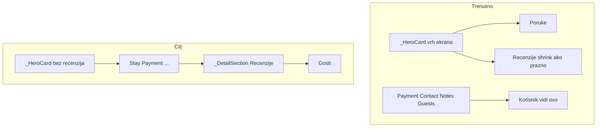

# Recenzije na detalju rezervacije — vidljiva kartica

## Dijagnoza

| Uzrok | Detalj |
|-------|--------|
| **Loša pozicija** | [`ReservationReviewsSection`](c:\Users\avrca\Documents\Projects\Uzorita_all\uzorita_flutter\lib\features\reception\presentation\widgets\reservation_reviews_section.dart) je unutar [`_HeroCard`](c:\Users\avrca\Documents\Projects\Uzorita_all\uzorita_flutter\lib\features\reception\presentation\reservation_detail_screen.dart) (ispod statusa/poruka), **ne** uz Notes/Guests kartice koje vidiš na screenshotu |
| **Potpuno skrivena** | Widget vraća `SizedBox.shrink()` za `loading`, `error` i `reviews.isEmpty` — nema UI-a |
| **Backend bez relinka** | [`list_reviews_for_property`](c:\Users\avrca\Documents\Projects\Uzorita_all\stay.hr\backend\apps\integrations\channex\review_service.py) zove `relink_unlinked_channex_reviews`, ali [`list_reviews_for_reservation`](c:\Users\avrca\Documents\Projects\Uzorita_all\stay.hr\backend\apps\integrations\channex\review_service.py) **ne** — direktan ulaz na rezervaciju #782 može vratiti praznu listu iako inbox relink već postoji |
| **Nema refresha** | `RefreshIndicator` na detalju osvježava samo detail + poruke, ne [`reservationReviewsControllerProvider`](c:\Users\avrca\Documents\Projects\Uzorita_all\uzorita_flutter\lib\features\reception\presentation\guest_reviews_controller.dart) |



---

## 1. Backend — relink pri GET recenzija rezervacije

Datoteka: [`review_service.py`](c:\Users\avrca\Documents\Projects\Uzorita_all\stay.hr\backend\apps\integrations\channex\review_service.py)

Na početak `list_reviews_for_reservation`:

```python
relink_unlinked_channex_reviews(reservation.tenant)
```

Test u [`test_reception_reviews.py`](c:\Users\avrca\Documents\Projects\Uzorita_all\stay.hr\backend\apps\api\tests\test_reception_reviews.py): unlinked review s `ota_reservation_id` = `booking_code` rezervacije → `GET /reservations/{id}/reviews/` vraća recenziju i `reservation_id` u bazi.

---

## 2. Flutter — premjestiti sekciju u glavni scroll

Datoteka: [`reservation_detail_screen.dart`](c:\Users\avrca\Documents\Projects\Uzorita_all\uzorita_flutter\lib\features\reception\presentation\reservation_detail_screen.dart)

- **Ukloniti** `ReservationReviewsSection` iz `_HeroCard` (ostaju status + poruke)
- **Dodati** u `ListView` children, npr. između Notes i Guests:

```dart
_DetailSection(
  title: l10n.reviewsSummaryTitle,
  child: ReservationReviewsSection(
    reservationId: widget.reservationId,
    importSource: d.importSource,
    embedded: true, // bez duplog naslova
  ),
),
```

- `RefreshIndicator.onRefresh`: dodati `reservationReviewsControllerProvider(reservationId).notifier.refresh()`

---

## 3. Flutter — uvijek vidljiva kartica s recenzijama

Datoteka: [`reservation_reviews_section.dart`](c:\Users\avrca\Documents\Projects\Uzorita_all\uzorita_flutter\lib\features\reception\presentation\widgets\reservation_reviews_section.dart)

| Stanje | Ponašanje |
|--------|-----------|
| `importSource != channex` | `SizedBox.shrink()` (nepromijenjeno) |
| `loading` | mali `CircularProgressIndicator` ili „Učitavanje…” unutar sekcije |
| `error` | kratka poruka greške |
| `reviews.isEmpty` | tekst npr. `reviewsNoReviewsForReservation` — **kartica ostaje vidljiva** |
| `data` | lista `_ReviewListTile` (tap → `/reservations/:id/reviews/:reviewId`) |

Parametar `embedded: true` — kad je unutar `_DetailSection`, ne renderirati vlastiti header red s ikonom (naslov već daje parent).

---

## 4. Lokalizacija

Novi ključ u [`app_hr.arb`](c:\Users\avrca\Documents\Projects\Uzorita_all\uzorita_flutter\lib\l10n\app_hr.arb) / [`app_en.arb`](c:\Users\avrca\Documents\Projects\Uzorita_all\uzorita_flutter\lib\l10n\app_en.arb):

- `reviewsNoReviewsForReservation` — „Nema recenzija za ovu rezervaciju.” / “No reviews for this reservation.”

`flutter gen-l10n`

---

## Ručni test

1. Deploy backend relink fix
2. Hot restart app
3. Otvori rezervaciju #782 (Channex) → scroll do **Recenzije** kartice (između Bilješke i Gosti)
4. Ako postoji povezana recenzija → stavka s OTA ocjenom; tap → ekran odgovora
5. Pull-to-refresh → lista se osvježi
6. Rezervacija bez recenzija → kartica s porukom „Nema recenzija…”, ne prazan ekran
