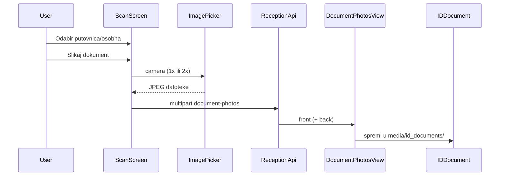

# Slikaj dokument — faza 1 (spremanje slika)

## Kontekst

- Ulaz ostaje **Gosti → Sken** → [`ScanScreen`](c:\Users\avrca\Documents\Projects\Uzorita_all\uzorita_flutter\lib\features\scan\presentation\scan_screen.dart) (ruta `/reservations/:id/guests/:guestId/scan`).
- Odabir tipa već postoji: `SegmentedButton<ScanDocumentKind>` + [`scan_document_kind.dart`](c:\Users\avrca\Documents\Projects\Uzorita_all\uzorita_flutter\lib\features\scan\scan_document_kind.dart) (`passport` / `national_id` preko `payloadValue`).
- MRZ flow i dalje ide na `POST .../document-scan/` (JSON) — **ne dirati** taj endpoint za slike.
- Paddle `/api/v1/scan/` i `cunning_document_scanner` **ne koristiti** u mobilnoj app (AGENTS.md).



---

## 1. Backend (uzorita-rooms-code)

### 1.1 Model i migracija

U [`backend/app/reception/models.py`](c:\Users\avrca\Documents\Projects\Uzorita_all\uzorita-rooms-code\backend\app\reception\models.py), na `IDDocument`:

```python
front_photo = models.ImageField(upload_to="id_documents/front/", null=True, blank=True)
back_photo = models.ImageField(upload_to="id_documents/back/", null=True, blank=True)
```

Nova migracija `0020_iddocument_front_back_photos.py` (ili sljedeći broj).

### 1.2 Novi view + URL

**Endpoint:** `POST /api/reception/reservations/<reservation_id>/guests/<guest_id>/document-photos/`

- `permission_classes = [IsAuthenticated]`
- `parser_classes = [MultiPartParser, FormParser]` (uzorak: [`PaddleScanSerializer`](c:\Users\avrca\Documents\Projects\Uzorita_all\uzorita-rooms-code\backend\app\reception\scan_views.py))
- Polja:
  - `document_type`: `passport` | `national_id` (ChoiceField)
  - `front`: FileField (obavezno)
  - `back`: FileField (obavezno za `national_id`, opcionalno za `passport`)
- Validacija veličine: reuse `PADDLE_OCR_SCAN_MAX_BYTES` ili novi `DOCUMENT_PHOTO_MAX_BYTES` (npr. 8 MB)

**Logika spremanja:**

1. Provjeri da gost pripada rezervaciji (kao [`DocumentScanIngestView`](c:\Users\avrca\Documents\Projects\Uzorita_all\uzorita-rooms-code\backend\app\reception\views.py)).
2. `get_or_create` najnoviji `IDDocument` za gosta **ili** uvijek jedan „aktivni” zapis po gostu (preporuka: zadnji po `created_at`, ako nema — kreiraj s `image_path=""`).
3. Spremi `front_photo` / `back_photo` preko `ImageField.save()`.
4. Opcionalno (faza 2 priprema): poziv [`save_scan_upload_sample`](c:\Users\avrca\Documents\Projects\Uzorita_all\uzorita-rooms-code\backend\app\reception\services\ocr_sample_store.py) za kopiju u `SCAN_OCR_SAMPLE_DIR` — **može ostati za fazu 2** da ne dupliramo storage u fazi 1.
5. Ažuriraj `Guest.document_type` na „Putovnica” / „Osobna iskaznica” prema `document_type` (već postoji mapiranje u Flutter `guestDocumentTypeLabel`).

**Odgovor (JSON):**

```json
{
  "id_document_id": 123,
  "document_type": "national_id",
  "front_saved": true,
  "back_saved": true
}
```

Registracija u [`api_urls.py`](c:\Users\avrca\Documents\Projects\Uzorita_all\uzorita-rooms-code\backend\app\reception\api_urls.py) pored `document-scan/`.

### 1.3 Admin (opcionalno, mali dodatak)

U [`admin.py`](c:\Users\avrca\Documents\Projects\Uzorita_all\uzorita-rooms-code\backend\app\reception\admin.py) prikazati `front_photo` / `back_photo` na `IDDocument` za ručnu provjeru.

### 1.4 Testovi

U [`tests.py`](c:\Users\avrca\Documents\Projects\Uzorita_all\uzorita-rooms-code\backend\app\reception\tests.py), novi test razred (uzorak `DocumentScanTests`):

- `test_document_photos_passport_single_front` — 200, `IDDocument.front_photo` postoji, `back` prazan
- `test_document_photos_national_id_requires_back` — 400 bez `back`
- `test_document_photos_national_id_front_and_back` — oba polja spremljena
- `test_document_photos_guest_not_found` — 404

Koristiti `SimpleUploadedFile` s malim JPEG-om (kao postojeći face photo testovi).

---

## 2. Flutter (uzorita_flutter)

### 2.1 Ovisnost

U [`pubspec.yaml`](c:\Users\avrca\Documents\Projects\Uzorita_all\uzorita_flutter\pubspec.yaml):

```yaml
image_picker: ^1.1.2
```

Android: `CAMERA` već u [`AndroidManifest.xml`](c:\Users\avrca\Documents\Projects\Uzorita_all\uzorita_flutter\android\app\src\main\AndroidManifest.xml).  
iOS: proširiti [`Info.plist`](c:\Users\avrca\Documents\Projects\Uzorita_all\uzorita_flutter\ios\Runner\Info.plist) tekst `NSCameraUsageDescription` da spominje i fotografiranje dokumenta (ne samo MRZ).

### 2.2 API klijent

U [`reception_api.dart`](c:\Users\avrca\Documents\Projects\Uzorita_all\uzorita_flutter\lib\features\reception\data\reception_api.dart):

```dart
Future<Map<String, dynamic>> uploadDocumentPhotos({
  required int reservationId,
  required int guestId,
  required String documentType, // passport | national_id
  required String frontPath,
  String? backPath,
})
```

`FormData` + `MultipartFile.fromFile`; `Content-Type: multipart/form-data`.

### 2.3 UI na ScanScreen

U [`scan_screen.dart`](c:\Users\avrca\Documents\Projects\Uzorita_all\uzorita_flutter\lib\features\scan\presentation\scan_screen.dart), **odmah ispod** `SegmentedButton` (prije MRZ preview boxa):

1. `Divider` + kratki podnaslov npr. „Fotografija dokumenta (bez MRZ)”.
2. `OutlinedButton.icon` — **„Slikaj dokument”** (`Icons.photo_camera_outlined`).
3. `onPressed`: disabled kad `_scanBusy || _nfcReadInProgress || _photoUploadBusy`.

**Nova metoda `_captureAndUploadDocumentPhotos()`:**

| `_kind` | Koraci |
|---------|--------|
| `passport` | Dialog/potvrda → `ImagePicker.pickImage(source: camera)` → preview (AlertDialog s thumbnail) → upload |
| `nationalId` | „Prednja strana” → kamera → preview → „Stražnja strana” → kamera → preview → upload |

- Dozvola kamere: `permission_handler` (već u projektu), isti pattern kao [`mrz_camera_screen.dart`](c:\Users\avrca\Documents\Projects\Uzorita_all\uzorita_flutter\lib\features\scan\presentation\mrz_camera_screen.dart).
- `documentType`: `_kind.payloadValue`.
- Uspjeh: `SnackBar` „Slike dokumenta spremljene”; greška: `SnackBar` s porukom iz Dio.
- **Ne** pozivati `_submit()` / `documentScan()` — nema mapiranja polja gosta u fazi 1.

Izdvojiti capture logiku u mali helper npr. [`document_photo_capture.dart`](c:\Users\avrca\Documents\Projects\Uzorita_all\uzorita_flutter\lib\features\scan\document_photo_capture.dart) radi testabilnosti (čisti Dart, mockable flow).

### 2.4 Što namjerno ne radimo u fazi 1

- OCR / Paddle / MRZ na uploadanim slikama
- Novi gumb u [`guests_action_sheet.dart`](c:\Users\avrca\Documents\Projects\Uzorita_all\uzorita_flutter\lib\features\reception\presentation\widgets\guests_action_sheet.dart) — ulaz ostaje postojeći **Sken**
- Prikaz spremljenih slika u guest detail UI (može faza 2)

---

## 3. Testiranje (ručno)

1. Rezervacija u statusu **Prijavljen** ili **Očekuje dolazak** → Gosti → Sken.
2. Odabir **Putovnica** → Slikaj dokument → 1 foto → provjera u Django admin / `media/id_documents/front/`.
3. Odabir **Osobna** → 2 foto → `front` + `back` na istom `IDDocument`.
4. Rezervacija **Odjavljen/Otkazan** → Sken nije dostupan (postojeće `guestsLocked`) — nema regresije.

---

## Datoteke (sažetak)

| Repo | Datoteke |
|------|----------|
| backend | `models.py`, migracija, novi view u `views.py` ili `document_photo_views.py`, `api_urls.py`, `tests.py`, opc. `admin.py` |
| flutter | `pubspec.yaml`, `Info.plist`, `reception_api.dart`, `scan_screen.dart`, novi `document_photo_capture.dart` |
