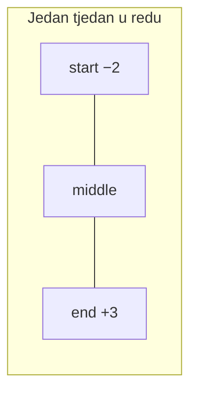

# Spojene trake boravka + −N / +N overflow

## Cilj

U modu **Kalendar po sobama** (`RoomMonthCalendarScreen`), višednevni boravak istog gosta u istoj sobi vizualno izgleda kao **jedna traka** (kao na mockupu), umjesto niza odvojenih kvadrata.

Dodatno, kad rezervacija prelazi granicu **prikazanog mjeseca** (PageView stranica):

| Oznaka | Značenje |
|--------|----------|
| **−N** | N noći boravka pada **prije** 1. dana tog mjeseca |
| **+N** | N noći boravka pada **nakon** zadnjeg dana tog mjeseca |

Pristup **A** (dogovoreno): −N/+N računati po granici kalendarskog mjeseca (`year`/`month` iz `MonthCalendarData`), neovisno o prigušenim danima iz susjednog mjeseca u gridu.

**Scope:** samo [`room_month_block.dart`](c:\Users\avrca\Documents\Projects\Uzorita_all\uzorita_flutter\lib\features\reception\presentation\widgets\room_month_block.dart) i proširenja koje koristi. Prikaz popunjenosti (`BookingCalendarScreen`) ostaje nepromijenjen.



---

## 1. Model: segment spajanja

**Novi fajl:** [`lib/features/reception/domain/room_calendar_stay_segment.dart`](c:\Users\avrca\Documents\Projects\Uzorita_all\uzorita_flutter\lib\features\reception\domain\room_calendar_stay_segment.dart)

```dart
enum DayCellJoin { alone, start, middle, end }

/// Identitet boravka u ćeliji — rezervacija ili blokada.
sealed class UnitNightStay { ... } // booking | block
```

Helperi:

- `DayCellJoin joinFromNeighbors({required bool sameLeft, required bool sameRight})`
- `bool sameBooking(CalendarDayBooking? a, CalendarDayBooking? b)` → `reservationId`
- `bool sameBlock(CalendarDayBlock? a, CalendarDayBlock? b)` → `id` ako postoji, inače `unitId + checkIn + checkOut + source`

---

## 2. Domain: noći izvan mjeseca + blok po noći

**Izmjena:** [`booking_calendar_models.dart`](c:\Users\avrca\Documents\Projects\Uzorita_all\uzorita_flutter\lib\features\reception\domain\booking_calendar_models.dart)

### `primaryBlockForUnit(int unitId, DateTime night)`

Vraća prvi blok koji pokriva tu noć (prioritet: hospira blok ako postoji više — isto kao `decorationForUnit`).

### `nightsBeforeMonth(CalendarDayBooking b, int year, int month)`

Broji noći boravka strogo **prije** `DateTime(year, month, 1)`:

- iteracija od `checkIn` do `checkOut` (exclusive), ista semantika kao [`buildBookingsByDate`](c:\Users\avrca\Documents\Projects\Uzorita_all\uzorita_flutter\lib\features\reception\domain\booking_occupancy_mapper.dart)

### `nightsAfterMonth(CalendarDayBooking b, int year, int month)`

Broji noći strogo **nakon** zadnjeg dana mjeseca, prije `checkOut`.

Iste metode za `CalendarDayBlock` (po `checkIn`/`checkOut` bloka).

---

## 3. UI: dinamički margin i radius

**Izmjena:** [`booking_day_cell.dart`](c:\Users\avrca\Documents\Projects\Uzorita_all\uzorita_flutter\lib\features\reception\presentation\widgets\booking_day_cell.dart)

Novi opcionalni parametar `DayCellJoin join` (default `alone`):

| Join | Horizontal margin | Border radius |
|------|-------------------|---------------|
| `alone` | 2 svuda | `6` svuda |
| `start` | lijevo 2, desno 0 | lijevo zaobljeno |
| `middle` | 0 horizontalno | `0` |
| `end` | lijevo 0, desno 2 | desno zaobljeno |

- Primijeniti `borderRadius` na `OccupancyDayBackground` (već podržava parametar) i na `InkWell` / today border wrapper
- Vertikalni margin (`2`) ostaje na svim segmentima

**Važno:** postojeći poziv iz `BookingMonthBlock` (popunjenost) ne prosljeđuje `join` → ponašanje ostaje kao sada.

---

## 4. RoomMonthBlock: računanje join + overlay

**Izmjena:** [`room_month_block.dart`](c:\Users\avrca\Documents\Projects\Uzorita_all\uzorita_flutter\lib\features\reception\presentation\widgets\room_month_block.dart)

### Petlja tjedna

Umjesto `for (final cell in week)`, iterirati s indeksom:

```dart
for (var i = 0; i < week.length; i++) {
  final cell = week[i];
  final prev = i > 0 ? week[i - 1] : null;
  final next = i < week.length - 1 ? week[i + 1] : null;
  final join = computeJoin(calendarState, room.roomId, cell, prev, next);
  ...
}
```

`computeJoin`: usporedi `primaryBookingForUnit` lijevo/desno; ako nema bookinga, usporedi `primaryBlockForUnit`. Ako nema boravka → `alone`.

### Overflow −N / +N

Za ćeliju s bookingom/blokom, koristi `data.year` / `data.month`:

- Prikaži **−N** na segmentu `start` ili `alone` kad `N > 0`
- Prikaži **+N** na segmentu `end` ili `alone` kad `N > 0`
- Kad je `middle` → bez overflow labela

### `_RoomDayOverlay` proširenje

| Element | Pravilo |
|---------|---------|
| Zastavica | samo `alone` ili `start` (gore desno) |
| Cijena | samo slobodni dani (`booking == null && block == null`) |
| **−N** | gore lijevo, mali font (~9px), `onSurfaceVariant` |
| **+N** | gore desno (ispod/uz zastavicu ako oba), isti stil |

Tooltip (opcionalno l10n): „Još N noći u prethodnom mjesecu” / „Još N noći u sljedećem mjesecu”.

---

## 5. Lokalizacija (tooltip)

**Izmjena:** [`tool/l10n/strings.json`](c:\Users\avrca\Documents\Projects\Uzorita_all\uzorita_flutter\tool\l10n\strings.json)

- `calendarStayNightsBeforeMonth` — „Još {count} noći u prethodnom mjesecu” (hr/en + gen ostali)
- `calendarStayNightsAfterMonth` — „Još {count} noći u sljedećem mjesecu”

Broj u UI ostaje `−2` / `+3` (bez prijevoda). `python tool/gen_arb.py` + `flutter gen-l10n`.

---

## 6. Rubni slučajevi

| Slučaj | Ponašanje |
|--------|-----------|
| Boravak prelazi nedjelja → ponedjeljak (novi red) | spajanje **samo unutar reda**; u novom redu segment počinje kao `start`/`alone` |
| Dva gosta, ista zastavica, različit `reservationId` | **ne** spajati |
| Blokada bez gosta | spajati po block id; bez zastavice; −N/+N po datumu bloka |
| Jednodnevni boravak u mjesecu s overflowom | `alone` s **oba** labela (−2 lijevo, +3 desno) |
| `isToday` border | primijeniti na cijeli segment (outer wrapper), radius usklađen s `join` |
| Tap | i dalje po danu → postojeći `BookingDayBookingsSheet` filtriran na sobu |

---

## 7. Test plan (ručno)

1. R2, gost 10.–14. (5 dana) → jedna crvena traka bez razmaka
2. Gost 15.–16. → druga traka (odvojena od 10.–14.)
3. Prijava prije 1. dana mjeseca → `−N` na prvom segmentu u mjesecu
4. Odjava nakon zadnjeg dana mjeseca → `+N` na zadnjem segmentu
5. Boravak cijeli mjesec + overflow obje strane → `−N` i `+N`
6. Nedjelja/poneđljak prelom → traka se prekida između redova
7. Slobodan dan → zeleni kvadrat s cijenom, `alone`
8. Prikaz popunjenosti → bez promjene
9. `flutter analyze` čist na diranim datotekama

---

## Datoteke

| Akcija | Datoteka |
|--------|----------|
| Novo | `room_calendar_stay_segment.dart` |
| Izmjena | `booking_calendar_models.dart` |
| Izmjena | `booking_day_cell.dart` |
| Izmjena | `room_month_block.dart` |
| Izmjena | `tool/l10n/strings.json` (+ gen l10n) |

Nema backend promjena.
