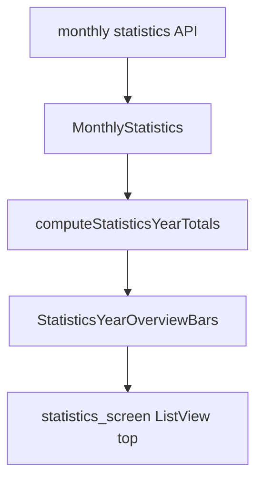

# Statistika: godišnji pregled (Revenue + Noćenja)

## Cilj

Na vrhu taba **Statistike**, iznad legende i grafa, dva **horizontalna stupca** s **tri preklapajuće trake** (boja po seriji fiksna; **red slojeva dinamičan po veličini**):

| Serija | Značenje | Podatak | Boja |
|--------|----------|---------|------|
| Prošla godina | Cijela 2025 | suma `previous.*` (12 mj.) | smeđa |
| Rezervirano | Tekuća bookirano (YTD) | suma `current.reserved*` | zelena |
| Realizirano | Tekuća realizirano (YTD) | suma `current.revenue` / `nights` | plava |

**Pravilo slojeva:** traka s **najvećom vrijednošću = pozadina** (prva u `Stack`), manje preklapaju iznad. U rujnu+ rezervirano YTD može prestići cijelu 2025 — tada je zelena najduža i u pozadini, ne smeđa uvijek pozadina.

Korisnik brzo vidi omjer bez novog API-ja.



## Odluka: agregacija tekuće godine

| Serija | Raspon |
|--------|--------|
| **Prošla godina** | Svi mjeseci 1–12 (`previous.*`) — cijela `comparison_year` |
| **Tekuća (book + real)** | Mjeseci **1 … `selectedMonth`** (YTD) — usklađeno s odabranim mjesecom na grafu |

Razlog: pri swipeu na svibanj prikaz „do svibnja 2026“ vs „cijela 2025“ je intuitivniji od sume budućih mjeseci s 0. Prošla godina ostaje puna referenca.

Ako kasnije treba „cijela tekuća godina“, dovoljno je parametar `throughMonth: 12` u helperu.

**Ne koristiti** `prior_revenue` / `prior_nights` (to je godina −2 za YoY u donjem panelu, ne „prošla godina“).

## UI dizajn

Novi widget [`statistics_year_overview_bars.dart`](c:\Users\avrca\Documents\Projects\Uzorita_all\uzorita_flutter\lib\features\reception\presentation\widgets\statistics_year_overview_bars.dart):

Primjer kad je **bookirano najveće** (rujan+):

```
Prihod — zelena najduža (pozadina), smeđa/plava preko
[████████████████████████] zelena  bookirano YTD
[████████████████]         smeđa  cijela 2025
[██████████]               plava   realizirano
```

- Sortiraj tri segmenta po `value` **opadajuće** → crtaj u `Stack` redom (najveći prvi).
- Širina: `value / max(sva tri, 1)`.
- Alpha: pozadina ~0.4, sredina ~0.55, prednji ~0.8 (po indeksu nakon sorta, ne po boji).
- Ispod: tri broja u **fiksnom legend-redu** (2025 · book · real), neovisno o Z-redu.
- Legenda na vrhu ekrana ([`_YearLegend`](c:\Users\avrca\Documents\Projects\Uzorita_all\uzorita_flutter\lib\features\reception\presentation\statistics_screen.dart)) **ostaje** — stupci su vizualni sažetak, ne zamjena.

Umetnuti u [`statistics_screen.dart`](c:\Users\avrca\Documents\Projects\Uzorita_all\uzorita_flutter\lib\features\reception\presentation\statistics_screen.dart) `ListView.children`:

```dart
StatisticsYearOverviewBars(
  data: state.data,
  selectedMonth: state.selectedMonth,
),
const SizedBox(height: 8),
_YearLegend(...),
StatisticsChart(...),
```

## Implementacija

### 1. Helper + model

Nova datoteka [`statistics_year_totals.dart`](c:\Users\avrca\Documents\Projects\Uzorita_all\uzorita_flutter\lib\features\reception\presentation\statistics_year_totals.dart):

```dart
class StatisticsYearTotals {
  final double previousYearRevenue;
  final int previousYearNights;
  final double bookedRevenue;
  final int bookedNights;
  final double realizedRevenue;
  final int realizedNights;
}

StatisticsYearTotals computeStatisticsYearTotals(
  MonthlyStatistics data, {
  required int throughMonth, // 1..12
});
```

- `previousYear*`: sum `m.previous` za `m.month` 1..12.
- `booked*` / `realized*`: sum `m.current` za `m.month` 1..`throughMonth`.

### 2. Widget traka

`StatisticsYearOverviewBars` — dva `_OverlappingMetricBar` (revenue + nights).

Interno `_OverlappingMetricBar`:

```dart
final segments = [prev, booked, realized]..sort(by value desc);
max = max(values, 1);
for (i, seg in segments.indexed) {
  // Stack child i: widthFactor = seg/max, color = seg.color, alpha = 0.4 + i*0.2
}
```

### 3. L10n

U [`tool/l10n/strings.json`](c:\Users\avrca\Documents\Projects\Uzorita_all\uzorita_flutter\tool\l10n\strings.json):

- `statisticsYearOverviewRevenue` — „Prihod (godišnji pregled)” / EN equivalent
- `statisticsYearOverviewNights` — „Noćenja (godišnji pregled)”
- (opcionalno) `statisticsYearOverviewYtdNote` — „Tekuća godina: do {month}” — mali subtitle ispod stupaca

`python tool/gen_arb.py` + `flutter gen-l10n`.

### 4. Testovi

[`test/features/reception/statistics_year_totals_test.dart`](c:\Users\avrca\Documents\Projects\Uzorita_all\uzorita_flutter\test\features\reception\statistics_year_totals_test.dart):

- Mock 3 mjeseca: previous puni godinu, current YTD kroz mjesec 2 → sume točne.
- `throughMonth: 12` uključuje sve mjeseci tekuće.

## Test plan (ručno)

| # | Korak | Očekivano |
|---|--------|-----------|
| 1 | Rujan+, bookirano > 2025 | Zelena najduža, **u pozadini** |
| 2 | Veljača, YTD mali | Smeđa često najduža, u pozadini |
| 3 | Swipe mjesecima | Pozadinski sloj se mijenja po brojkama |
| 4 | Boje serija | Smeđa/zelena/plava = legenda (Z-red dinamičan) |

## Izvan scopea

- Backend / novi endpoint
- Otkazano u godišnjem pregledu
- Kalendar / timeline
- Zamjena donjeg `StatisticsMonthComparison` panela

## Datoteke

| Akcija | Datoteka |
|--------|----------|
| Novo | `statistics_year_totals.dart`, `statistics_year_overview_bars.dart`, `statistics_year_totals_test.dart` |
| Izmjena | `statistics_screen.dart`, `strings.json` + generirani ARB |
