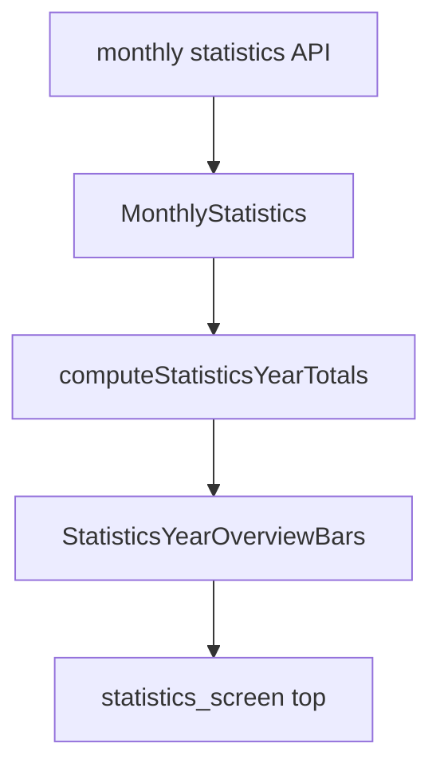

# Statistika: godišnji pregled (Revenue + Noćenja)

Plan datoteka: [uzorita-rooms-code/.cursor/plans/statistika_godisnji_pregled_bars.plan.md](c:\Users\avrca\Documents\Projects\Uzorita_all\uzorita-rooms-code\.cursor\plans\statistika_godisnji_pregled_bars.plan.md)

## Cilj

Na vrhu taba **Statistike**, iznad legende i grafa, **dva horizontalna stupca** (prihod + noćenja) s **tri preklapajuće trake** (ista semantička boja po seriji, **red slojeva ovisi o veličini**):

| Serija | Značenje | Podatak | Boja (uvijek ista) |
|--------|----------|---------|---------------------|
| Prošla godina | Cijela 2025 | suma `previous.*` (12 mj.) | smeđa |
| Rezervirano | Tekuća bookirano | suma `current.reserved*` (YTD) | zelena |
| Realizirano | Tekuća realizirano | suma `current.revenue` / `nights` (YTD) | plava |

**Pravilo slojeva (ključno):** traka s **najvećom vrijednošću ide u pozadinu** (prva u `Stack`), manje preklapaju preko nje. Primjer: u rujnu/srpnju **rezervirano YTD** može prestići cijelu 2025 — tada je **zelena najduža i u pozadini**, smeđa i plava suži preko nje. Fiksni red „smeđa uvijek pozadina“ nije prihvatljiv.

Bez novog API-ja — agregacija postojećeg [`MonthlyStatistics`](c:\Users\avrca\Documents\Projects\Uzorita_all\uzorita_flutter\lib\features\reception\domain\monthly_statistics.dart).



## Agregacija

- **Prošla godina:** svi mjeseci 1–12 (`previous.*`)
- **Tekuća (book + real):** mjeseci 1 … `selectedMonth` (YTD, usklađeno sa swipeom na grafu)
- **Ne** koristiti `prior_revenue` (to je godina −2 za donji YoY panel)

## UI

Novi widget [`statistics_year_overview_bars.dart`](c:\Users\avrca\Documents\Projects\Uzorita_all\uzorita_flutter\lib\features\reception\presentation\widgets\statistics_year_overview_bars.dart):

**`_OverlappingMetricBar` — dinamički red slojeva:**

```dart
final segments = [
  (value: prev, color: brown, label: comparisonYear),
  (value: booked, color: green, label: 'booked'),
  (value: realized, color: blue, label: 'realized'),
]..sort((a, b) => b.value.compareTo(a.value)); // najveći prvi = pozadina

for (final seg in segments) {
  // FractionallySizedBox width = seg.value / max(all three)
  // alpha: pozadina ~0.4, sredina ~0.55, prednji ~0.8 (po indeksu u sortiranom nizu)
}
```

- `max = max(prev, booked, realized, 1)` — skala širine
- `Stack` crta od **najvećeg prema najmanjem** (ispod → iznad)
- Ispod trake: tri broja u **fiksnom redoslijedu** u legendi (2025 · bookirano · realizirano), neovisno o Z-redu
- Legenda [`_YearLegend`](c:\Users\avrca\Documents\Projects\Uzorita_all\uzorita_flutter\lib\features\reception\presentation\statistics_screen.dart) ostaje ispod stupaca

Umetnuti u [`statistics_screen.dart`](c:\Users\avrca\Documents\Projects\Uzorita_all\uzorita_flutter\lib\features\reception\presentation\statistics_screen.dart) **iznad** `_YearLegend` i grafa.

## Datoteke

| Akcija | Datoteka |
|--------|----------|
| Novo | `statistics_year_totals.dart`, `statistics_year_overview_bars.dart`, test |
| Izmjena | `statistics_screen.dart`, `strings.json` |

## Ručni test

1. Statistike, **rujan+** (YTD velik) — ako je bookirano > 2025, **zelena traka najduža i u pozadini**
2. Rani mjesec (npr. veljača) — često je **smeđa najduža** (cijela 2025 > YTD)
3. Swipe mjesecima — koji sloj je u pozadini **mijenja se** prema brojkama
4. Boje serija = legenda grafa (smeđa/zelena/plava), samo Z-red dinamičan
