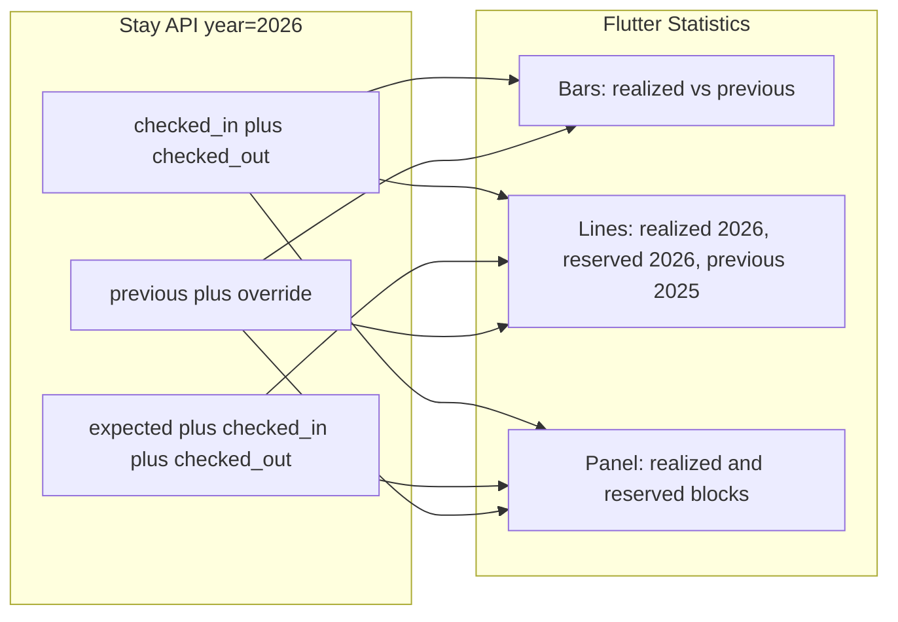

# Statistika: rezervirano vs realizirano

## Cilj

Na ekranu **Statistike** ([`statistics_screen.dart`](c:\Users\avrca\Documents\Projects\Uzorita_all\uzorita_flutter\lib\features\reception\presentation\statistics_screen.dart)):

- **Realizirano** — noći/prihod od boravaka koje su stvarno odrađene (`checked_in`, `checked_out`), kao danas.
- **Rezervirano** — ukupno bookirano za mjesec (**sve osim `canceled`**: `expected` + `checked_in` + `checked_out`), po datumu check-in.
- **Graf** — zadržati stupce realizirano 2026 (plavo) vs 2025 (sivo); linije: crvena = realizirano 2026, žuta = realizirano 2025, **nova** = rezervirano 2026 (usporedba s prošlom godinom).
- **Donji panel** — za tekuću godinu dva bloka metrika (realizirano + rezervirano); 2025 ostaje jedan blok (povijest / override).

## Trenutno stanje

[`aggregate_monthly_statistics`](c:\Users\avrca\Documents\Projects\Uzorita_all\stay.hr\backend\apps\reservations\statistics.py) broji samo `checked_in` + `checked_out`. Rezervacija `expected` (test u [`test_statistics.py`](c:\Users\avrca\Documents\Projects\Uzorita_all\stay.hr\backend\apps\reservations\tests\test_statistics.py) L46–71) **ne ulazi** u agregat → travanj 2026 ostaje 0.

Flutter [`MonthBucket`](c:\Users\avrca\Documents\Projects\Uzorita_all\uzorita_flutter\lib\features\reception\domain\monthly_statistics.dart) ima samo `revenue` / `nights` po `current` i `previous`.

## API kontrakt (Stay.hr)

Proširiti payload po mjesecu (additive, bez lomljenja starog polja `current.revenue`):

```json
{
  "month": 5,
  "current": {
    "revenue": "2030.00",
    "commission": "...",
    "nights": 18,
    "reserved_revenue": "8500.00",
    "reserved_commission": "...",
    "reserved_nights": 62
  },
  "previous": { "revenue": "7150.00", "commission": "...", "nights": 51 }
}
```

- `current.revenue` / `nights` = **realizirano** (isto kao danas).
- `current.reserved_*` = **rezervirano** (samo za `year` u queryju; zaseban queryset).
- `previous` = samo realizirano + `MonthlyStatisticsOverride` (bez reserved — povijest je override/realized).

### Backend — [`statistics.py`](c:\Users\avrca\Documents\Projects\Uzorita_all\stay.hr\backend\apps\reservations\statistics.py)

1. `_realized_queryset` — postojeći filter (`checked_in`, `checked_out`).
2. `_reserved_queryset` — `status__in=[expected, checked_in, checked_out]`, isti raspon `check_in` (samo godina `year` za current bucket).
3. Dva prolaza (ili jedan queryset s grupiranjem) u bucket `current.reserved_*`.
4. Override i dalje **samo** prepisuje `current`/`previous` realizirane vrijednosti, ne `reserved_*`.

Testovi u [`test_statistics.py`](c:\Users\avrca\Documents\Projects\Uzorita_all\stay.hr\backend\apps\reservations\tests\test_statistics.py):

- `expected` u 2026 povećava `reserved_*`, ne `revenue`/`nights`.
- `checked_in` ulazi u **oba** (realized + reserved).
- Override ne dira `reserved_*`.

Ažurirati [`docs/development/monthly-statistics-override.md`](c:\Users\avrca\Documents\Projects\Uzorita_all\stay.hr\docs\development\monthly-statistics-override.md).

**Deploy:** migracija nije potrebna; treba deploy koda na `api.stay.hr`.

## Flutter

### Domain — [`monthly_statistics.dart`](c:\Users\avrca\Documents\Projects\Uzorita_all\uzorita_flutter\lib\features\reception\domain\monthly_statistics.dart)

- Na `MonthBucket` dodati opcionalna polja `reservedRevenue`, `reservedCommission`, `reservedNights` (default 0 ako API stariji).

### Graf — [`statistics_chart.dart`](c:\Users\avrca\Documents\Projects\Uzorita_all\uzorita_flutter\lib\features\reception\presentation\widgets\statistics_chart.dart)

- `maxY` uključuje i `reserved_*` vrijednosti.
- **Treća** `LineChartBarData` (npr. zelena/teal, isprekidana): `reserved` tekuće godine po mjesecu.
- Legenda u [`statistics_screen.dart`](c:\Users\avrca\Documents\Projects\Uzorita_all\uzorita_flutter\lib\features\reception\presentation\statistics_screen.dart) (`_YearLegend` → proširiti na 3 stavke: realizirano 2026, rezervirano 2026, 2025).

### Donji usporedni panel — [`statistics_month_comparison.dart`](c:\Users\avrca\Documents\Projects\Uzorita_all\uzorita_flutter\lib\features\reception\presentation\widgets\statistics_month_comparison.dart)

Lijeva kolona (tekuća godina):

- Podnaslov **Realizirano** — prihod + noći + YoY% vs 2025 (postojeća logika).
- Podnaslov **Rezervirano** — `reserved_revenue` + `reserved_nights` (bez YoY ili opcionalno YoY reserved vs previous realized — vizualno već na liniji).

Desna kolona (2025): bez promjene.

### L10n — [`tool/l10n/strings.json`](c:\Users\avrca\Documents\Projects\Uzorita_all\uzorita_flutter\tool\l10n\strings.json)

Novi ključevi (hr + en ručno, ostali jezici): npr. `statisticsRealized`, `statisticsReserved`, `statisticsLegendReserved`.

`python tool/gen_arb.py` + `flutter gen-l10n`.

## Tok podataka



## Test plan (ručno)

1. Mjesec s `expected` rezervacijama → **Rezervirano** > **Realizirano**; linija rezervirano vidljiva na grafu.
2. Svibanj 2026 — plavi stupac = realizirano; sivi = 2025 override; zelena linija rezervirano vs žuta 2025.
3. Povuci za osvježiti nakon deploya API-ja.
4. Regresija: 2025 override i dalje u sivoj koloni.

## Opseg izvan ovog plana

- Nema promjene `MonthlyStatisticsOverride` modela (ručni unos samo za realizirano/povijest).
- Nema izmjene [`uzorita-rooms-code`](c:\Users\avrca\Documents\Projects\Uzorita_all\uzorita-rooms-code) — produkcija ide preko Stay.hr.
