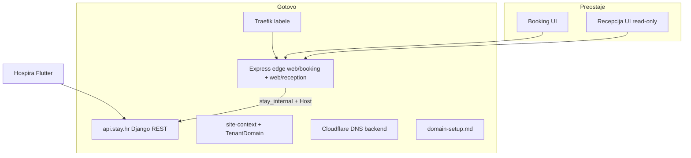
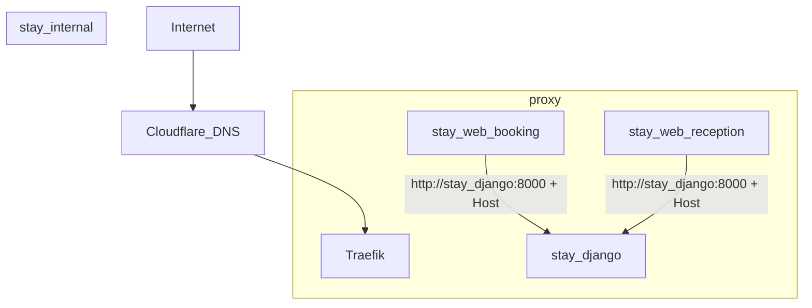

# Stay.hr web frontend — plan (ažurirano)

## Status pregled



| Komponenta | Status |
|------------|--------|
| Recepcijski API | ✅ Produkcija — Flutter |
| Javni booking API | ✅ Kontrakt spreman |
| `TenantDomain.property` + migracija | ✅ [`0006_tenantdomain_property`](c:\Users\avrca\Documents\Projects\Uzorita_all\stay.hr\backend\apps\tenants\migrations\0006_tenantdomain_property.py) |
| `GET /api/v1/public/site-context/` | ✅ [`site_context_views.py`](c:\Users\avrca\Documents\Projects\Uzorita_all\stay.hr\backend\apps\api\site_context_views.py) |
| Cloudflare DNS (backend) | ✅ [`apps/tenants/cloudflare/dns.py`](c:\Users\avrca\Documents\Projects\Uzorita_all\stay.hr\backend\apps\tenants\cloudflare\dns.py) |
| `provision_platform_dns` | ✅ |
| Admin **Provision DNS** | ✅ [`tenants/admin.py`](c:\Users\avrca\Documents\Projects\Uzorita_all\stay.hr\backend\apps\tenants\admin.py) |
| `rollout_uzorita_domains` | ✅ |
| Docker `web-booking` / `web-reception` | ✅ [`docker-compose.yml`](c:\Users\avrca\Documents\Projects\Uzorita_all\stay.hr\docker-compose.yml) |
| Mreža `stay_internal` | ✅ |
| Operativne upute | ✅ [`docs/operations/domain-setup.md`](c:\Users\avrca\Documents\Projects\Uzorita_all\stay.hr\docs\operations\domain-setup.md) |
| Express edge (Host + `/api` proxy) | ✅ [`web/booking/server.js`](c:\Users\avrca\Documents\Projects\Uzorita_all\stay.hr\web\booking\server.js), [`web/reception/server.js`](c:\Users\avrca\Documents\Projects\Uzorita_all\stay.hr\web\reception\server.js) |
| **Booking UI** | ⏳ Placeholder HTML |
| **Recepcija UI** | ⏳ Placeholder HTML |
| Legacy `rooms.uzorita.hr` | Zaseban stack — referenca UX-a, ne migracija |
| Flutter web | ❌ Nije opcija (MRZ/NFC/push) |

**Scope MVP (nepromijenjen):** recepcija + booking, read-only recepcija (bez sken/NFC/eVisitor submit).

**Booking routing:** property preko **domene** (`booking.uzorita.hr`) **ili** **slug-a** (`uzorita.stay.hr/p/uzorita`).

---

## Arhitektura (implementirano + cilj)

### Produkcijski stack



| Servis | Uloga |
|--------|--------|
| **Traefik** | TLS + `Host` / `HostRegexp` routing |
| **Express edge** | Prosljeđuje `Host`, proxy `/api` → Django; kasnije servira Next.js UI |
| **Django** | API + `site-context` + `TenantHostMiddleware` |
| **Cloudflare API** | DNS upsert (backend commands/admin) |

Env: `STAY_API_INTERNAL_URL=http://stay_django:8000` (compose + edge).

### Web UI — trenutno vs cilj

Plan je originally predvidio **Next.js 16** monorepo. Implementirana je **faza 0**: Express edge s placeholder HTML.

```
stay.hr/web/
  booking/       # Express edge ✅ — Next.js UI ⏳
  reception/     # Express edge ✅ — Next.js UI ⏳
```

**Sljedeći korak:** dodati Next.js app unutar istog containera (multi-stage Dockerfile: `next build` + Express static/serve) **ili** zamijeniti Express čistim Next.js custom serverom — zadržati `Host` forwarding i internal API URL.

Referenca UX-a: [`uzorita-rooms-code/frontend`](c:\Users\avrca\Documents\Projects\Uzorita_all\uzorita-rooms-code\frontend), [`uzorita-rooms-code/booking`](c:\Users\avrca\Documents\Projects\Uzorita_all\uzorita-rooms-code\booking).

---

## Routing bookiranja

### Backend (✅)

- [`TenantDomain.property`](c:\Users\avrca\Documents\Projects\Uzorita_all\stay.hr\backend\apps\tenants\models.py) — nullable FK
- [`TenantHostMiddleware`](c:\Users\avrca\Documents\Projects\Uzorita_all\stay.hr\backend\apps\tenants\middleware.py) — `request.tenant`, `request.tenant_domain` (+ `property` preko domain FK)
- [`SiteContextView`](c:\Users\avrca\Documents\Projects\Uzorita_all\stay.hr\backend\apps\api\site_context_views.py) — AllowAny, verified domain only u produkciji

Primjer odgovora:

```json
{
  "tenant": { "slug": "uzorita", "name": "..." },
  "property": { "slug": "uzorita", "name": "..." },
  "domain_type": "custom_domain",
  "branding": {},
  "languages": ["hr"]
}
```

Tenant hub (`property: null`): frontend koristi `/p/[slug]/`.

### Dva načina pristupa

| Način | URL | Objekt |
|-------|-----|--------|
| Custom domena | `https://booking.uzorita.hr/` | `TenantDomain.property` FK |
| Subdomena + slug | `https://uzorita.stay.hr/p/uzorita/` | slug iz patha |

### Ciljane rute (booking UI — ⏳)

```
/                         → single-property domena
/p/[slug]/                → tenant hub
/p/[slug]/checkout
/p/[slug]/confirmation/[code]
/search
```

---

## Domene i operacije

**Kanonski dokument:** [`docs/operations/domain-setup.md`](c:\Users\avrca\Documents\Projects\Uzorita_all\stay.hr\docs\operations\domain-setup.md)

| Sloj | Status |
|------|--------|
| Cloudflare DNS | ✅ Backend (`provision_platform_dns`, admin Provision DNS) |
| Traefik | ✅ `app.stay.hr`, `HostRegexp *.stay.hr`, `booking.uzorita.hr` |
| Django TenantDomain | ✅ Admin + seed |
| Uzorita rollout | ✅ `manage.py rollout_uzorita_domains` |

**Operater na serveru:**

```bash
cd /opt/stacks/stay.hr
git pull && ./scripts/deploy.sh
docker compose run --rm django python manage.py rollout_uzorita_domains
```

Opcije: `--dry-run`, `--skip-dns`, `--skip-verify`.

---

## Autentikacija (⏳ UI sloj)

### Recepcija (`app.stay.hr`)

- Device token kao Hospira tablet
- Bootstrap: `GET /api/v1/app/config`
- **Cilj:** httpOnly cookie preko edge/BFF, ne `localStorage`
- MVP scope: `reception:read`

### Booking (gosti)

- Server-side `ApiApplication` token (`public:read`, `reservations:create`)
- Property kontekst iz **Host/slug**, ne iz tokena
- Token nikad u `NEXT_PUBLIC_*`

Edge već proxy-a `/api` s ispravnim `Host` headerom — UI sloj treba dodati auth cookie/logiku za recepciju i server-only token za booking POST.

---

## MVP feature scope

### Recepcija web (`web/reception`) — ⏳

| Ekran | API |
|-------|-----|
| `/login` | `GET /api/v1/app/config` |
| `/` timeline | `GET /api/v1/reception/reservations/` |
| `/calendar/rooms` | `GET /api/v1/rooms/rooms/`, calendar |
| `/reservations/[id]` | GET detail + gosti (read-only) |
| `/statistics` (opcionalno) | monthly statistics |

**Izvan MVP-a:** sken, NFC, eVisitor, PATCH, guest CRUD, push, import.

**Sync:** polling `sync-versions` ~30 s.

### Booking web (`web/booking`) — ⏳

1. `site-context` (edge već omogućuje poziv s Host)
2. `GET /api/v1/public/units?property=`
3. Datumi → `GET /api/v1/public/availability?from=&to=&property=`
4. `POST /api/v1/public/reservations`
5. Confirmation s `booking_code`

**Faza 2:** fotografije, amenities, cijene u availability API.

---

## Preostali rad — faze

### Faza 1 — Next.js scaffold (2–3 dana)

- Next.js App Router u `web/booking` i `web/reception`
- Dockerfile multi-stage (build + run)
- Zadržati internal API URL + Host forwarding
- Dev: lokalno s `STAY_API_INTERNAL_URL` ili javni API + CORS (opcionalno)

### Faza 2 — recepcija read-only (3–5 dana)

- Login, timeline, kalendar, detalj
- Port UX iz legacy frontend timeline stranice
- Polling sync-versions

### Faza 3 — booking MVP (4–5 dana)

- site-context bootstrap
- Rute `/` i `/p/[slug]/`
- Search → checkout → confirmation
- SEO iz `Property.branding`

### Faza 4 — Uzorita go-live (1 dan)

- `rollout_uzorita_domains` na produkciji
- Checklist iz domain-setup.md
- Ručno: README „Traefik later” → ažurirati (wildcard je aktivan)

---

## Procjena preostalog rada

| Faza | Trajanje |
|------|----------|
| 1 Next.js scaffold | ~2–3 dana |
| 2 Recepcija read-only | ~3–5 dana |
| 3 Booking MVP | ~4–5 dana |
| 4 Go-live | ~1 dan |
| **Ukupno preostalo** | **~1,5–2 tjedna** |

*(Infra faza A0 + edge + ops doc: ~gotovo.)*

---

## Rizici i ograničenja

- **Bez skeniranja u browseru** — tablet ostaje primarni check-in
- **Booking bez cijena** — dok se availability API ne proširi
- **Custom domene izvan `*.stay.hr`** — Traefik `Host()` label po domeni u compose (MVP)
- **Express → Next.js migracija** — paziti da se ne izgubi Host forwarding na `/api`
- **Više Cloudflare zona** — backend mapira domenu → zona; dokumentirano u domain-setup.md

---

## Ključne datoteke

| Datoteka | Svrha |
|----------|--------|
| [`docs/operations/domain-setup.md`](c:\Users\avrca\Documents\Projects\Uzorita_all\stay.hr\docs\operations\domain-setup.md) | Operativne upute |
| [`docker-compose.yml`](c:\Users\avrca\Documents\Projects\Uzorita_all\stay.hr\docker-compose.yml) | Servisi + Traefik |
| [`backend/apps/tenants/cloudflare/dns.py`](c:\Users\avrca\Documents\Projects\Uzorita_all\stay.hr\backend\apps\tenants\cloudflare\dns.py) | DNS upsert |
| [`backend/apps/api/site_context_views.py`](c:\Users\avrca\Documents\Projects\Uzorita_all\stay.hr\backend\apps\api\site_context_views.py) | site-context |
| [`web/booking/server.js`](c:\Users\avrca\Documents\Projects\Uzorita_all\stay.hr\web\booking\server.js) | Booking edge |
| [`web/reception/server.js`](c:\Users\avrca\Documents\Projects\Uzorita_all\stay.hr\web\reception\server.js) | Reception edge |
