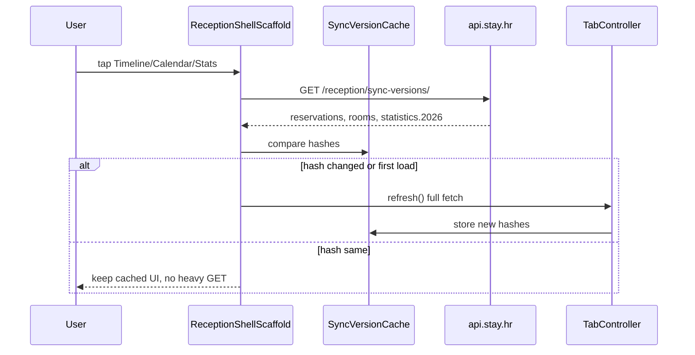

# Tab refresh s hash provjerom (Timeline / Calendar / Statistics)

## Stanje danas

- Bottom bar u [`uzorita_flutter/lib/app/reception_shell_scaffold.dart`](uzorita_flutter/lib/app/reception_shell_scaffold.dart) samo poziva `navigationShell.goBranch()` — **bez** osvježavanja.
- Puní fetchovi već postoje: `TimelineController.refresh()`, `BookingCalendarController.refresh()`, `StatisticsController.refresh()`.
- Push invalidira uglavnom timeline ([`push_invalidation.dart`](uzorita_flutter/lib/core/notifications/push_invalidation.dart)), ne kalendar/statistiku.
- Na Stay **nema** sync/version endpointa za recepciju.



---

## 1. Backend (stay.hr)

### Novi modul / view

- Datoteka npr. [`stay.hr/backend/apps/reservations/sync_versions.py`](stay.hr/backend/apps/reservations/sync_versions.py) s funkcijama:
  - **`reservations_version(tenant)`** — `Count('id')` + `Max('updated_at')` na `Reservation.objects.for_tenant(tenant)` → SHA-256 hexdigest (skraćeno npr. 16 znakova).
  - **`rooms_version(tenant)`** — isto na aktivne `Unit` (`is_active=True`) — kalendar učitava listu soba zasebno.
  - **`statistics_version(tenant, year)`** — kombinacija:
    - `Max(updated_at)` na `MonthlyStatisticsOverride` za godine `year`, `year-1`, `year-2`
    - agregat na rezervacijama koje utječu na statistiku (realizirano/rezervirano/otkazano po `check_in` u tom rasponu godina) — `count` + `max(updated_at)` dovoljno za fingerprint (ne treba ponovno računati cijeli `aggregate_monthly_statistics`).

### Endpoint

- `GET /api/v1/reception/sync-versions/`
- Query: opcionalno `year` (default tekuća godina u `Europe/Zagreb`, kao statistika).
- Odgovor:

```json
{
  "reservations": "a1b2…",
  "rooms": "c3d4…",
  "statistics": { "2026": "e5f6…" }
}
```

- View u [`stay.hr/backend/apps/api/reception_views.py`](stay.hr/backend/apps/api/reception_views.py) (`ReceptionReadView`, scope `reception:read`).
- Ruta u [`stay.hr/backend/apps/api/reception_urls.py`](stay.hr/backend/apps/api/reception_urls.py).

### Testovi

- [`stay.hr/backend/apps/reservations/tests/test_sync_versions.py`](stay.hr/backend/apps/reservations/tests/test_sync_versions.py):
  - prazan tenant → stabilni hashovi
  - kreiranje/patch rezervacije → `reservations` se mijenja
  - override za 2025 → `statistics["2026"]` se mijenja (jer utječe na `previous` za year=2026)
- API test: `GET` s device tokenom → 200 + ključevi.

---

## 2. Flutter — API i cache verzija

### API

- [`uzorita_flutter/lib/features/reception/data/reception_api.dart`](uzorita_flutter/lib/features/reception/data/reception_api.dart): `Future<Map<String, dynamic>> syncVersions({int? year})`.

### Cache (Riverpod)

- Novi [`uzorita_flutter/lib/features/reception/data/reception_sync_cache.dart`](uzorita_flutter/lib/features/reception/data/reception_sync_cache.dart):
  - drži zadnje poznate hashove: `reservations`, `rooms`, `statisticsByYear`
  - `Future<bool> reservationsChanged(ReceptionApi api)`
  - `Future<bool> roomsChanged(...)` / `statisticsChanged(year)`
  - nakon uspješnog punog fetcha controller ažurira cache iz novog `syncVersions` odgovora
- **404 / mreža na sync-versions:** tretiraj kao „promijenjeno” → radi puni `refresh()` (isto kao postojeći P1 fallback uzorak u [`p1_unavailable.dart`](uzorita_flutter/lib/core/network/p1_unavailable.dart)).

---

## 3. Flutter — `refreshIfStale()` na controllerima

| Controller | Datoteka | Logika |
|------------|----------|--------|
| Timeline | [`timeline_controller.dart`](uzorita_flutter/lib/features/reception/presentation/timeline_controller.dart) | `refreshIfStale()`: ako `reservations` hash isti → return; inače postojeći `refresh()` |
| Kalendar | [`booking_calendar_controller.dart`](uzorita_flutter/lib/features/reception/presentation/booking_calendar_controller.dart) | stale ako se promijenio `reservations` **ili** `rooms` |
| Statistika | [`statistics_controller.dart`](uzorita_flutter/lib/features/reception/presentation/statistics_controller.dart) | stale ako se promijenio `statistics[year]` |

- **Bez loading overlaya** kad hash isti (korisnik ostaje na postojećim podacima).
- Kad hash drugačiji: postojeći loading ponašanje (`AsyncLoading` / `invalidateSelf`).

---

## 4. Flutter — bottom bar

U [`reception_shell_scaffold.dart`](uzorita_flutter/lib/app/reception_shell_scaffold.dart), u `_onDestinationSelected`:

- index `0` → `timelineControllerProvider.notifier.refreshIfStale()`
- index `1` → `bookingCalendarControllerProvider.notifier.refreshIfStale()`
- index `2` → `statisticsControllerProvider.notifier.refreshIfStale()`
- index `3` (More) → bez promjene

Poziv **nakon** `goBranch` (ili u `addPostFrameCallback` ako treba stabilan `ref`), uključivo i kad korisnik ponovno pritisne **isti** tab (`initialLocation: true`).

---

## 5. Push (opcionalno, mali dodatak)

U [`push_invalidation.dart`](uzorita_flutter/lib/core/notifications/push_invalidation.dart), uz postojeći `invalidate(timeline)`:

- reset sync cache za `reservations` (ili `invalidate(receptionSyncCacheProvider)`) da sljedeći tab tap zna da treba puni fetch
- opcionalno i `invalidate(bookingCalendarControllerProvider)` / `statisticsControllerProvider` na `reservation.*` evente — da UI ne čeka tab tap

---

## 6. Deploy i testiranje

1. Deploy **stay.hr** na `api.stay.hr` (endpoint + statistika `prior_*` ako još nije).
2. Flutter build s novim kodom.
3. Ručno:
   - tap Timeline dvaput bez promjene na serveru → drugi tap **nema** veliki GET rezervacija (samo mali `sync-versions` u mreži)
   - promjena statusa s drugog uređaja → hash drugačiji → puni refresh
   - isto za Calendar i Statistics

---

## Ograničenja (svjesno prihvaćeno)

- Hash je **tenant-wide** za rezervacije (ne po `period_from`/`period_to`) — promjena bilo koje rezervacije invalidira timeline i kalendar čak i izvan vidljivog raspona. Jednostavnije i sigurnije; prihvatljivo za recepciju.
- Kalendar i dalje radi N `roomCalendar` poziva kad je stale — hash samo preskače taj skup kad nema promjena.
