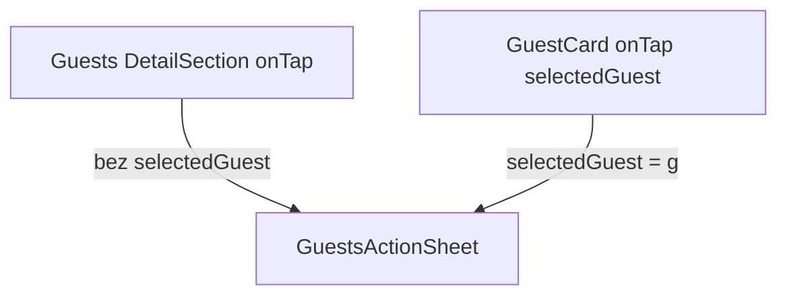

# Tap na cijeli Guests box + karticu gosta

## Cilj

- Tap na **karticu gosta** → `GuestsActionSheet` s `selectedGuest` (već implementirano).
- Tap na **bilo koji drugi dio Guests boxa** (naslov „Gosti”, padding, razmak između kartica, prazna poruka) → isti izbornik, **bez** `selectedGuest` (picker ako ima više gostiju; „Dodaj gosta” radi i kad je lista prazna).

## Trenutno stanje

U [`reservation_detail_screen.dart`](c:\Users\avrca\Documents\Projects\Uzorita_all\uzorita_flutter\lib\features\reception\presentation\reservation_detail_screen.dart):

- Sekcija Gosti koristi `_DetailSection` **bez** `onTitleTap` (⋯ uklonjen).
- Samo [`_GuestCard`](c:\Users\avrca\Documents\Projects\Uzorita_all\uzorita_flutter\lib\features\reception\presentation\reservation_detail_screen.dart) ima `InkWell` + `onTap`.

## Promjene

### 1. Proširiti `_DetailSection`

Dodati opcionalni `VoidCallback? onTap` na [`_DetailSection`](c:\Users\avrca\Documents\Projects\Uzorita_all\uzorita_flutter\lib\features\reception\presentation\reservation_detail_screen.dart) (L541+):

- Na vanjskom `Card`: `clipBehavior: Clip.antiAlias`
- Ako je `onTap != null`, omotati cijeli sadržaj (`Column` s naslovom + `child`) u jedan `InkWell(onTap: onTap)`
- Ukloniti ili ne koristiti stari `onTitleTap` + ⋯ za Guests (ostaje mrtav kod samo ako ga drugi dijelovi ne koriste — provjeri grep; ako nitko ne koristi `onTitleTap`, može se ukloniti iz widgeta radi čistoće)

### 2. Guests sekcija — `onTap` na cijeli box

```dart
_DetailSection(
  title: l10n.sectionGuests,
  highlightIncompleteEvisitor: d.evisitorSummary == 'incomplete',
  onTap: () => _openGuestsActions(
    context,
    d.guests,
    reservationStatus: d.status,
  ),
  child: ...
)
```

`_GuestCard` ostaje nepromijenjen: i dalje prosljeđuje `selectedGuest: g`.

### 3. Ugniježđeni tapovi

Flutter: tap na unutarnji `InkWell` (`_GuestCard`) **ne propagira** na vanjski — nema dvostrukog otvaranja sheeta.

| Tap zona | `selectedGuest` | Detalj / Sken |
|----------|-----------------|---------------|
| Kartica gosta | `g` | direktno na tog gosta |
| Naslov / padding / prazan tekst | `null` | `resolveGuestForAction` ili snackbar ako nema gostiju |

## Datoteke

- Jedina izmjena: [`reservation_detail_screen.dart`](c:\Users\avrca\Documents\Projects\Uzorita_all\uzorita_flutter\lib\features\reception\presentation\reservation_detail_screen.dart)

## Test

1. Tap na karticu → sheet → Detalj → točan gost.
2. Tap na naslov „Gosti” ili bijeli prostor oko kartica → sheet → Detalj → picker (2+ gosta) ili jedini gost.
3. Prazna lista → tap na box → sheet → „Dodaj gosta” dostupan.
4. Ostale sekcije (Plaćanje, Kontakt, …) — tap ne otvara ništa.


