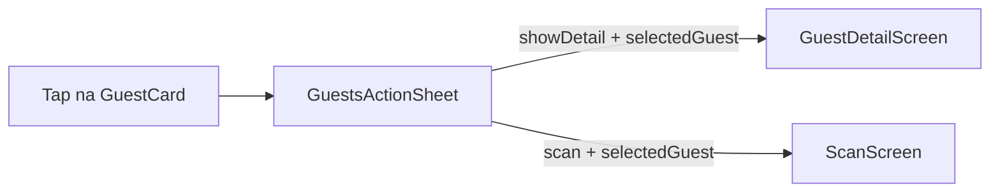

# Tap na karticu gosta → izbornik

## Što korisnik želi

- **Tap bilo gdje na karticu gosta** (siva/bež kutija s avatarom i imenom) otvara **isti izbornik** kao dosad (`GuestsActionSheet`: detalj, sken, dodaj gosta, eVisitor).
- **Ukloniti ⋯** (`Icons.more_horiz`) s retka naslova „Gosti” — izbornik više nije na naslovu sekcije.
- **Ne** direktna navigacija na `GuestDetailScreen` pri tapu (to je bilo u ranijoj iteraciji plana).

## Trenutno stanje

U [`reservation_detail_screen.dart`](c:\Users\avrca\Documents\Projects\Uzorita_all\uzorita_flutter\lib\features\reception\presentation\reservation_detail_screen.dart):

- Sekcija Gosti: `_DetailSection(onTitleTap: _openGuestsActions)` → prikazuje ⋯ i otvara sheet.
- [`_GuestCard`](c:\Users\avrca\Documents\Projects\Uzorita_all\uzorita_flutter\lib\features\reception\presentation\reservation_detail_screen.dart) (oko L646): `ListTile(enabled: false)` — **nije klikabilan**.

`_openGuestsActions` za `showDetail` / `scan` zove [`resolveGuestForAction`](c:\Users\avrca\Documents\Projects\Uzorita_all\uzorita_flutter\lib\features\reception\presentation\guest_flow.dart) (picker ako ima više gostiju).

## Promjene (jedna datoteka)

### 1. Ukloniti ⋯ s naslova Gosti

U buildu sekcije Gosti (oko L348–366):

- Maknuti `onTitleTap` s `_DetailSection` za goste.
- `highlightIncompleteEvisitor` ostaje kao sada.

### 2. Klikabilna `_GuestCard`

Proširiti widget:

```dart
_GuestCard({
  required this.guest,
  required this.onTap,
});
```

- Omotati sadržaj u `InkWell` (ili `Material` + `InkWell`) s `onTap`, `borderRadius` usklađen s unutarnjim `Card`-om.
- Ukloniti `enabled: false` s `ListTile` (ili koristiti samo `InkWell` bez `ListTile.onTap` da nema duplog ripplea — dovoljno je `InkWell` oko `ListTile`).

U listi gostiju:

```dart
for (final g in d.guests)
  _GuestCard(
    guest: g,
    onTap: () => _openGuestsActions(
      context,
      d.guests,
      reservationStatus: d.status,
      selectedGuest: g,
    ),
  ),
```

### 3. Kontekst tapnutog gosta u `_openGuestsActions`

Dodati opcionalni parametar `GuestLite? selectedGuest`:

| Akcija | Ponašanje |
|--------|-----------|
| `showDetail` | `guest = selectedGuest ?? await resolveGuestForAction(...)` |
| `scan` | isto |
| `addGuest` / `evisitor` | bez promjene (cijela rezervacija) |

Time tap na karticu Ante Vrcan → izbornik → „Prikaži detalje” ide **direktno** na tog gosta, bez `GuestPickerSheet`.

Postojeća logika (`guestsLocked`, `readonly=1`, invalidacija `reservationDetailControllerProvider`) ostaje.

### 4. Što ne dirati

- [`guests_action_sheet.dart`](c:\Users\avrca\Documents\Projects\Uzorita_all\uzorita_flutter\lib\features\reception\presentation\widgets\guests_action_sheet.dart) — bez izmjena.
- Rute u [`app.dart`](c:\Users\avrca\Documents\Projects\Uzorita_all\uzorita_flutter\lib\app\app.dart) — bez izmjena.
- L10n — nije potreban.

## Rubni slučaj

Ako je **lista gostiju prazna**, nema kartice za tap — izbornik (npr. „Dodaj gosta”) više nije dostupan s ovog ekrana dok se ne doda gost drugim putem. To je posljedica uklanjanja ⋯ s naslova; ako zatreba, može se kasnije dodati zaseban gumb ispod prazne poruke.

## Test (ručno na `flutter run`)

1. Rezervacija s 1 gostom → tap na karticu → sheet → Detalj → `GuestDetailScreen`.
2. Rezervacija s 2+ gosta → tap na drugu karticu → Detalj → **taj** gost (bez pickera).
3. Naslov „Gosti” **nema** ⋯ i tap na naslov ne otvara ništa.
4. Zaključana rezervacija → sheet bez Sken/Dodaj; Detalj s `?readonly=1`.


