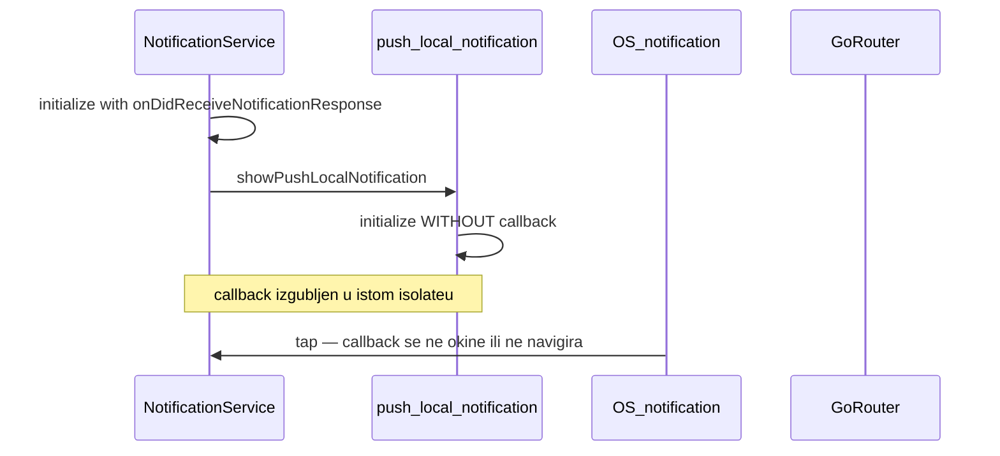

# Tap na notifikaciju → ekran rezervacije

## Problem

Logika za tap već postoji u [`notification_service.dart`](c:\Users\avrca\Documents\Projects\Uzorita_all\uzorita_flutter\lib\core\notifications\notification_service.dart) (`onDidReceiveNotificationResponse` → `_scheduleNavigation`), ali **lokalne notifikacije koje korisnik vidi** prikazuje [`push_local_notification.dart`](c:\Users\avrca\Documents\Projects\Uzorita_all\uzorita_flutter\lib\core\notifications\push_local_notification.dart) preko **drugog** `FlutterLocalNotificationsPlugin` instancea koji se u istom isolateu ponovno `initialize()`-a **bez callbacka**.

To pogađa iOS foreground (gdje `_onForegroundMessage` zove `showPushLocalNotification`) — drugi `initialize()` može pregaziti callback registriran u `NotificationService`.



FCM sustavski tap (Android background, `onMessageOpenedApp`, `getInitialMessage`) već radi — ne dirati osim usklađivanja navigacije (`push` umjesto `go`).

## Cilj

Kad korisnik tapne lokalnu notifikaciju (iOS foreground banner, iOS/Android background data-only put):

1. Parsirati JSON payload (`reservation_id` / `entity_id` preko postojećeg [`PushPayload.fromData`](c:\Users\avrca\Documents\Projects\Uzorita_all\uzorita_flutter\lib\core\notifications\push_payload.dart))
2. Navigirati na `/reservations/{id}` → [`ReservationDetailScreen`](c:\Users\avrca\Documents\Projects\Uzorita_all\uzorita_flutter\lib\features\reception\presentation\reservation_detail_screen.dart)
3. Koristiti `goRouter.push` (kao timeline: [`timeline_reservation_tile.dart`](c:\Users\avrca\Documents\Projects\Uzorita_all\uzorita_flutter\lib\features\reception\presentation\timeline_reservation_tile.dart)) da back vraća na prethodni ekran

## Implementacija

### 1. Jedinstveni plugin u main isolateu

Refaktor [`push_local_notification.dart`](c:\Users\avrca\Documents\Projects\Uzorita_all\uzorita_flutter\lib\core\notifications\push_local_notification.dart):

- Maknuti globalni `_plugin` i `ensurePushLocalNotificationsInitialized()`
- Pretvoriti `showPushLocalNotification` u funkciju koja prima **`FlutterLocalNotificationsPlugin`** (prvi argument)
- Zadržati postojeći `payload: jsonEncode(payload.toJson())` — backend već šalje `reservation_id` ([`stay.hr/.../push_payload.py`](c:\Users\avrca\Documents\Projects\Uzorita_all\stay.hr\backend\apps\core\push_payload.py))

U [`notification_service.dart`](c:\Users\avrca\Documents\Projects\Uzorita_all\uzorita_flutter\lib\core\notifications\notification_service.dart):

- Dodati privatnu metodu `_showLocalNotification(...)` koja zove refaktorirani `showPushLocalNotification(_localNotifications, ...)`
- Zamijeniti sve pozive `showPushLocalNotification(...)` u `_onForegroundMessage` tom metodom
- Kanal `_androidChannelId` / `_androidChannelName` ostaje samo u `NotificationService` (maknuti duplikat konstanti iz `push_local_notification.dart` ili izdvojiti u mali shared file ako treba i background handleru)

### 2. Zajednički handler za tap

U `notification_service.dart` izdvojiti:

```dart
void _handleNotificationTap(String? rawPayload) {
  if (rawPayload == null || rawPayload.isEmpty) return;
  final map = jsonDecode(rawPayload) as Map<String, dynamic>;
  _scheduleNavigation(PushPayload.fromData(map));
}
```

Koristiti u:

- `onDidReceiveNotificationResponse: (r) => _handleNotificationTap(r.payload)`
- cold start (sljedeći korak)

Promijeniti `_scheduleNavigation` da koristi **`push`** umjesto **`go`**:

```dart
_ref.read(goRouterProvider).push('/reservations/$reservationId');
```

Isto uskladiti u [`foreground_push_listener.dart`](c:\Users\avrca\Documents\Projects\Uzorita_all\uzorita_flutter\lib\core\notifications\foreground_push_listener.dart) (SnackBar „Otvori") radi konzistentnosti.

U debug modu dodati `debugPrint` u `catch` umjesto tihog gutanja grešaka.

### 3. Cold start iz lokalne notifikacije

Nakon `_localNotifications.initialize(...)` u `_initLocalNotifications()`:

```dart
final launchDetails = await _localNotifications.getNotificationAppLaunchDetails();
if (launchDetails?.didNotificationLaunchApp ?? false) {
  _handleNotificationTap(launchDetails!.notificationResponse?.payload);
}
```

Pozivati `_initLocalNotifications()` iz postojećeg `_onReady` u [`notification_bootstrap.dart`](c:\Users\avrca\Documents\Projects\Uzorita_all\uzorita_flutter\lib\core\notifications\notification_bootstrap.dart) — router i auth već postoje prije navigacije (isti pattern kao `getInitialMessage()`).

**Napomena o auth:** postojeći `_scheduleNavigation` već radi `Future.microtask` bez čekanja autha; GoRouter redirect na `/login` ostaje kao sada. Nema novog scopea osim ako QA pokaže gubitak rute — tada P2 pending navigation store.

### 4. Background isolate (`firebaseMessagingBackgroundHandler`)

Background handler u [`main.dart`](c:\Users\avrca\Documents\Projects\Uzorita_all\uzorita_flutter\lib\main.dart) radi u **zasebnom isolateu** — ne može dijeliti `_localNotifications` instancu iz `NotificationService`.

Ostaje lokalni plugin samo za **prikaz** u background handleru:

- Zadržati minimalni init + `show` u background handleru (bez callbacka — OK u tom isolateu)
- Refaktorirati da koristi istu `showPushLocalNotification(plugin, ...)` funkciju s lokalnom instancom unutar handlera
- Tap kad je app ubijen pokriva `getNotificationAppLaunchDetails` u main isolateu (korak 3)

Ne uvoditi `onDidReceiveBackgroundNotificationResponse` / SharedPreferences osim ako QA na fizičkom uređaju pokaže da launch details nisu dovoljni (npr. neki Android OEM edge case).

## Datoteke koje se mijenjaju

| Datoteka | Promjena |
|----------|----------|
| [`push_local_notification.dart`](c:\Users\avrca\Documents\Projects\Uzorita_all\uzorita_flutter\lib\core\notifications\push_local_notification.dart) | Ukloniti vlastiti init; `show` prima plugin |
| [`notification_service.dart`](c:\Users\avrca\Documents\Projects\Uzorita_all\uzorita_flutter\lib\core\notifications\notification_service.dart) | Jedini init s callbackom; launch details; `_handleNotificationTap`; `push` |
| [`foreground_push_listener.dart`](c:\Users\avrca\Documents\Projects\Uzorita_all\uzorita_flutter\lib\core\notifications\foreground_push_listener.dart) | `go` → `push` |
| [`test/core/notifications/push_payload_test.dart`](c:\Users\avrca\Documents\Projects\Uzorita_all\uzorita_flutter\test\core\notifications\push_payload_test.dart) | Dodati test: JSON payload iz `toJson()` → `reservationId` parsiran |

## Test plan (ručno na 2 tableta)

| # | Scenarij | Očekivano |
|---|----------|-----------|
| 1 | Tablet B promijeni status → Tablet A iOS **foreground** → tap lokalnog bannera | Otvori točan `/reservations/{id}` |
| 2 | App u background → tap lokalne notifikacije (data-only put) | Detalj rezervacije |
| 3 | App killed → tap lokalne notifikacije | Detalj rezervacije (launch details) |
| 4 | Android background FCM heads-up tap | I dalje radi (`onMessageOpenedApp`) |
| 5 | Foreground SnackBar „Otvori" | Isti ekran, back vraća na timeline |
| 6 | Payload bez `reservation_id` | Nema crasha, nema navigacije |

Nema promjena na backendu (`stay.hr`) — payload kontrakt već ispunjava uvjete.
