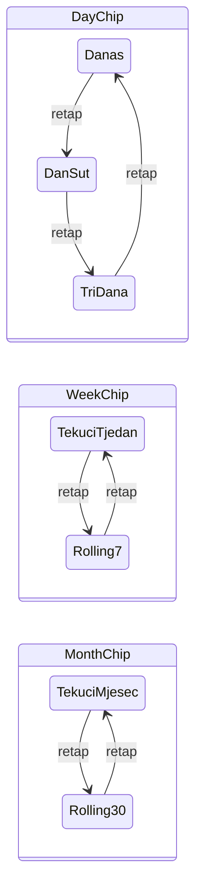

# Timeline chipovi: cikliranje raspona datuma

## Trenutno stanje

U [`timeline_controller.dart`](c:\Users\avrca\Documents\Projects\Uzorita_all\uzorita_flutter\lib\features\reception\presentation\timeline_controller.dart):

- Jedan `OverviewMode` po chipu (`todayAndTomorrow`, `week`, `month`, `all`)
- Default: `todayAndTomorrow` (API: danas → sutra; label: „Danas i sutra”)
- Chipovi u [`timeline_screen.dart`](c:\Users\avrca\Documents\Projects\Uzorita_all\uzorita_flutter\lib\features\reception\presentation\timeline_screen.dart) samo pozivaju `setFilters(mode: …)` — nema cikliranja na ponovni tap



## Ciljano ponašanje (samo Flutter)

| Chip | Prvi tap (ili prelazak s drugog chipa) | Ponovni tap dok je aktivan |
|------|----------------------------------------|----------------------------|
| **Dan** (dinamički label) | **Danas** (default) | Danas → **Dan/Sut** → **Tri dana** → Danas … |
| **Tjedan** | Tekući ISO tjedan (pon → ned) | ↔ **7 dana** od danas (danas + 6) |
| **Mjesec** | Tekući kalendarski mjesec | ↔ **30 dana** od danas (danas + 29) |
| **Sve** | bez promjene | — |

**Prelazak chipa:** kad korisnik tapne drugi chip (npr. Tjedan), taj chip ulazi u **default** varijantu (kalendarski tjedan / mjesec). Pod-varijanta prethodnog chipa ostaje zapamćena u controlleru — kad se vrati na Dan, nastavlja zadnji ciklus (npr. „Tri dana”).

**Label iznad chipova** (`period.label`) i **tooltip** prate aktivnu varijantu.

## 1. Model stanja u controlleru

Zamijeniti grubi `OverviewMode.todayAndTomorrow` podjelom:

```dart
enum OverviewMode { dayRange, week, month, all }

enum DayRangeVariant { today, todayAndTomorrow, threeDays }
enum WeekVariant { calendarWeek, rolling7Days }
enum MonthVariant { calendarMonth, rolling30Days }
```

U `TimelineController` dodati privatna polja s defaultima:

- `_mode = OverviewMode.dayRange`
- `_dayVariant = DayRangeVariant.today` (novi default umjesto Dan/Sut)
- `_weekVariant = WeekVariant.calendarWeek`
- `_monthVariant = MonthVariant.calendarMonth`

Javni getteri: `dayVariant`, `weekVariant`, `monthVariant` (za UI label chipa).

Nove metode (umjesto samo `setFilters(mode:)` za chipove):

- `selectDayRangeChip()` — ako `_mode != dayRange` → postavi `dayRange` + `today`; inače ciklus `today → todayAndTomorrow → threeDays → today`
- `selectWeekChip()` — ako `_mode != week` → `week` + `calendarWeek`; inače toggle `calendarWeek ↔ rolling7Days`
- `selectMonthChip()` — ako `_mode != month` → `month` + `calendarMonth`; inače toggle `calendarMonth ↔ rolling30Days`
- `selectAllChip()` — `_mode = all` (bez pod-varijante)

`setFilters` ostaje za status/pretragu; `mode` opcionalno ostaje za kompatibilnost ili se zamijeni s `overviewMode`.

## 2. Rasponi datuma (`_apiCheckInRange` + `period`)

Koristiti postojeći [`DateUtilsIso`](c:\Users\avrca\Documents\Projects\Uzorita_all\uzorita_flutter\lib\core\utils\date_utils.dart). Svi „od danas” rasponi: `from = today`.

| Varijanta | API `check_in_from` / `check_in_to` | `period` (filtar liste, `[start, end)`) | Label |
|-----------|--------------------------------------|-------------------------------------------|-------|
| Danas | today → today | start=today, end=today+1 | „Danas” |
| Dan/Sut | today → today+1 | start=today, end=today+2 | „Danas i sutra” |
| Tri dana | today → today+2 | start=today, end=today+3 | „Tri dana” |
| Tekući tjedan | startOfIsoWeek → +6 dana | kao sada | „Pregled: ovaj tjedan” |
| 7 dana | today → today+6 | start=today, end=today+7 | „Sljedećih 7 dana” |
| Tekući mjesec | startOfMonth → kraj mjeseca | kao sada | „Pregled: ovaj mjesec” |
| 30 dana | today → today+29 | start=today, end=today+30 | „Sljedećih 30 dana” |

`_applyPeriodFilter` i `summary` ostaju na `period` getteru — dovoljno je ažurirati `period` i `_apiCheckInRange()` switch po `_mode` + pod-varijanti.

## 3. UI chipovi ([`timeline_screen.dart`](c:\Users\avrca\Documents\Projects\Uzorita_all\uzorita_flutter\lib\features\reception\presentation\timeline_screen.dart))

- **Prvi chip:** dinamički `label` ovisno o `dayVariant`:
  - `Danas` / `Dan/Sut` / `3 dana`
  - `selected: timeline.mode == OverviewMode.dayRange`
  - `onSelected: (_) => timeline.selectDayRangeChip()`
  - Tooltip odgovara aktivnoj varijanti
- **Tjedan / Mjesec:** dinamički label kao Dan chip — `Tjedan` ↔ `7 dana`, `Mjesec` ↔ `30 dana` (vidljivo i kad chip nije aktivan, prema zapamćenoj varijanti); `onSelected` → `selectWeekChip()` / `selectMonthChip()`
- **Sve:** `selectAllChip()`

Napomena: `ChoiceChip` na ponovni tap zove `onSelected(true)` i kad je već selected — handler gore to iskorištava za ciklus/toggle.

## 4. Backend

**Nema promjena** — i dalje `check_in_from` / `check_in_to` na list endpointu; samo šaljemo druge granice iz Fluttera.

## Test plan (ručno)

1. Cold start → chip „Danas”, label „Danas”, samo današnji dolasci.
2. Tri uzastopna tapa na Dan chip → Dan/Sut → Tri dana → Danas (loop).
3. Tap Tjedan → kalendarski tjedan; ponovni tap → 7 dana od danas; treći tap → natrag na tjedan.
4. Tap Mjesec → isto za 30 dana.
5. Postavi Dan na „Tri dana”, tapni Tjedan, vrati se na Dan → i dalje „Tri dana”.
6. Sažetak (Dolasci/Odlasci) i „Prikazano: X / Y” usklađeni s novim rasponom.
