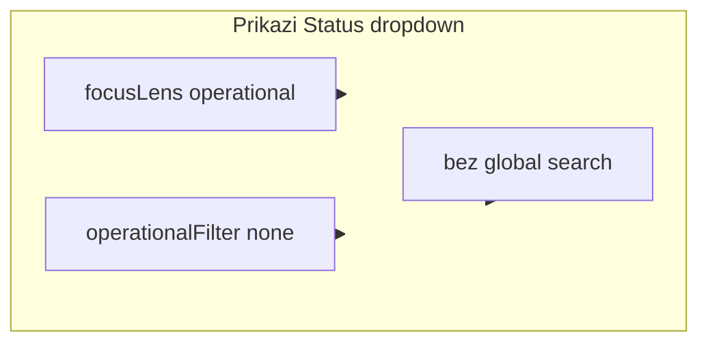

# Timeline: zadani Dolasci + sakrij Status kad je toggle aktivan

## Zahtjev

1. **Po defaultu** kartica **Dolasci** je uključena (toggle ON).
2. Dok je **bilo koji** toggle na karticama aktivan, **ne prikazivati** Status select (dropdown „Svi statusi” + checkbox otkazane).

Aktivni toggle = jedan od:
- operativni filter: Dolasci / Odlasci / Prijavljeni (`operationalFilter != none`)
- fokus **Today** (`focusLens == activityToday`)
- (već postojeće) globalna pretraga — Status je već skriven



---

## 1. Zadani filter Dolasci

U [`timeline_controller.dart`](c:\Users\avrca\Documents\Projects\Uzorita_all\uzorita_flutter\lib\features\reception\presentation\timeline_controller.dart) promijeniti inicijalno stanje:

```dart
TimelineOperationalFilter _operationalFilter = TimelineOperationalFilter.arrivals;
```

**Efekt pri prvom učitavanju:**
- `_focusLens` ostaje `operational` (već je tako).
- `_operationallyFiltered` već koristi `filterTimelineOperational` — lista odmah prikazuje samo dolazak u periodu (npr. Danas).
- Kartica **Dolasci** vizualno `selected` jer `operationalFilter == arrivals` ([`timeline_screen.dart`](c:\Users\avrca\Documents\Projects\Uzorita_all\uzorita_flutter\lib\features\reception\presentation\timeline_screen.dart)).
- Status red: `Prikazano: x / y · Samo dolasci` (postojeći `timelineFilterArrivalsOnly`).

**Nema** promjene API-ja — samo lokalni filter nakon učitavanja perioda.

**Korisnik i dalje može** tapnuti Dolasci ponovo → `none` → puna operativna lista + Status dropdown se ponovo prikaže.

---

## 2. Getter: je li kartica-toggle aktivan

U istom controlleru dodati:

```dart
bool get statCardFilterActive =>
    _focusLens == TimelineFocusLens.activityToday ||
    _operationalFilter != TimelineOperationalFilter.none;
```

Javni getter za UI (`timeline_status_filter_field`, eventualno buduća upotreba).

---

## 3. Sakrij Status dropdown

U [`timeline_status_filter_field.dart`](c:\Users\avrca\Documents\Projects\Uzorita_all\uzorita_flutter\lib\features\reception\presentation\widgets\timeline_status_filter_field.dart) zamijeniti uvjet skrivanja:

**Prije:** skriveno samo za `activityToday` ili global search (`focusActive || globalSearchActive`).

**Poslije:**

```dart
if (timeline.globalSearchActive || timeline.statCardFilterActive) {
  return const SizedBox.shrink();
}
```

Time se pri zadanom **Dolasci** Status ne prikazuje na normalnom startu (jer je `operationalFilter == arrivals` ≠ `none`).

Ukloniti redundantnu varijablu `focusActive` ako više nije potrebna.

---

## 4. Ponašanje pri prebacivanju modova (bez obaveznih izmjena)

| Akcija | `operationalFilter` danas | Status vidljiv? |
|--------|---------------------------|-----------------|
| Start app | `arrivals` | Ne |
| Tap Dolasci (gas) | `none` | Da |
| Tap Today | `none` (u `setFocusLens`) | Ne (activityToday) |
| Tap Today off | `none` | Da |
| Tap Odlasci s Today-a | npr. `departures` | Ne |
| Global search | `none` (postojeće) | Ne |

Opcionalno (izvan minimalnog scopea): nakon gašenja **Today** ili `clearSearch()` vratiti `arrivals` umjesto `none` — nije traženo eksplicitno; plan ostaje samo na **inicijalnom** defaultu.

---

## 5. Testovi

U [`timeline_period_filter_test.dart`](c:\Users\avrca\Documents\Projects\Uzorita_all\uzorita_flutter\test\features\reception\timeline_period_filter_test.dart) nema promjene logike filtera.

Opcionalno: mali widget/controller test da `statCardFilterActive` je true za `arrivals` i `activityToday`, false za `none` + operational — nije obavezno za ovaj mali diff.

---

## Datoteke

| Datoteka | Promjena |
|----------|----------|
| [`timeline_controller.dart`](c:\Users\avrca\Documents\Projects\Uzorita_all\uzorita_flutter\lib\features\reception\presentation\timeline_controller.dart) | default `arrivals`, getter `statCardFilterActive` |
| [`timeline_status_filter_field.dart`](c:\Users\avrca\Documents\Projects\Uzorita_all\uzorita_flutter\lib\features\reception\presentation\widgets\timeline_status_filter_field.dart) | skrivanje po `statCardFilterActive` |

L10n: bez novih ključeva.
